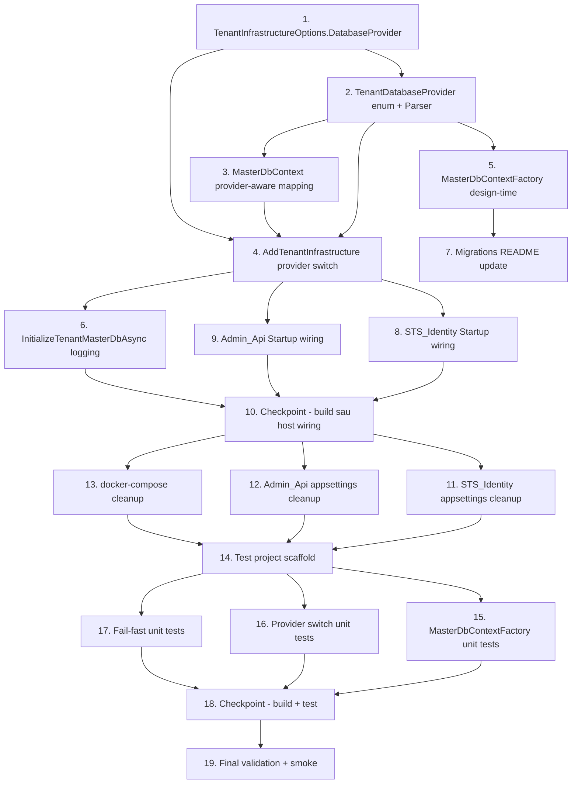

# Implementation Plan: Consolidate `idsrv_master` into `IdentityServerAdmin`

## Overview

Convert the feature design into a series of prompts for a code-generation LLM that will implement each step with incremental progress. Make sure that each prompt builds on the previous prompts, and ends with wiring things together. There should be no hanging or orphaned code that isn't integrated into a previous step. Focus ONLY on tasks that involve writing, modifying, or testing code.

Plan này refactor `TenantInfrastructure` để dùng chung database `IdentityServerAdmin` qua `ConnectionStrings:IdentityDbConnection`. Thứ tự thực hiện:

1. Hoàn tất các thay đổi nội tại bên trong project `TenantInfrastructure` (options → context → registration → design-time factory → application-builder logging) trước, vì các project host (STS, Admin.Api) phụ thuộc vào API mới (`TenantInfrastructureOptions.DatabaseProvider`).
2. Cập nhật wiring ở STS_Identity và Admin_Api để đọc `IdentityDbConnection` và truyền provider type.
3. Dọn config (`appsettings.json` + Development variants) và `docker-compose.yml`.
4. Bổ sung unit tests xác nhận các nhánh quyết định.
5. Validation cuối cùng (`dotnet build`, `dotnet test`, manual smoke checklist).

PBT không áp dụng cho feature này (refactor hạ tầng, không có universal property có nghĩa) — không có task property-based test.

## Tasks

- [x] 1. Mở rộng `TenantInfrastructureOptions` để mang `DatabaseProvider`
  - File: `src/Skoruba.Duende.IdentityServer.TenantInfrastructure/TenantInfrastructure/Wiring/TenantInfrastructureOptions.cs`
  - Thêm public property `string DatabaseProvider { get; set; } = "MySql";` (dùng kiểu `string` để tránh phụ thuộc enum của `Skoruba.Duende.IdentityServer.Admin.EntityFramework.Configuration`).
  - Giữ nguyên tất cả property hiện có: `MasterConnectionString`, `ApplyMasterDbMigrations`, `AllowMasterDbAutoMigration`, `Resolution`, `TenantCacheAbsolute`, `TenantCacheSliding`, `TenantCacheRefreshInterval`, `RedisConnectionString`, `RedisInstanceName`, `AllowMissingTenant`, `SkipTenantResolutionHosts`.
  - Đặt XML doc nhỏ giải thích giá trị hợp lệ: `"SqlServer"`, `"PostgreSQL"`, `"MySql"` (1:1 với enum `DatabaseProviderType` của Admin.EntityFramework.Configuration).
  - Không đổi tên field nào khác để giữ tương thích với consumer hiện hữu.
  - _Requirements: 3.1, 3.2, 3.3, 3.7, 5.7, 7.1_

- [x] 2. Bổ sung enum nội bộ `TenantDatabaseProvider` cho TenantInfrastructure
  - File mới: `src/Skoruba.Duende.IdentityServer.TenantInfrastructure/TenantInfrastructure/Wiring/TenantDatabaseProvider.cs`.
  - Khai báo enum `internal enum TenantDatabaseProvider { SqlServer, PostgreSQL, MySql }` đặt trong namespace `TenantInfrastructure.Wiring`.
  - File mới: `src/Skoruba.Duende.IdentityServer.TenantInfrastructure/TenantInfrastructure/Wiring/TenantDatabaseProviderParser.cs`.
  - Cung cấp `internal static class TenantDatabaseProviderParser` với method `Parse(string? value)` trả về `TenantDatabaseProvider`. Hỗ trợ so sánh case-insensitive cho `"SqlServer"`, `"PostgreSQL"`, `"MySql"`. Khi `null`/empty/giá trị lạ → throw `InvalidOperationException` với message liệt kê các provider được hỗ trợ.
  - Class này được dùng lại bởi `MasterDbContextFactory` (task 5) và `ServiceCollectionExtensions` (task 3) để tránh duplicate logic.
  - _Requirements: 3.1, 3.2, 3.3, 3.7_

- [x] 3. Provider-aware mapping trong `MasterDbContext.OnModelCreating`
  - File: `src/Skoruba.Duende.IdentityServer.TenantInfrastructure/TenantInfrastructure/MasterDb/MasterDbContext.cs`.
  - Bổ sung field nội tại `TenantDatabaseProvider _provider` (lấy thông qua `IDbContextOptionsExtension` mới — xem tiếp).
  - File mới: `src/Skoruba.Duende.IdentityServer.TenantInfrastructure/TenantInfrastructure/MasterDb/Internal/TenantProviderOptionsExtension.cs` thực thi `IDbContextOptionsExtension` để mang giá trị `TenantDatabaseProvider` qua `DbContextOptions`. `_provider = options.FindExtension<TenantProviderOptionsExtension>()?.Provider ?? TenantDatabaseProvider.MySql`.
  - Trong `OnModelCreating`:
    - Bỏ `b.ApplyLowerCaseNames()` đang gọi vô điều kiện. Chỉ gọi khi `_provider == TenantDatabaseProvider.MySql`.
    - Thêm `e.ToTable("tenants")` cho entity `TenantInfo` để khoá tên bảng cho mọi provider.
    - Cấu hình cột `ConnectionSecrets` (đang map qua `ConnectionSecretsJson`) với `HasColumnType` theo provider:
      - `MySql` → `"json"`
      - `PostgreSQL` → `"jsonb"`
      - `SqlServer` → `"nvarchar(max)"`
    - Giữ nguyên `HasColumnName("ConnectionSecrets")` và `IsRequired()`.
  - Giữ nguyên các ràng buộc khác (`TenantKey` unique max length 64, `DisplayName` max length 256, `RedirectUrl` max length 2048, `LogoUrl` không giới hạn, `IsActive` required, `CreatedUtc` required, `Id` PK).
  - Không thêm/bớt entity khác trong context.
  - _Requirements: 3.1, 3.2, 3.3, 3.4, 3.5, 3.6, 4.2, 4.3_

- [x] 4. Provider switch trong `AddTenantInfrastructure` + tách `MigrationsHistoryTable`
  - File: `src/Skoruba.Duende.IdentityServer.TenantInfrastructure/TenantInfrastructure/Wiring/ServiceCollectionExtensions.cs`.
  - Trong nhánh `services.AddDbContextFactory<MasterDbContext>(...)`:
    - Parse `opt.DatabaseProvider` qua `TenantDatabaseProviderParser.Parse` (task 2). Nếu lỗi → throw fail-fast.
    - Thay block `db.UseMySQL(...).UseLowerCaseNamingConvention()` đang chạy vô điều kiện bằng switch theo `TenantDatabaseProvider`:
      - `SqlServer` → `db.UseSqlServer(opt.MasterConnectionString, sql => { sql.MigrationsAssembly(...); sql.MigrationsHistoryTable("__EFMigrationsHistory_TenantRegistry"); })`.
      - `PostgreSQL` → `db.UseNpgsql(opt.MasterConnectionString, npg => { npg.MigrationsAssembly(...); npg.MigrationsHistoryTable("__EFMigrationsHistory_TenantRegistry"); })`.
      - `MySql` → `db.UseMySQL(opt.MasterConnectionString, my => { my.MigrationsAssembly(...); my.MigrationsHistoryTable("__EFMigrationsHistory_TenantRegistry"); }).UseLowerCaseNamingConvention()`.
    - `MigrationsAssembly` lấy từ `typeof(MasterDbContext).Assembly.GetName().Name`.
    - Đăng ký `TenantProviderOptionsExtension` (task 3) vào builder, ví dụ qua `((IDbContextOptionsBuilderInfrastructure)db).AddOrUpdateExtension(new TenantProviderOptionsExtension(provider))`.
  - Validation fail-fast trong `AddTenantInfrastructure`: nếu `string.IsNullOrWhiteSpace(opt.MasterConnectionString)` → throw `InvalidOperationException` với message dạng `"Connection string 'IdentityDbConnection' is required for TenantInfrastructure. Set ConnectionStrings:IdentityDbConnection in configuration."`.
  - Không thêm `using` reference đến `Skoruba.Duende.IdentityServer.Admin.EntityFramework.*` — copy phong cách wiring trực tiếp để giữ ranh giới layer.
  - _Requirements: 1.1, 1.2, 2.1, 2.4, 2.5, 3.1, 3.2, 3.3, 3.4, 3.7, 4.1, 4.3, 7.1, 7.7_

- [x] 5. Cập nhật `MasterDbContextFactory` (design-time)
  - File: `src/Skoruba.Duende.IdentityServer.TenantInfrastructure/TenantInfrastructure/MasterDb/MasterDbContextFactory.cs`.
  - Bỏ hoàn toàn việc đọc env var `ConnectionStrings__MasterDb`.
  - Thứ tự nguồn cho connection string trong `CreateDbContext(string[] args)`:
    1. Argument `--connection=<value>` (case-insensitive) — ưu tiên cao nhất.
    2. Env var `ConnectionStrings__IdentityDbConnection`.
  - Khi cả hai trống/whitespace → throw `InvalidOperationException` với message: `"Tenant registry connection string is missing. Set ConnectionStrings__IdentityDbConnection or pass --connection=<value> to dotnet ef."`.
  - Provider được chọn từ env var `DatabaseProviderConfiguration__ProviderType` (parse qua `TenantDatabaseProviderParser`); nếu env var trống → mặc định `MySql` để giữ behaviour cũ của `dotnet ef migrations add` trong workspace MySQL.
  - Nếu provider là `MySql` → vẫn áp dụng helper `NormalizeMySqlConnectionStringForDevelopment` hiện có. Provider khác → không xử lý chuỗi.
  - Cấu hình DB context giống task 4 (`UseSqlServer` / `UseNpgsql` / `UseMySQL` + `MigrationsAssembly` + `MigrationsHistoryTable("__EFMigrationsHistory_TenantRegistry")`; `UseLowerCaseNamingConvention()` chỉ cho MySql) và đăng ký `TenantProviderOptionsExtension`.
  - Đảm bảo factory này dùng đúng API public của task 2/3/4 để tránh duplicate parser/extension logic.
  - _Requirements: 6.1, 6.2, 6.3, 6.4, 6.5, 8.7_

- [x] 6. Log Information rõ rệt trong `InitializeTenantMasterDbAsync`
  - File: `src/Skoruba.Duende.IdentityServer.TenantInfrastructure/TenantInfrastructure/Wiring/ApplicationBuilderExtensions.cs`.
  - Resolve `ILoggerFactory` rồi tạo logger với category name `"TenantInfrastructure.Init"`.
  - Phân nhánh theo `options.ApplyMasterDbMigrations` và `options.AllowMasterDbAutoMigration` ghi log Information đúng theo bảng quyết định trong design (mục Error Handling):
    - `ApplyMasterDbMigrations=true` & `AllowMasterDbAutoMigration=true` → log `"Applying tenant registry migrations against IdentityServerAdmin database."` rồi gọi `db.Database.MigrateAsync()`.
    - `ApplyMasterDbMigrations=true` & `AllowMasterDbAutoMigration=false` → log `"Tenant registry migrations are configured but auto-migration is disabled. Skipping Database.Migrate(). Operator must apply migrations manually against IdentityServerAdmin."` rồi return mà không migrate.
    - `ApplyMasterDbMigrations=false` → log `"Tenant registry migrations disabled; calling EnsureCreatedAsync on IdentityServerAdmin database."` rồi gọi `db.Database.EnsureCreatedAsync()`.
  - Giữ nguyên scope/dispose pattern (`using var scope`, `await using var db`).
  - Không thêm log Warning về `ConnectionStrings:MasterDb` (đã out of scope theo quyết định của user).
  - _Requirements: 4.6, 4.7, 4.8_

- [x] 7. Cập nhật `Migrations/README.md` cho TenantInfrastructure
  - File: `src/Skoruba.Duende.IdentityServer.TenantInfrastructure/TenantInfrastructure/MasterDb/Migrations/README.md`.
  - Thay mọi tham chiếu `ConnectionStrings__MasterDb` bằng `ConnectionStrings__IdentityDbConnection` cho phần hướng dẫn `dotnet ef migrations add` / `database update`.
  - Thêm 1 đoạn giải thích migrations history table dùng tên `__EFMigrationsHistory_TenantRegistry` (tách biệt với `__EFMigrationsHistory` của `AdminIdentityDbContext`).
  - Ghi chú follow-up: SqlServer/PostgreSQL migration assemblies chưa được generate — sẽ được bổ sung ở PR sau khi thực sự cần triển khai trên 2 provider này. Thông báo rõ rằng PR hiện tại chỉ giữ migrations MySQL hiện có.
  - Không sinh migrations mới ở task này.
  - _Requirements: 4.5, 6.1, 6.2, 6.3_

- [x] 8. Wiring STS_Identity Startup đọc `IdentityDbConnection`
  - File: `src/Skoruba.Duende.IdentityServer.STS.Identity/Startup.cs`.
  - Trong `ConfigureServices`, trước khối `services.AddTenantInfrastructure(...)`:
    - Bind `DatabaseProviderConfiguration` từ `Configuration.GetSection(nameof(DatabaseProviderConfiguration))`. Nếu null → khởi tạo default với `ProviderType = DatabaseProviderType.MySql` (giữ behaviour hiện tại).
    - Lấy `identityDbConnectionString = Configuration.GetConnectionString(ConfigurationConsts.IdentityDbConnectionStringKey)` (`"IdentityDbConnection"`).
    - Nếu `string.IsNullOrWhiteSpace(identityDbConnectionString)` → throw `InvalidOperationException` với message: `"Connection string 'IdentityDbConnection' is required for TenantInfrastructure. Set ConnectionStrings:IdentityDbConnection in configuration."` (khớp Requirement 2.5).
  - Trong block `services.AddTenantInfrastructure(opt => { ... })`:
    - Bỏ `Configuration.GetConnectionString("MasterDb")`.
    - Đặt `opt.DatabaseProvider = databaseProviderConfiguration.ProviderType.ToString()`.
    - Đặt `opt.MasterConnectionString = (provider == MySql ? NormalizeMySqlConnectionStringForDevelopment(identityDbConnectionString, env.IsDevelopment()) : identityDbConnectionString)`.
    - Giữ nguyên các binding khác: `opt.RedisConnectionString`, `opt.RedisInstanceName`, `opt.ApplyMasterDbMigrations`, `opt.AllowMasterDbAutoMigration`, các option `Resolution`.
  - Không thay đổi đăng ký auth scheme, signing key, token lifetime, tenant resolution middleware.
  - _Requirements: 1.3, 1.5, 2.2, 2.5, 7.1, 7.2, 7.4, 7.5, 8.5_

- [x] 9. Wiring Admin_Api Startup đọc `IdentityDbConnection`
  - File: `src/Skoruba.Duende.IdentityServer.Admin.Api/Startup.cs`.
  - Lặp lại đúng pattern của task 8: bind `DatabaseProviderConfiguration`, lấy `identityDbConnectionString`, fail-fast nếu trống, gọi `services.AddTenantInfrastructure(...)` với `opt.DatabaseProvider` + `opt.MasterConnectionString` từ `IdentityDbConnection`.
  - Bỏ mọi reference tới `GetConnectionString("MasterDb")` trong Startup này (kể cả comment cũ).
  - Áp dụng `NormalizeMySqlConnectionStringForDevelopment` chỉ khi provider là MySql.
  - Không đổi đăng ký `AdminIdentityDbContext`, `IdentityServerConfigurationDbContext`, `IdentityServerPersistedGrantDbContext`, `IdentityServerDataProtectionDbContext` hoặc CORS/Swagger pipeline.
  - _Requirements: 1.4, 1.5, 2.3, 2.5, 7.1, 8.6_

- [x] 10. Checkpoint - Đảm bảo tất cả test hiện hữu vẫn pass
  - Ensure all tests pass, ask the user if questions arise.
  - Chạy `dotnet build` để xác nhận thay đổi 1–9 compile sạch trước khi sang đoạn config.
  - Nếu có lỗi liên quan tới các consumer (`Skoruba.Duende.IdentityServer.Admin.UI.Api`, Views, `StsIdentityDbConnectionStringResolver`) → dừng và đối chiếu lại design (task 1 quyết định không đổi tên type).
  - _Requirements: 7.1, 7.5, 8.1_

- [x] 11. Dọn `appsettings.json` của STS_Identity
  - File: `src/Skoruba.Duende.IdentityServer.STS.Identity/appsettings.json`.
  - Nếu có key `ConnectionStrings:MasterDb` → xoá hẳn key (chỉ key đó, không động vào key khác).
  - Giữ nguyên `ConnectionStrings:IdentityDbConnection`, `ConnectionStrings:ConfigurationDbConnection`, `ConnectionStrings:PersistedGrantDbConnection`, `ConnectionStrings:DataProtectionDbConnection`.
  - Giữ nguyên section `DatabaseProviderConfiguration` (`ProviderType: "MySql"`).
  - Giữ nguyên section `TenantInfrastructure` với key `ApplyMasterDbMigrations`, `AllowMasterDbAutoMigration`, `RedisInstanceName` (không đổi tên).
  - Áp dụng cùng quy tắc cho `appsettings.Development.json` (nếu có chứa `ConnectionStrings:MasterDb`).
  - _Requirements: 5.1, 5.3, 5.7, 5.8_

- [x] 12. Dọn `appsettings.json` của Admin_Api
  - File: `src/Skoruba.Duende.IdentityServer.Admin.Api/appsettings.json`.
  - Áp dụng cùng quy tắc như task 11: xoá key `ConnectionStrings:MasterDb` nếu có; giữ nguyên `IdentityDbConnection`, các connection string khác, `DatabaseProviderConfiguration`, section `TenantInfrastructure`.
  - Áp dụng cùng cho `appsettings.Development.json` (nếu có).
  - _Requirements: 5.2, 5.4, 5.7, 5.8_

- [x] 13. Cập nhật `docker-compose.yml` ở root workspace
  - File: `docker-compose.yml` (root). Cũng kiểm tra `docker-compose.override.yml` nếu được commit.
  - Loại bỏ tất cả env entries có dạng `ConnectionStrings__MasterDb=...` cho 3 service `skoruba.duende.identityserver.admin`, `skoruba.duende.identityserver.admin.api`, `skoruba.duende.identityserver.sts.identity`.
  - Đảm bảo `ConnectionStrings__IdentityDbConnection=...` đã có cho cả STS_Identity và Admin_Api, trỏ đến database vật lý `IdentityServerAdmin`.
  - Không thêm/xoá service hoặc volume khác. Không đổi thứ tự `depends_on`.
  - Thêm comment ngắn gọn ở phần env của 2 service (1 dòng) ghi rõ tenant registry hiện sống bên trong `IdentityServerAdmin` qua `IdentityDbConnection`.
  - _Requirements: 1.2, 5.5, 5.6_

- [x] 14. Tạo project unit test mới cho TenantInfrastructure
  - File mới: `tests/Skoruba.Duende.IdentityServer.TenantInfrastructure.UnitTests/Skoruba.Duende.IdentityServer.TenantInfrastructure.UnitTests.csproj`.
  - Target framework giống các project test hiện có trong `tests/` (ví dụ `net9.0` — kiểm tra một test project hiện hữu trước khi quyết định để giữ đồng bộ).
  - Thêm reference đến project `src/Skoruba.Duende.IdentityServer.TenantInfrastructure/TenantInfrastructure/TenantInfrastructure.csproj`.
  - Thêm package: `xunit`, `xunit.runner.visualstudio`, `Microsoft.NET.Test.Sdk`, `FluentAssertions`. Phiên bản đồng bộ với các project test khác.
  - Đăng ký project mới vào solution `Skoruba.Duende.IdentityServer.Admin.sln` qua `dotnet sln add`.
  - Chưa thêm test class trong task này — sẽ thêm ở task 15–17.
  - _Requirements: 8.1, 8.2_

- [x] 15. Unit test cho `MasterDbContextFactory`
  - File mới: `tests/Skoruba.Duende.IdentityServer.TenantInfrastructure.UnitTests/MasterDb/MasterDbContextFactoryTests.cs`.
  - Test các nhánh quyết định:
    - `--connection=<value>` thắng env var `ConnectionStrings__IdentityDbConnection`.
    - Chỉ env var `ConnectionStrings__IdentityDbConnection` có giá trị → factory tạo `MasterDbContext` thành công.
    - Cả argument lẫn env var đều trống → throw `InvalidOperationException` chứa cụm `ConnectionStrings__IdentityDbConnection` và `--connection=<value>`.
    - `DatabaseProviderConfiguration__ProviderType=SqlServer` → `ctx.Database.ProviderName == "Microsoft.EntityFrameworkCore.SqlServer"`.
    - `DatabaseProviderConfiguration__ProviderType=PostgreSQL` → `ctx.Database.ProviderName == "Npgsql.EntityFrameworkCore.PostgreSQL"`.
    - `DatabaseProviderConfiguration__ProviderType=MySql` → `ctx.Database.ProviderName == "MySql.EntityFrameworkCore"` (hoặc tên thật của package MySQL hiện dùng — đối chiếu khi viết test).
    - Provider value lạ (`"oracle"`) → throw `InvalidOperationException` liệt kê đủ 3 provider hợp lệ.
    - Factory không đọc env var `ConnectionStrings__MasterDb` (verify bằng cách set env var đó kèm `IdentityDbConnection` rỗng → vẫn throw).
  - Dùng helper `EnvironmentVariableScope` (tự viết, IDisposable) để set/unset env var trong test mà không leak sang test khác.
  - _Requirements: 6.1, 6.2, 6.3, 6.4, 6.5, 8.7_

- [x] 16. Unit test cho provider switch trong `AddTenantInfrastructure`
  - File mới: `tests/Skoruba.Duende.IdentityServer.TenantInfrastructure.UnitTests/Wiring/AddTenantInfrastructureProviderSwitchTests.cs`.
  - Cho mỗi `DatabaseProvider` trong `{ "SqlServer", "PostgreSQL", "MySql" }`:
    - Build `IServiceCollection`, gọi `AddTenantInfrastructure(opt => { opt.DatabaseProvider = ...; opt.MasterConnectionString = "<dummy>"; opt.RedisConnectionString = ""; opt.ApplyMasterDbMigrations = false; opt.AllowMasterDbAutoMigration = false; })`.
    - Resolve `IDbContextFactory<MasterDbContext>` từ `ServiceProvider`, `await using var ctx = factory.CreateDbContext()`. Assert `ctx.Database.ProviderName` đúng provider tương ứng.
  - Test giá trị `DatabaseProvider = "oracle"` → khi resolve `IDbContextFactory<MasterDbContext>` thì throw `InvalidOperationException` với message liệt kê các provider hợp lệ.
  - Test (riêng) `MasterDbContext.Model` cho provider MySql có `ConnectionSecrets` mapping `HasColumnType("json")` (kiểm tra qua `entityType.FindProperty("ConnectionSecretsJson")?.GetColumnType()`); cho `PostgreSQL` → `"jsonb"`; cho `SqlServer` → `"nvarchar(max)"`.
  - Giữ test kích thước nhỏ; KHÔNG mở connection thật, chỉ kiểm tra metadata model (EF cho phép build model mà không kết nối).
  - _Requirements: 3.1, 3.2, 3.3, 3.4, 3.5, 3.6, 3.7_

- [x] 17. Unit test fail-fast cho `AddTenantInfrastructure`
  - File mới: `tests/Skoruba.Duende.IdentityServer.TenantInfrastructure.UnitTests/Wiring/AddTenantInfrastructureFailFastTests.cs`.
  - Kịch bản:
    - `MasterConnectionString` rỗng → khi resolve `IDbContextFactory<MasterDbContext>` (hoặc khi gọi `AddTenantInfrastructure`, tuỳ task 4 quyết định) thì throw `InvalidOperationException` với message khớp `"Connection string 'IdentityDbConnection' is required for TenantInfrastructure. Set ConnectionStrings:IdentityDbConnection in configuration."`.
    - `MasterConnectionString` chỉ chứa whitespace → cùng kỳ vọng throw.
    - `DatabaseProvider` rỗng/null → throw `InvalidOperationException` liệt kê provider hợp lệ.
  - Test KHÔNG được phụ thuộc `IConfiguration` thật (build trực tiếp `IServiceCollection`).
  - _Requirements: 1.3, 1.4, 1.5, 2.5, 3.7, 8.5, 8.6_

- [x] 18. Checkpoint - Build và test sau khi hoàn tất unit tests
  - Ensure all tests pass, ask the user if questions arise.
  - Chạy `dotnet build` toàn solution.
  - Chạy `dotnet test tests/Skoruba.Duende.IdentityServer.TenantInfrastructure.UnitTests/Skoruba.Duende.IdentityServer.TenantInfrastructure.UnitTests.csproj` xác nhận pass.
  - _Requirements: 8.1, 8.2_

- [x] 19. Validation - Build, test, smoke checklist cuối cùng
  - **Build**: từ workspace root chạy `dotnet build Skoruba.Duende.IdentityServer.Admin.sln` (hoặc tên file `.sln` thực tế tại root). Yêu cầu 0 lỗi mới.
  - **Test**: chạy `dotnet test` trên các test project liên quan trực tiếp:
    - `tests/Skoruba.Duende.IdentityServer.TenantInfrastructure.UnitTests`
    - `tests/Skoruba.Duende.IdentityServer.STS.Identity.IntegrationTests`
    - `tests/Skoruba.Duende.IdentityServer.Admin.Api.IntegrationTests`
    - `tests/Skoruba.Duende.IdentityServer.Admin.Api.UnitTests`
    - `tests/Skoruba.Duende.IdentityServer.Admin.UnitTests`
    Cho phép chạy gọn bằng `dotnet test` ở root nếu CI cấu hình được.
  - **Manual smoke (do người chạy hoặc operator thực hiện, ghi kết quả vào PR description)**:
    1. Set env `ConnectionStrings__IdentityDbConnection=<value-trỏ-tới-IdentityServerAdmin>` cho cả STS_Identity và Admin_Api.
    2. KHÔNG set `ConnectionStrings__MasterDb`.
    3. Boot `Skoruba.Duende.IdentityServer.STS.Identity` → log boot có `"Tenant registry migrations disabled; calling EnsureCreatedAsync ..."` hoặc `"Applying tenant registry migrations against IdentityServerAdmin database."` hoặc `"Tenant registry migrations are configured but auto-migration is disabled. ..."` đúng theo cấu hình.
    4. Boot `Skoruba.Duende.IdentityServer.Admin.Api` → request `/api/tenants` trả 200, request `/api/tenants/public` trả 200.
    5. Bỏ env `ConnectionStrings__IdentityDbConnection` trong 1 lần boot thử nghiệm (chỉ test, không commit) → process fail-fast với exception message khớp Requirement 2.5.
  - **Follow-up note (không trong scope PR này)**: chưa generate migrations cho SqlServer / PostgreSQL; sẽ tạo trong PR riêng khi có deployment thực tế cho 2 provider này.
  - _Requirements: 8.1, 8.2, 8.3, 8.4, 8.5, 8.6, 8.7_

## Task Dependency Graph

Sơ đồ phụ thuộc giữa các task (mũi tên `A --> B` nghĩa là B yêu cầu A hoàn tất trước):



### Execution waves

Các task không phụ thuộc nhau trong cùng một wave có thể được thực thi song song (mặc dù plan này khuyến nghị thực thi tuần tự để giữ blast radius nhỏ và dễ review):

```json
{
  "waves": [
    {
      "wave": 1,
      "tasks": ["1"],
      "description": "Mở rộng options trước khi chạm context/wiring"
    },
    {
      "wave": 2,
      "tasks": ["2"],
      "description": "Helper enum + parser dùng chung cho task 3, 4, 5"
    },
    {
      "wave": 3,
      "tasks": ["3", "5", "7"],
      "description": "Sửa context, design-time factory, README — không phụ thuộc lẫn nhau"
    },
    {
      "wave": 4,
      "tasks": ["4"],
      "description": "ServiceCollection wiring sau khi context và options sẵn sàng"
    },
    {
      "wave": 5,
      "tasks": ["6"],
      "description": "ApplicationBuilder logging sau khi DI hoàn chỉnh"
    },
    {
      "wave": 6,
      "tasks": ["8", "9"],
      "description": "Wiring 2 host độc lập nhau"
    },
    {
      "wave": 7,
      "tasks": ["10"],
      "description": "Checkpoint build trước khi đụng config"
    },
    {
      "wave": 8,
      "tasks": ["11", "12", "13"],
      "description": "Cleanup config files và docker-compose song song"
    },
    {
      "wave": 9,
      "tasks": ["14"],
      "description": "Tạo project test mới"
    },
    {
      "wave": 10,
      "tasks": ["15", "16", "17"],
      "description": "Viết unit tests độc lập"
    },
    {
      "wave": 11,
      "tasks": ["18"],
      "description": "Checkpoint build + test"
    },
    {
      "wave": 12,
      "tasks": ["19"],
      "description": "Final validation + manual smoke"
    }
  ]
}
```

## Notes

- Tasks marked với `*` là optional và có thể skip cho MVP — plan này không có task nào marked optional vì user đã loại bỏ các nhiệm vụ phụ (deprecation Warning log, `MasterDbContextModelTests`).
- Mỗi task đều reference trực tiếp tới các requirement clause (`X.Y`) để truy xuất ngược.
- Checkpoint (task 10, 18) đảm bảo validation tăng dần.
- Property-based testing không áp dụng cho feature này (xem section "Testing Strategy" trong `design.md`); tests dùng example-based unit tests + integration tests sẵn có.
- Không sinh migrations mới cho SqlServer/PostgreSQL trong PR này (chỉ giữ migrations MySQL hiện có và tách history table); hạng mục này sẽ là follow-up khi cần triển khai 2 provider.
- Tuân thủ AGENTS.md: không bypass layer, giữ nguyên naming convention, blast radius nhỏ (giữ tên type/options công khai).
