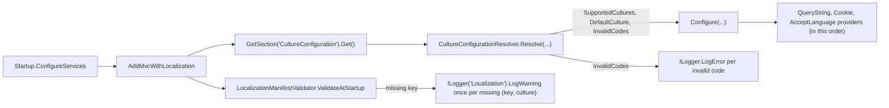

# Design Document

Login UI Redesign + Multi-language

## Overview

This feature reskins the STS host (`Skoruba.Duende.IdentityServer.STS.Identity`) login surface to match the new SaaS Platform brand mockup and adds English alongside Vietnamese as a first-class UI culture, with an in-page language switcher. The work lives entirely in the presentation layer and the localization resources of the STS host project; no business-logic, EF, API, or tenant-infrastructure project is touched.

The design preserves every public contract listed in Requirements 9, 10, 11 (routes, view model fields, form `name` attributes, anti-forgery, JS DOM ids, security boundaries, `_Layout.cshtml` markup for non-login branches) and minimizes blast radius by:

1. Restyling existing views via additive Razor markup and additive CSS rules in `wwwroot/css/login-tabs.css`; no new JS file is added.
2. Introducing small, page-scoped Razor partials under `Views/Shared/Common/` (matching the existing `SelectLanguage.cshtml` convention) so the same redesigned chrome is reused on Login_Page and Phone_Verify_Page without touching `Views/Shared/_Layout.cshtml`.
3. Adding new resx files under existing folders (`Resources/Views/Account/Login.{culture}.resx`, etc.) — each new culture is a pure file addition, so adding a third language later is also pure file work.
4. Replacing the inline culture-resolution block in `Helpers/StartupHelpers.cs` with a call to a new stateless utility `Helpers/Localization/CultureConfigurationResolver` so the same logic is unit-testable and property-testable.
5. Moving the two hard-coded Vietnamese error strings out of `PhoneLoginController` and into `Resources/Controllers/PhoneLoginController.{en,vi}.resx`, resolved via a new `IStringLocalizer<PhoneLoginController>` injection — TempData/ViewData keys (`PhoneOtpError`, `PhoneOtpVerifyError`) are preserved.
6. Extending `Configuration/AdminConfiguration.cs` with **optional, nullable** URL fields (terms / privacy / support / marketing) — additive only, no migration, no business-logic dependency.

The redesign does not change any IdentityServer config, signing keys, cookie schemes, authentication flow, anti-enumeration delay, rate-limit windows, or controller HTTP semantics. The Phone-OTP feature flag (`PhoneOtpLogin:Enabled`) still gates phone tab rendering and routes.

## Architecture

The change is confined to the STS host project tree. Architectural layers are preserved (no DbContext, repository, or BusinessLogic call is added to view code; controllers continue to be the only consumers of services).

```mermaid
flowchart TB
    subgraph STSHost["Skoruba.Duende.IdentityServer.STS.Identity (only project touched)"]
        direction TB

        subgraph Views["Views/ (Razor presentation)"]
            Login["Account/Login.cshtml<br/>(restyled)"]
            Verify["Account/LoginWithPhone/Verify.cshtml<br/>(restyled)"]
            PhonePanel["Shared/_PhoneRequestPanel.cshtml<br/>(restyled, contracts preserved)"]
            LayoutShared["Shared/_Layout.cshtml<br/>(unchanged for other pages)"]

            subgraph LoginShell["Shared/Common/ (new partials, additive)"]
                LoginHeader["_LoginHeader.cshtml"]
                LoginFooter["_LoginFooter.cshtml"]
                LoginTenantPill["_LoginTenantPill.cshtml"]
                LoginLangSwitcher["_LoginLanguageSwitcher.cshtml"]
                SelectLanguage["SelectLanguage.cshtml<br/>(unchanged, used by _Layout)"]
            end

            Login --> LoginHeader
            Login --> LoginTenantPill
            Login --> LoginLangSwitcher
            Login --> LoginFooter
            Login --> PhonePanel
            Verify --> LoginHeader
            Verify --> LoginTenantPill
            Verify --> LoginLangSwitcher
            Verify --> LoginFooter
        end

        subgraph Controllers["Controllers/"]
            PhoneCtrl["PhoneLoginController.cs<br/>(inject IStringLocalizer<T>, no flow change)"]
            HomeCtrl["HomeController.cs<br/>(unchanged — SetLanguage already present)"]
            AccountCtrl["AccountController.cs<br/>(unchanged)"]
        end

        subgraph Resources["Resources/ (resx, additive)"]
            ResLoginEn["Views/Account/Login.en.resx"]
            ResLoginVi["Views/Account/Login.vi.resx"]
            ResVerifyEn["Views/Account/LoginWithPhone/Verify.en.resx"]
            ResVerifyVi["Views/Account/LoginWithPhone/Verify.vi.resx"]
            ResPanelEn["Views/Shared/_PhoneRequestPanel.en.resx"]
            ResPanelVi["Views/Shared/_PhoneRequestPanel.vi.resx"]
            ResAccountVi["Controllers/AccountController.vi.resx"]
            ResPhoneCtrlEn["Controllers/PhoneLoginController.en.resx"]
            ResPhoneCtrlVi["Controllers/PhoneLoginController.vi.resx"]
        end

        subgraph Helpers["Helpers/Localization/ (new stateless utilities)"]
            CultureResolver["CultureConfigurationResolver.cs<br/>(pure function)"]
            ManifestValidator["LocalizationManifestValidator.cs<br/>(startup scan, optional log)"]
        end

        subgraph Config["Configuration/"]
            CultureCfg["CultureConfiguration.cs<br/>(unchanged static fields)"]
            AdminCfg["AdminConfiguration.cs<br/>(add nullable URL fields)"]
        end

        subgraph WwwRoot["wwwroot/"]
            CssTabs["css/login-tabs.css<br/>(additive selectors only)"]
            CssApp["css/app.css<br/>(produced by Tailwind, additive)"]
            JsTabs["js/login-tabs.js<br/>(unchanged)"]
            JsLang["js/language.js<br/>(unchanged)"]
            JsTenant["js/login-tenant-status.js<br/>(unchanged)"]
        end

        Login --> ResLoginEn
        Login --> ResLoginVi
        Verify --> ResVerifyEn
        Verify --> ResVerifyVi
        PhonePanel --> ResPanelEn
        PhonePanel --> ResPanelVi
        PhoneCtrl --> ResPhoneCtrlEn
        PhoneCtrl --> ResPhoneCtrlVi
        Login -.-> CssTabs
        Verify -.-> CssTabs

        StartupHelpers["Helpers/StartupHelpers.cs<br/>(call CultureResolver, register Manifest scan)"] --> CultureResolver
        StartupHelpers --> ManifestValidator
        StartupHelpers --> AdminCfg
    end

    Browser([User Browser]) -- "GET /Account/Login" --> Login
    Browser -- "POST /Home/SetLanguage" --> HomeCtrl
    Browser -- "POST /Account/LoginWithPhone/Request" --> PhoneCtrl
    Browser -- "GET/POST /Account/LoginWithPhone/Verify" --> PhoneCtrl
    Browser -- "POST /Account/LoginWithPhone/Resend" --> PhoneCtrl
```



### Layer boundaries (Requirement 11)

- **Presentation only**: every file added or modified by this feature lives under `src/Skoruba.Duende.IdentityServer.STS.Identity/`.
- **No DbContext, repository, or BusinessLogic injection** is introduced into any view; partials only inject `IViewLocalizer`, `IStringLocalizer<T>`, `IOptions<RequestLocalizationOptions>`, `IRootConfiguration`, `ITenantContextAccessor`, and `IUrlHelper`.
- **No project file outside the STS host** is modified; in particular, no migration, no EF entity, no API DTO, no UI client (React SPA) file is touched.
- **Helpers/Localization/** continues to host stateless utilities only; the new `CultureConfigurationResolver` and `LocalizationManifestValidator` follow the existing `LoginPolicyResolutionLocalizer` pattern (no DI on persistence, no I/O).

### Page rendering flow

```mermaid
sequenceDiagram
    autonumber
    participant Browser
    participant Routing as ASP.NET Routing
    participant Account as AccountController.Login (GET)
    participant LoginView as Views/Account/Login.cshtml
    participant Header as _LoginHeader.cshtml
    participant Pill as _LoginTenantPill.cshtml
    participant Switcher as _LoginLanguageSwitcher.cshtml
    participant Footer as _LoginFooter.cshtml
    participant Panel as _PhoneRequestPanel.cshtml

    Browser->>Routing: GET /Account/Login?returnUrl=...
    Routing->>Account: Login(returnUrl)
    Account-->>LoginView: View(LoginViewModel)
    LoginView->>LoginView: Activate "login-shell" body class via @section styles
    LoginView->>Header: PartialAsync (brand, nav, CTA, switcher slot)
    Header-->>LoginView: HTML
    LoginView->>Pill: PartialAsync (only if ITenantContextAccessor.Current != null)
    Pill-->>LoginView: HTML or empty
    LoginView->>Switcher: PartialAsync (only if SupportedUICultures.Count >= 2)
    Switcher-->>LoginView: <form> + <select>
    LoginView->>Panel: PartialAsync (only if PhoneOtpLogin:Enabled && tenant)
    Panel-->>LoginView: phone request <form>
    LoginView->>Footer: PartialAsync (terms paragraph + utility links)
    Footer-->>LoginView: HTML
    LoginView-->>Browser: HTML page
```



### Culture resolution flow



## Components and Interfaces

### 1. View Razor templates (modified)

#### 1.1 `Views/Account/Login.cshtml`

Re-skinned in place. Markup-level changes only — every `id`, `name`, `asp-for`, anti-forgery emission, `tw-validation` attribute, and external-provider iteration is preserved verbatim per Requirement 2.2–2.9 and Requirement 9.3.

New top-level structure (pseudo-Razor):

```razor
@* Body class via styles section so other pages keep their bg-background. *@
@section styles {
    <link rel="stylesheet" href="~/css/login-tabs.css" asp-append-version="true" />
    <style>:root[data-login-shell] body { /* nothing — class is set on a wrapper div */ }</style>
}

<div class="login-shell login-shell--gradient">
    @await Html.PartialAsync("Common/_LoginHeader", new LoginShellHeaderModel { ... })

    <main class="login-shell__main">
        <section class="login-shell__logo-block">
            
        </section>

        <h1 class="login-shell__title">@Localizer["Login.Title"]</h1>
        <p class="login-shell__subtitle">@Localizer["Login.Subtitle"]</p>

        @if (TenantContextAccessor.Current != null)
        {
            @await Html.PartialAsync("Common/_LoginTenantPill")
        }

        <div class="card login-card">
            @* existing tab control, account form, _PhoneRequestPanel, external providers — preserved. *@
            ...
        </div>

        @await Html.PartialAsync("Common/_LoginFooter")
    </main>

    @* Inline <script> for password show/hide toggle preserved unchanged (Requirement 10.7). *@
</div>
```

The `login-shell` wrapper element scopes the dark gradient (Requirement 1.7) — the Tailwind `body.bg-background` from `_Layout.cshtml` is not modified, so other pages keep their existing chrome (Requirement 11.6). The login chrome gradient is implemented in `wwwroot/css/login-tabs.css` (renaming the file is out of scope; the class additions are additive — Requirement 9.8).

The existing `local-login-form` is wrapped without changing its `<form>` tag, route, method, or hidden inputs. The submit button keeps `id="login-submit-button"`, `name="button"`, `value="login"`, and the `aria-busy` activation logic in the inline script. The `lucide-icon` leading icons inside `<input>` are absolute-positioned via new CSS rules (Requirement 2.2–2.4); the `<input>` element keeps its `id` and `asp-for` and is given a left padding utility (`pl-10`) but **not** an inline style (Requirement 10.7).

#### 1.2 `Views/Account/LoginWithPhone/Verify.cshtml`

Re-skinned to mirror Login_Page chrome. Existing form actions (`/Account/LoginWithPhone/Verify`, `/Account/LoginWithPhone/Resend`), anti-forgery emission, `name="Otp"`, `id="phoneOtpCode"`, `inputmode="numeric"`, `autocomplete="one-time-code"`, dynamic `maxlength`, hidden `ReturnUrl`, cooldown disabling, and `MaskedPhone` rendering are preserved (Requirement 3.4–3.7, 9.1–9.5).

New structure:

```razor
<div class="login-shell login-shell--gradient">
    @await Html.PartialAsync("Common/_LoginHeader", ...)
    <main class="login-shell__main">
        <section class="login-shell__logo-block">...</section>
        <h1>@Localizer["LoginWithPhone.Verify.Title"]</h1>
        <p>@Localizer["LoginWithPhone.Verify.Subtitle"]</p>

        @if (TenantContextAccessor.Current != null)
        {
            @await Html.PartialAsync("Common/_LoginTenantPill")
        }

        <div class="card login-card">
            @* existing verify form (preserved) with leading 'key' icon, gradient submit button *@
            <form method="post" action="/Account/LoginWithPhone/Verify" novalidate>
                @Html.AntiForgeryToken()
                <label for="phoneOtpCode">@Localizer["LoginWithPhone.OtpLabel"]</label>
                <div class="input-with-icon">
                    <lucideicon name="key" aria-hidden="true" />
                    <input id="phoneOtpCode" name="Otp" inputmode="numeric"
                           autocomplete="one-time-code" maxlength="@Model.OtpLength"
                           aria-describedby="phoneOtpMaskedPhone" required autofocus />
                </div>
                <span id="phoneOtpMaskedPhone" class="sr-only">
                    @Localizer["LoginWithPhone.MaskedPhonePrefix"] @Model.MaskedPhone
                </span>
                <input type="hidden" name="ReturnUrl" value="@returnUrl" />
                <button type="submit" class="btn-gradient-primary">@Localizer["LoginWithPhone.VerifySubmit"]</button>
            </form>

            @* existing resend form (preserved) with cooldown disabled state *@
            <form method="post" action="/Account/LoginWithPhone/Resend" ...>...</form>

            <a href="@loginHref" class="link-secondary">@Localizer["LoginWithPhone.BackToLogin"]</a>
        </div>

        @await Html.PartialAsync("Common/_LoginFooter")
    </main>
</div>
```

The error block (rendered only when `ViewData["PhoneOtpVerifyError"]` is non-null) now reads the **localized message string** that `PhoneLoginController` placed there (see §3.1) instead of calling `@Localizer["LoginWithPhone.GenericVerifyError"]` itself. The view does not change which TempData/ViewData keys it consults (Requirement 9.5).

#### 1.3 `Views/Shared/_PhoneRequestPanel.cshtml`

Restyled in place. Every existing element is preserved: anti-forgery token, hidden `ReturnUrl`, honeypot input `name="website"` with `tabindex="-1"` and visually-hidden styling, phone input attributes (`name="PhoneNumber"`, `id="phoneOtpPhoneNumber"`, `type="tel"`, `inputmode="tel"`, `autocomplete="tel"`). The phone input gains a leading Lucide `phone` icon via the new `input-with-icon` CSS hook. The submit button gains a gradient primary class.

The error banner now reads `ViewData["PhoneOtpError"]` as a localized string (the controller resolves it).

### 2. New shared partials (`Views/Shared/Common/`)

These are presentation-only Razor partials. None inject DbContext, repositories, or BusinessLogic services.

#### 2.1 `Common/_LoginHeader.cshtml`

Renders the page-scoped header (Requirement 1.1, 1.2). Three regions:

- Brand region (left): `RootConfiguration.AdminConfiguration.PageTitle` plain text.
- Navigation region (center): three `<a>` anchors, labels resolved via keys `Login.Nav.Products`, `Login.Nav.Features`, `Login.Nav.Pricing`. URLs resolved from `AdminConfiguration:MarketingProductsUri`, `AdminConfiguration:MarketingFeaturesUri`, `AdminConfiguration:MarketingPricingUri` (defaults to `#` when null/whitespace).
- Right region: primary CTA `<a href="#local-login-form">` labelled via `Login.HeaderCtaLogin`, plus the Language_Switcher partial (when ≥ 2 supported UI cultures).

Below the Tailwind `md` breakpoint the navigation region collapses into a `<details>`/`<summary>` disclosure (native HTML, no JS) — Requirement 1.2. The Language_Switcher moves into the same `<details>` panel below `md` (Requirement 6.1).

Injected services: `IRootConfiguration`, `IViewLocalizer`. Model: a small DTO `LoginShellHeaderModel { string CurrentPath, string CurrentQuery }` so `_LoginHeader` can pass the current path/query to `_LoginLanguageSwitcher` for the `returnUrl` hidden input.

#### 2.2 `Common/_LoginTenantPill.cshtml`

Renders the tenant pill **only when** `ITenantContextAccessor.Current != null` (Requirement 1.5, 1.6, 3.3). The pill contains:

- Static label text resolved from `Login.TenantPillLabel`.
- Plain-text `Context.Request.Host.Value`.
- An `aria-label` resolved from `Login.TenantPillAriaLabel` containing both the static label and the host value (Requirement 8.5).

Injected services: `ITenantContextAccessor`, `IViewLocalizer`. The partial is opt-in: callers wrap it in `@if (TenantContextAccessor.Current != null) { ... }` before invocation; the partial itself also short-circuits as a defense in depth.

#### 2.3 `Common/_LoginLanguageSwitcher.cshtml`

Renders the in-page language switcher (Requirement 6). Behavior:

- A `<form method="post" action="/Home/SetLanguage">` with `@Html.AntiForgeryToken()` (Requirement 6.3, 9.4).
- A hidden `<input name="returnUrl">` populated from the current request path + query (Requirement 6.3).
- A `<select name="culture" id="cultureSelect">` populated from `IOptions<RequestLocalizationOptions>.Value.SupportedUICultures` (Requirement 6.3).
- The pre-selected option matches `Context.Features.Get<IRequestCultureFeature>()?.RequestCulture.UICulture.Name` (Requirement 6.4).
- Each option's display text is `CultureInfo.NativeName`, falling back to `CultureInfo.DisplayName` if `NativeName` is whitespace (Requirement 6.7).
- A leading `lucide-icon` `languages` (or `globe`) before the `<select>` (Requirement 6.9).
- An `aria-label` on the form root resolved from key `Layout.Language` (existing `_Layout.{culture}.resx` key reused — Requirement 6.9).
- Renders nothing (early-return) when `SupportedUICultures.Count < 2` (Requirement 6.8).

Submission uses the existing `wwwroot/js/language.js` change-handler (which submits the surrounding form on `<select>` change). No new JavaScript is added (Requirement 6.5, 9.7, 9.8). The form also degrades to manual submit when JS is disabled (Requirement 13.3).

Note: this partial is a **separate file** from `Views/Shared/Common/SelectLanguage.cshtml` (used by `_Layout.cshtml`). The two coexist:
- `SelectLanguage.cshtml`: keeps the existing footer-mounted layout, used by every non-login page via `_Layout.cshtml` — unchanged.
- `_LoginLanguageSwitcher.cshtml`: emits the same form contract (`name="culture"`, `id="cultureSelect"`, `id="selectLanguageForm"`, `name="returnUrl"`) but with login-shell styling. Both target the same `HomeController.SetLanguage` POST endpoint.

Reusing the existing IDs (`cultureSelect`, `selectLanguageForm`) keeps `wwwroot/js/language.js` working for both pages without modification (Requirement 9.7, 9.8). Only one of the two partials is rendered per page (login pages use `_LoginLanguageSwitcher` directly and override `_Layout` selectively or use a no-layout pattern; see §1.1 — Login.cshtml does not embed `_Layout.cshtml`'s footer switcher because it's a full-page redesign).

#### 2.4 `Common/_LoginFooter.cshtml`

Renders the page-scoped footer (Requirement 4):

- A single `<p>` with the localized `Login.TermsNotice` text. The localized string contains two `{0}` `{1}` placeholders consumed via `string.Format` to produce `<a href="...">terms</a>` and `<a href="...">privacy</a>` anchors. URLs resolved from `AdminConfiguration:TermsOfServiceUri` and `AdminConfiguration:PrivacyPolicyUri` (defaults to `#` when null/whitespace per Requirement 4.4).
- Below the paragraph, three utility links rendered inline with separator characters: keys `Login.TermsLink`, `Login.PrivacyLink`, `Login.SupportLink`; URLs resolved from `AdminConfiguration:TermsOfServiceUri`, `AdminConfiguration:PrivacyPolicyUri`, `AdminConfiguration:SupportUri` (defaults `#`) — Requirement 4.2, 4.3.

Injected services: `IRootConfiguration`, `IViewLocalizer`.

### 3. Controllers (modified — minimal change)

#### 3.1 `Controllers/PhoneLoginController.cs`

Single localization-related change: inject `IStringLocalizer<PhoneLoginController> _localizer` and replace the two hard-coded constant keys `GenericRequestErrorKey` (`"Generic_Error"`) and `GenericVerifyErrorKey` (`"Generic_Verify_Error"`) with localized resolution at the call sites:

```csharp
// inside RejectRequestAsync(...)
TempData["PhoneOtpError"] = _localizer["Generic_Request_Error"].Value;

// inside RenderVerifyWithError(...)
ViewData["PhoneOtpVerifyError"] = _localizer["Generic_Verify_Error"].Value;
```

Both resx files (`Resources/Controllers/PhoneLoginController.en.resx` and `.vi.resx`) define the two keys with the exact strings from Requirement 5.8. The TempData / ViewData key **names** (`PhoneOtpError`, `PhoneOtpVerifyError`) and the view templates that read them are unchanged (Requirement 9.5).

No other behavior changes. The anti-enumeration `RandomNumberGenerator.GetInt32(200, 601)` delay, cookie issuance/validation, rate-limit windows, `PhoneOtpFeatureGate` attribute, sign-in via `ApplicationSignInManager.SignInAsync`, `UserLoginSuccessEvent` raise, and continuation logic all remain byte-equivalent (Requirements 9.1–9.6, 10.1–10.9).

#### 3.2 `Controllers/HomeController.cs`

**Unchanged.** Already exposes `[HttpPost][ValidateAntiForgeryToken] SetLanguage(string culture, string returnUrl)` that writes the `.AspNetCore.Culture` cookie with `Expires = DateTimeOffset.UtcNow.AddYears(1)` and `LocalRedirect(returnUrl)` — exactly matching Requirements 6.3, 6.6, 9.1, 9.4.

#### 3.3 `Controllers/AccountController.cs`

**Unchanged at the controller level.** The controller already exposes the `Login` action and uses `IGenericControllerLocalizer<AccountController<TUser, TKey>>`. The only related work in this feature is adding `Resources/Controllers/AccountController.vi.resx` (Requirement 5.7) for the keys already referenced from this controller in other languages — no controller code change.

### 4. Helpers (new)

#### 4.1 `Helpers/Localization/CultureConfigurationResolver.cs`

Stateless, pure-function utility that owns the culture configuration → `RequestLocalizationOptions` mapping. Replaces the inline block currently in `StartupHelpers.AddMvcWithLocalization`. Lives under `Helpers/Localization/` per Requirement 11.7.

```csharp
namespace Skoruba.Duende.IdentityServer.STS.Identity.Helpers.Localization;

public sealed class CultureConfigurationResolverResult
{
    public IReadOnlyList<CultureInfo> SupportedCultures { get; init; }
    public CultureInfo DefaultCulture { get; init; }
    public IReadOnlyList<string> InvalidCultureCodes { get; init; }
}

public static class CultureConfigurationResolver
{
    public const string StsHostFallbackCulture = "vi";

    public static CultureConfigurationResolverResult Resolve(
        CultureConfiguration? configuration,
        string fallbackCulture = StsHostFallbackCulture,
        IEnumerable<string>? availableCultures = null)
    {
        // Pure function — no I/O, no logging, no DI.
        // 1. Combine static AvailableCultures with [fallbackCulture] (distinct, ordered).
        // 2. Filter input Cultures to those in the combined set; if empty/absent, return combined set.
        // 3. Drop unparseable codes; return them in InvalidCultureCodes for the caller to log.
        // 4. Pick DefaultCulture from cultureConfiguration.DefaultCulture if present and supported,
        //    else fallbackCulture if supported, else first SupportedCulture.
        ...
    }
}
```

Rationale for extracting:
- The current inline block is hard to test (it sits inside an `Action<RequestLocalizationOptions>`).
- Requirements 7.2 / 7.3 / 7.7 describe a **pure function** of inputs to outputs — exactly what property-based tests are for.
- Requirement 11.7 explicitly mandates this folder for "a culture-list provider for the language switcher".

#### 4.2 `Helpers/Localization/LocalizationManifestValidator.cs`

Optional startup scan that emits one Warning log per missing `(resource type, key, culture)` tuple under logger category `Localization` (Requirement 5.12). Implementation:

```csharp
public sealed record LocalizationManifestEntry(Type ResourceType, string Key);

public static class LocalizationManifest
{
    public static readonly IReadOnlyList<LocalizationManifestEntry> Entries =
    [
        // Login_Page redesign keys (Requirement 5.1, 5.2)
        new(typeof(Views.Account.Login), "Login.Title"),
        new(typeof(Views.Account.Login), "Login.Subtitle"),
        new(typeof(Views.Account.Login), "Login.TenantPillLabel"),
        new(typeof(Views.Account.Login), "Login.TenantPillAriaLabel"),
        new(typeof(Views.Account.Login), "Login.Nav.Products"),
        ...
        // Verify keys (Requirement 5.3, 5.4)
        new(typeof(Views.Account.LoginWithPhone.Verify), "LoginWithPhone.Verify.Title"),
        ...
        // Phone request panel keys (Requirement 5.5, 5.6)
        ...
        // PhoneLoginController error keys (Requirement 5.8)
        new(typeof(Controllers.PhoneLoginController), "Generic_Request_Error"),
        new(typeof(Controllers.PhoneLoginController), "Generic_Verify_Error"),
    ];
}

public static class LocalizationManifestValidator
{
    public static void ValidateAtStartup(
        IServiceProvider services,
        IEnumerable<CultureInfo> supportedUICultures,
        ILogger logger)
    {
        // For each (entry, culture):
        //   1. Switch CultureInfo.CurrentUICulture to the target culture.
        //   2. Resolve IStringLocalizerFactory.Create(entry.ResourceType).
        //   3. Call localizer[entry.Key]; if LocalizedString.ResourceNotFound, log Warning.
        //   4. Use a HashSet<(Type,string,string)> to dedupe (one warning per missing tuple).
    }
}
```

Wired in once from `Startup.Configure` after `app.UseRequestLocalization(...)`. The scan runs synchronously, completes in milliseconds, and is safe to run in production (read-only). Requirement 5.12 says "log a Warning at startup once per missing key under logger category `Localization`" — this validator implements that exactly.

The manifest is the **single source of truth** for which keys must exist in which culture. Adding a new culture later (Requirement 7.6) requires no code change: dropping `Login.{newCulture}.resx` etc. into the resx folders is enough; the validator simply finds no missing keys for that culture.

### 5. Configuration (modified — additive only)

#### 5.1 `Configuration/AdminConfiguration.cs`

Add **nullable, optional** URL fields. No existing field is renamed or removed. No persistence schema change.

```csharp
public class AdminConfiguration
{
    // existing fields preserved verbatim ...
    public string PageTitle { get; set; }
    public string HomePageLogoUri { get; set; }
    public string FaviconUri { get; set; }
    // ...

    // New (additive, all nullable, defaults to null → views render `#` per requirement)
    public string? TermsOfServiceUri { get; set; }
    public string? PrivacyPolicyUri { get; set; }
    public string? SupportUri { get; set; }
    public string? MarketingProductsUri { get; set; }
    public string? MarketingFeaturesUri { get; set; }
    public string? MarketingPricingUri { get; set; }
}
```

The fields read from existing `appsettings.json` `AdminConfiguration:*` section through the existing options binding — no new configuration root.

#### 5.2 `Configuration/CultureConfiguration.cs`

**Unchanged.** Static fields `AvailableCultures` and `DefaultRequestCulture` are not modified (Requirement 7.3 explicitly: "SHALL NOT modify `CultureConfiguration.DefaultRequestCulture` in code"). The STS-host-specific fallback (`"vi"`) is applied by `CultureConfigurationResolver` at startup, not by mutating the class.

#### 5.3 `appsettings.json`

Add default values (Requirement 7.5) **without breaking existing deployments** that override the section:

```json
"CultureConfiguration": {
  "Cultures": ["vi", "en"],
  "DefaultCulture": "vi"
}
```

This replaces the current (empty) defaults. Operators who have already shipped a non-empty override are unaffected — the resolver does the right thing for any non-empty intersected list.

### 6. wwwroot (CSS additive only, JS unchanged)

#### 6.1 `wwwroot/css/login-tabs.css`

**Additive only** (Requirement 9.8). New selectors added below the existing rules:

- `.login-shell` and `.login-shell--gradient`: full-bleed dark gradient background, scoped to login pages only.
- `.login-shell__main`, `.login-shell__logo-block`, `.login-shell__title`, `.login-shell__subtitle`: layout helpers for the centered logo+title block.
- `.login-card`: rounded card on top of the gradient.
- `.login-tab.is-active`: existing rule; **no change to the existing `[role="tab"][aria-selected="true"]` selector**.
- `.input-with-icon`: relative wrapper that absolute-positions a leading icon at the input's left padding region; pairs with Tailwind `pl-10` on the input.
- `.btn-gradient-primary`: violet gradient submit button using existing theme tokens (`--primary`, `--primary-foreground`).
- `.login-shell__header`, `.login-shell__footer`, `.login-shell__tenant-pill`, `.login-shell__lang-switcher`: chrome region styles.
- All new rules use CSS variables (`--primary`, `--primary-foreground`, `--background`, `--foreground`, `--border`, `--muted-foreground`) so theme tokens drive the design (Requirement 2.10). No inline styles are introduced into the .cshtml templates (Requirement 10.7).

`backdrop-filter` fallback: rules use `@supports (backdrop-filter: blur(0))` for the blurred header surface; the fallback branch uses a solid background color with WCAG 2.1 AA contrast (Requirement 13.2).

#### 6.2 `wwwroot/css/app.css`

Generated by Tailwind. The redesign uses existing utility classes plus a small set of new arbitrary-value classes for spacing/positioning that are already supported by the project's Tailwind config. No `tailwind.config.js` change is required (Requirement 12.5). `npm run build` produces the updated `wwwroot/css/app.css` (Requirement 12.4 — no new npm dependency, no new MSBuild task).

#### 6.3 JavaScript files

**Unchanged.** `wwwroot/js/login-tabs.js`, `wwwroot/js/language.js`, `wwwroot/js/login-tenant-status.js` keep their public DOM contracts and content (Requirement 9.7, 9.8). The existing inline `<script>` block in `Login.cshtml` (password show/hide toggle + login-submit-button aria-busy activation) is preserved unchanged to avoid CSP changes (Requirement 10.7).

### 7. Resource (resx) files

All paths follow the existing `Resources/{Views|Controllers}/{Path}/{Name}.{culture}.resx` convention. Each file is added as `<EmbeddedResource>` per the existing csproj convention (Requirement 12.2).

| Path | Status | Keys |
|---|---|---|
| `Resources/Views/Account/Login.en.resx` | exists — extend with redesign keys | `Login.Title`, `Login.Subtitle`, `Login.TenantPillLabel`, `Login.TenantPillAriaLabel`, `Login.Nav.Products`, `Login.Nav.Features`, `Login.Nav.Pricing`, `Login.HeaderCtaLogin`, `Login.TermsNotice`, `Login.TermsLink`, `Login.PrivacyLink`, `Login.SupportLink`, `Login.Forgot`, `Login.SignUp`, `Login.NoAccount`, `Login.Or` (plus all existing keys preserved) |
| `Resources/Views/Account/Login.vi.resx` | exists — extend with same keys | same set, Vietnamese values |
| `Resources/Views/Account/LoginWithPhone/Verify.en.resx` | new | `LoginWithPhone.Verify.Title`, `LoginWithPhone.Verify.Subtitle`, `LoginWithPhone.OtpLabel`, `LoginWithPhone.MaskedPhonePrefix`, `LoginWithPhone.VerifySubmit`, `LoginWithPhone.Resend`, `LoginWithPhone.BackToLogin`, `LoginWithPhone.GenericVerifyError`, `LoginWithPhone.TabPhone` |
| `Resources/Views/Account/LoginWithPhone/Verify.vi.resx` | new | same keys, Vietnamese values |
| `Resources/Views/Shared/_PhoneRequestPanel.en.resx` | new | `LoginWithPhone.PhoneLabel`, `LoginWithPhone.PhonePlaceholder`, `LoginWithPhone.RequestSubmit`, `LoginWithPhone.GenericError`, `LoginWithPhone.TabsLabel`, `LoginWithPhone.TabAccount`, `LoginWithPhone.TabPhone` |
| `Resources/Views/Shared/_PhoneRequestPanel.vi.resx` | exists — extend (currently has 4 keys, missing `PhonePlaceholder`, `TabsLabel`, `TabAccount`, `TabPhone`) | full set |
| `Resources/Controllers/AccountController.vi.resx` | new | every key currently referenced from `AccountController` localized error messages |
| `Resources/Controllers/PhoneLoginController.en.resx` | new | `Generic_Request_Error` = "Cannot send OTP. Please try again in a few minutes.", `Generic_Verify_Error` = "OTP is incorrect or has expired." |
| `Resources/Controllers/PhoneLoginController.vi.resx` | new | `Generic_Request_Error` = "Không thể gửi mã OTP. Vui lòng thử lại sau ít phút.", `Generic_Verify_Error` = "Mã OTP không đúng hoặc đã hết hạn." |

Localization key naming follows the existing pattern `<Area>.<Section>.<Element>` for new keys, while existing keys (`LoginWithPhone.TabAccount`, `LoginWithPhone.TabPhone`, `LoginWithPhone.GenericError`) keep their current names for backward compatibility (Requirement Glossary — Localization_Key). Culture suffix follows the BCP-47 neutral form `en` / `vi` to match the rest of the repo (current resx files use `.en.resx`, `.vi.resx`). When a request resolves to `en-US` or `vi-VN`, ASP.NET Core's localization fallback chain (specific → neutral) finds the neutral resx (Requirement 5.10, 5.11).

### 8. Startup wiring (modified — minimal)

`Helpers/StartupHelpers.cs::AddMvcWithLocalization<TUser, TKey>` is the only startup method touched. The change is:

```csharp
// Before (existing inline block):
var supportedCultureCodes = (cultureConfiguration?.Cultures?.Count > 0
    ? cultureConfiguration.Cultures.Intersect(CultureConfiguration.AvailableCultures)
    : CultureConfiguration.AvailableCultures).ToArray();
// ...
opts.DefaultRequestCulture = new RequestCulture(defaultCultureCode);
opts.SupportedCultures = supportedCultures;
opts.SupportedUICultures = supportedCultures;

// After (delegates to resolver, registers providers in required order):
var resolved = CultureConfigurationResolver.Resolve(cultureConfiguration);
foreach (var bad in resolved.InvalidCultureCodes)
{
    // log Error per Requirement 7.7 — emitted via a temporary ILoggerFactory available during DI build
    // OR queued for first request via IHostApplicationLifetime; pattern decided in implementation task
}
opts.DefaultRequestCulture = new RequestCulture(resolved.DefaultCulture);
opts.SupportedCultures = resolved.SupportedCultures.ToList();
opts.SupportedUICultures = resolved.SupportedCultures.ToList();
opts.RequestCultureProviders = new List<IRequestCultureProvider>
{
    new QueryStringRequestCultureProvider(),
    new CookieRequestCultureProvider(),
    new AcceptLanguageHeaderRequestCultureProvider(),
}; // Requirement 7.4 — exact order
```

`Startup.Configure` invokes `LocalizationManifestValidator.ValidateAtStartup(...)` once after `app.UseRequestLocalization(...)`. The validator is fire-and-forget at startup; it does not impact request handling.

### 9. Project file (`Skoruba.Duende.IdentityServer.STS.Identity.csproj`)

**Unchanged structurally.** New resx files are picked up by the existing `<EmbeddedResource Include="Resources\**\*.resx" />` glob. `<ImplicitUsings>` and the absence of `<Nullable>` are preserved (Requirement 11.5).

## Data Models

This feature is presentation-only. There is no new domain model, no new EF entity, no migration, no new DTO, no business-logic service, no API contract change.

The following existing types receive **additive, view-only changes**:

| Type | Location | Change |
|---|---|---|
| `LoginViewModel` | `ViewModels/Account/LoginViewModel.cs` | No change. Existing field names preserved verbatim per Requirement 9.2. |
| `PhoneVerifyViewModel` | `ViewModels/Account/PhoneVerifyViewModel.cs` | No change. Existing field names preserved verbatim per Requirement 9.2. |
| `AdminConfiguration` | `Configuration/AdminConfiguration.cs` | Add 6 new nullable `string?` URL properties (`TermsOfServiceUri`, `PrivacyPolicyUri`, `SupportUri`, `MarketingProductsUri`, `MarketingFeaturesUri`, `MarketingPricingUri`). No removed/renamed field. No persistence implication. |
| `CultureConfiguration` | `Configuration/CultureConfiguration.cs` | Unchanged. The static `AvailableCultures` is not modified (Requirement 7.3). |

The following new types are added:

| Type | Location | Purpose |
|---|---|---|
| `CultureConfigurationResolverResult` | `Helpers/Localization/CultureConfigurationResolver.cs` | Pure value object; carries `SupportedCultures`, `DefaultCulture`, `InvalidCultureCodes` from the resolver back to the caller. |
| `CultureConfigurationResolver` | same file | Static class with the `Resolve(...)` pure function. |
| `LoginShellHeaderModel` | `Models/Login/LoginShellHeaderModel.cs` (new folder) | Tiny DTO holding `CurrentPath` and `CurrentQuery` so `_LoginHeader` can pass them to `_LoginLanguageSwitcher`. View-only DTO with no persistence. |
| `LocalizationManifestEntry` | `Helpers/Localization/LocalizationManifestValidator.cs` | `record` listing `(ResourceType, Key)` tuples. |
| `LocalizationManifestValidator` | same file | Static helper that walks the manifest and logs warnings. |

No new database schema, no new migration, no new business-logic service.


## Correctness Properties

*A property is a characteristic or behavior that should hold true across all valid executions of a system — essentially, a formal statement about what the system should do. Properties serve as the bridge between human-readable specifications and machine-verifiable correctness guarantees.*

Most acceptance criteria for this feature are presentational (HTML/CSS structure, responsive breakpoints, ARIA wiring, resx file completeness). Those are best validated with Razor-render example tests, accessibility scans, and source-file scans — they have no meaningful input variation to justify property-based testing.

A focused subset of the work, however, **is** suitable for property-based testing because the input space is large or unbounded and the rule must hold across the entire space. The properties below cover that subset; each is implementable as a single property-based test and is annotated with the requirements clauses it validates.

### Property 1: Culture configuration resolver preserves valid input cultures

*For any* `CultureConfiguration` input where `Cultures` is null, empty, or any list of strings, `CultureConfigurationResolver.Resolve(...).SupportedCultures` SHALL equal — as a set — the intersection of the input `Cultures` with `(CultureConfiguration.AvailableCultures ∪ {"vi"})` when the input is non-empty, OR the full set `(CultureConfiguration.AvailableCultures ∪ {"vi"})` when the input is null or empty. AND every `CultureInfo` in `SupportedCultures` SHALL be parseable by `CultureInfo.GetCultureInfo`.

**Validates: Requirements 7.2, 7.6**

### Property 2: Culture configuration resolver default culture fallback

*For any* `CultureConfiguration` input where `DefaultCulture` is null, empty, or whitespace AND the resolved `SupportedCultures` set contains the culture `"vi"`, `CultureConfigurationResolver.Resolve(...).DefaultCulture.Name` SHALL equal `"vi"`. AND for any non-whitespace `DefaultCulture` value that is contained in the resolved `SupportedCultures` set, the resolver SHALL return that value as `DefaultCulture`. AND the static field `CultureConfiguration.DefaultRequestCulture` SHALL remain unchanged at the value `"en"`.

**Validates: Requirements 7.3**

### Property 3: Culture configuration resolver isolates invalid culture codes

*For any* list of strings `Cultures` containing arbitrary mixes of valid culture codes (parseable by `CultureInfo.GetCultureInfo` AND in the set `AvailableCultures ∪ {"vi"}`) and invalid strings (unparseable or out-of-set), `CultureConfigurationResolver.Resolve(Cultures).InvalidCultureCodes` SHALL contain exactly the unparseable strings, AND no string from `InvalidCultureCodes` SHALL appear in `SupportedCultures`. The resolver SHALL NOT throw for any input string.

**Validates: Requirements 7.7**

### Property 4: External providers grid iterates exactly one anchor per visible provider

*For any* `LoginViewModel` with `VisibleExternalProviders` of count N (N ≥ 0) and any non-null `ReturnUrl`, the rendered `Login.cshtml` SHALL contain exactly N anchors targeting `Account/ExternalLogin`, AND each rendered anchor SHALL carry an `asp-route-provider` attribute matching the provider's `AuthenticationScheme` and an `asp-route-returnUrl` attribute equal to the model's `ReturnUrl`.

**Validates: Requirements 2.9, 9.3**

### Property 5: Resend button cooldown binds both `disabled` and `aria-disabled`

*For any* non-negative integer `ResendCooldownRemainingSeconds`, the rendered Phone_Verify_Page resend `<button>` SHALL carry the `disabled` HTML attribute if and only if `ResendCooldownRemainingSeconds > 0`, AND it SHALL carry an `aria-disabled` attribute whose value (`"true"` / `"false"`) mirrors the presence of the `disabled` attribute.

**Validates: Requirements 3.6, 8.8**

### Property 6: Verify back-link preserves `returnUrl` with URL encoding

*For any* string `returnUrl` (including null, empty, ASCII, Unicode, and strings containing reserved URL characters such as `?`, `&`, `=`, `#`, `%`), the rendered Phone_Verify_Page back-link `href` SHALL equal:
- `"/Account/Login"` when `returnUrl` is null or empty
- `"/Account/Login?returnUrl=" + Uri.EscapeDataString(returnUrl)` otherwise

**Validates: Requirements 3.7, 9.1**

### Property 7: Footer anchors fall back to `#` when URLs are null or whitespace

*For any* tuple of input strings `(termsUrl, privacyUrl, supportUrl)` from `AdminConfiguration` (each may be null, empty, whitespace, or any string), every anchor rendered by `_LoginFooter.cshtml` (the two anchors inside the `Login.TermsNotice` paragraph plus the three utility anchors) SHALL have its `href` attribute equal to the corresponding configured URL when the URL is non-whitespace, OR equal to `"#"` when the corresponding URL is null, empty, or whitespace. AND no anchor SHALL be omitted from the rendered footer regardless of the URL values.

**Validates: Requirements 4.1, 4.2, 4.4**

### Property 8: Tenant pill aria-label contains both label and host

*For any* non-empty `Context.Request.Host.Value` string `H`, when `ITenantContextAccessor.Current` is non-null and `_LoginTenantPill.cshtml` is rendered, the resulting element SHALL carry an `aria-label` attribute whose value contains both the localized `Login.TenantPillLabel` text AND the exact host string `H`, in either order, separated by at least one whitespace character.

**Validates: Requirements 1.5, 8.5**

### Property 9: Every visible input has an associated label

*For any* `LoginViewModel` and any `PhoneVerifyViewModel`, when the corresponding view is rendered, every `<input>` element whose `type` is not `hidden` SHALL have either an enclosing `<label>` or a `<label for="X">` element where `X` matches the input's `id` attribute.

**Validates: Requirements 8.3**

### Property 10: Form `name` attributes preserved per page

*For any* rendering of `Login.cshtml`, `LoginWithPhone/Verify.cshtml`, or `_PhoneRequestPanel.cshtml` with arbitrary view-model variations, the set of distinct `name` attribute values across all `<input>` and `<button>` elements SHALL be a superset of the page-specific required set:

- Login.cshtml: `{Username, Password, RememberLogin, ReturnUrl, button}` (plus `culture` when the language switcher is rendered, plus `PhoneNumber` and `website` when the phone tab is enabled)
- Verify.cshtml: `{Otp, ReturnUrl}` (plus `culture` when the language switcher is rendered)
- _PhoneRequestPanel.cshtml: `{PhoneNumber, ReturnUrl, website}`

**Validates: Requirements 9.3**

### Property 11: Anti-forgery token count equals form count

*For any* rendering of `Login.cshtml`, `LoginWithPhone/Verify.cshtml`, `_PhoneRequestPanel.cshtml`, or `_LoginLanguageSwitcher.cshtml` with arbitrary view-model and configuration variations, the number of `<input type="hidden" name="__RequestVerificationToken">` elements SHALL equal the number of `<form>` elements in the same render output.

**Validates: Requirements 9.4, 10.8**

### Property 12: Language switcher renders one option per supported culture with the current culture pre-selected

*For any* list of `CultureInfo` `Cultures` with size N ≥ 2, any `currentCulture ∈ Cultures`, and any non-empty request path string `P` and query string `Q`, the rendered `_LoginLanguageSwitcher.cshtml` SHALL contain:
- Exactly one `<form action="/Home/SetLanguage" method="post">` element
- Exactly one `<input type="hidden" name="__RequestVerificationToken">` inside that form
- Exactly one `<input type="hidden" name="returnUrl">` whose `value` equals `P + Q`
- Exactly one `<select name="culture">` containing exactly N `<option>` elements, one per culture in `Cultures`
- Exactly one option with `selected="selected"` (or the equivalent attribute), and its `value` SHALL equal `currentCulture.Name`

**Validates: Requirements 6.3, 6.4**

### Property 13: Language switcher option text falls back from NativeName to DisplayName

*For any* `CultureInfo` `c` rendered as an option by `_LoginLanguageSwitcher.cshtml`, the option's display text SHALL equal `c.NativeName` when `c.NativeName` is non-whitespace, OR `c.DisplayName` when `c.NativeName` is null, empty, or whitespace.

**Validates: Requirements 6.7**

### Property 14: Language switcher hides itself when fewer than two cultures are configured

*For any* list of `CultureInfo` with size N, the rendered `_LoginLanguageSwitcher.cshtml` SHALL produce empty output (no `<form>`, no `<select>`, no rendered text) when N < 2, AND SHALL produce non-empty output when N ≥ 2.

**Validates: Requirements 6.8**

### Property 15: Localization manifest covers every required key in every supported culture

*For any* `LocalizationManifestEntry` `(ResourceType, Key)` in `LocalizationManifest.Entries` and any `CultureInfo` `c` in the resolved `SupportedUICultures`, when `IStringLocalizerFactory.Create(ResourceType)` is invoked under `CultureInfo.CurrentUICulture = c` and the resulting `IStringLocalizer[Key]` is read, the returned `LocalizedString` SHALL satisfy `IsResourceNotFound == false` AND `Value` SHALL be a non-empty string distinct from `Key`.

**Validates: Requirements 5.1, 5.2, 5.3, 5.4, 5.5, 5.6, 5.7, 5.8, 5.10, 5.11**

### Property 16: Localization manifest validator emits exactly one Warning per missing tuple and dedupes across invocations

*For any* list `Es` of `LocalizationManifestEntry` and any list `Cs` of `CultureInfo`, when `LocalizationManifestValidator.ValidateAtStartup(...)` is invoked against an `IStringLocalizerFactory` stub that reports every key as missing, the captured `ILogger` warning entries SHALL contain exactly `Es.Count * Cs.Count` distinct entries — one per `(ResourceType, Key, CultureName)` tuple — AND a second invocation of the validator within the same logger context SHALL NOT add any additional entries (deduplication holds across invocations).

**Validates: Requirements 5.12**

### Property 17: SetLanguage sets a long-lived cookie and redirects preserving the returnUrl

*For any* `culture` in the resolved `SupportedUICultures` and any `returnUrl` that is a local URL with arbitrary query string, when an HTTP POST to `/Home/SetLanguage` is submitted with valid anti-forgery, the response SHALL satisfy:
- HTTP status code `302`
- Set-Cookie header for `.AspNetCore.Culture` with `Expires` strictly between `now + 364 days` and `now + 366 days`
- `Location` header byte-for-byte equal to the input `returnUrl`, preserving every query-string parameter

**Validates: Requirements 6.6, 9.1, 9.4**


## Error Handling

This feature does not add new error paths to the runtime request pipeline; existing controller error handling is preserved verbatim (Requirements 9, 10). Error handling additions are limited to **localization gaps** and **configuration issues** discovered at startup or during partial rendering.

### Localization gaps (missing resx keys)

When a Localization_Key is missing from the resolved culture's resx file:

1. The `IViewLocalizer` / `IStringLocalizer<T>` framework returns a `LocalizedString` with `IsResourceNotFound = true` and `Value = key` (existing ASP.NET Core fallback). This default is preserved (Requirement 5.12).
2. `LocalizationManifestValidator` runs once at startup, iterates over `LocalizationManifest.Entries × SupportedUICultures`, and for each missing tuple emits one `LogWarning` entry under logger category `"Localization"` (Requirement 5.12). Deduplication is enforced via a `HashSet<(Type, string, string)>` so the validator never logs the same `(ResourceType, Key, CultureName)` more than once across invocations.
3. The validator is non-fatal: missing keys do not block startup. Operations dashboards can alert on the `Localization` logger category to surface gaps.

### Invalid culture codes in `CultureConfiguration:Cultures`

When an operator supplies a culture code that cannot be parsed by `CultureInfo.GetCultureInfo`:

1. `CultureConfigurationResolver.Resolve(...)` catches the parse failure internally and returns the offending code in the `InvalidCultureCodes` list (Requirement 7.7). The resolver itself never throws.
2. `StartupHelpers.AddMvcWithLocalization` iterates `InvalidCultureCodes` and emits one `LogError` entry per offending code, containing the literal string. The startup proceeds with the valid subset.
3. If the resolver produces an empty `SupportedCultures` list (input was entirely invalid), the resolver falls back to the union of `CultureConfiguration.AvailableCultures` and `["vi"]` so the application always has at least one supported culture. This matches the existing behavior for empty `Cultures`.

### Phone-OTP error messages

`PhoneLoginController` continues to surface error UX through the existing TempData/ViewData keys (`PhoneOtpError`, `PhoneOtpVerifyError`) and the existing redirect-to-Login pattern with anti-enumeration delay [200, 600] ms (Requirements 9.5, 10.1). The only change is **how the error string is produced** — from a hard-coded constant to a localized lookup via `IStringLocalizer<PhoneLoginController>`. The view-side rendering is unchanged.

If `IStringLocalizer<PhoneLoginController>` itself returns `IsResourceNotFound = true` for `Generic_Request_Error` or `Generic_Verify_Error`, the controller still places the `LocalizedString.Value` (which equals the key name) into TempData/ViewData, the view still renders the alert region, and the user still sees a non-empty (if untranslated) error. `LocalizationManifestValidator` will already have logged a Warning at startup naming the missing key.

### Missing optional configuration URLs

When any of `AdminConfiguration:TermsOfServiceUri`, `PrivacyPolicyUri`, `SupportUri`, `MarketingProductsUri`, `MarketingFeaturesUri`, `MarketingPricingUri` is null, empty, or whitespace, the corresponding `<a href>` falls back to `"#"` (Requirements 1.1, 4.2, 4.4) — no startup warning, no runtime error. This matches the requirement that operators may deploy without these URLs and still see a complete login page.

### Missing language switcher pre-conditions

When fewer than two cultures are configured, `_LoginLanguageSwitcher.cshtml` renders an empty fragment (Requirement 6.8) — no error, no log, no UI element. This is intentional: a single-language deployment should not surface a non-functional dropdown.

## Testing Strategy

### Test pyramid for this feature

| Layer | Scope | Where it lives |
|---|---|---|
| Unit tests (xUnit) | `CultureConfigurationResolver`, `LocalizationManifestValidator`, key view-model render assertions | `tests/Skoruba.Duende.IdentityServer.STS.Identity.UnitTests/` (new project, see below) |
| Property-based tests (FsCheck.Xunit) | The 17 properties listed in Correctness Properties | Same project, marked with `[Property]` attribute |
| Integration tests (TestServer + xUnit) | Routing, anti-forgery, cookie behavior, full Login/Verify renders, language switching round-trip | `tests/Skoruba.Duende.IdentityServer.STS.Identity.PhoneOtp.IntegrationTests/` extended **without modifying existing tests** (Requirement 9.9) |
| Accessibility scan (Playwright + axe-core) | WCAG 2.1 AA contrast, focus rings, ARIA correctness | `tests/Skoruba.Duende.IdentityServer.STS.Identity.UI.E2E/` (existing or new — discussed below) |
| Manual / responsive QA | Breakpoint behavior at 375 / 768 / 1024 / 1440, JS-disabled scenarios, cross-browser matrix | Manual checklist in PR |

### Unit testing balance

- **Unit tests** focus on:
  - Specific examples that demonstrate correct behavior (one per acceptance criterion classified as `EXAMPLE`)
  - Integration points between the new partials and the existing views
  - Edge cases that are not naturally generated by the property generators (e.g. exact en/vi resx string contents per Requirement 5.8)
- **Property tests** focus on:
  - Universal properties that hold for all inputs (the 17 properties above)
  - Comprehensive input coverage through randomization

We deliberately avoid duplicating coverage: where a property already validates an acceptance criterion (e.g. Property 7 covers Requirements 4.1, 4.2, 4.4), there is no separate example test for the same rule.

### Property-based testing

**Library**: `FsCheck.Xunit` (idiomatic for .NET, integrates cleanly with xUnit, already used elsewhere in the .NET ecosystem). The project does not currently include FsCheck — it will be added as a NuGet reference in the **test** project only, not in the production STS host project (Requirement 12.4 forbids new tooling for the **STS host**, not for tests).

We will not implement property-based testing from scratch.

**Configuration**:
- Each property test runs a minimum of **100 iterations** (FsCheck default is 100; we configure `[Property(MaxTest = 100)]` explicitly so the count is visible at the call site).
- Each property test is tagged with a comment immediately above the `[Property]` attribute referencing the design document property:

```csharp
// Feature: login-ui-redesign-i18n, Property 1: Culture configuration resolver preserves valid input cultures
[Property(MaxTest = 100)]
public Property Resolver_PreservesValidInputCultures(...) { ... }
```

- Each correctness property is implemented by **exactly one** property-based test. There is no fan-out from one property to multiple tests.

**Generators**:
- Razor-render properties (4, 7–14) use a custom `Arb.Default` extension that generates `LoginViewModel`, `PhoneVerifyViewModel`, and `AdminConfiguration` instances with bounded-size lists of providers and bounded string lengths, plus explicit cases for null / empty / whitespace strings.
- Resolver properties (1–3) use `Arb.Generate<List<string>>()` mixed with hand-picked valid culture codes (`"en"`, `"vi"`, `"fr"`, `"zh"`, ...) and known-bad strings (`"xx-INVALID"`, `""`, `"   "`, `"--"`).
- The `SetLanguage` cookie/redirect property (17) uses TestServer-driven HTTP requests; the generator covers `returnUrl` strings drawn from `Arb.Generate<string>()` filtered to `Url.IsLocalUrl`-compatible shapes.

**Shrinking**: FsCheck's default shrinking is sufficient. No custom shrinkers are needed because all generators produce simple value types or small object graphs.

### Razor render testing

For the example tests and the render-shape property tests (4, 7, 8, 9, 10, 11, 12, 13, 14), we render `.cshtml` files using `Microsoft.AspNetCore.Mvc.Testing.WebApplicationFactory<Program>` plus a thin Razor-render helper that invokes `IRazorViewEngine.GetView(...)` against a captured `StringWriter`. This is a standard pattern; we will not introduce new infrastructure for this.

DOM assertions use `AngleSharp` (lightweight HTML parser) so we can express the assertions as CSS-selector queries instead of brittle string matches.

### Integration testing

The existing project `tests/Skoruba.Duende.IdentityServer.STS.Identity.PhoneOtp.IntegrationTests/` already exercises the full STS host via `TestServer`. We extend it (without modifying existing tests, per Requirement 9.9) with new test classes:

- `LoginRedesignTests` — full-page GETs of `/Account/Login` under both cultures, asserting redesign elements are present and contracts are preserved.
- `PhoneVerifyRedesignTests` — full-page GETs of `/Account/LoginWithPhone/Verify` under both cultures.
- `LanguageSwitcherTests` — POST to `/Home/SetLanguage`, asserting cookie and 302 redirect (Property 17 implementation).
- `LocalizationManifestTests` — instantiate the validator with the real STS host services, assert no warnings under the in-repo resx set (Property 16 with non-stub localizer factory).

### Accessibility testing

- WCAG 2.1 AA contrast (Requirements 1.8, 1.9, 8.4) is validated by **automated axe-core scans** via Playwright on Login_Page in both `dark` and `light` body themes.
- Focus order (Requirement 8.9) is validated by a Playwright keyboard-tab test that asserts the focus path matches the documented sequence.
- Keyboard tab control (Requirement 8.2) reuses the existing phone-otp-login Playwright tests for `login-tabs.js` (Requirement 9.7 — JS unchanged).

Manual review with a screen reader (NVDA on Windows, VoiceOver on macOS) is part of the PR checklist for the chrome partials but is not automated; full WCAG validation requires manual testing with assistive technologies and expert accessibility review beyond what automated scans cover.

### Browser-support testing

- Playwright matrix across Chromium, Firefox, WebKit (proxy for Safari) confirming the page renders and forms submit on each browser (Requirement 13.1).
- A Playwright run with `javaScriptEnabled: false` confirms:
  - Account_Tab is the default visible panel (Requirement 13.3)
  - Phone_Tab still renders its form and accepts a manual submit (Requirement 13.4)
  - Language_Switcher form submits via manual submit (Requirement 13.3)
- `backdrop-filter` fallback (Requirement 13.2) is verified by a CSS-feature toggle in Playwright (`page.emulateMedia({ reducedMotion: 'reduce' })` and a manual `@supports` toggle in dev tools).

### Build and CI

- `dotnet build src/Skoruba.Duende.IdentityServer.STS.Identity` SHALL produce zero errors and zero **new** warnings (Requirement 12.1).
- `dotnet build` at the solution root SHALL succeed for all dependent projects (preserving Requirements 9.9 and 12.3).
- `npm run build` in the STS host project SHALL produce the updated `wwwroot/css/app.css` (Requirement 12.5).
- `dotnet test tests/Skoruba.Duende.IdentityServer.STS.Identity.PhoneOtp.IntegrationTests` SHALL pass without modification (Requirement 9.9, 12.3).
- The new test project `tests/Skoruba.Duende.IdentityServer.STS.Identity.UnitTests` SHALL be added to the solution and run as part of `dotnet test`. (If a unit test project for the STS host already exists at implementation time, the property tests live there instead — the design does not mandate a new project, only a logical home for the tests.)

