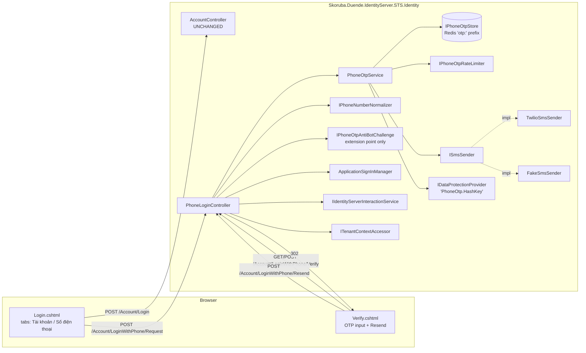
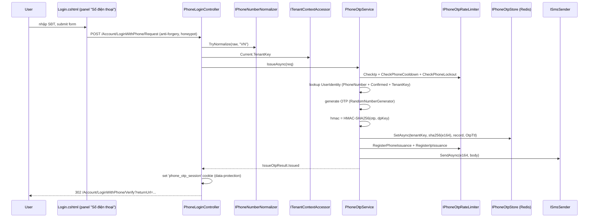
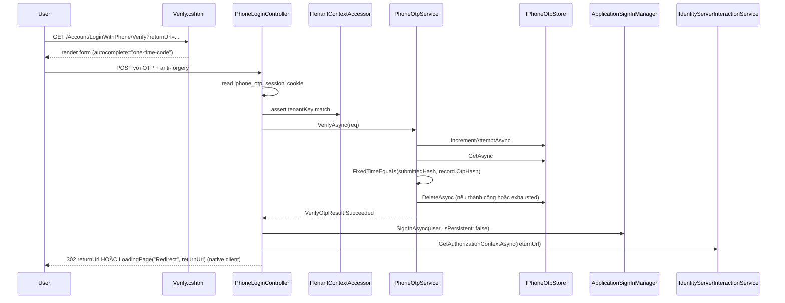
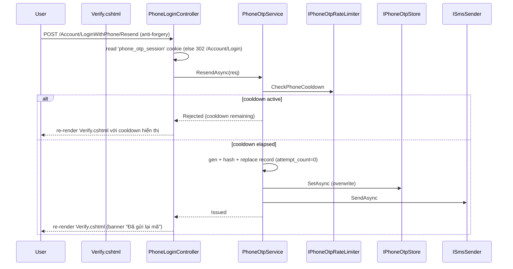

# Design Document

Phone OTP Login

## Overview

Tính năng này bổ sung phương thức đăng nhập **passwordless qua OTP SMS** cho host STS (`Skoruba.Duende.IdentityServer.STS.Identity`), chỉ dành cho **người dùng đã tồn tại** trong tenant hiện tại với `PhoneNumberConfirmed = true`. Toàn bộ thay đổi đặt **chỉ trong STS host** — không chạm Admin UI/API, không sửa BusinessLogic, không chạm EntityFramework, không phát sinh migration mới.

Blast radius được giữ tối thiểu bằng các nguyên tắc:

- Cookie scheme, IdentityServer signing keys, token lifetimes, OIDC client config: **không thay đổi**.
- `AccountController` hiện hành (form username/password): **không sửa**. `Login.cshtml` chỉ được wrap thêm tab control bên ngoài.
- Tính năng OFF mặc định (`PhoneOtpLogin:Enabled=false`); khi tắt, host render như trước feature.
- Lưu OTP **chỉ trong Redis** (instance đã có), prefix riêng `"otp:"` để cách ly với prefix `"tenant-registry:"` đang dùng.
- SMS provider (Twilio) ẩn sau abstraction `ISmsSender` để test không gọi mạng thật.

Phía người dùng: trang `/Account/Login` mở rộng thành tabbed UI (tab "Tài khoản" mặc định active, tab "Số điện thoại"). Step 2 nhập OTP nằm ở **trang riêng** `/Account/LoginWithPhone/Verify` để bookmark/refresh/back-button hoạt động đúng. Resend OTP nằm trên trang Verify.

## Architecture



Ràng buộc kiến trúc khẳng định lại:

- **KHÔNG** thêm authentication scheme mới.
- **KHÔNG** thêm cookie scheme mới. Cookie phát hành sau verify dùng đúng `IdentityConstants.ApplicationScheme` qua `ApplicationSignInManager.SignInAsync`.
- **KHÔNG** sửa OIDC sign-in/sign-out flow của `AccountController`.
- `phone_otp_session` là **session cookie ngắn hạn** (data-protection-protected) chỉ phục vụ chuyển trạng thái Step 1 → Step 2; **không** phải auth cookie.

## Components and Interfaces

Namespace gốc: `Skoruba.Duende.IdentityServer.STS.Identity.PhoneOtp` (sub-namespace `.Services`, `.Storage`, `.Sms`, `.Configuration`, `.Models`).

```csharp
// Services
public interface IPhoneOtpService
{
    Task<IssueOtpResult> IssueAsync(IssueOtpRequest request, CancellationToken ct);
    Task<VerifyOtpResult> VerifyAsync(VerifyOtpRequest request, CancellationToken ct);
    Task<IssueOtpResult> ResendAsync(IssueOtpRequest request, CancellationToken ct);
}

public interface IPhoneOtpStore
{
    Task<OtpStoreRecord?> GetAsync(string tenantKey, string phoneE164Hash, CancellationToken ct);
    Task SetAsync(string tenantKey, string phoneE164Hash, OtpStoreRecord record, TimeSpan ttl, CancellationToken ct);
    Task<int> IncrementAttemptAsync(string tenantKey, string phoneE164Hash, CancellationToken ct);
    Task DeleteAsync(string tenantKey, string phoneE164Hash, CancellationToken ct);
}

public interface IPhoneOtpRateLimiter
{
    Task<RateLimitDecision> CheckPhoneCooldownAsync(string tenantKey, string phoneE164Hash, CancellationToken ct);
    Task RegisterPhoneIssuanceAsync(string tenantKey, string phoneE164Hash, CancellationToken ct);
    Task<RateLimitDecision> CheckIpAsync(string ipHash, CancellationToken ct);
    Task RegisterIpIssuanceAsync(string ipHash, CancellationToken ct);
    Task<RateLimitDecision> CheckPhoneLockoutAsync(string tenantKey, string phoneE164Hash, CancellationToken ct);
    Task RegisterVerifyFailureAsync(string tenantKey, string phoneE164Hash, CancellationToken ct);
}

public interface IPhoneNumberNormalizer
{
    bool TryNormalize(string raw, string defaultRegion, out string e164);
    string Format(string e164);
    string MaskLast4(string e164);
}

// SMS
public interface ISmsSender
{
    Task<SmsSendResult> SendAsync(string e164PhoneNumber, string body, CancellationToken cancellationToken);
}

// Anti-bot extension point (no-op default)
public interface IPhoneOtpAntiBotChallenge
{
    Task<AntiBotDecision> EvaluateAsync(HttpContext context, CancellationToken ct);
}

// DTOs
public sealed record IssueOtpRequest(string RawPhone, string TenantKey, string RemoteIp, string ReturnUrl);

public sealed record IssueOtpResult(
    IssueOutcome Outcome,
    string? PhoneE164Hash,
    DateTimeOffset? ExpiresAtUtc,
    int? ResendCooldownRemainingSeconds);

public enum IssueOutcome { Issued, Rejected }

public sealed record VerifyOtpRequest(
    string TenantKey,
    string PhoneE164Hash,
    string SubmittedOtp,
    string RemoteIp);

public sealed record VerifyOtpResult(
    VerifyOutcome Outcome,
    string? UserId,
    int AttemptCount);

public enum VerifyOutcome { Succeeded, Mismatch, Expired, Exhausted, NoSession }

public sealed record OtpStoreRecord(
    byte[] OtpHash,
    string TenantKey,
    string PhoneE164,
    string UserId,
    DateTimeOffset CreatedAtUtc,
    DateTimeOffset ExpiresAtUtc,
    int AttemptCount);

public sealed record SmsSendResult(bool Succeeded, string? ProviderMessageId, string? ErrorCode, string? ErrorMessage)
{
    public static SmsSendResult Ok(string id) => new(true, id, null, null);
    public static SmsSendResult Failed(string code, string message) => new(false, null, code, message);
}

public sealed record RateLimitDecision(bool Allowed, string? Reason, int? CooldownRemainingSeconds);
public sealed record AntiBotDecision(bool Allowed, string? Reason);
```

Configuration POCOs (default values inline):

```csharp
public sealed class PhoneOtpLoginConfiguration
{
    public bool Enabled { get; set; } = false;
    public int OtpLength { get; set; } = 6;
    public int OtpTtlSeconds { get; set; } = 300;
    public int ResendCooldownSeconds { get; set; } = 60;
    public int MaxVerifyAttemptsPerOtp { get; set; } = 5;
    public int IpRateLimitWindowSeconds { get; set; } = 600;
    public int IpRateLimitMaxRequests { get; set; } = 10;
    public int PhoneVerifyLockoutWindowSeconds { get; set; } = 3600;
    public int PhoneVerifyLockoutMaxFailures { get; set; } = 10;
    public string DefaultRegion { get; set; } = "VN";
    public string RedisKeyPrefix { get; set; } = "otp:";
}

public sealed class SmsTwilioConfiguration
{
    public string AccountSid { get; set; } = string.Empty;
    public string AuthToken { get; set; } = string.Empty;
    public string FromNumber { get; set; } = string.Empty;
    public int TimeoutMilliseconds { get; set; } = 2000;
    public int MaxRetries { get; set; } = 1;
}
```

DI extension:

```csharp
namespace Skoruba.Duende.IdentityServer.STS.Identity.PhoneOtp;

public static class PhoneOtpServiceCollectionExtensions
{
    public static IServiceCollection AddPhoneOtpLogin(this IServiceCollection services, IConfiguration configuration);
}
```

Hành vi: `AddPhoneOtpLogin` đọc `PhoneOtpLogin` và `SmsConfiguration:Twilio`, fail-fast theo Section 8, đăng ký `IPhoneOtpService`, `IPhoneOtpStore` (Redis-backed), `IPhoneOtpRateLimiter`, `IPhoneNumberNormalizer` (libphonenumber-csharp), `ISmsSender` (Twilio hoặc Fake theo môi trường), no-op `IPhoneOtpAntiBotChallenge` mặc định, `IOptions<PhoneOtpLoginConfiguration>`, `IOptions<SmsTwilioConfiguration>`. Khi `Enabled=false`, phương thức trả về `services` không đăng ký gì, để controller routes trả 404 qua filter `PhoneOtpFeatureGateAttribute`.

## Data Models

Các shape dữ liệu chính của tính năng (định nghĩa C# đã liệt kê chi tiết ở Section "Components and Interfaces"):

- **`OtpStoreRecord`** — record bất biến lưu trong Redis tại key `otp:rec:{tenantKey}:{sha256(phoneE164)}`, gồm `OtpHash` (HMAC-SHA256, byte[]), `TenantKey`, `PhoneE164`, `UserId`, `CreatedAtUtc`, `ExpiresAtUtc`, `AttemptCount`. Serialize bằng `System.Text.Json` (camelCase, không indent). Plaintext OTP **không** xuất hiện trong record.
- **`IssueOtpRequest` / `IssueOtpResult` / `VerifyOtpRequest` / `VerifyOtpResult`** — DTO bất biến giữa controller ↔ `IPhoneOtpService`. Không persist; vòng đời = 1 request.
- **`SmsSendResult`** — return type của `ISmsSender.SendAsync`; không bao giờ throw, luôn về dạng `(Succeeded, ProviderMessageId, ErrorCode, ErrorMessage)`.
- **`RateLimitDecision` / `AntiBotDecision`** — value object `(Allowed, Reason, CooldownRemainingSeconds?)` dùng giữa rate-limiter / anti-bot và controller.
- **`PhoneOtpLoginConfiguration` / `SmsTwilioConfiguration`** — POCO IOptions binding từ `appsettings.json`; default values inline (xem Components and Interfaces).
- **`phone_otp_session` cookie payload** — JSON `{ "tenantKey": string, "phoneE164Hash": string, "expiresAtUtc": ISO-8601 string, "version": int = 1 }`, được protect bằng `IDataProtector.CreateProtector("PhoneOtp.SessionCookie")`. Cookie là session-only, ngắn hạn, KHÔNG phải auth cookie.
- **Persistence boundary**: tính năng KHÔNG thêm bảng/cột mới trong cơ sở dữ liệu. `UserIdentity` được đọc-only qua `UserManager<UserIdentity>` đã có (filter `PhoneNumber + PhoneNumberConfirmed + TenantKey`). Không migration EF Core.

## Data Flow

### 4.1 Step 1 — Issue OTP



Nhánh từ chối (bất kỳ lý do nào trong R7.1) trả cùng response: re-render `Login.cshtml` với tab "Số điện thoại" pre-activated server-side + `Generic_Error`, sau khi `Task.Delay(Random(200, 600))`.

### 4.2 Step 2 — Verify OTP



### 4.3 Resend



## Storage Layout (Redis)

Mọi khoá đặt dưới prefix `otp:` (cấu hình `PhoneOtpLogin:RedisKeyPrefix`, mặc định `otp:`). Prefix này **độc lập** với `tenant-registry:` đang dùng bởi `TenantInfrastructure`. Hai prefix dùng chung Redis instance định nghĩa ở `TenantInfrastructure:RedisInstanceName` + `Connections:Redis` nhưng không có khả năng đụng key.

| Key | Value | TTL | Mục đích |
| --- | --- | --- | --- |
| `otp:rec:{tenantKey}:{sha256(phoneE164)}` | JSON `OtpStoreRecord` | `OtpTtlSeconds` (mặc định 300s) | Record OTP đang chờ verify |
| `otp:rl:phone:{tenantKey}:{sha256(phoneE164)}` | Unix timestamp issuance gần nhất (string) | `ResendCooldownSeconds` (60s) | Cooldown per-phone |
| `otp:rl:ip:{ipHash}` | Counter (string số nguyên, tăng bằng `INCR`) | `IpRateLimitWindowSeconds` (600s) | Rolling counter per-IP |
| `otp:lockout:phone:{tenantKey}:{sha256(phoneE164)}` | Counter `int` | `PhoneVerifyLockoutWindowSeconds` (3600s) | Đếm số verify failure trong cửa sổ |

Chi tiết:

- `phoneE164Hash` = SHA-256 hex của số E.164 (lowercase). Hash dùng để **tránh lưu plaintext SĐT trong key Redis**, không phải để bảo mật mạnh.
- `ipHash` = SHA-256 hex của IP đã canonicalize. Salt = empty (cần thiết là idempotent giữa các instance STS).
- TTL được set bằng `IDistributedCache.SetAsync` với `AbsoluteExpirationRelativeToNow`. Redis tự dọn rác.
- `IPhoneOtpStore.IncrementAttemptAsync` thực thi qua Lua script atomic (`GET` + `INCR` + `EXPIRE`) để tránh race giữa các verify đồng thời.

## Security

- **HMAC key**: `IDataProtectionProvider.CreateProtector("PhoneOtp.HashKey").Protect(constSeed)` được dùng làm key cho `HMACSHA256`. Key persist qua `IdentityServerDataProtectionDbContext` đã có sẵn. Không có key plaintext nào trong `appsettings.json`.
- **Constant-time compare**: dùng `System.Security.Cryptography.CryptographicOperations.FixedTimeEquals(submittedHash, record.OtpHash)` để so sánh hash, tránh timing attack.
- **Redaction**: mỗi log entry chứa thông tin định danh SĐT bằng format `last4:sha8` — `last4` = 4 chữ số cuối của E.164, `sha8` = 8 hex đầu của `sha256(e164)`. KHÔNG bao giờ log: OTP plaintext, OTP hash, full E.164, Twilio AuthToken, body SMS.
- **CSRF**: tất cả POST endpoint (`Request`, `Verify`, `Resend`) đều có `[ValidateAntiForgeryToken]`.
- **Honeypot**: input ẩn `name="website"` trong Phone_Request_Page; nếu non-empty trên POST, controller xử lý theo nhánh từ chối indistinguishable (R7.1).
- **`phone_otp_session` cookie**: payload JSON `{ "tenantKey": "...", "phoneE164Hash": "...", "expiresAtUtc": "...", "version": 1 }`, được protect bằng `IDataProtector.CreateProtector("PhoneOtp.SessionCookie")`. Cookie attributes: `HttpOnly=true`, `Secure=true` (theo môi trường), `SameSite=Lax`, `IsEssential=true`, expire = `expiresAtUtc + 30s` để cho client đến trang Verify kịp.
- **Random delay 200–600 ms**: áp dụng cho **mọi nhánh từ chối ở step 1** (số chưa đăng ký, chưa confirm, rate-limit, lockout, missing tenant, honeypot tripped, Twilio fail, normalize fail). Sample bằng `RandomNumberGenerator.GetInt32(200, 601)` rồi `await Task.Delay(...)`.

## Multi-tenant

- TenantKey **duy nhất** đến từ `ITenantContextAccessor.Current.TenantKey`. Controller **KHÔNG** đọc tenant từ body, query, header, hoặc cookie.
- Composite key OTP record bao gồm tenantKey: `otp:rec:{tenantKey}:{phoneE164Hash}`. Hai tenant cùng SĐT không đụng nhau.
- Lookup `UserIdentity` lọc đồng thời `PhoneNumber == e164 AND PhoneNumberConfirmed == true AND TenantKey == current`.
- `phone_otp_session` cookie chứa `tenantKey`. Tại verify, nếu `cookie.tenantKey != Current.TenantKey` (ví dụ user đổi subdomain giữa step 1 và step 2), controller **xóa cookie** và 302 sang `/Account/Login` preserving `returnUrl`.

## Error Handling

Phần này gộp Failure Modes & Startup Fail-Fast (theo cấu trúc design template chuẩn).

### Startup fail-fast

`AddPhoneOtpLogin` gọi tại Startup theo thứ tự được chốt ở R17.4. Khi `PhoneOtpLogin:Enabled=true`, các kiểm tra sau chạy ngay:

| Điều kiện | Exception (verbatim) |
| --- | --- |
| `PhoneOtpLogin:Enabled=true` AND môi trường Production AND `SmsConfiguration:Twilio:AccountSid` null/whitespace | `InvalidOperationException("PhoneOtpLogin is enabled in Production but SmsConfiguration:Twilio:AccountSid is not configured.")` |
| `PhoneOtpLogin:Enabled=true` AND môi trường Production AND `SmsConfiguration:Twilio:AuthToken` null/whitespace | `InvalidOperationException("PhoneOtpLogin is enabled in Production but SmsConfiguration:Twilio:AuthToken is not configured.")` |
| `PhoneOtpLogin:Enabled=true` AND môi trường Production AND `SmsConfiguration:Twilio:FromNumber` null/whitespace | `InvalidOperationException("PhoneOtpLogin is enabled in Production but SmsConfiguration:Twilio:FromNumber is not configured.")` |
| `PhoneOtpLogin:Enabled=true` AND `IDataProtectionProvider.CreateProtector("PhoneOtp.HashKey")` ném/trả null | `InvalidOperationException("PhoneOtpLogin is enabled but IDataProtectionProvider could not produce a protector for 'PhoneOtp.HashKey'.")` |
| `PhoneOtpLogin:Enabled=true` AND không có Redis connection (`Connections:Redis` null/whitespace) | `InvalidOperationException("PhoneOtpLogin is enabled but no Redis connection is configured at 'Connections:Redis'.")` |
| `PhoneOtpLogin:Enabled=true` AND `PhoneOtpLogin:OtpLength < 4 OR > 10` | `InvalidOperationException("PhoneOtpLogin:OtpLength must be between 4 and 10.")` |
| `PhoneOtpLogin:Enabled=true` AND `PhoneOtpLogin:DefaultRegion` không phải ISO-3166 alpha-2 hợp lệ | `InvalidOperationException("PhoneOtpLogin:DefaultRegion must be an ISO-3166 alpha-2 region code (e.g., 'VN').")` |

Môi trường non-Production có cấu hình Twilio thiếu: KHÔNG fail-fast; thay vào đó đăng ký `FakeSmsSender` và log Warning với danh sách key thiếu.

### Runtime failure modes

Không fail-fast, xử lý cục bộ:

- Twilio timeout/5xx sau retry → `SmsSendResult.Failed`; controller invalidate record, log Error, re-render với Generic_Error.
- Redis unavailable → `IDistributedCache` ném; controller catch, log Error, trả Generic_Error. Không retry.
- `ITenantContextAccessor.Current == null` → log Warning `Reason="MissingTenantContext"`, trả Generic_Error sau random delay.

## UX & UI

### Login.cshtml (tabbed)

```
+------------------------------------------------+
| [tablist role="tablist"]                       |
|   [tab "Tài khoản"  aria-selected="true"  ←]   |
|   [tab "Số điện thoại"  aria-selected="false"] |
+------------------------------------------------+
| [tabpanel "Tài khoản"  hidden=false]           |
|   <form id="local-login-form"> (UNCHANGED)     |
|     - Username, Password, RememberMe           |
|     - External providers, Forgot, Cancel       |
|   </form>                                      |
+------------------------------------------------+
| [tabpanel "Số điện thoại"  hidden=true]        |
|   <form method="post"                          |
|         action="/Account/LoginWithPhone/Request">|
|     - PhoneNumber (type=tel, inputmode=tel)    |
|     - hidden ReturnUrl                         |
|     - hidden honeypot name="website"           |
|     - anti-forgery token                       |
|     - submit "Gửi mã"                          |
|   </form>                                      |
+------------------------------------------------+
```

Render rule:

- Nếu `PhoneOtpLogin:Enabled=false` HOẶC `ITenantContextAccessor.Current == null`: render giữ y nguyên trang Login cũ, **không** có tablist, **không** include `login-tabs.js`/`login-tabs.css`.
- Nếu enabled: render tablist + 2 panel server-side. Mặc định mỗi GET fresh: tab "Tài khoản" active, panel "Số điện thoại" có thuộc tính `hidden`. Nhánh re-render do lỗi Step 1: server gắn `aria-selected="true"` cho tab "Số điện thoại" và remove `hidden` trên panel tương ứng.

### Verify.cshtml (`/Account/LoginWithPhone/Verify`)

```
+------------------------------------------------+
| Đăng nhập bằng số điện thoại — bước 2          |
+------------------------------------------------+
| Mã đã gửi đến SĐT: ******1234                  |
|                                                |
| <form method="post">                           |
|   [Mã OTP] (autocomplete="one-time-code",      |
|             inputmode="numeric",               |
|             maxlength=OtpLength)               |
|   hidden ReturnUrl                             |
|   anti-forgery                                 |
|   [Xác nhận]                                   |
| </form>                                        |
|                                                |
| <form method="post" action=".../Resend">       |
|   anti-forgery                                  |
|   [Gửi lại mã (chờ {n}s)]                       |
| </form>                                        |
|                                                |
| <a href="/Account/Login?returnUrl=...">        |
|   ← Quay lại                                   |
| </a>                                           |
+------------------------------------------------+
```

### Localization keys (verbatim)

```
LoginWithPhone.TabAccount
LoginWithPhone.TabPhone
LoginWithPhone.PhoneLabel
LoginWithPhone.RequestSubmit
LoginWithPhone.OtpLabel
LoginWithPhone.VerifySubmit
LoginWithPhone.Resend
LoginWithPhone.BackToLogin
LoginWithPhone.GenericError
LoginWithPhone.GenericVerifyError
LoginWithPhone.MaskedPhonePrefix
LoginWithPhone.SmsBodyTemplate
```

`SmsBodyTemplate` mặc định: `"Mã đăng nhập của bạn: {otp}. Mã có hiệu lực trong {ttl_minutes} phút."`

### Frontend assets

- `wwwroot/js/login-tabs.js`: vanilla JS module, ~80 dòng. Chỉ toggle `aria-selected`, `tabindex`, `hidden`, class `is-active`. Hỗ trợ ArrowLeft/ArrowRight wrap-around. **Không** AJAX, **không** jQuery, **không** mutate giá trị input. Chỉ được include từ `Login.cshtml` khi flag bật.
- `wwwroot/css/login-tabs.css`: CSS thuần cho tablist layout, `.is-active`, focus ring, visually-hidden honeypot. **Không** include từ `_Layout.cshtml`.
- **CSP nonce**: nếu `_Layout.cshtml` đã có cơ chế nonce (cần kiểm tra trong Phase 3 task), `<script>` của `login-tabs.js` phải nhận `asp-add-nonce` hoặc tương đương; nếu chưa có nonce mechanism, dùng `<script src=...>` external file (đã là plan), tránh inline script để không vi phạm CSP tương lai.

## Telemetry & Audit

Sử dụng Serilog (đã có trong host) với structured properties. Không log raw E.164, không log OTP/hash/AuthToken/body SMS.

| Property | Loại | Ghi chú |
| --- | --- | --- |
| `Event` | string | `PhoneOtpRequest` \| `PhoneOtpVerify` \| `PhoneOtpResend` \| `PhoneOtpSmsSend` |
| `TenantKey` | string | từ `ITenantContextAccessor.Current` |
| `PhoneLast4` | string | 4 chữ số cuối của E.164 |
| `PhoneSha8` | string | 8 hex đầu của `sha256(e164)` |
| `RemoteIp` | string | đã canonicalize qua middleware forwarded-headers nếu enabled |
| `Outcome` | string | `Issued` \| `Rejected` \| `Succeeded` \| `Mismatch` \| `Expired` \| `Exhausted` \| `NoSession` |
| `AttemptCount` | int | hiện tại trong record sau increment |
| `RateLimitReason` | string | `PhoneCooldown` \| `IpWindow` \| `PhoneLockout` \| null |
| `ProviderErrorCode` | string | Twilio error code (vd `20429`) |
| `LoginType` | string | constant `"phone-otp"` cho `UserLoginSuccessEvent` |

Severity:

- `Information`: mọi `PhoneOtpRequest` (issued/rejected), mọi `PhoneOtpVerify`, `PhoneOtpResend` thành công, `PhoneOtpSmsSend` thành công.
- `Warning`: rate-limit hit, missing tenant context, honeypot tripped, Twilio retry-recoverable error, non-Production thiếu Twilio config.
- `Error`: Twilio fail sau retry, Redis exception, exception ngoài dự kiến.

Sau khi sign-in thành công, raise `Duende.IdentityServer.Events.UserLoginSuccessEvent` với `loginType = "phone-otp"` qua `IEventService` đã có.

## Twilio Integration

Implementation `TwilioSmsSender : ISmsSender`:

```csharp
public async Task<SmsSendResult> SendAsync(string e164, string body, CancellationToken ct)
{
    TwilioClient.Init(_cfg.AccountSid, _cfg.AuthToken);
    using var cts = CancellationTokenSource.CreateLinkedTokenSource(ct);
    cts.CancelAfter(TimeSpan.FromMilliseconds(_cfg.TimeoutMilliseconds));

    for (int attempt = 0; attempt <= _cfg.MaxRetries; attempt++)
    {
        try
        {
            var msg = await MessageResource.CreateAsync(
                to: new PhoneNumber(e164),
                from: new PhoneNumber(_cfg.FromNumber),
                body: body);
            return SmsSendResult.Ok(msg.Sid);
        }
        catch (ApiException ex) when (IsRetryable(ex) && attempt < _cfg.MaxRetries)
        {
            // log Warning, continue
        }
        catch (Exception ex)
        {
            return SmsSendResult.Failed(ExtractCode(ex), ex.Message);
        }
    }
    return SmsSendResult.Failed("max-retries", "Twilio send failed after retry.");
}
```

- Timeout per-call: 2000 ms (cấu hình `SmsConfiguration:Twilio:TimeoutMilliseconds`).
- Retry: **đúng 1 lần** trên transient failures. Coi là retryable: HTTP 5xx (Twilio `ApiException.Status >= 500`), network IO error, Twilio code `20429` (Too Many Requests), `20003` không retry (auth fail là permanent).
- **Không throw** ra ngoài cho permanent failure — luôn trả `SmsSendResult.Failed(...)`. Throw chỉ xảy ra với exception lập trình (null param, v.v.) và sẽ được controller catch chung.
- Khuyến nghị dùng **manual retry loop** (như trên) thay vì Polly. Lý do: (1) `Skoruba.Duende.IdentityServer.STS.Identity.csproj` hiện không reference Polly — thêm dependency mới để retry duy nhất 1 lần là không cân xứng; (2) yêu cầu retry rất đơn giản và đã viết được trong ~10 dòng. Nếu csproj đã reference Polly tại thời điểm implement Phase 3, có thể đổi sang `ResiliencePipelineBuilder`.

`FakeSmsSender : ISmsSender`: ghi `(e164, body, sentAtUtc)` vào `ConcurrentBag<FakeSentSms>` thread-safe expose qua property `IReadOnlyCollection<FakeSentSms> Sent`. Dùng cho integration test và Development.

## Coexistence

- `Login.cshtml` chỉ bị **bọc thêm** tab markup. Form `id="local-login-form"` và toàn bộ partials nội bộ (`_ValidationSummary`, external providers, Forgot, Cancel) được di chuyển nguyên xi vào panel "Tài khoản". `asp-action`, `asp-controller`, anti-forgery, model binding **không thay đổi**.
- `Startup.cs`: thêm 1 dòng `services.AddPhoneOtpLogin(Configuration);` đặt **ngay sau** `AddEmailSenders(Configuration)` và **trước** `AddAuthorizationPolicies(...)` (đúng vị trí R17.4).
- Sau verify thành công, `PhoneLoginController` gọi `_signInManager.SignInAsync(user, isPersistent: false)` — đúng signature mà `AccountController.Login` đang dùng — tạo cookie cùng scheme và shape. Sau đó controller gọi `_interaction.GetAuthorizationContextAsync(returnUrl)` và dispatch theo cùng 2 nhánh: `Redirect(returnUrl)` cho non-native, `LoadingPage("Redirect", returnUrl)` cho native client.
- IdentityServer signing keys, validation keys, scope definitions, token lifetimes, `IdentityServerOptions`, `ServerSideSessionsConfiguration`: **không thay đổi** ở Phase này.
- `TenantResolutionMiddleware` tiếp tục chạy trước routing → Phone_Login_Controller luôn có `ITenantContextAccessor.Current` đúng.


## Correctness Properties

*A property is a characteristic or behavior that should hold true across all valid executions of a system — essentially, a formal statement about what the software should do. Properties bridge human-readable specifications and machine-verifiable correctness guarantees.*

Mỗi property dưới đây được rút ra từ prework (Section trên), được hợp nhất để loại bỏ trùng lặp, và sẽ được implement bằng property-based test (mỗi property = đúng 1 test, tối thiểu 100 iterations) trong Phase 3.

### Property 1: Phone-number normalize round-trip

*For any* raw phone string `r` mà `IPhoneNumberNormalizer.TryNormalize(r, "VN", out var e)` trả `true`, `Normalize(Format(e), "VN")` SHALL trả về `e` (E.164 ổn định qua format → normalize).

**Validates: Requirements 3.4, 16.6**

### Property 2: Tenant-scoped user lookup

*For any* tenants `tA != tB` và số `phone` cùng tồn tại ở cả hai tenant với `PhoneNumberConfirmed = true`, một issuance request trong tenant context `tA` SHALL chỉ resolve về user thuộc `tA`, và ngược lại; không bao giờ resolve user của tenant đối lập, không bao giờ trả nhiều hơn một user.

**Validates: Requirements 3.7, 8.2, 8.3**

### Property 3: OTP shape and hash-only storage

*For any* OTP được generate, OTP có chính xác `OtpLength` ký tự, mọi ký tự là chữ số `0–9`, AND chuỗi plaintext của OTP SHALL không xuất hiện trong byte serialized của `OtpStoreRecord` ghi vào `IPhoneOtpStore` (chỉ HMAC hash được lưu).

**Validates: Requirements 3.10, 9.1, 13.4**

### Property 4: OTP store lifecycle

*For any* successful issuance `I` với `(tenantKey, phoneE164)`:

1. Ngay sau `I`, `IPhoneOtpStore.GetAsync(tenantKey, sha256(phoneE164))` trả `OtpStoreRecord` có `attempt_count = 0`, TTL trong khoảng `[OtpTtlSeconds − 2s, OtpTtlSeconds]`.
2. Nếu một resend `R` chạy sau khi cooldown elapsed, record cũ bị thay thế bởi record mới có `attempt_count = 0` và `OtpHash` khác record cũ.
3. Sau verify thành công HOẶC sau khi `attempt_count > MaxVerifyAttemptsPerOtp`, `GetAsync` SHALL trả `null` (record đã bị xoá trước khi controller gửi response).

**Validates: Requirements 3.11, 5.3, 5.4, 9.3, 9.4, 4.7**

### Property 5: Indistinguishable rejection (Step 1)

*For any* nhánh từ chối ở step 1 thuộc tập `{ invalid E.164, phone không tồn tại, PhoneNumberConfirmed=false, LockoutEnd>now, phone-cooldown hit, ip-window hit, phone-lockout hit, honeypot non-empty, missing tenant context, Twilio send failure, body/query injected tenant }`:

1. HTTP status, Content-Type và HTML response body của Login_Page (sau re-render với phone tab pre-active + Generic_Error) SHALL byte-equal qua tất cả các nhánh.
2. Response headers và Set-Cookie SHALL không chứa bất kỳ token tiết lộ lý do nào trong tập `{ "phone-not-registered", "phone-not-confirmed", "rate-limit", "lockout", "honeypot-tripped", "twilio" }`.
3. Delay được apply từ `IDelayProvider` (test-injected) SHALL nằm trong `[200ms, 600ms]`.
4. `ISmsSender.SendAsync` SHALL được invoke đúng `0` lần.
5. Server-side log SHALL có đúng 1 entry với property `Reason` phân biệt được nhánh thực tế và `PhoneLast4` (KHÔNG phải full E.164).

**Validates: Requirements 7.1, 7.2, 7.3, 7.4, 8.1, 11.2, 11.3, 14.2**

### Property 6: Step-1 success continuation

*For any* successful issuance với `returnUrl ∈ R` (tập returnUrl hợp lệ — kể cả null/empty/relative/absolute-same-host):

1. Response là HTTP 302 với `Location = "/Account/LoginWithPhone/Verify?returnUrl=" + UrlEncode(returnUrl)` (omit query khi returnUrl null).
2. Response chứa Set-Cookie `phone_otp_session` mà payload, sau khi unprotect bằng `IDataProtectionProvider`, SHALL có shape `{ tenantKey, phoneE164Hash, expiresAtUtc, version }` với `tenantKey == Current.TenantKey`, `phoneE164Hash == sha256(e164)`, `expiresAtUtc - now ∈ [OtpTtlSeconds − 2s, OtpTtlSeconds]`.

**Validates: Requirements 3.13, 3.15**

### Property 7: Verify success post-conditions

*For any* matching OTP submission ở `/Account/LoginWithPhone/Verify`:

1. `IPhoneOtpStore.GetAsync(...)` SHALL trả `null` ngay trước khi controller gọi sign-in.
2. Set-Cookie `phone_otp_session` SHALL được gửi với expiry quá khứ (clear cookie) trong cùng response.
3. `ApplicationSignInManager.SignInAsync(user, isPersistent: false)` SHALL được invoke đúng 1 lần với user đúng `UserId` lấy từ record.
4. `IEventService.RaiseAsync` SHALL được invoke đúng 1 lần với một `UserLoginSuccessEvent` có `LoginType == "phone-otp"`.

**Validates: Requirements 4.10, 4.11, 9.4, 13.3**

### Property 8: Verify counter atomicity và exhaustion

*For any* `n` verify request đồng thời chạy trên cùng một `(tenantKey, phoneE164)` với OTP sai:

1. Tổng increment trên counter trong `IPhoneOtpStore` SHALL bằng đúng `n` (không có lost update).
2. Nếu `n > MaxVerifyAttemptsPerOtp`, record SHALL bị xoá (test sau khi tất cả request hoàn tất).

**Validates: Requirements 4.5, 4.7, 6.3**

### Property 9: Rate-limit windows enforced and expire

*For any* configured window `W` và max-count `M`, ba family rate-limit (phone cooldown, IP window, phone lockout) tuân:

1. **Phone cooldown** (`W = ResendCooldownSeconds`, `M = 1`): trong cùng `(tenantKey, phoneE164)`, request thứ 2 trong cửa sổ SHALL bị reject. Sau `W + 1s`, request mới SHALL được chấp nhận.
2. **IP window** (`W = IpRateLimitWindowSeconds`, `M = IpRateLimitMaxRequests`): trong cùng IP, request thứ `M + 1` trong cửa sổ SHALL bị reject. Sau `W + 1s` counter SHALL bị reset (key Redis hết hạn).
3. **Phone lockout** (`W = PhoneVerifyLockoutWindowSeconds`, `M = PhoneVerifyLockoutMaxFailures`): sau `M + 1` verify failure trong cửa sổ, mọi issuance request mới cho `(tenantKey, phoneE164)` SHALL bị reject; sau `W + 1s` SHALL được phép trở lại.

**Validates: Requirements 6.1, 6.2, 6.4, 6.7**

### Property 10: Redis key namespace isolation

*For any* operation của `IPhoneOtpStore`, `IPhoneOtpRateLimiter`, hoặc lockout counter, key gửi đến `IDistributedCache` SHALL bắt đầu bằng `PhoneOtpLogin:RedisKeyPrefix` (mặc định `"otp:"`) AND SHALL không bắt đầu bằng `"tenant-registry:"`.

**Validates: Requirements 8.3, 9.5**

### Property 11: Twilio retry semantics

*For any* sequence `S` của Twilio gateway responses (mock-injected):

1. Nếu `S[0]` là transient (HTTP 5xx, network IO, code `20429`) AND `S[1]` là success → `SendAsync` returns `Succeeded`, gateway invoke đúng 2 lần.
2. Nếu `S[0]` là transient AND `S[1]` là transient → `SendAsync` returns `Failed`, gateway invoke đúng 2 lần (không retry quá `MaxRetries`).
3. Nếu `S[0]` là permanent (4xx khác `429`, code `20003`) → `SendAsync` returns `Failed`, gateway invoke đúng 1 lần.
4. Trong mọi trường hợp, `SendAsync` SHALL không re-throw; lỗi luôn quy về `SmsSendResult.Failed`.

**Validates: Requirements 10.3, 10.4**

### Property 12: No auto-provisioning

*For any* phone-OTP request với `phoneE164` không khớp bất kỳ `UserIdentity` nào (kể cả khi confirm=false hoặc tenant mismatch hoặc lockout active), tổng số bản ghi trong `UserManager`/`UserStore` SHALL không thay đổi sau request — không Insert, không Update vào `UserIdentity`, claims, roles.

**Validates: Requirements 11.1**

### Property 13: Audit log redaction and structure

*For any* request đi qua bất kỳ endpoint phone-OTP nào, log output captured (sink test) thoả:

1. Có đúng 1 entry `Information`/`Warning` với `Event ∈ { "PhoneOtpRequest", "PhoneOtpVerify", "PhoneOtpResend", "PhoneOtpSmsSend" }` và đầy đủ structured properties theo Section 10.
2. Không entry nào (mọi level) chứa: chuỗi plaintext OTP, hex của OTP hash, full E.164 (search exact), Twilio AuthToken value, body SMS đã render (string chứa OTP).

**Validates: Requirements 13.1, 13.2, 13.4, 13.5, 10.6**

## Testing Strategy

Cách tiếp cận **dual** (đã hợp với prework Section 13):

- **Unit tests** (xUnit): bao phủ EXAMPLE/EDGE_CASE đã liệt kê trong prework — startup fail-fast messages, defaults, controller branch render, view rendering.
- **Property-based tests** (FsCheck.Xunit hoặc CsCheck — chọn FsCheck vì đã quen thuộc trong .NET community; KHÔNG implement PBT framework từ đầu): mỗi Property 1–13 ở Section 13 = đúng 1 test, cấu hình `[Property(MaxTest = 100)]` (≥ 100 iterations). Mỗi test annotate bằng comment đầu file:

  ```csharp
  // Feature: phone-otp-login, Property 5: Indistinguishable rejection (Step 1)
  ```

- **Integration tests** (`Microsoft.AspNetCore.Mvc.Testing` + `WebApplicationFactory`): boot host với `FakeSmsSender`, in-memory `IDistributedCache` (StackExchangeRedis được swap bằng MemoryDistributedCache hoặc fake adapter), in-memory `UserManager`. Bao phủ:
  - Flag false: HTML không có tablist; 3 routes 404.
  - Flag true: HTML có tablist + 2 panels markup; POST Request với valid number → 302 Verify; POST Request với invalid → re-render với phone tab pre-active.
  - GET Verify không cookie → 302 Login.
  - POST Verify đúng OTP → 302 returnUrl + cookie auth scheme cũ.
  - POST Verify sai OTP `MaxVerifyAttemptsPerOtp + 1` lần → record xoá.
  - POST Resend trong cooldown → no SMS call.
  - Cookie tenantKey mismatch tại verify → clear + 302 Login.
  - DOM accessibility: tab buttons có `role="tab"`, `aria-controls`, `aria-selected`; panels có `role="tabpanel"`, `aria-labelledby`.

- **CI guard test**: `TwilioCredentialsScannerTests` quét tất cả file trong test projects (`tests/**/*.json`, `tests/**/appsettings*.json`, `tests/**/*.cs`) bằng regex `\bAC[a-fA-F0-9]{32}\b` (Twilio AccountSid pattern). Nếu match, test FAIL với message liệt kê file + line. Test này luôn chạy (không skip), thỏa Requirement 16.7.

- **JS static-asset test**: đọc nội dung `wwwroot/js/login-tabs.js`, assert KHÔNG match `\bfetch\s*\(`, `\bXMLHttpRequest\b`, `jquery`, `\$\(`, `\.submit\s*\(`. Thoả Requirement 2.10.

- **Out of scope cho test pyramid này**: behavior tab-toggle thực thi trong browser (Requirements 2.8, 2.9). Khuyến nghị manual smoke + Playwright test trong feature riêng nếu cần.

## Implementation Impact Map

### Files mới

| File | Mục đích |
| --- | --- |
| `src/Skoruba.Duende.IdentityServer.STS.Identity/PhoneOtp/Configuration/PhoneOtpLoginConfiguration.cs` | POCO + defaults |
| `src/Skoruba.Duende.IdentityServer.STS.Identity/PhoneOtp/Configuration/SmsTwilioConfiguration.cs` | POCO |
| `src/Skoruba.Duende.IdentityServer.STS.Identity/PhoneOtp/PhoneOtpServiceCollectionExtensions.cs` | `AddPhoneOtpLogin` |
| `src/Skoruba.Duende.IdentityServer.STS.Identity/PhoneOtp/Services/IPhoneOtpService.cs` |  |
| `src/Skoruba.Duende.IdentityServer.STS.Identity/PhoneOtp/Services/PhoneOtpService.cs` |  |
| `src/Skoruba.Duende.IdentityServer.STS.Identity/PhoneOtp/Services/IPhoneOtpRateLimiter.cs` |  |
| `src/Skoruba.Duende.IdentityServer.STS.Identity/PhoneOtp/Services/PhoneOtpRateLimiter.cs` |  |
| `src/Skoruba.Duende.IdentityServer.STS.Identity/PhoneOtp/Services/IPhoneNumberNormalizer.cs` |  |
| `src/Skoruba.Duende.IdentityServer.STS.Identity/PhoneOtp/Services/PhoneNumberNormalizer.cs` | libphonenumber-csharp wrapper |
| `src/Skoruba.Duende.IdentityServer.STS.Identity/PhoneOtp/Services/IPhoneOtpAntiBotChallenge.cs` | Extension point |
| `src/Skoruba.Duende.IdentityServer.STS.Identity/PhoneOtp/Services/NoopPhoneOtpAntiBotChallenge.cs` | Default no-op |
| `src/Skoruba.Duende.IdentityServer.STS.Identity/PhoneOtp/Storage/IPhoneOtpStore.cs` |  |
| `src/Skoruba.Duende.IdentityServer.STS.Identity/PhoneOtp/Storage/RedisPhoneOtpStore.cs` |  |
| `src/Skoruba.Duende.IdentityServer.STS.Identity/PhoneOtp/Sms/ISmsSender.cs` |  |
| `src/Skoruba.Duende.IdentityServer.STS.Identity/PhoneOtp/Sms/TwilioSmsSender.cs` |  |
| `src/Skoruba.Duende.IdentityServer.STS.Identity/PhoneOtp/Sms/FakeSmsSender.cs` |  |
| `src/Skoruba.Duende.IdentityServer.STS.Identity/PhoneOtp/Sms/SmsSendResult.cs` |  |
| `src/Skoruba.Duende.IdentityServer.STS.Identity/PhoneOtp/Models/IssueOtpRequest.cs`, `IssueOtpResult.cs`, `VerifyOtpRequest.cs`, `VerifyOtpResult.cs`, `OtpStoreRecord.cs`, `RateLimitDecision.cs`, `AntiBotDecision.cs` | DTOs |
| `src/Skoruba.Duende.IdentityServer.STS.Identity/PhoneOtp/Filters/PhoneOtpFeatureGateAttribute.cs` | 404 khi flag tắt |
| `src/Skoruba.Duende.IdentityServer.STS.Identity/Controllers/PhoneLoginController.cs` | 3 endpoints |
| `src/Skoruba.Duende.IdentityServer.STS.Identity/ViewModels/Account/PhoneRequestViewModel.cs` |  |
| `src/Skoruba.Duende.IdentityServer.STS.Identity/ViewModels/Account/PhoneVerifyViewModel.cs` |  |
| `src/Skoruba.Duende.IdentityServer.STS.Identity/Views/Account/LoginWithPhone/Verify.cshtml` | View riêng cho Step 2 |
| `src/Skoruba.Duende.IdentityServer.STS.Identity/Views/Shared/_PhoneRequestPanel.cshtml` | Partial cho panel "Số điện thoại" trong Login.cshtml |
| `src/Skoruba.Duende.IdentityServer.STS.Identity/wwwroot/js/login-tabs.js` | Vanilla JS tabs |
| `src/Skoruba.Duende.IdentityServer.STS.Identity/wwwroot/css/login-tabs.css` | Tab styles |
| `src/Skoruba.Duende.IdentityServer.STS.Identity/Resources/SharedResource.vi.resx` | Bổ sung 12 keys `LoginWithPhone.*` (file .resx hiện hữu — modify chứ không tạo mới) |
| `tests/Skoruba.Duende.IdentityServer.STS.Identity.PhoneOtp.UnitTests/*` | Test project mới: unit + property tests + Twilio credential scanner |
| `tests/Skoruba.Duende.IdentityServer.STS.Identity.PhoneOtp.IntegrationTests/*` | Test project mới: WebApplicationFactory-based integration tests |

### Files modified (additive)

| File | Thay đổi |
| --- | --- |
| `src/Skoruba.Duende.IdentityServer.STS.Identity/Startup.cs` | Thêm `services.AddPhoneOtpLogin(Configuration);` ngay sau `AddEmailSenders(Configuration)` |
| `src/Skoruba.Duende.IdentityServer.STS.Identity/Views/Account/Login.cshtml` | Wrap form hiện hữu vào tabpanel "Tài khoản"; thêm tablist + tabpanel "Số điện thoại" có-điều-kiện theo flag; include `login-tabs.js`/`login-tabs.css` có-điều-kiện |
| `src/Skoruba.Duende.IdentityServer.STS.Identity/appsettings.json` | KHÔNG thay đổi trong Phase 2 (sẽ thực hiện ở Phase 3 nếu user duyệt) — Phase 2 chỉ document keys cần có |
| `src/Skoruba.Duende.IdentityServer.STS.Identity/Skoruba.Duende.IdentityServer.STS.Identity.csproj` | Phase 3: thêm reference `Twilio` (>= 7.x) và `libphonenumber-csharp` (>= 8.x) |

## Open Questions (deferred to follow-up)

- Xác nhận trong Phase 3 thư viện normalize: `libphonenumber-csharp` (Google) là khuyến nghị mặc định; nếu csproj đã có lib khác, dùng cái đã có.
- Có nên thêm Polly `ResiliencePipeline` cho TwilioSmsSender nếu có người duyệt thêm dependency? Hiện đề xuất: không.
- CSP nonce mechanism của host: cần grep `_Layout.cshtml` ở đầu Phase 3 để biết cách inject script đúng cách (và xác nhận có cần thay đổi hay không).
- `IPhoneOtpAntiBotChallenge` v2: có cần ship một Cloudflare Turnstile / hCaptcha implementation đi kèm hay chỉ giữ no-op? Hiện đề xuất: chỉ no-op trong v1.
- Có phát hành event `IEventService` cho rejected step-1 (tương tự `UserLoginFailureEvent`) hay chỉ log? Hiện đề xuất: chỉ log (tránh nhiễu event service với rejection indistinguishable).
- Localization: `Resources/SharedResource.vi.resx` có cần fallback `en.resx` cho 12 keys mới không? Đề xuất: thêm fallback en để tương thích culture switch hiện hữu, nhưng deferred đến Phase 3 nếu user yêu cầu.
