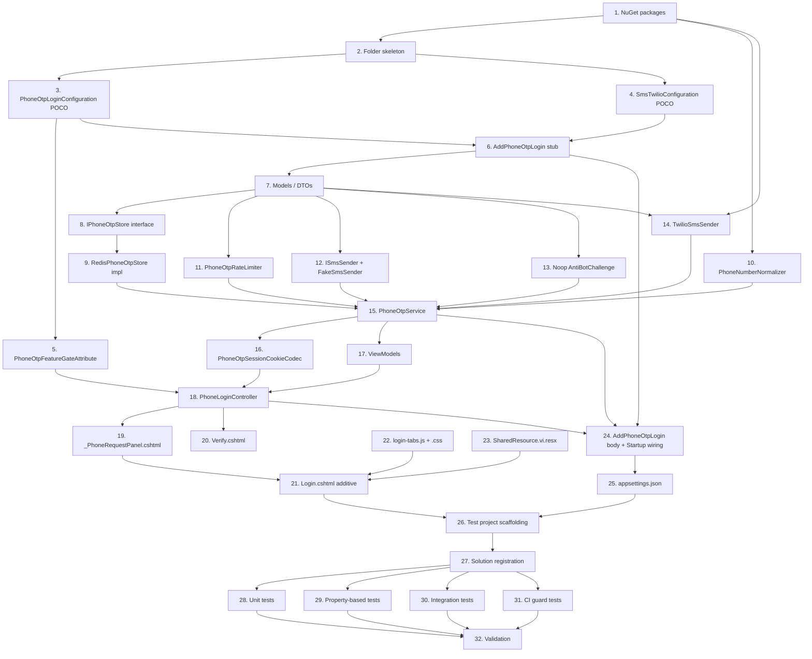

# Implementation Plan: Phone OTP Login

## Overview

Tài liệu này chia toàn bộ thiết kế ở `design.md` thành các task code-only nhỏ, có thứ tự phụ thuộc rõ ràng, tối ưu cho việc thực thi từng wave một. Mỗi task chỉ chạm 1–3 file (tối đa) và liên kết về acceptance criteria cụ thể trong `requirements.md`. Quy ước:

- Mọi sub-task gắn `*` là task test/optional — agent có thể bỏ qua khi muốn build MVP nhanh, nhưng wave Validation cuối cùng yêu cầu chạy tất cả test có mặt.
- Tất cả file mới đặt dưới namespace gốc `Skoruba.Duende.IdentityServer.STS.Identity.PhoneOtp` (sub-namespace `.Configuration`, `.Models`, `.Services`, `.Storage`, `.Sms`, `.Filters`).
- Thay đổi additive trên file hiện có: `Startup.cs`, `Views/Account/Login.cshtml`, `appsettings.json`, `Resources/SharedResource.vi.resx`, `Skoruba.Duende.IdentityServer.STS.Identity.csproj`. Không sửa `AccountController` và bất kỳ component nào ngoài STS host.
- Quyết định chốt cho Phase 3: dùng `libphonenumber-csharp` (Google), retry Twilio bằng manual loop (KHÔNG Polly), `IPhoneOtpAntiBotChallenge` chỉ là extension point no-op, không thêm `en.resx` fallback (note ở phần Notes).

## Tasks

- [x] 1. Thêm NuGet PackageReferences cho STS host
  - Sửa `src/Skoruba.Duende.IdentityServer.STS.Identity/Skoruba.Duende.IdentityServer.STS.Identity.csproj`: thêm `<PackageReference Include="Twilio" Version="7.*" />` và `<PackageReference Include="libphonenumber-csharp" Version="8.*" />` vào ItemGroup hiện có cho NuGet packages (chèn cùng vị trí với các package SDK đã có, không tạo ItemGroup mới nếu không cần).
  - KHÔNG chạy `dotnet restore` trong task này — wave Validation sẽ chạy.
  - _Requirements: 10.2, 16.6_

- [x] 2. Tạo skeleton folder cho namespace PhoneOtp
  - Tạo các thư mục rỗng (kèm `.gitkeep` placeholder hoặc tạo cùng lúc với task tiếp theo): `src/Skoruba.Duende.IdentityServer.STS.Identity/PhoneOtp/Configuration/`, `.../PhoneOtp/Models/`, `.../PhoneOtp/Services/`, `.../PhoneOtp/Storage/`, `.../PhoneOtp/Sms/`, `.../PhoneOtp/Filters/`.
  - Tạo file `src/Skoruba.Duende.IdentityServer.STS.Identity/Views/Account/LoginWithPhone/` (folder cho Verify.cshtml ở wave 7).
  - Đảm bảo csproj không có entry exclude folder mới.
  - _Requirements: 17.3, 17.4_

- [x] 3. Thêm POCO cấu hình `PhoneOtpLoginConfiguration`
  - File mới: `src/Skoruba.Duende.IdentityServer.STS.Identity/PhoneOtp/Configuration/PhoneOtpLoginConfiguration.cs`.
  - Thuộc tính + giá trị mặc định verbatim theo Section "Components and Interfaces" của `design.md`: `Enabled=false`, `OtpLength=6`, `OtpTtlSeconds=300`, `ResendCooldownSeconds=60`, `MaxVerifyAttemptsPerOtp=5`, `IpRateLimitWindowSeconds=600`, `IpRateLimitMaxRequests=10`, `PhoneVerifyLockoutWindowSeconds=3600`, `PhoneVerifyLockoutMaxFailures=10`, `DefaultRegion="VN"`, `RedisKeyPrefix="otp:"`.
  - Class là `public sealed`, không validation logic ở đây (validation xảy ra ở `AddPhoneOtpLogin`).
  - _Requirements: 1.1, 1.6_

- [x] 4. Thêm POCO cấu hình `SmsTwilioConfiguration`
  - File mới: `src/Skoruba.Duende.IdentityServer.STS.Identity/PhoneOtp/Configuration/SmsTwilioConfiguration.cs`.
  - Thuộc tính: `AccountSid`, `AuthToken`, `FromNumber` (default empty string), `TimeoutMilliseconds=2000`, `MaxRetries=1`.
  - Class là `public sealed`.
  - _Requirements: 10.1, 10.2, 15.1_

- [x] 5. Thêm filter `PhoneOtpFeatureGateAttribute`
  - File mới: `src/Skoruba.Duende.IdentityServer.STS.Identity/PhoneOtp/Filters/PhoneOtpFeatureGateAttribute.cs`.
  - Là `IAsyncActionFilter` + `Attribute` (apply ở action hoặc controller). Đọc `IOptions<PhoneOtpLoginConfiguration>` từ `context.HttpContext.RequestServices`. Nếu `Enabled == false`, set `context.Result = new NotFoundResult()` rồi return; ngược lại gọi `await next()`.
  - Không log gì ở đây (route 404 rõ ràng, không cần audit trail).
  - _Requirements: 1.3, 4.2_

- [x] 6. Tạo stub `AddPhoneOtpLogin` extension method
  - File mới: `src/Skoruba.Duende.IdentityServer.STS.Identity/PhoneOtp/PhoneOtpServiceCollectionExtensions.cs`.
  - Định nghĩa `public static class PhoneOtpServiceCollectionExtensions` với method `public static IServiceCollection AddPhoneOtpLogin(this IServiceCollection services, IConfiguration configuration)`.
  - Trong wave này chỉ cần stub: bind 2 POCO ở task 3 và task 4 vào `services.Configure<...>(configuration.GetSection("PhoneOtpLogin"))` và `services.Configure<...>(configuration.GetSection("SmsConfiguration:Twilio"))`. Trả về `services`. Phần register service cụ thể sẽ thêm dần ở các wave sau (sẽ được hoàn chỉnh ở task 24).
  - _Requirements: 1.1, 17.3, 17.4_

- [x] 7. Thêm DTO/models cho domain OTP
  - File mới đặt trong `src/Skoruba.Duende.IdentityServer.STS.Identity/PhoneOtp/Models/`:
    - `IssueOtpRequest.cs`, `IssueOtpResult.cs`, `IssueOutcome.cs` (enum), `VerifyOtpRequest.cs`, `VerifyOtpResult.cs`, `VerifyOutcome.cs` (enum), `OtpStoreRecord.cs`, `RateLimitDecision.cs`, `AntiBotDecision.cs`.
  - Mỗi record là `public sealed record` với các thuộc tính khớp Section "Components and Interfaces" của `design.md`. Khai báo immutable, không method nghiệp vụ.
  - `OtpStoreRecord` đánh dấu serializer-friendly: thuộc tính public, init-only.
  - _Requirements: 9.1, 10.1_

- [x] 8. Định nghĩa `IPhoneOtpStore`
  - File mới: `src/Skoruba.Duende.IdentityServer.STS.Identity/PhoneOtp/Storage/IPhoneOtpStore.cs`.
  - Khai báo 4 method async: `GetAsync`, `SetAsync`, `IncrementAttemptAsync`, `DeleteAsync` (signature theo `design.md`).
  - _Requirements: 9.1, 9.3, 9.4_

- [x] 9. Implement `RedisPhoneOtpStore`
  - File mới: `src/Skoruba.Duende.IdentityServer.STS.Identity/PhoneOtp/Storage/RedisPhoneOtpStore.cs`.
  - Constructor inject `IDistributedCache` và `IOptions<PhoneOtpLoginConfiguration>`.
  - Build key: `{RedisKeyPrefix}rec:{tenantKey}:{phoneE164Hash}`. Serialize `OtpStoreRecord` qua `System.Text.Json` camelCase.
  - `IncrementAttemptAsync`: đọc record, tăng `AttemptCount`, ghi lại với cùng `AbsoluteExpirationRelativeToNow` còn lại (xem ghi chú Lua atomic ở `design.md` — phiên bản đầu dùng pattern Get/Set có CAS-like log; nếu cần atomic tuyệt đối, dùng `IConnectionMultiplexer` của StackExchange.Redis có sẵn để eval Lua script — chỉ thêm khi tests phát hiện race).
  - `DeleteAsync`: gọi `IDistributedCache.RemoveAsync`.
  - Implement static helper `Sha256Hex(string input)` private để hash phone E.164 (không expose).
  - _Requirements: 9.1, 9.3, 9.4, 9.5, 8.3_

- [x] 10. Implement `IPhoneNumberNormalizer` + wrapper libphonenumber-csharp
  - File mới: `src/Skoruba.Duende.IdentityServer.STS.Identity/PhoneOtp/Services/IPhoneNumberNormalizer.cs` (interface với `TryNormalize`, `Format`, `MaskLast4`).
  - File mới: `src/Skoruba.Duende.IdentityServer.STS.Identity/PhoneOtp/Services/PhoneNumberNormalizer.cs` — bọc `PhoneNumberUtil` của Google (`PhoneNumbers.PhoneNumberUtil.GetInstance()`). `TryNormalize` parse với `defaultRegion`, validate, format E.164. `MaskLast4` trả `"******" + last4` an toàn cho chuỗi ngắn.
  - Constructor không phụ thuộc DI.
  - _Requirements: 3.4, 14.4, 16.6_

- [x] 11. Implement `IPhoneOtpRateLimiter` + `PhoneOtpRateLimiter`
  - File mới: `src/Skoruba.Duende.IdentityServer.STS.Identity/PhoneOtp/Services/IPhoneOtpRateLimiter.cs` (signature đầy đủ theo `design.md`: 6 method).
  - File mới: `src/Skoruba.Duende.IdentityServer.STS.Identity/PhoneOtp/Services/PhoneOtpRateLimiter.cs`.
  - Constructor inject `IDistributedCache`, `IOptions<PhoneOtpLoginConfiguration>`, `ISystemClock` hoặc `TimeProvider` (dùng `TimeProvider.System` mặc định để tests mock được).
  - Key prefixes: `{prefix}rl:phone:{tenant}:{phoneHash}`, `{prefix}rl:ip:{ipHash}`, `{prefix}lockout:phone:{tenant}:{phoneHash}`. TTL theo cấu hình. Counter dùng `IDistributedCache` get → parse int → set lại với TTL còn lại; nếu cần atomic INCR, dùng `IConnectionMultiplexer.GetDatabase().StringIncrementAsync` (chỉ chuyển sang Lua khi tests phát hiện race).
  - `RateLimitDecision` trả về phải bao gồm `CooldownRemainingSeconds` cho cooldown phone.
  - _Requirements: 6.1, 6.2, 6.3, 6.4, 6.5, 6.6, 6.7, 9.5_

- [x] 12. Định nghĩa SMS abstraction + FakeSmsSender
  - File mới: `src/Skoruba.Duende.IdentityServer.STS.Identity/PhoneOtp/Sms/ISmsSender.cs` (single async method).
  - File mới: `src/Skoruba.Duende.IdentityServer.STS.Identity/PhoneOtp/Sms/SmsSendResult.cs` — `record` với 4 prop + 2 factory `Ok` / `Failed`.
  - File mới: `src/Skoruba.Duende.IdentityServer.STS.Identity/PhoneOtp/Sms/FakeSmsSender.cs` — implements `ISmsSender`, ghi `(e164, body, sentAtUtc)` vào `ConcurrentBag<FakeSentSms>`, expose `IReadOnlyCollection<FakeSentSms> Sent`. Khai báo `FakeSentSms` là sealed record cùng namespace.
  - _Requirements: 10.1, 10.5_

- [x] 13. Implement no-op `IPhoneOtpAntiBotChallenge`
  - File mới: `src/Skoruba.Duende.IdentityServer.STS.Identity/PhoneOtp/Services/IPhoneOtpAntiBotChallenge.cs` (interface theo design).
  - File mới: `src/Skoruba.Duende.IdentityServer.STS.Identity/PhoneOtp/Services/NoopPhoneOtpAntiBotChallenge.cs` — luôn trả `new AntiBotDecision(true, null)` không async overhead (`Task.FromResult`).
  - _Requirements: 14.5_

- [x] 14. Implement `TwilioSmsSender` (manual retry, 2s timeout, KHÔNG Polly)
  - File mới: `src/Skoruba.Duende.IdentityServer.STS.Identity/PhoneOtp/Sms/TwilioSmsSender.cs`.
  - Constructor inject `IOptions<SmsTwilioConfiguration>` + `ILogger<TwilioSmsSender>`.
  - Logic theo Section "Twilio Integration" của `design.md`: linked CTS với `CancelAfter(TimeoutMilliseconds)`, `for` loop tới `MaxRetries+1`, retry chỉ với `ApiException.Status >= 500`, network IO error, hoặc Twilio code `20429`. Code `20003` (auth fail) — permanent, return `Failed` ngay.
  - KHÔNG re-throw permanent failure — luôn return `SmsSendResult.Failed(code, message)`.
  - Log Information cho mỗi attempt success (chỉ phone last4), Error cho mỗi attempt failure cuối cùng. KHÔNG log `AuthToken`, KHÔNG log `body` chứa OTP plaintext.
  - _Requirements: 10.2, 10.3, 10.4, 10.6, 13.5_

- [x] 15. Implement `IPhoneOtpService` + `PhoneOtpService`
  - File mới: `src/Skoruba.Duende.IdentityServer.STS.Identity/PhoneOtp/Services/IPhoneOtpService.cs` (3 method async theo design).
  - File mới: `src/Skoruba.Duende.IdentityServer.STS.Identity/PhoneOtp/Services/PhoneOtpService.cs`.
  - Inject: `IPhoneOtpStore`, `IPhoneOtpRateLimiter`, `IPhoneNumberNormalizer`, `ISmsSender`, `UserManager<UserIdentity>`, `IDataProtectionProvider` (purpose `"PhoneOtp.HashKey"`), `IOptions<PhoneOtpLoginConfiguration>`, `ILogger<PhoneOtpService>`, `TimeProvider`.
  - `IssueAsync`: order theo data flow Section 4.1 — normalize, check rate-limit (IP, phone cooldown, phone lockout), lookup `UserIdentity` (filter `PhoneNumber == e164 && PhoneNumberConfirmed && TenantKey == tenant`), generate OTP qua `RandomNumberGenerator.GetInt32`, HMAC-SHA256 với key từ data protector (Protect const seed `"phone-otp-hash-v1"`), build `OtpStoreRecord`, `Store.SetAsync`, `RegisterPhoneIssuance`, `RegisterIpIssuance`, gọi `ISmsSender.SendAsync`. Mọi nhánh rejection trả `IssueOtpResult.Rejected` không phân biệt nguyên nhân (controller sẽ áp delay).
  - `VerifyAsync`: `IncrementAttemptAsync` → `GetAsync` → `FixedTimeEquals` HMAC → nếu match: `DeleteAsync`; nếu vượt `MaxVerifyAttemptsPerOtp` hoặc expired: `DeleteAsync`. Trả `VerifyOtpResult` với enum tương ứng.
  - `ResendAsync`: tương tự Issue nhưng skip lookup user (user đã bound trong session cookie, controller truyền vào). Replace record nếu cooldown elapsed (sets `AttemptCount = 0`).
  - HMAC thực hiện qua `HMACSHA256` với key = `dataProtector.Protect(Encoding.UTF8.GetBytes("phone-otp-hash-v1"))` (tham chiếu `design.md` Section Security).
  - _Requirements: 3.10, 3.11, 4.5, 4.6, 4.7, 4.8, 4.10, 5.3, 5.4, 6.1-6.7, 7.1, 8.2, 9.1, 9.2, 9.3, 9.4, 11.1, 11.2, 11.3, 13.1, 13.2, 13.4, 15.3_

- [x] 16. Implement `PhoneOtpSessionCookieCodec`
  - File mới: `src/Skoruba.Duende.IdentityServer.STS.Identity/PhoneOtp/Services/PhoneOtpSessionCookieCodec.cs`.
  - Inject `IDataProtectionProvider` (purpose `"PhoneOtp.SessionCookie"`).
  - 2 method: `string Protect(SessionCookiePayload payload)` và `bool TryUnprotect(string raw, out SessionCookiePayload payload)`. Payload là sealed record `{ string TenantKey, string PhoneE164Hash, DateTimeOffset ExpiresAtUtc, int Version = 1 }` serialize bằng `System.Text.Json`.
  - Cookie name constant: `"phone_otp_session"`.
  - _Requirements: 3.13, 4.3, 8.4_

- [x] 17. Thêm view models cho phone-OTP
  - File mới: `src/Skoruba.Duende.IdentityServer.STS.Identity/ViewModels/Account/PhoneRequestViewModel.cs` — `PhoneNumber`, `ReturnUrl`, hidden honeypot `Website`.
  - File mới: `src/Skoruba.Duende.IdentityServer.STS.Identity/ViewModels/Account/PhoneVerifyViewModel.cs` — `Otp`, `ReturnUrl`, `MaskedPhone`, `ResendCooldownRemainingSeconds`.
  - Cả 2 đều plain DTO; data annotations chỉ `[Required]` nếu cần (phần lớn validation server-side).
  - _Requirements: 3.2, 4.4_

- [x] 18. Implement `PhoneLoginController`
  - File mới: `src/Skoruba.Duende.IdentityServer.STS.Identity/Controllers/PhoneLoginController.cs`.
  - Apply `[PhoneOtpFeatureGate]` ở class-level. Route prefix `[Route("Account/LoginWithPhone")]`. Inject: `IPhoneOtpService`, `PhoneOtpSessionCookieCodec`, `IPhoneNumberNormalizer`, `ITenantContextAccessor`, `ApplicationSignInManager<UserIdentity>`, `UserManager<UserIdentity>`, `IIdentityServerInteractionService`, `IEventService`, `IPhoneOtpAntiBotChallenge`, `IOptions<PhoneOtpLoginConfiguration>`, `ILogger<PhoneLoginController>`.
  - 3 actions:
    - `[HttpPost("Request")] [ValidateAntiForgeryToken]` Request: nhận `PhoneRequestViewModel`. Áp dụng random delay [200,600]ms cho mọi nhánh rejection (sample bằng `RandomNumberGenerator.GetInt32(200, 601)`). Honeypot non-empty → rejection. Nhánh thành công: set cookie qua codec, redirect `/Account/LoginWithPhone/Verify?returnUrl=...`. Nhánh rejection: re-render `Login.cshtml` với view-data flag `PhoneTabPreActive = true` + `Generic_Error`.
    - `[HttpGet("Verify")]` + `[HttpPost("Verify")] [ValidateAntiForgeryToken]` Verify: GET đọc cookie qua codec; thiếu cookie → 302 `/Account/Login` preserve returnUrl. Tenant mismatch → clear cookie + 302 Login. POST: `PhoneOtpService.VerifyAsync`; nhánh `Succeeded` → load `UserIdentity` qua `UserManager.FindByIdAsync`, gọi tương đương `EnsureLoginAllowedAsync`/`EnsureClientAllowedAsync` (refer `AccountController` hiện hữu để mượn helper hoặc duplicate logic), `_signInManager.SignInAsync(user, isPersistent: false)`, `IEventService.RaiseAsync(new UserLoginSuccessEvent(...){ "phone-otp" })`, dispatch returnUrl theo 2 nhánh `Redirect(returnUrl)` / `LoadingPage("Redirect", returnUrl)` đúng pattern `AccountController.Login`. Mọi nhánh fail (Mismatch/Expired/Exhausted/NoSession) → re-render `Verify.cshtml` với `Generic_Verify_Error`.
    - `[HttpPost("Resend")] [ValidateAntiForgeryToken]` Resend: thiếu cookie → 302 Login. Cooldown active → re-render Verify với cooldown remaining. Cooldown elapsed → `PhoneOtpService.ResendAsync`, re-render Verify với banner success.
  - Logging: structured properties verbatim theo Section "Telemetry & Audit" của `design.md` (Event/TenantKey/PhoneLast4/PhoneSha8/RemoteIp/Outcome/AttemptCount/RateLimitReason).
  - _Requirements: 3.1, 3.3, 3.5, 3.6, 3.7, 3.8, 3.9, 3.13, 3.14, 3.15, 4.1, 4.2, 4.3, 4.4, 4.5, 4.9, 4.10, 4.11, 4.12, 4.13, 4.14, 5.1, 5.2, 5.3, 5.4, 5.5, 7.1, 7.2, 7.3, 7.4, 7.5, 8.1, 8.4, 11.1, 11.2, 11.3, 11.4, 12.3, 12.4, 13.1, 13.2, 13.3, 14.1, 14.2_

- [x] 19. Thêm partial `_PhoneRequestPanel.cshtml`
  - File mới: `src/Skoruba.Duende.IdentityServer.STS.Identity/Views/Shared/_PhoneRequestPanel.cshtml`.
  - Render `<form method="post" action="/Account/LoginWithPhone/Request">` với: `<label>` + input `name="PhoneNumber" type="tel" inputmode="tel"`, hidden `ReturnUrl` (lấy từ ViewBag), hidden honeypot `name="website" tabindex="-1" autocomplete="off"` ẩn bằng inline class hook `is-honeypot`, `@Html.AntiForgeryToken()`, submit button text `@Localizer["LoginWithPhone.RequestSubmit"]`.
  - Hỗ trợ chế độ `PhoneTabPreActive` truyền qua ViewData để show generic error message bên trong form (`@Localizer["LoginWithPhone.GenericError"]`).
  - _Requirements: 3.2, 14.2, 14.3, 14.4, 14.6_

- [x] 20. Thêm view `Verify.cshtml`
  - File mới: `src/Skoruba.Duende.IdentityServer.STS.Identity/Views/Account/LoginWithPhone/Verify.cshtml`.
  - Model `PhoneVerifyViewModel`. Markup:
    - Form 1 POST cùng URL: input OTP `type="text" inputmode="numeric" autocomplete="one-time-code" maxlength="@Model.OtpLength"`, hidden `ReturnUrl`, anti-forgery, submit `@Localizer["LoginWithPhone.VerifySubmit"]`.
    - Form 2 POST `/Account/LoginWithPhone/Resend`: anti-forgery, button "Gửi lại mã (chờ {n}s)" disabled khi `ResendCooldownRemainingSeconds > 0`.
    - `<a href="/Account/Login?returnUrl=@Model.ReturnUrl">` text `@Localizer["LoginWithPhone.BackToLogin"]`.
  - Render generic error qua `ViewData["VerifyError"]` (string) hiển thị nếu non-null.
  - _Requirements: 4.1, 4.4, 14.1, 14.3, 14.4_

- [x] 21. Sửa `Login.cshtml` ADDITIVE — wrap thành tab control
  - Sửa `src/Skoruba.Duende.IdentityServer.STS.Identity/Views/Account/Login.cshtml`.
  - Inject `IOptions<PhoneOtpLoginConfiguration>` và `ITenantContextAccessor` ở đầu view.
  - Khi `Enabled == false || TenantContext == null`: render đúng markup gốc, KHÔNG có tablist, KHÔNG include `login-tabs.js`/`.css`.
  - Khi `Enabled == true && TenantContext != null`:
    - Bọc form `id="local-login-form"` hiện hữu (bao gồm `_ValidationSummary`, external providers, "Forgot", "Cancel") vào `<div role="tabpanel" id="panel-account" aria-labelledby="tab-account" tabindex="0">`.
    - Thêm `<div role="tablist">` chứa 2 button `role="tab"` (id `tab-account`, `tab-phone`), `aria-controls`, `aria-selected`, `tabindex` đúng theo Section UX. Default: tab `account` active. Khi `ViewData["PhoneTabPreActive"] == true`: tab `phone` active server-side.
    - Render partial `_PhoneRequestPanel.cshtml` trong `<div role="tabpanel" id="panel-phone" aria-labelledby="tab-phone" tabindex="0" hidden>` (remove `hidden` khi pre-active).
    - Append `<link rel="stylesheet" href="~/css/login-tabs.css">` và `<script src="~/js/login-tabs.js" defer></script>` (chỉ trong nhánh enabled, không chạm `_Layout.cshtml`).
  - KHÔNG thay đổi `asp-action`, `asp-controller`, model binding, anti-forgery, hay submit button của form gốc.
  - _Requirements: 2.1, 2.2, 2.3, 2.4, 2.5, 2.6, 2.7, 12.5, 12.7, 17.6_

- [x] 22. Thêm tab assets `login-tabs.js` + `login-tabs.css`
  - File mới: `src/Skoruba.Duende.IdentityServer.STS.Identity/wwwroot/js/login-tabs.js`. Vanilla JS module ~80 dòng theo Section UX của `design.md`. Chỉ toggle `aria-selected`, `tabindex`, `hidden`, class `is-active`. Hỗ trợ click + Enter/Space + ArrowLeft/ArrowRight wrap-around. KHÔNG fetch/XHR/jQuery/jQuery-like, KHÔNG submit form, KHÔNG mutate value của input.
  - File mới: `src/Skoruba.Duende.IdentityServer.STS.Identity/wwwroot/css/login-tabs.css`. CSS thuần cho `[role="tablist"]`, `[role="tab"]`, `.is-active`, focus ring, `.is-honeypot { position:absolute; left:-9999px; }`.
  - _Requirements: 2.7, 2.8, 2.9, 2.10, 17.6_

- [x] 23. Thêm 12 localization keys vào `SharedResource.vi.resx`
  - Sửa `src/Skoruba.Duende.IdentityServer.STS.Identity/Resources/SharedResource.vi.resx`: thêm verbatim 12 keys sau (giá trị tiếng Việt nội bộ — đề xuất giá trị mặc định ở task này, có thể chỉnh ở review):
    - `LoginWithPhone.TabAccount` = "Tài khoản"
    - `LoginWithPhone.TabPhone` = "Số điện thoại"
    - `LoginWithPhone.PhoneLabel` = "Số điện thoại"
    - `LoginWithPhone.RequestSubmit` = "Gửi mã"
    - `LoginWithPhone.OtpLabel` = "Mã OTP"
    - `LoginWithPhone.VerifySubmit` = "Xác nhận"
    - `LoginWithPhone.Resend` = "Gửi lại mã"
    - `LoginWithPhone.BackToLogin` = "← Quay lại đăng nhập"
    - `LoginWithPhone.GenericError` = "Không thể gửi mã OTP. Vui lòng thử lại sau ít phút."
    - `LoginWithPhone.GenericVerifyError` = "Mã OTP không đúng hoặc đã hết hạn."
    - `LoginWithPhone.MaskedPhonePrefix` = "******"
    - `LoginWithPhone.SmsBodyTemplate` = "Mã đăng nhập của bạn: {otp}. Mã có hiệu lực trong {ttl_minutes} phút."
  - KHÔNG tạo `SharedResource.en.resx` mới (xem Notes).
  - _Requirements: 14.3_

- [x] 24. Hoàn chỉnh `AddPhoneOtpLogin` + wiring `Startup.cs`
  - Sửa `src/Skoruba.Duende.IdentityServer.STS.Identity/PhoneOtp/PhoneOtpServiceCollectionExtensions.cs`: hoàn chỉnh body theo Section "Error Handling — Startup fail-fast" của `design.md`:
    - Đọc `PhoneOtpLoginConfiguration` qua `configuration.GetSection("PhoneOtpLogin").Get<...>()`.
    - Nếu `Enabled == false`: chỉ register `PhoneOtpFeatureGateAttribute` và `IOptions<...>` cho cả 2 POCO, return.
    - Nếu `Enabled == true`: thực thi 7 check fail-fast verbatim theo bảng Section "Startup fail-fast" (chỉ apply check Twilio config khi `IHostEnvironment.IsProduction()` — task cần cách lấy `IHostEnvironment` qua `BuildServiceProvider` tạm hoặc nhận `IHostEnvironment` qua overload — đề xuất đọc env-name qua `configuration["ASPNETCORE_ENVIRONMENT"]` hoặc `IConfiguration`-based check để tránh BuildServiceProvider).
    - Register: `IPhoneNumberNormalizer` (singleton), `IPhoneOtpStore` → `RedisPhoneOtpStore` (scoped), `IPhoneOtpRateLimiter` → `PhoneOtpRateLimiter` (scoped), `IPhoneOtpService` → `PhoneOtpService` (scoped), `PhoneOtpSessionCookieCodec` (singleton), `IPhoneOtpAntiBotChallenge` → `NoopPhoneOtpAntiBotChallenge` (singleton), `ISmsSender` → `TwilioSmsSender` nếu Production và config đầy đủ; `FakeSmsSender` (singleton) ngược lại + log Warning verbatim.
  - Sửa `src/Skoruba.Duende.IdentityServer.STS.Identity/Startup.cs`: thêm đúng 1 dòng `services.AddPhoneOtpLogin(Configuration);` ngay SAU dòng `services.AddEmailSenders(Configuration);` (phải tìm exact line trước `AddAuthorizationPolicies`). KHÔNG thêm using mới nếu namespace đã được auto-import bởi sln-level GlobalUsings; nếu cần, thêm `using Skoruba.Duende.IdentityServer.STS.Identity.PhoneOtp;` trên đầu file.
  - _Requirements: 1.1, 1.4, 1.5, 1.6, 17.3, 17.4_

- [x] 25. Thêm cấu hình mặc định vào `appsettings.json` của STS host
  - Sửa `src/Skoruba.Duende.IdentityServer.STS.Identity/appsettings.json`: append 2 section:
    - `"PhoneOtpLogin": { "Enabled": false, "OtpLength": 6, "OtpTtlSeconds": 300, "ResendCooldownSeconds": 60, "MaxVerifyAttemptsPerOtp": 5, "IpRateLimitWindowSeconds": 600, "IpRateLimitMaxRequests": 10, "PhoneVerifyLockoutWindowSeconds": 3600, "PhoneVerifyLockoutMaxFailures": 10, "DefaultRegion": "VN", "RedisKeyPrefix": "otp:" }` (placeholder defaults, khớp R1.6).
    - `"SmsConfiguration": { "Twilio": { "AccountSid": "", "AuthToken": "", "FromNumber": "", "TimeoutMilliseconds": 2000, "MaxRetries": 1 } }` (rỗng, NO real secret).
  - KHÔNG bao giờ commit Twilio AuthToken/AccountSid thật vào appsettings.json — operator phải set qua user-secrets/env vars.
  - _Requirements: 1.1, 1.4, 1.5, 1.6, 15.1_

- [x] 26. Tạo project test scaffolding
  - Tạo file mới `tests/Skoruba.Duende.IdentityServer.STS.Identity.PhoneOtp.UnitTests/Skoruba.Duende.IdentityServer.STS.Identity.PhoneOtp.UnitTests.csproj` với target `net10.0` (khớp solution), Sdk `Microsoft.NET.Sdk`. PackageReferences: `xunit` (latest), `xunit.runner.visualstudio`, `Microsoft.NET.Test.Sdk`, `FsCheck.Xunit` (>= 3.x), `NSubstitute` (cho mock), `Microsoft.Extensions.Caching.Memory`. ProjectReference tới `Skoruba.Duende.IdentityServer.STS.Identity.csproj`.
  - Tạo file mới `tests/Skoruba.Duende.IdentityServer.STS.Identity.PhoneOtp.IntegrationTests/Skoruba.Duende.IdentityServer.STS.Identity.PhoneOtp.IntegrationTests.csproj` tương tự + thêm `Microsoft.AspNetCore.Mvc.Testing` (>= 9.0.x — khớp ASP.NET Core target solution), `AngleSharp` (cho parse HTML và assert DOM accessibility).
  - Mỗi project thêm 1 file `Usings.cs` với `global using Xunit;`.
  - _Requirements: 16.1, 16.2, 16.3, 16.4, 16.5, 16.6, 16.7, 16.8_

- [x] 27. Đăng ký 2 project test vào solution
  - Note: phase này KHÔNG chạy `dotnet sln add` — chỉ document command để wave Validation thực thi:
    - `dotnet sln Skoruba.Duende.IdentityServer.Admin.sln add tests/Skoruba.Duende.IdentityServer.STS.Identity.PhoneOtp.UnitTests/Skoruba.Duende.IdentityServer.STS.Identity.PhoneOtp.UnitTests.csproj`
    - `dotnet sln Skoruba.Duende.IdentityServer.Admin.sln add tests/Skoruba.Duende.IdentityServer.STS.Identity.PhoneOtp.IntegrationTests/Skoruba.Duende.IdentityServer.STS.Identity.PhoneOtp.IntegrationTests.csproj`
  - Khi agent thực thi task này, chạy 2 lệnh trên từ workspace root.
  - _Requirements: 16.1, 16.4, 16.5_

- [ ] 28. Unit tests cho từng service
  - [ ]* 28.1 Test class `PhoneNumberNormalizerTests`
    - File: `tests/Skoruba.Duende.IdentityServer.STS.Identity.PhoneOtp.UnitTests/Services/PhoneNumberNormalizerTests.cs`.
    - Cover: numbers VN hợp lệ (10/11 chữ số, có/không +84, 0xx, có space/hyphen) → normalized E.164; numbers vô lệ → false; format/mask correctness.
    - _Requirements: 3.4, 14.4, 16.6_
  - [ ]* 28.2 Test class `RedisPhoneOtpStoreTests`
    - File: `.../Storage/RedisPhoneOtpStoreTests.cs`.
    - Substitute `IDistributedCache` bằng `MemoryDistributedCache` (in-memory adapter từ `Microsoft.Extensions.Caching.Memory`). Cover: SetAsync→GetAsync round-trip, IncrementAttempt tăng counter đúng và preserve TTL, DeleteAsync xoá record, key prefix bắt đầu `otp:`.
    - _Requirements: 9.1, 9.3, 9.4, 9.5, 8.3_
  - [ ]* 28.3 Test class `PhoneOtpRateLimiterTests`
    - File: `.../Services/PhoneOtpRateLimiterTests.cs`.
    - Mock `TimeProvider` (FakeTimeProvider) + memory cache. Cover từng family: phone cooldown, IP window, phone lockout — verify Allow/Deny transitions ở boundary thời gian.
    - _Requirements: 6.1, 6.2, 6.3, 6.4, 6.7_
  - [ ]* 28.4 Test class `PhoneOtpServiceTests`
    - File: `.../Services/PhoneOtpServiceTests.cs`.
    - Mock store/rate-limiter/sms/normalizer/UserManager (NSubstitute) + `EphemeralDataProtectionProvider`. Cover: Issue happy path, Issue rejection (no user, not confirmed, rate-limited) trả `Outcome=Rejected`, hash KHÔNG chứa OTP plaintext, Verify mismatch, Verify success xoá record, Verify exhaustion xoá record.
    - _Requirements: 3.10, 4.5, 4.7, 4.8, 4.10, 9.1, 11.1, 11.2_
  - [ ]* 28.5 Test class `TwilioSmsSenderTests`
    - File: `.../Sms/TwilioSmsSenderTests.cs`.
    - Cover retry semantics (transient → retry once, permanent → no retry), timeout → return Failed, log không chứa AuthToken/body. Dùng wrapper hoặc Twilio mock helper (có thể stub bằng `HttpMessageHandler` interception qua Twilio SDK options nếu khả thi; nếu không, refactor TwilioSmsSender nhận seam delegate `Func<...,Task<MessageResource>>` để test).
    - _Requirements: 10.3, 10.4, 13.5_
  - [ ]* 28.6 Test class `FakeSmsSenderTests`
    - File: `.../Sms/FakeSmsSenderTests.cs`. Cover: SendAsync ghi vào Sent collection, thread-safe khi gọi parallel.
    - _Requirements: 10.5, 16.2_
  - [ ]* 28.7 Test class `PhoneOtpFeatureGateAttributeTests`
    - File: `.../Filters/PhoneOtpFeatureGateAttributeTests.cs`. Cover: Enabled=false → 404; Enabled=true → next() được gọi.
    - _Requirements: 1.3, 4.2_

- [ ] 29. Property-based tests (FsCheck.Xunit, mỗi property = 1 test, `[Property(MaxTest = 100)]`)
  - Tất cả file đặt trong `tests/Skoruba.Duende.IdentityServer.STS.Identity.PhoneOtp.UnitTests/Properties/`. Mỗi file mở đầu bằng comment header `// Feature: phone-otp-login, Property N: <Title>`.
  - [ ]* 29.1 `Property01_NormalizeRoundTripTests.cs`
    - **Feature: phone-otp-login, Property 1: Phone-number normalize round-trip**
    - **Validates: Requirements 3.4, 16.6**
  - [ ]* 29.2 `Property02_TenantScopedLookupTests.cs`
    - **Feature: phone-otp-login, Property 2: Tenant-scoped user lookup**
    - **Validates: Requirements 3.7, 8.2, 8.3**
  - [ ]* 29.3 `Property03_OtpShapeAndHashOnlyStorageTests.cs`
    - **Feature: phone-otp-login, Property 3: OTP shape and hash-only storage**
    - **Validates: Requirements 3.10, 9.1, 13.4**
  - [ ]* 29.4 `Property04_OtpStoreLifecycleTests.cs`
    - **Feature: phone-otp-login, Property 4: OTP store lifecycle**
    - **Validates: Requirements 3.11, 4.7, 5.3, 5.4, 9.3, 9.4**
  - [ ]* 29.5 `Property05_IndistinguishableRejectionTests.cs`
    - **Feature: phone-otp-login, Property 5: Indistinguishable rejection (Step 1)**
    - **Validates: Requirements 7.1, 7.2, 7.3, 7.4, 8.1, 11.2, 11.3, 14.2**
  - [ ]* 29.6 `Property06_Step1SuccessContinuationTests.cs`
    - **Feature: phone-otp-login, Property 6: Step-1 success continuation**
    - **Validates: Requirements 3.13, 3.15**
  - [ ]* 29.7 `Property07_VerifySuccessPostConditionsTests.cs`
    - **Feature: phone-otp-login, Property 7: Verify success post-conditions**
    - **Validates: Requirements 4.10, 4.11, 9.4, 13.3**
  - [ ]* 29.8 `Property08_VerifyCounterAtomicityTests.cs`
    - **Feature: phone-otp-login, Property 8: Verify counter atomicity và exhaustion**
    - **Validates: Requirements 4.5, 4.7, 6.3**
  - [ ]* 29.9 `Property09_RateLimitWindowsTests.cs`
    - **Feature: phone-otp-login, Property 9: Rate-limit windows enforced and expire**
    - **Validates: Requirements 6.1, 6.2, 6.4, 6.7**
  - [ ]* 29.10 `Property10_RedisKeyNamespaceIsolationTests.cs`
    - **Feature: phone-otp-login, Property 10: Redis key namespace isolation**
    - **Validates: Requirements 8.3, 9.5**
  - [ ]* 29.11 `Property11_TwilioRetrySemanticsTests.cs`
    - **Feature: phone-otp-login, Property 11: Twilio retry semantics**
    - **Validates: Requirements 10.3, 10.4**
  - [ ]* 29.12 `Property12_NoAutoProvisioningTests.cs`
    - **Feature: phone-otp-login, Property 12: No auto-provisioning**
    - **Validates: Requirements 11.1**
  - [ ]* 29.13 `Property13_AuditLogRedactionTests.cs`
    - **Feature: phone-otp-login, Property 13: Audit log redaction and structure**
    - **Validates: Requirements 10.6, 13.1, 13.2, 13.4, 13.5**

- [ ] 30. Integration tests (WebApplicationFactory, cover Section 13 design)
  - Tất cả file đặt trong `tests/Skoruba.Duende.IdentityServer.STS.Identity.PhoneOtp.IntegrationTests/`. Helper `PhoneOtpWebApplicationFactory.cs` ghi đè service: thay `IDistributedCache` bằng `MemoryDistributedCache`, thay `ISmsSender` bằng `FakeSmsSender` (đăng ký singleton để test inspect), set `PhoneOtpLogin:Enabled` qua in-memory `IConfiguration`.
  - [ ]* 30.1 `FlagDisabled_LoginPage_NoTablistTests.cs` — `Enabled=false`, GET `/Account/Login` HTML không chứa `role="tablist"`, không chứa `name="website"`/`name="PhoneNumber"`. _Requirements: 1.2, 16.4_
  - [ ]* 30.2 `FlagDisabled_PhoneRoutes_404Tests.cs` — GET/POST 3 route phone trả 404. _Requirements: 1.3, 16.4_
  - [ ]* 30.3 `FlagEnabled_LoginPage_RendersTablistTests.cs` — `Enabled=true`, parse HTML với AngleSharp: 2 tab có `role="tab"` + `aria-controls`+`aria-selected`, panels có `role="tabpanel"`+`aria-labelledby`, panel phone `hidden`, form local-login-form intact. _Requirements: 2.1-2.7, 16.5, 16.8_
  - [ ]* 30.4 `FlagEnabled_RequestValid_RedirectsTests.cs` — POST `/Request` với phone hợp lệ tồn tại trong test user store + tenant context → 302 Verify, FakeSmsSender.Sent có 1 entry. _Requirements: 3.13, 16.5_
  - [ ]* 30.5 `FlagEnabled_RequestInvalid_RerendersTests.cs` — POST `/Request` với phone không tồn tại → 200 re-render Login với phone tab pre-active + Generic_Error, FakeSmsSender.Sent rỗng. _Requirements: 7.1, 7.5_
  - [ ]* 30.6 `Verify_NoCookie_RedirectsToLoginTests.cs` — GET `/Verify` không cookie → 302 `/Account/Login` preserve returnUrl. _Requirements: 4.3_
  - [ ]* 30.7 `Verify_CorrectOtp_SignsInTests.cs` — Issue qua FakeSmsSender → đọc OTP raw từ FakeSmsSender (Fake exposes raw body) → POST Verify → 302 returnUrl + cookie auth ApplicationScheme present. _Requirements: 4.10, 4.11, 4.12, 4.13, 12.3, 12.4_
  - [ ]* 30.8 `Verify_ExceedAttempts_DeletesRecordTests.cs` — POST Verify với OTP sai `MaxVerifyAttemptsPerOtp+1` lần → record bị xoá khỏi cache. _Requirements: 4.7, 6.3_
  - [ ]* 30.9 `Resend_DuringCooldown_NoSmsTests.cs` — POST Resend trong cooldown → re-render, FakeSmsSender.Sent không tăng. _Requirements: 5.2_
  - [ ]* 30.10 `TenantMismatch_ClearsCookieTests.cs` — issue OTP với tenant A, đổi sang tenant B trước verify → cookie clear + 302 Login. _Requirements: 8.4_

- [ ] 31. CI guard tests
  - [ ]* 31.1 `TwilioCredentialsScannerTests.cs` trong UnitTests project
    - File: `.../Guards/TwilioCredentialsScannerTests.cs`. Quét tất cả `tests/**/*.cs`, `tests/**/appsettings*.json`, `tests/**/*.json` bằng regex `\bAC[a-fA-F0-9]{32}\b`. Match → fail với danh sách file:line. Test luôn run.
    - _Requirements: 16.7_
  - [ ]* 31.2 `LoginTabsJsStaticAssetTests.cs` trong UnitTests project
    - File: `.../Guards/LoginTabsJsStaticAssetTests.cs`. Đọc nội dung `wwwroot/js/login-tabs.js`, assert KHÔNG match: `\bfetch\s*\(`, `\bXMLHttpRequest\b`, case-insensitive `jquery`, `\$\(`, `\.submit\s*\(`.
    - _Requirements: 2.10_

- [x] 32. Validation cuối cùng
  - Chạy từ workspace root, theo thứ tự:
    1. `dotnet sln Skoruba.Duende.IdentityServer.Admin.sln add tests/Skoruba.Duende.IdentityServer.STS.Identity.PhoneOtp.UnitTests/Skoruba.Duende.IdentityServer.STS.Identity.PhoneOtp.UnitTests.csproj`
    2. `dotnet sln Skoruba.Duende.IdentityServer.Admin.sln add tests/Skoruba.Duende.IdentityServer.STS.Identity.PhoneOtp.IntegrationTests/Skoruba.Duende.IdentityServer.STS.Identity.PhoneOtp.IntegrationTests.csproj`
    3. `dotnet restore Skoruba.Duende.IdentityServer.Admin.sln`
    4. `dotnet build Skoruba.Duende.IdentityServer.Admin.sln` → 0 lỗi mới (so với baseline trước feature). Warning mới phải được giải thích trong PR description.
    5. `dotnet test tests/Skoruba.Duende.IdentityServer.STS.Identity.PhoneOtp.UnitTests/Skoruba.Duende.IdentityServer.STS.Identity.PhoneOtp.UnitTests.csproj` → all green.
    6. `dotnet test tests/Skoruba.Duende.IdentityServer.STS.Identity.PhoneOtp.IntegrationTests/Skoruba.Duende.IdentityServer.STS.Identity.PhoneOtp.IntegrationTests.csproj` → all green.
  - **Manual smoke checklist (copy nguyên văn vào PR description, dùng `[ ]` ASCII checkbox):**
    - `[ ]` Set `PhoneOtpLogin:Enabled=true` và Twilio config qua `dotnet user-secrets` hoặc environment variables (`SmsConfiguration__Twilio__AccountSid`, `__AuthToken`, `__FromNumber`).
    - `[ ]` GET `/Account/Login` → thấy 2 tab, "Tài khoản" active mặc định; panel "Số điện thoại" hidden.
    - `[ ]` Click tab "Số điện thoại" → panel hiện ra mà không có page navigation.
    - `[ ]` Submit số điện thoại tồn tại + đã confirmed trong tenant hiện tại → nhận SMS, redirect tới `/Account/LoginWithPhone/Verify`.
    - `[ ]` Nhập OTP sai → re-render với `Generic_Verify_Error`.
    - `[ ]` Nhập OTP đúng → cookie issued + redirect tới `returnUrl` HOẶC home.
    - `[ ]` Set `PhoneOtpLogin:Enabled=false` → tabs biến mất, GET `/Account/LoginWithPhone/Verify` trả 404.
  - _Requirements: 1.2, 1.3, 2.*, 3.*, 4.*, 16.*, 17.*_

## Task Dependency Graph

Sơ đồ phụ thuộc giữa các task (mũi tên `A --> B` nghĩa là B yêu cầu A hoàn tất trước):



### Execution waves

Các task không phụ thuộc nhau trong cùng một wave có thể được thực thi song song. Sơ đồ này cũng phục vụ để orchestrator chạy parallel khi an toàn:

```json
{
  "waves": [
    {
      "wave": 1,
      "tasks": ["1", "2"],
      "description": "Foundations: NuGet packages + folder skeleton"
    },
    {
      "wave": 2,
      "tasks": ["3", "4"],
      "description": "Configuration POCOs (no inter-dependency)"
    },
    {
      "wave": 3,
      "tasks": ["5", "6"],
      "description": "Feature gate filter + AddPhoneOtpLogin stub"
    },
    {
      "wave": 4,
      "tasks": ["7"],
      "description": "DTO/models — sau khi POCO sẵn sàng"
    },
    {
      "wave": 5,
      "tasks": ["8", "10"],
      "description": "Store interface + Normalizer (độc lập)"
    },
    {
      "wave": 6,
      "tasks": ["9", "11", "12", "13"],
      "description": "Storage impl, RateLimiter, Sms abstraction, AntiBot no-op (song song)"
    },
    {
      "wave": 7,
      "tasks": ["14"],
      "description": "TwilioSmsSender (manual retry, KHÔNG Polly)"
    },
    {
      "wave": 8,
      "tasks": ["15"],
      "description": "PhoneOtpService — orchestrator của domain"
    },
    {
      "wave": 9,
      "tasks": ["16", "17"],
      "description": "Session cookie codec + ViewModels"
    },
    {
      "wave": 10,
      "tasks": ["18"],
      "description": "PhoneLoginController"
    },
    {
      "wave": 11,
      "tasks": ["19", "20", "22", "23"],
      "description": "Partial view, Verify view, frontend assets, localization (song song)"
    },
    {
      "wave": 12,
      "tasks": ["21"],
      "description": "Login.cshtml additive wrap (sau khi partial + assets sẵn sàng)"
    },
    {
      "wave": 13,
      "tasks": ["24", "25"],
      "description": "AddPhoneOtpLogin body + Startup wiring + appsettings (song song)"
    },
    {
      "wave": 14,
      "tasks": ["26"],
      "description": "Test project scaffolding"
    },
    {
      "wave": 15,
      "tasks": ["27"],
      "description": "Đăng ký 2 project test vào solution"
    },
    {
      "wave": 16,
      "tasks": ["28", "29", "30", "31"],
      "description": "Test waves độc lập có thể chạy song song"
    },
    {
      "wave": 17,
      "tasks": ["32"],
      "description": "Validation cuối cùng — build + test + manual smoke"
    }
  ]
}
```

## Notes

Theo yêu cầu Phase 3 đã chốt, các hạng mục dưới đây được loại khỏi scope feature này và sẽ được cân nhắc trong PR riêng:

- **`SharedResource.en.resx` fallback**: hiện chỉ thêm 12 keys vào `SharedResource.vi.resx`. Nếu host chuyển sang culture khác `vi`, message sẽ rơi về key literal (resource fallback thiếu). Theo dõi qua issue follow-up: "Add 12 LoginWithPhone.* keys to SharedResource.en.resx".
- **Anti-bot v2 (Cloudflare Turnstile / hCaptcha)**: chỉ expose `IPhoneOtpAntiBotChallenge` extension point + register `NoopPhoneOtpAntiBotChallenge` trong v1. PR follow-up sẽ thêm implementation cụ thể nếu observability cho thấy abuse rate vượt ngưỡng.
- **Polly resilience pipeline cho TwilioSmsSender**: hiện dùng manual retry loop để tránh thêm dependency mới chỉ cho 1 retry. Nếu csproj sau này đã reference `Microsoft.Extensions.Resilience` / `Polly`, có thể swap sang `ResiliencePipelineBuilder` mà KHÔNG đổi public surface của `ISmsSender` (thay đổi internal implementation only). Issue follow-up: "Switch TwilioSmsSender to Polly when Polly is already in dependency graph".
- **Auto-provisioning user mới từ số điện thoại**: vẫn ngoài scope (R11.1). Bất kỳ thay đổi tương lai phải đi kèm risk review về abuse vector.
- **Browser-side automation tests cho tab control**: integration test hiện chỉ assert markup; behavior toggle thực sự cần Playwright/Selenium — đề xuất tách feature riêng nếu có nhu cầu.

