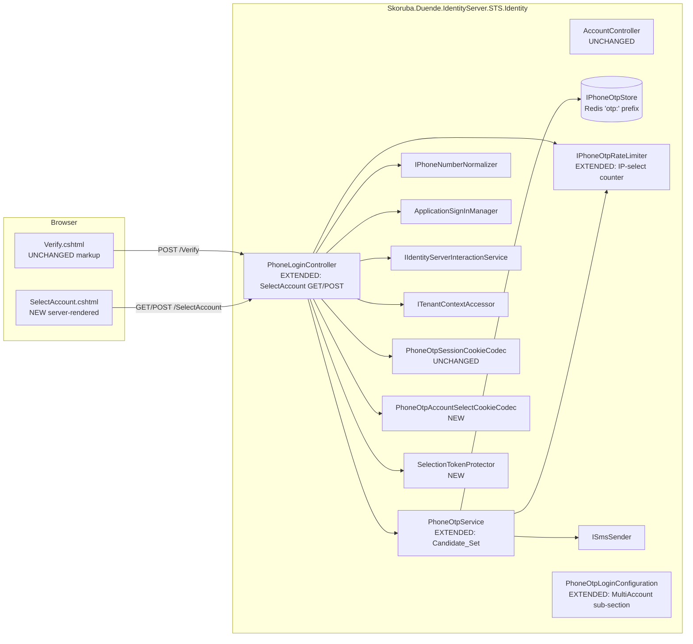
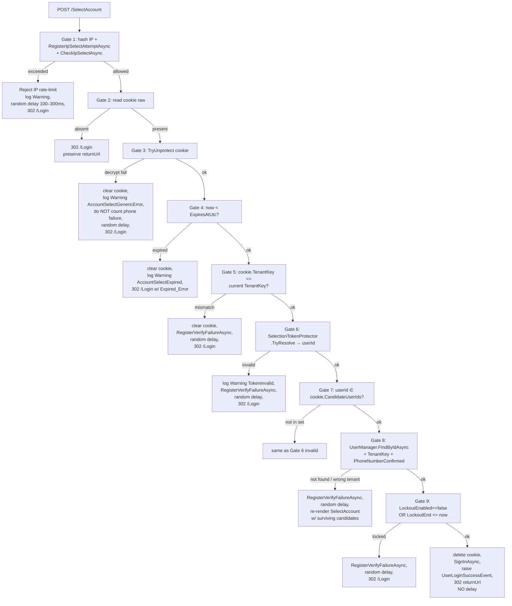

# Design Document

Phone OTP Multi-Account Select

## Overview

Tính năng này nới phạm vi luồng phone-OTP đã có (`Skoruba.Duende.IdentityServer.STS.Identity`, spec `phone-otp-login`) để xử lý trường hợp **một số điện thoại được gắn với nhiều `UserIdentity` cùng tenant**. Hành vi hiện tại trong `PhoneOtpService.IssueAsync` reject mọi nhánh `users.Count != 1`. Sau feature này, khi flag `PhoneOtpLogin:MultiAccount:Enabled = true`:

- `users.Count == 1` → giữ nguyên UX (verify OTP → sign-in → redirect `returnUrl`).
- `users.Count > 1` → render trang `Account_Select_Page` chỉ **sau khi** OTP được verify thành công; user chọn 1 account trong dropdown thì sign-in account đó.
- `users.Count == 0` → giữ nguyên rejection (anti-enumeration).

Ranh giới blast-radius vẫn được giữ tối thiểu: chỉ thêm code trong namespace `Skoruba.Duende.IdentityServer.STS.Identity.PhoneOtp` + 1 controller action mới + 1 view server-rendered. Không sửa `AccountController`, không thêm cookie scheme mới, không tạo migration EF, không thêm NuGet package.

### 1.1 Bối cảnh tích hợp với spec `phone-otp-login`

Feature này **mở rộng** spec `phone-otp-login` chứ không thay thế:

- `IPhoneOtpService.IssueAsync` được mở rộng để chấp nhận `users.Count >= 1` khi flag bật, và mang theo `CandidateUserIds` trong `IssueOtpResult`.
- `OtpStoreRecord` thêm field `CandidateUserIds: IReadOnlyList<string>`. Backward compatible: deserialize record cũ thiếu field này → fallback `[record.UserId]`.
- `PhoneLoginController.Verify` action giữ nguyên route, chỉ rẽ nhánh sau khi verify thành công dựa trên `record.CandidateUserIds.Count`.
- `IPhoneOtpRateLimiter` thêm 2 method (`RegisterIpSelectAttemptAsync`, `CheckIpSelectAsync`) tái sử dụng pattern Redis `IDistributedCache` đã có.
- `phone_otp_session` cookie KHÔNG đổi shape, KHÔNG mang `CandidateCount` (R3.4).
- Hai cookie không bao giờ coexist: trước khi set `phone_otp_account_select`, controller phải xoá `phone_otp_session` (R6.5).

### 1.2 High-level flow

```mermaid
sequenceDiagram
    participant U as User (Browser)
    participant L as Login.cshtml (panel "Số điện thoại")
    participant C as PhoneLoginController
    participant S as PhoneOtpService
    participant V as Verify.cshtml
    participant SA as SelectAccount.cshtml
    participant SI as ApplicationSignInManager

    U->>L: nhập SĐT, submit
    L->>C: POST /Account/LoginWithPhone/Request
    C->>S: IssueAsync(req)
    Note over S: lookup users (count = N)<br/>N==0 → reject<br/>N>=1 (multi flag on) → issue OTP<br/>persist Candidate_Set in record
    S-->>C: Issued (PhoneE164Hash, ExpiresAtUtc, CandidateUserIds)
    C-->>U: 302 /Verify (set phone_otp_session)

    U->>V: GET /Verify (markup byte-equivalent N=1 vs N=3, R3)
    U->>C: POST /Verify với OTP
    C->>S: VerifyAsync
    S-->>C: Succeeded (UserId, CandidateUserIds via record)

    alt Candidate_Set.Count == 1
        C->>SI: SignInAsync(user, isPersistent:false)
        C-->>U: 302 returnUrl (UX y nguyên spec gốc)
    else Candidate_Set.Count > 1 AND MultiAccount:Enabled
        C->>C: clear phone_otp_session,<br/>set phone_otp_account_select
        C-->>U: 302 /SelectAccount?returnUrl=...
        U->>SA: GET /SelectAccount
        SA-->>U: render <form><select> với N option
        U->>C: POST /SelectAccount (SelectionToken)
        Note over C: gates: IP rate-limit → cookie decrypt →<br/>expiry → tenant → token→userId →<br/>user reload + lockout/disabled
        C->>SI: SignInAsync(selectedUser, isPersistent:false)
        C-->>U: clear cookie, 302 returnUrl
    else Candidate_Set.Count > 1 AND flag off
        C-->>U: re-render Verify với Generic_Verify_Error (defensive)
    end
```



---

## Architecture

### 2.1 Component overview

Mọi component mới đặt trong namespace `Skoruba.Duende.IdentityServer.STS.Identity.PhoneOtp` (sub-namespace giữ nguyên: `.Configuration`, `.Models`, `.Services`, `.Storage`, `.Sms`, `.Filters`). View đặt tại `Views/Account/LoginWithPhone/SelectAccount.cshtml`. Resource files đặt tại `Resources/Views/Account/LoginWithPhone/SelectAccount.{vi,en}.resx`.



Ràng buộc kiến trúc:

- **KHÔNG** thêm authentication scheme, cookie scheme, hoặc OIDC scope mới.
- **KHÔNG** sửa `AccountController`, `Login.cshtml`, hoặc `Verify.cshtml`.
- Cookie phát hành sau verify multi-user dùng đúng `IdentityConstants.ApplicationScheme` qua `ApplicationSignInManager.SignInAsync` (giống single-user).
- `phone_otp_account_select` là cookie ngắn hạn (TTL ≤ 60s), **KHÔNG** phải auth cookie, không thay thế cookie scheme nào.
- Feature gate: action `SelectAccount` chỉ được register khi `PhoneOtpLogin:Enabled == true && PhoneOtpLogin:MultiAccount:Enabled == true`. Bằng cách áp `[PhoneOtpFeatureGate]` ở class-level (đã có) cộng thêm một filter mới `PhoneOtpMultiAccountFeatureGateAttribute` áp action-level cho `SelectAccount`.

### 2.2 POST `/SelectAccount` — gate ordering (R18.6)

POST `/Account/LoginWithPhone/SelectAccount` phải áp gate theo thứ tự dưới đây. **IP rate-limit phải đứng trước cookie decrypt** để request có cookie tampered/missing vẫn tiêu IP budget (R18.6):



Notes:

- Random delay: `[100, 300]` ms cho mọi rejection branch ngoại trừ Gate 1 success path (R11.4, R11.5, R18.7).
- Gate 1 (IP rate-limit) áp dụng `RegisterIpSelectAttemptAsync` **mỗi POST** bất kể outcome (R18.5).
- Gate 3 (decrypt fail) **KHÔNG** count phone failure counter (R11.1).

---

## Data Models

### 3.1 `OtpStoreRecord` (extended, backward compatible)

`OtpStoreRecord` (file `PhoneOtp/Models/OtpStoreRecord.cs`) thêm 1 field `CandidateUserIds`. Field `UserId` cũ giữ nguyên, được giữ ngang bằng `Candidate_Set[0]` (R2.4) cho code path đọc legacy.

```csharp
namespace Skoruba.Duende.IdentityServer.STS.Identity.PhoneOtp.Models;

public sealed record OtpStoreRecord
{
    public byte[] OtpHash { get; init; } = Array.Empty<byte>();
    public string TenantKey { get; init; } = string.Empty;
    public string PhoneE164 { get; init; } = string.Empty;

    /// <summary>Equal to <c>CandidateUserIds[0]</c>. Kept for backward-compat with code paths that read <c>UserId</c> directly.</summary>
    public string UserId { get; init; } = string.Empty;

    /// <summary>Lock-in danh sách userId thoả filter ở thời điểm IssueAsync. NEW field (Requirement 2.4).</summary>
    public IReadOnlyList<string> CandidateUserIds { get; init; } = Array.Empty<string>();

    public DateTimeOffset CreatedAtUtc { get; init; }
    public DateTimeOffset ExpiresAtUtc { get; init; }
    public int AttemptCount { get; init; }
}
```

JSON serialization shape (camelCase, `System.Text.Json`):

```json
{
  "otpHash": "BASE64_BYTES",
  "tenantKey": "tenant-a",
  "phoneE164": "+84334336232",
  "userId": "u-1",
  "candidateUserIds": ["u-1", "u-7", "u-42"],
  "createdAtUtc": "2025-01-05T08:00:00+00:00",
  "expiresAtUtc": "2025-01-05T08:05:00+00:00",
  "attemptCount": 0
}
```

**Backward-compat rule** (R2.6, R14.4, R16.8): khi `IPhoneOtpStore.GetAsync` đọc 1 record JSON cũ thiếu field `candidateUserIds`, deserialize SHALL fallback `CandidateUserIds = ImmutableArray.Create(record.UserId)`. Implement bằng cách đặt `[JsonIgnore(Condition = WhenWritingDefault)]` trên CandidateUserIds, kèm hàm hậu-deserialize trong `RedisPhoneOtpStore.GetAsync`:

```csharp
if (record.CandidateUserIds is null || record.CandidateUserIds.Count == 0)
{
    record = record with { CandidateUserIds = new[] { record.UserId } };
}
```

Trường hợp `Candidate_Set.Count == 1` AND `MultiAccount:Enabled = false` (legacy path): `IssueAsync` SHALL ghi record với `candidateUserIds: ["userId"]` (forward-compat, R14.4 second clause). Code path đọc `record.UserId` không bị ảnh hưởng.

### 3.2 `IssueOtpResult` (extended)

```csharp
namespace Skoruba.Duende.IdentityServer.STS.Identity.PhoneOtp.Models;

public sealed record IssueOtpResult(
    IssueOutcome Outcome,
    string? PhoneE164Hash,
    DateTimeOffset? ExpiresAtUtc,
    int? ResendCooldownRemainingSeconds,
    /// <summary>NEW. Khi <see cref="Outcome"/> == Issued AND MultiAccount.Enabled, mang Candidate_Set đã persist trong record. Khi flag off hoặc Count==1: chứa exactly 1 phần tử = UserId. Khi Outcome == Rejected: <c>null</c>.</summary>
    IReadOnlyList<string>? CandidateUserIds = null);
```

Ngữ nghĩa với `MultiAccount:Enabled = false` giữ nguyên: `CandidateUserIds = [UserId]` (1 phần tử) hoặc `null` khi rejected. Caller hiện tại (`PhoneLoginController.RequestOtp`) bỏ qua field này — chỉ controller verify pipeline đọc nó từ record (vì record là source-of-truth, R4.1).

### 3.3 `AccountSelectContext`

Payload đặt trong `phone_otp_account_select` cookie. Đặt trong `PhoneOtp/Services/PhoneOtpAccountSelectCookieCodec.cs` (cùng file với codec, theo pattern hiện có của `SessionCookiePayload`).

```csharp
namespace Skoruba.Duende.IdentityServer.STS.Identity.PhoneOtp.Services;

public sealed record AccountSelectContext(
    string TenantKey,
    string PhoneE164Hash,
    IReadOnlyList<string> CandidateUserIds,
    DateTimeOffset IssuedAtUtc,
    DateTimeOffset ExpiresAtUtc,
    string OtpRecordKey,
    int Version = 1);
```

Field-by-field (R6.3):

| Field | Loại | Mục đích |
| --- | --- | --- |
| `TenantKey` | string | Cross-check tenant tại POST (R5.3, R6.6.c, R9.2) |
| `PhoneE164Hash` | string | SHA-256 hex của E.164 — dùng làm khóa truy log redact, KHÔNG plaintext phone |
| `CandidateUserIds` | `IReadOnlyList<string>` | Candidate_Set lock-in tại verify success time, immutable trong cookie lifetime (R5.5, R6.6.d) |
| `IssuedAtUtc` | DateTimeOffset | Anchor cho `now - issued > SelectTtlSeconds` (R8.2) |
| `ExpiresAtUtc` | DateTimeOffset | `IssuedAtUtc + SelectTtlSeconds`, dùng cho R5.4 / R6.6.b |
| `OtpRecordKey` | string | `{tenantKey}:{phoneE164Hash}` — informative, để log audit / future use |
| `Version` | int | Schema version, default 1; cho phép backward compat sau này |

JSON shape (camelCase):

```json
{
  "tenantKey": "tenant-a",
  "phoneE164Hash": "f1d2…",
  "candidateUserIds": ["u-1","u-7","u-42"],
  "issuedAtUtc": "2025-01-05T08:05:00+00:00",
  "expiresAtUtc": "2025-01-05T08:06:00+00:00",
  "otpRecordKey": "tenant-a:f1d2…",
  "version": 1
}
```

Cookie raw value = `IDataProtectionProvider.CreateProtector("PhoneOtp.AccountSelectCookie").Protect(json)`.

### 3.4 `MultiAccountConfiguration` (sub-section của `PhoneOtpLoginConfiguration`)

Mở rộng `PhoneOtp/Configuration/PhoneOtpLoginConfiguration.cs`:

```csharp
namespace Skoruba.Duende.IdentityServer.STS.Identity.PhoneOtp.Configuration;

public sealed class PhoneOtpLoginConfiguration
{
    // … existing fields unchanged …
    public bool Enabled { get; set; } = false;
    public int OtpLength { get; set; } = 6;
    // (etc., unchanged)

    public MultiAccountConfiguration MultiAccount { get; set; } = new();
}

public sealed class MultiAccountConfiguration
{
    public bool Enabled { get; set; } = false;
    public int SelectTtlSeconds { get; set; } = 60;
    public int IpSelectRateLimitWindowSeconds { get; set; } = 600;
    public int IpSelectRateLimitMaxRequests { get; set; } = 30;
}
```

Validation qua `IValidateOptions<PhoneOtpLoginConfiguration>` (theo pattern hiện hữu trong `PhoneOtpServiceCollectionExtensions.AddPhoneOtpLogin`):

| Rule | Exception message |
| --- | --- |
| `MultiAccount.Enabled = true && PhoneOtpLogin.Enabled = false` | `InvalidOperationException("PhoneOtpLogin:MultiAccount:Enabled cannot be true when PhoneOtpLogin:Enabled is false.")` |
| `MultiAccount.SelectTtlSeconds ∉ [30, 180]` | `InvalidOperationException("PhoneOtpLogin:MultiAccount:SelectTtlSeconds must be in [30, 180].")` |
| `MultiAccount.IpSelectRateLimitWindowSeconds ∉ [60, 3600]` | `InvalidOperationException("PhoneOtpLogin:MultiAccount:IpSelectRateLimitWindowSeconds must be in [60, 3600].")` |
| `MultiAccount.IpSelectRateLimitMaxRequests ∉ [5, 200]` | `InvalidOperationException("PhoneOtpLogin:MultiAccount:IpSelectRateLimitMaxRequests must be in [5, 200].")` |
| `MultiAccount.Enabled = true && IDataProtectionProvider.CreateProtector("PhoneOtp.AccountSelectCookie")` ném/trả null | `InvalidOperationException("PhoneOtpLogin is enabled but IDataProtectionProvider could not produce a protector for 'PhoneOtp.AccountSelectCookie'.")` |

Validation chạy fail-fast tại `AddPhoneOtpLogin` (R1.6, R1.7, R6.12, R18.2).

### 3.5 `SelectAccountViewModel`

Đặt tại `ViewModels/Account/SelectAccountViewModel.cs`:

```csharp
namespace Skoruba.Duende.IdentityServer.STS.Identity.ViewModels.Account;

public sealed record CandidateOption(string SelectionToken, string UserName);

public sealed class SelectAccountViewModel
{
    public string MaskedPhone { get; init; } = string.Empty;
    public IReadOnlyList<CandidateOption> Candidates { get; init; } = Array.Empty<CandidateOption>();
    public string? ReturnUrl { get; init; }
    public string? Error { get; init; }
}
```

`Candidates` được build trong `PhoneLoginController.SelectAccount` GET, dùng `IPhoneNumberNormalizer.MaskLast4` cho `MaskedPhone`. `Error` chỉ non-null trên path re-render do candidate-deleted (R8.5).

---

## Components and Interfaces

### 4.1 `IPhoneOtpService.IssueAsync` (extended)

Method signature **không đổi**. Chỉ ngữ nghĩa được mở rộng và `IssueOtpResult` thêm field `CandidateUserIds` (xem Section 3.2). Order các bước trong `IssueAsync`:

1. Normalize phone (giữ nguyên).
2. IP rate-limit, phone cooldown, phone lockout (giữ nguyên).
3. Lookup user — query giữ nguyên `BuildPhoneLookupCandidates(...)` (xem `PhoneOtpService.cs` hiện hữu).
4. **NEW branch**:
   - Nếu `users.Count == 0` → `Rejected` (giữ nguyên).
   - Nếu `users.Count >= 1` AND `MultiAccount.Enabled = false`:
     - `users.Count == 1` → tiếp tục (giữ nguyên).
     - `users.Count > 1` → `Rejected` với log Information `Outcome="Rejected"` (giữ nguyên fail-closed).
   - Nếu `users.Count >= 1` AND `MultiAccount.Enabled = true`:
     - Sort `users` deterministic theo `(LockoutEnabled ASC, LockoutEnd NULL FIRST then ASC, NormalizedUserName ASC)` (R2.3).
     - `candidateIds = users.Select(u => u.Id).ToImmutableArray()`.
     - `primaryUserId = candidateIds[0]`.
5. Build `OtpStoreRecord` với `UserId = primaryUserId`, `CandidateUserIds = candidateIds`.
6. (Giữ nguyên) Persist record, register counters, send SMS.
7. Trả `IssueOtpResult(Issued, phoneHash, expiresAt, null, candidateIds)`.

**Concurrency**: stateless, mỗi request độc lập. Race giữa hai `IssueAsync` của cùng phone được serialize qua phone cooldown counter trong Redis (đã có).

**Error handling**: SMS fail / store fail giữ nguyên contract — `DeleteAsync` record và trả `Rejected`. Logger thêm `CandidateCount` field (R2.8, R10.1) cho mọi log entry `Event="PhoneOtpRequest"`.

### 4.2 `IPhoneOtpRateLimiter` (extended)

Mở rộng interface trong `PhoneOtp/Services/IPhoneOtpRateLimiter.cs`:

```csharp
public interface IPhoneOtpRateLimiter
{
    // … existing methods unchanged …

    /// <summary>NEW. Tăng counter per-IP cho POST /SelectAccount (R18.5). Counter share TTL = MultiAccount.IpSelectRateLimitWindowSeconds.</summary>
    Task RegisterIpSelectAttemptAsync(string ipHash, CancellationToken ct);

    /// <summary>NEW. Trả về <c>Allowed=false</c> khi counter >= MultiAccount.IpSelectRateLimitMaxRequests (R18.3).</summary>
    Task<RateLimitDecision> CheckIpSelectAsync(string ipHash, CancellationToken ct);
}
```

Implementation trong `PhoneOtpRateLimiter`:

```csharp
private string BuildIpSelectKey(string ipHash)
    => $"{_prefix}rl:ip-select:{ipHash}";

public async Task<RateLimitDecision> CheckIpSelectAsync(string ipHash, CancellationToken ct)
{
    var key = BuildIpSelectKey(ipHash);
    var stored = await _cache.GetStringAsync(key, ct);
    if (stored is null || !int.TryParse(stored, out var counter))
        return new RateLimitDecision(true, null, null);
    if (counter >= _config.MultiAccount.IpSelectRateLimitMaxRequests)
        return new RateLimitDecision(false, "IpSelectWindow", null);
    return new RateLimitDecision(true, null, null);
}

public async Task RegisterIpSelectAttemptAsync(string ipHash, CancellationToken ct)
{
    var key = BuildIpSelectKey(ipHash);
    var stored = await _cache.GetStringAsync(key, ct);
    int counter = (stored is not null && int.TryParse(stored, out var c)) ? c : 0;
    counter++;
    await _cache.SetStringAsync(key, counter.ToString(), new DistributedCacheEntryOptions
    {
        AbsoluteExpirationRelativeToNow = TimeSpan.FromSeconds(_config.MultiAccount.IpSelectRateLimitWindowSeconds)
    }, ct);
}
```

Redis key suggestion: `otp:rl:ip-select:{ipHash}` (cùng prefix `otp:` đã dùng cho rate-limit khác). TTL = `MultiAccount.IpSelectRateLimitWindowSeconds`.

**Concurrency**: read-modify-write trên `IDistributedCache` không atomic — chấp nhận ±1 race trên counter (giống pattern `RegisterIpIssuanceAsync` hiện có). Nếu cần atomic, switch sang `IConnectionMultiplexer.GetDatabase().StringIncrementAsync` (out-of-scope cho feature này).

### 4.3 `PhoneOtpAccountSelectCookieCodec` (NEW)

File mới: `PhoneOtp/Services/PhoneOtpAccountSelectCookieCodec.cs`. Pattern y hệt `PhoneOtpSessionCookieCodec` đã có (xem Section 1).

```csharp
namespace Skoruba.Duende.IdentityServer.STS.Identity.PhoneOtp.Services;

public sealed class PhoneOtpAccountSelectCookieCodec
{
    public const string CookieName = "phone_otp_account_select";
    private const string DataProtectionPurpose = "PhoneOtp.AccountSelectCookie";

    private static readonly JsonSerializerOptions SerializerOptions = new()
    {
        PropertyNamingPolicy = JsonNamingPolicy.CamelCase
    };

    private readonly IDataProtector _protector;

    public PhoneOtpAccountSelectCookieCodec(IDataProtectionProvider dataProtectionProvider)
    {
        ArgumentNullException.ThrowIfNull(dataProtectionProvider);
        _protector = dataProtectionProvider.CreateProtector(DataProtectionPurpose);
    }

    public string Protect(AccountSelectContext payload)
    {
        ArgumentNullException.ThrowIfNull(payload);
        var json = JsonSerializer.Serialize(payload, SerializerOptions);
        return _protector.Protect(json);
    }

    public bool TryUnprotect(string raw, out AccountSelectContext payload)
    {
        if (string.IsNullOrEmpty(raw)) { payload = null!; return false; }
        try
        {
            var json = _protector.Unprotect(raw);
            var deserialized = JsonSerializer.Deserialize<AccountSelectContext>(json, SerializerOptions);
            if (deserialized is null) { payload = null!; return false; }
            payload = deserialized;
            return true;
        }
        catch (CryptographicException) { payload = null!; return false; }
        catch (JsonException)        { payload = null!; return false; }
    }
}
```

**DI**: register singleton trong `AddPhoneOtpLogin` chỉ khi `MultiAccount.Enabled = true` (R1.8).

**Thread-safety**: `IDataProtector` thread-safe (theo contract của ASP.NET Core Data Protection); codec không có mutable state.

**Error handling**: tampering / wrong purpose → `TryUnprotect` trả `false`. Caller (controller) translate sang `AccountSelectGenericError`.

### 4.4 `ISelectionTokenProtector` (NEW)

File mới: `PhoneOtp/Services/ISelectionTokenProtector.cs` + `SelectionTokenProtector.cs`.

```csharp
namespace Skoruba.Duende.IdentityServer.STS.Identity.PhoneOtp.Services;

public interface ISelectionTokenProtector
{
    /// <summary>Issue an opaque token bound to the given userId. Token is base64url-encoded ciphertext, KHÔNG chứa userId plaintext.</summary>
    string Issue(string userId);

    /// <summary>Reverse Issue. Returns null if token is tampered, expired (purpose mismatch), or wrong key.</summary>
    bool TryResolve(string token, out string userId);
}

public sealed class SelectionTokenProtector : ISelectionTokenProtector
{
    private const string Purpose = "PhoneOtp.AccountSelectToken";
    private readonly IDataProtector _protector;

    public SelectionTokenProtector(IDataProtectionProvider dataProtectionProvider)
    {
        ArgumentNullException.ThrowIfNull(dataProtectionProvider);
        _protector = dataProtectionProvider.CreateProtector(Purpose);
    }

    public string Issue(string userId)
    {
        ArgumentException.ThrowIfNullOrEmpty(userId);
        var bytes = Encoding.UTF8.GetBytes(userId);
        return Base64UrlTextEncoder.Encode(_protector.Protect(bytes));
    }

    public bool TryResolve(string token, out string userId)
    {
        userId = string.Empty;
        if (string.IsNullOrEmpty(token)) return false;
        try
        {
            var bytes = Base64UrlTextEncoder.Decode(token);
            var plain = _protector.Unprotect(bytes);
            userId = Encoding.UTF8.GetString(plain);
            return !string.IsNullOrEmpty(userId);
        }
        catch (CryptographicException) { return false; }
        catch (FormatException)        { return false; }
    }
}
```

Properties (R6.8):

- Token KHÔNG chứa `userId` plaintext. Chỉ là `Protect(userId-bytes)`.
- Mỗi lần render `SelectAccount.cshtml`, controller issue token mới qua `Issue(userId)` cho từng candidate. ASP.NET Core Data Protection thêm random IV vào ciphertext nên hai lần `Issue(same userId)` cho ra hai token khác nhau (đáp ứng "regenerated each time" của R6.8).
- Token bind vào DataProtection key + purpose `"PhoneOtp.AccountSelectToken"`. Nếu key bị rotate (rare, vì TTL ≤ 60s), token cũ được giải mã đến hết grace period nội bộ của Data Protection.
- KHÔNG lưu token server-side. KHÔNG có table mapping. Tất cả state nằm trong ciphertext.

**Note về security boundary**: `SelectionToken` được POST kèm cookie `phone_otp_account_select`. Cookie chứa `CandidateUserIds`. Controller sau khi `TryResolve(token, out userId)` PHẢI kiểm tra `userId ∈ cookie.CandidateUserIds` (Gate 7, R6.6.d). Điều này đảm bảo: ngay cả khi attacker forge một token hợp lệ cho userId KHÔNG thuộc tập, request vẫn bị reject. Token là HMAC-bound qua data protector — attacker không có key thì không thể forge token hợp lệ.

### 4.5 `PhoneLoginController.SelectAccount` GET

Handler:

```csharp
[HttpGet("SelectAccount")]
[PhoneOtpMultiAccountFeatureGate]
public async Task<IActionResult> SelectAccountGet([FromQuery] string? returnUrl, CancellationToken ct)
{
    // Gate 1: read cookie
    var raw = Request.Cookies[PhoneOtpAccountSelectCookieCodec.CookieName];
    if (string.IsNullOrEmpty(raw))
        return RedirectToLoginPreservingReturnUrl(returnUrl);

    // Gate 2: decrypt
    if (!_selectCodec.TryUnprotect(raw, out var ctx))
    {
        ClearAccountSelectCookie();
        return RedirectToLoginPreservingReturnUrl(returnUrl);
    }

    // Gate 3: tenant mismatch → clear + 302 /Login
    var tenantKey = _tenantContextAccessor.Current?.TenantKey;
    if (string.IsNullOrEmpty(tenantKey) || !string.Equals(tenantKey, ctx.TenantKey, StringComparison.Ordinal))
    {
        ClearAccountSelectCookie();
        return RedirectToLoginPreservingReturnUrl(returnUrl);
    }

    // Gate 4: TTL expired
    if (_timeProvider.GetUtcNow() > ctx.ExpiresAtUtc)
    {
        ClearAccountSelectCookie();
        _logger.LogWarning("PhoneOtpAccountSelectExpired …");
        return RedirectToLoginPreservingReturnUrl(returnUrl);
    }

    // Gate 5: load candidate UserIdentity rows (R5.6 silent omit deleted)
    var users = await _userManager.Users
        .Where(u => ctx.CandidateUserIds.Contains(u.Id)
                 && u.TenantKey == tenantKey
                 && u.PhoneNumberConfirmed)
        .ToListAsync(ct);

    // R5.15 — empty after filter → clear + 302 /Login
    if (users.Count == 0)
    {
        ClearAccountSelectCookie();
        TempData["PhoneOtpError"] = _localizer["LoginWithPhone.SelectAccount.GenericError"].Value;
        return RedirectToLoginPreservingReturnUrl(returnUrl);
    }

    // R5.5 — preserve deterministic order from cookie payload
    var byId = users.ToDictionary(u => u.Id, StringComparer.Ordinal);
    var ordered = ctx.CandidateUserIds
        .Where(id => byId.ContainsKey(id))
        .Where(id => !string.IsNullOrEmpty(byId[id].UserName)) // R12.9 — omit empty UserName
        .Select(id => new CandidateOption(
            SelectionToken: _tokenProtector.Issue(id),
            UserName: byId[id].UserName!))
        .ToList();

    // Build masked phone via reverse: cookie has hash only. We can re-derive by reading
    // the most recent OtpStoreRecord lookup, but the record was already deleted on verify
    // success. So we display a generic mask "••••" (decision deferred — see open question).
    // For now, MaskedPhone is derived from the verifyPipeline's last4 captured in-memory
    // via a transient "phone_otp_masked" cookie or via TempData carrying MaskedPhone.
    var masked = (TempData["PhoneOtpMaskedPhone"] as string) ?? "••••";

    var model = new SelectAccountViewModel
    {
        MaskedPhone = masked,
        Candidates = ordered,
        ReturnUrl = returnUrl
    };

    return View("~/Views/Account/LoginWithPhone/SelectAccount.cshtml", model);
}
```

Notes:

- `[PhoneOtpMultiAccountFeatureGate]` = filter mới (analogue của `PhoneOtpFeatureGateAttribute` đã có) — return 404 khi `MultiAccount.Enabled = false` (R1.8, R14.4 first sentence).
- `MaskedPhone` được carry qua `TempData` từ `Verify` POST handler (TempData chỉ tồn tại 1 redirect). Sạch hơn việc thêm cookie thứ ba.
- Order `Candidates` theo `ctx.CandidateUserIds` (deterministic từ R2.3 đã lock-in tại Issue time).
- Re-render do candidate deleted (Gate 8 trong POST flow, R8.5) cũng gọi handler này nhưng truyền `Error` qua TempData.

### 4.6 `PhoneLoginController.SelectAccount` POST

Handler signature:

```csharp
[HttpPost("SelectAccount")]
[ValidateAntiForgeryToken]
[PhoneOtpMultiAccountFeatureGate]
public async Task<IActionResult> SelectAccountPost(
    [FromForm] string SelectionToken,
    [FromForm] string? ReturnUrl,
    CancellationToken ct)
```

Gates theo Section 2.2 (đã liệt kê) + chi tiết log/counter mỗi nhánh trong Section 9 (Error handling matrix).

Pseudocode (giảm tải):

```csharp
// Gate 1 (R18.6): IP rate-limit FIRST
var ipHash = Sha256Hex(GetRemoteIp());
await _rateLimiter.RegisterIpSelectAttemptAsync(ipHash, ct);
var ipDecision = await _rateLimiter.CheckIpSelectAsync(ipHash, ct);
if (!ipDecision.Allowed)
{
    _logger.LogWarning("PhoneOtpAccountSelectIpRateLimited …", ipHashShort, tenantKey);
    await DelayJitterAsync(ct); // 100..300ms
    TempData["PhoneOtpError"] = _localizer["LoginWithPhone.SelectAccount.GenericError"].Value;
    return RedirectToLoginPreservingReturnUrl(ReturnUrl);
}

// Gate 2: decrypt cookie
if (!TryReadAccountSelectCookie(out var ctx)) {
    // do NOT count phone failure (R11.1); IP counter already incremented above
    await DelayJitterAsync(ct);
    return RedirectToLoginPreservingReturnUrl(ReturnUrl);
}

// Gate 3: TTL
if (_timeProvider.GetUtcNow() > ctx.ExpiresAtUtc) {
    ClearAccountSelectCookie();
    _logger.LogWarning("PhoneOtpAccountSelectExpired …");
    TempData["PhoneOtpError"] = _localizer["LoginWithPhone.SelectAccount.ExpiredError"].Value;
    await DelayJitterAsync(ct);
    return RedirectToLoginPreservingReturnUrl(ReturnUrl);
}

// Gate 4: tenant
var tenantKey = _tenantContextAccessor.Current?.TenantKey;
if (!string.Equals(tenantKey, ctx.TenantKey, StringComparison.Ordinal)) {
    ClearAccountSelectCookie();
    await _rateLimiter.RegisterVerifyFailureAsync(ctx.TenantKey, ctx.PhoneE164Hash, ct); // R11.1
    _logger.LogWarning("PhoneOtpAccountSelected … TenantMismatch …");
    await DelayJitterAsync(ct);
    return RedirectToLoginPreservingReturnUrl(ReturnUrl);
}

// Gate 5: SelectionToken → userId
if (!_tokenProtector.TryResolve(SelectionToken, out var userId)) {
    await _rateLimiter.RegisterVerifyFailureAsync(tenantKey, ctx.PhoneE164Hash, ct);
    _logger.LogWarning("PhoneOtpAccountSelectTokenInvalid …");
    await DelayJitterAsync(ct);
    return RedirectToLoginPreservingReturnUrl(ReturnUrl);
}

// Gate 6: userId in CandidateUserIds set
if (!ctx.CandidateUserIds.Contains(userId, StringComparer.Ordinal)) {
    await _rateLimiter.RegisterVerifyFailureAsync(tenantKey, ctx.PhoneE164Hash, ct);
    _logger.LogWarning("PhoneOtpAccountSelectTokenInvalid … userIdNotInSet");
    await DelayJitterAsync(ct);
    return RedirectToLoginPreservingReturnUrl(ReturnUrl);
}

// Gate 7: reload + tenant + phoneConfirmed
var user = await _userManager.Users
    .Where(u => u.Id == userId && u.TenantKey == tenantKey && u.PhoneNumberConfirmed)
    .FirstOrDefaultAsync(ct);

if (user is null) {
    await _rateLimiter.RegisterVerifyFailureAsync(tenantKey, ctx.PhoneE164Hash, ct);
    _logger.LogWarning("PhoneOtpAccountSelected … UserNotFound …");
    await DelayJitterAsync(ct);
    // R8.5 — re-render with surviving candidates, keep cookie
    return await ReRenderSelectAccountAsync(ctx, ReturnUrl, ct);
}

// Gate 8: lockout
if (user.LockoutEnabled && user.LockoutEnd is { } end && end > _timeProvider.GetUtcNow()) {
    await _rateLimiter.RegisterVerifyFailureAsync(tenantKey, ctx.PhoneE164Hash, ct);
    _logger.LogWarning("PhoneOtpAccountSelected … UserLockedOut …");
    await DelayJitterAsync(ct);
    return RedirectToLoginPreservingReturnUrl(ReturnUrl);
}

// SUCCESS: delete cookie BEFORE issuing Identity cookie (R6.9)
ClearAccountSelectCookie();
await _signInManager.SignInAsync(user, isPersistent: false);
await _events.RaiseAsync(new UserLoginSuccessEvent(
    user.UserName, user.Id, user.UserName, clientId: null) { /* LoginType set on event */ });

_logger.LogInformation("PhoneOtpAccountSelected Succeeded …", tenantKey, userIdHash);

// Continuation (R7.3 / R7.4): identical to PhoneLoginController.Verify branches
var context = await _interaction.GetAuthorizationContextAsync(ReturnUrl);
if (context != null)
    return context.IsNativeClient() ? this.LoadingPage("Redirect", ReturnUrl) : Redirect(ReturnUrl!);
if (Url.IsLocalUrl(ReturnUrl))
    return Redirect(ReturnUrl!);
return Redirect("~/");
```

**`UserLoginSuccessEvent.LoginType`**: feature dùng `"phone-otp-multi"` (R7.2) thay vì `"phone-otp"` (single-user) để audit dễ phân biệt branch.

**`DelayJitterAsync`**: `await Task.Delay(RandomNumberGenerator.GetInt32(100, 301), ct)` — tương tự `RejectRequestAsync` đã có ở step 1, nhưng range `[100, 300]` ms (R11.4).

**Concurrency / Single-use** (R8.1): cookie được `ClearAccountSelectCookie()` trước `SignInAsync`. Nếu user mở 2 tab, tab thứ hai POST sẽ fail Gate 2 (decrypt — cookie absent) hoặc Gate 5 (token invalid — token gắn data protector key đã rotate).

---

## View and i18n

### 5.1 `Views/Account/LoginWithPhone/SelectAccount.cshtml`

Markup chi tiết (Razor pseudocode, theo style của `Verify.cshtml`):

```razor
@using Microsoft.AspNetCore.Mvc.Localization
@using Skoruba.Duende.IdentityServer.STS.Identity.Models.Login
@using Skoruba.Duende.IdentityServer.STS.Identity.ViewModels.Account
@using TenantInfrastructure.Abstractions
@inject IViewLocalizer Localizer
@inject ITenantContextAccessor TenantContextAccessor
@model SelectAccountViewModel
@{
    ViewData["Title"] = Localizer["LoginWithPhone.SelectAccount.Title"].Value;

    var returnUrl = Model.ReturnUrl ?? string.Empty;
    var loginHref = string.IsNullOrEmpty(returnUrl)
        ? "/Account/Login"
        : "/Account/Login?returnUrl=" + Uri.EscapeDataString(returnUrl);

    var headerModel = new LoginShellHeaderModel
    {
        CurrentPath = Context.Request.Path.HasValue ? Context.Request.Path.Value : "/",
        CurrentQuery = Context.Request.QueryString.HasValue ? Context.Request.QueryString.Value : string.Empty
    };
}

<div class="login-shell login-shell--gradient">
    <div class="login-shell__lang-floating">
        @await Html.PartialAsync("Common/_LoginLanguageSwitcher", headerModel)
    </div>

    <main class="login-shell__main">
        <section class="login-shell__logo-block flex flex-col items-center text-center gap-2 mb-6">
            <h1 class="login-shell__title text-2xl font-bold">
                @Localizer["LoginWithPhone.SelectAccount.Title"]
            </h1>
            <p class="login-shell__subtitle text-sm text-muted-foreground">
                @Localizer["LoginWithPhone.SelectAccount.Subtitle"]
            </p>
        </section>

        @if (TenantContextAccessor.Current != null)
        {
            @await Html.PartialAsync("Common/_LoginTenantPill")
        }

        <div class="card login-card">
            <div class="card-content py-6 space-y-5">
                @if (!string.IsNullOrEmpty(Model.Error))
                {
                    <div class="alert alert-danger" role="alert">
                        @Model.Error
                    </div>
                }

                <p class="text-sm text-muted-foreground">
                    @Localizer["LoginWithPhone.SelectAccount.MaskedPhonePrefix"]
                    <span class="font-medium text-foreground">@Model.MaskedPhone</span>
                </p>

                <form method="post" asp-action="SelectAccount" novalidate class="space-y-5">
                    @Html.AntiForgeryToken()

                    <div class="form-item">
                        <label class="form-label" for="account-select">
                            @Localizer["LoginWithPhone.SelectAccount.DropdownLabel"]
                        </label>
                        <select id="account-select"
                                name="SelectionToken"
                                class="input"
                                aria-required="true"
                                autofocus
                                required>
                            @for (var i = 0; i < Model.Candidates.Count; i++)
                            {
                                var c = Model.Candidates[i];
                                <option value="@c.SelectionToken" selected="@(i == 0)">@c.UserName</option>
                            }
                        </select>
                    </div>

                    <input type="hidden" name="ReturnUrl" value="@returnUrl" />

                    <button type="submit"
                            class="btn-gradient-primary w-full inline-flex items-center justify-center rounded-md px-4 py-2 text-sm font-medium"
                            aria-label="@Localizer["LoginWithPhone.SelectAccount.SubmitAriaLabel"]">
                        @Localizer["LoginWithPhone.SelectAccount.Continue"]
                    </button>
                </form>

                <p class="text-center text-sm">
                    <a href="@loginHref" class="link-secondary text-muted-foreground hover:text-foreground hover:underline">
                        @Localizer["LoginWithPhone.SelectAccount.BackToLogin"]
                    </a>
                </p>
            </div>
        </div>

        @await Html.PartialAsync("Common/_LoginFooter")
    </main>
</div>
```

Markup thoả mãn:

- R5.10: single `<form method="post">` với asp-action submit về `/Account/LoginWithPhone/SelectAccount`, anti-forgery, hidden ReturnUrl, single `<select name="SelectionToken">`, single `<button type="submit">`.
- R5.11: `selected="@(i == 0)"` — option đầu tiên được mark `selected`.
- R5.12: zero JS, native `<select>` only.
- R5.13: back-link với `loginHref` preserving returnUrl.
- R5.14: `<h1>` localized title + `<p>` subtitle.
- R12.1: single `<h1>` + `<p>` subtitle theo document order.
- R12.2: `<label for="account-select">` với localized key.
- R12.3: `<select id="account-select" name="SelectionToken" aria-required="true">`.
- R12.4: `autofocus` attribute trên `<select>`.
- R12.5: `<button type="submit" aria-label="@Localizer[...SubmitAriaLabel]">`.
- R12.7: chỉ 1 affordance click (`<button type="submit">`).
- R12.8: error region `role="alert"` (giống pattern Verify.cshtml).

### 5.2 Resource keys

File: `Resources/Views/Account/LoginWithPhone/SelectAccount.vi.resx` (default) và `SelectAccount.en.resx` (R13.2, R13.3, R13.5).

Required keys (R13.2):

| Key | vi (default) | en |
| --- | --- | --- |
| `LoginWithPhone.SelectAccount.Title` | "Chọn tài khoản" | "Select an account" |
| `LoginWithPhone.SelectAccount.Subtitle` | "Số điện thoại của bạn được liên kết với nhiều tài khoản. Hãy chọn tài khoản bạn muốn đăng nhập." | "Your phone number is linked to multiple accounts. Choose the one you want to sign in to." |
| `LoginWithPhone.SelectAccount.MaskedPhonePrefix` | "Số điện thoại đã xác thực:" | "Verified phone number:" |
| `LoginWithPhone.SelectAccount.DropdownLabel` | "Chọn tài khoản" | "Choose account" |
| `LoginWithPhone.SelectAccount.Continue` | "Tiếp tục" | "Continue" |
| `LoginWithPhone.SelectAccount.SubmitAriaLabel` | "Đăng nhập với tài khoản đã chọn" | "Sign in with the selected account" |
| `LoginWithPhone.SelectAccount.ExpiredError` | "Phiên chọn tài khoản đã hết hạn. Vui lòng nhập lại mã OTP." | "Account selection session expired. Please request a new OTP." |
| `LoginWithPhone.SelectAccount.GenericError` | "Không thể đăng nhập với tài khoản đã chọn. Vui lòng thử lại." | "Cannot sign in with the selected account. Please try again." |
| `LoginWithPhone.SelectAccount.BackToLogin` | "← Quay lại đăng nhập" | "← Back to sign in" |

### 5.3 Anti-forgery

Sử dụng `@Html.AntiForgeryToken()` trong form (giống `Verify.cshtml`). Action POST gắn `[ValidateAntiForgeryToken]`.

---

## Cookie and Token Security Details

### 6.1 `phone_otp_account_select` cookie

| Property | Value |
| --- | --- |
| Name | `phone_otp_account_select` (R6.1) |
| HttpOnly | `true` (R6.1) |
| Secure | `true` (R6.1) |
| SameSite | `Lax` (R6.1) |
| Path | `/` (R8.9 — auto-deleted on logout via path scope) |
| Domain | (default, host-only — R9.4) |
| IsEssential | `true` (R6.1) |
| Expires | `IssuedAtUtc + MultiAccount.SelectTtlSeconds` (R6.4) |

### 6.2 Single-use & lifecycle

- **Set**: trong `PhoneLoginController.Verify` POST handler, sau khi `VerifyAsync` trả `Succeeded` AND `record.CandidateUserIds.Count > 1`. Cùng response **đồng thời** xoá `phone_otp_session` (R6.5).
- **Read**: trong `SelectAccount` GET (display) và POST (sign-in).
- **Delete**: ngay trước `SignInAsync` (R6.9), bằng `Response.Cookies.Delete(PhoneOtpAccountSelectCookieCodec.CookieName)`.
- **Re-issue**: KHÔNG. Sau success, không cookie nào được phát lại (R6.10). Trên path Gate 8 (candidate deleted re-render, R8.5), cookie giữ nguyên — KHÔNG re-issue.

### 6.3 Tampering & decrypt failure

- `TryUnprotect` thất bại (decrypt / json) → cookie bị `Delete`, response 302 `/Account/Login` với generic error. **KHÔNG** count `RegisterVerifyFailureAsync` (R11.1) — vì cookie tampered không thể trust phone identity.
- IP counter được incremented trước khi decrypt (Gate 1, R18.6) → tampering vẫn tiêu IP budget.

### 6.4 SelectionToken security

- Bound vào DataProtection key (purpose `PhoneOtp.AccountSelectToken`).
- Mỗi render tạo token mới (random IV trong AES-CBC của Data Protection).
- KHÔNG chứa `userId` plaintext (`Protect(userId)` rồi base64url).
- Reject nếu protector key không match (R6.8 last sentence) → `TryResolve` trả `false`.
- Membership check sau resolve: `userId ∈ cookie.CandidateUserIds` để chống forge (R6.6.d).

### 6.5 Cookie + key rotation

- DataProtection key persist qua `IdentityServerDataProtectionDbContext`. Key rotation thông thường ≥ 90 ngày — TTL cookie ≤ 60s nên rotation không gây invalidate đáng kể.
- Nếu rotation xảy ra giữa Issue và POST: cookie cũ unprotect được (Data Protection giữ key cũ trong grace window), nhưng `SelectionTokenProtector.Issue` đã chạy với key mới → cookie cũ + token mới hoặc ngược lại đều invalidate ở Gate 5 → fail-safe.

---

## Configuration

### 7.1 `appsettings.json` patch (chỉ nêu, không apply trong design)

```jsonc
"PhoneOtpLogin": {
  "Enabled": true,
  "OtpLength": 6,
  // … existing keys unchanged …
  "MultiAccount": {
    "Enabled": false,
    "SelectTtlSeconds": 60,
    "IpSelectRateLimitWindowSeconds": 600,
    "IpSelectRateLimitMaxRequests": 30
  }
}
```

Defaults verbatim (R1.5): `Enabled=false`, `SelectTtlSeconds=60`, `IpSelectRateLimitWindowSeconds=600`, `IpSelectRateLimitMaxRequests=30`. Khi key absent, options binding sẽ tạo `new MultiAccountConfiguration()` với defaults inline (Section 3.4).

### 7.2 Validation

`AddPhoneOtpLogin` (extension method hiện hữu) phải thêm validation block sau khi đã read `phoneOtpConfig`:

```csharp
var multi = phoneOtpConfig.MultiAccount ?? new MultiAccountConfiguration();
if (multi.Enabled && !phoneOtpConfig.Enabled)
    throw new InvalidOperationException("PhoneOtpLogin:MultiAccount:Enabled cannot be true when PhoneOtpLogin:Enabled is false.");
if (multi.SelectTtlSeconds < 30 || multi.SelectTtlSeconds > 180)
    throw new InvalidOperationException("PhoneOtpLogin:MultiAccount:SelectTtlSeconds must be in [30, 180].");
if (multi.IpSelectRateLimitWindowSeconds < 60 || multi.IpSelectRateLimitWindowSeconds > 3600)
    throw new InvalidOperationException("PhoneOtpLogin:MultiAccount:IpSelectRateLimitWindowSeconds must be in [60, 3600].");
if (multi.IpSelectRateLimitMaxRequests < 5 || multi.IpSelectRateLimitMaxRequests > 200)
    throw new InvalidOperationException("PhoneOtpLogin:MultiAccount:IpSelectRateLimitMaxRequests must be in [5, 200].");
```

Validation chạy fail-fast (R1.6, R1.7, R18.2).

### 7.3 DI registration (conditional, R1.8 + R6.12)

Trong `AddPhoneOtpLogin`, sau block validation đã có:

```csharp
if (phoneOtpConfig.Enabled && multi.Enabled)
{
    // R6.12 — fail-fast nếu data-protector không thể tạo
    var protectorTest = sp => sp.GetRequiredService<IDataProtectionProvider>()
                                .CreateProtector("PhoneOtp.AccountSelectCookie");
    services.AddSingleton(sp => {
        var p = sp.GetRequiredService<IDataProtectionProvider>().CreateProtector("PhoneOtp.AccountSelectCookie");
        if (p is null) throw new InvalidOperationException(
            "PhoneOtpLogin is enabled but IDataProtectionProvider could not produce a protector for 'PhoneOtp.AccountSelectCookie'.");
        return new PhoneOtpAccountSelectCookieCodec(sp.GetRequiredService<IDataProtectionProvider>());
    });
    services.AddSingleton<ISelectionTokenProtector, SelectionTokenProtector>();
    // Filter mới cho action SelectAccount
    services.AddSingleton<PhoneOtpMultiAccountFeatureGateAttribute>();
}
```

Khi `MultiAccount.Enabled = false`, **KHÔNG** register `PhoneOtpAccountSelectCookieCodec` / `ISelectionTokenProtector`. Action `SelectAccount` vẫn declared trong controller, nhưng filter `PhoneOtpMultiAccountFeatureGateAttribute` đọc options và return `NotFoundResult` khi flag off (R1.2, R1.8, R14.4 first sentence). Filter implementation tương tự `PhoneOtpFeatureGateAttribute` (đã có).

---

## Logging

Tất cả log entry tuân thủ R10.1–R10.6, redact theo same convention với spec gốc (`Phone_Last4`, `Phone_Sha8`, `User_Id_Hash` = 8 hex đầu của `sha256(userId)`).

| Event | Level | Fields | Khi nào emit |
| --- | --- | --- | --- |
| `PhoneOtpRequest` (extended) | Information | `TenantKey`, `Phone_Last4`, `Phone_Sha8`, `Outcome="Issued"`, `CandidateCount` | Trong `IssueAsync` khi `users.Count >= 1` AND issued OK (R2.8, R10.1). KHÔNG log individual user-id. |
| `PhoneOtpAccountSelectShown` | Information | `TenantKey`, `Phone_Last4`, `Phone_Sha8`, `CandidateCount` | Trong `Verify` POST handler khi `record.CandidateUserIds.Count > 1` AND set cookie + 302 SelectAccount (R4.5, R10.2). |
| `PhoneOtpAccountSelected` | Information | `TenantKey`, `Phone_Last4`, `Phone_Sha8`, `User_Id_Hash`, `Outcome="Succeeded"`, `LoginType="phone-otp-multi"` | Sau `SignInAsync` thành công (R7.5, R10.3). |
| `PhoneOtpAccountSelected` | Warning | `TenantKey`, `Phone_Last4`, `Phone_Sha8`, `User_Id_Hash` (nullable), `Outcome` | Mọi rejection branch ở Gate 4..8 (R10.4). `Outcome` ∈ `{ "TenantMismatch", "TokenInvalid", "UserNotFound", "UserDisabled", "UserLockedOut" }`. |
| `PhoneOtpAccountSelectExpired` | Warning | `TenantKey`, `Phone_Last4`, `Phone_Sha8` | Gate 4 (TTL expired) ở GET hoặc POST (R5.4, R10.6). |
| `PhoneOtpAccountSelectTokenInvalid` | Warning | `TenantKey`, `Phone_Last4`, `Phone_Sha8` | Gate 5 (TryResolve fail OR userId not in set) (R8.6). |
| `PhoneOtpAccountSelectIpRateLimited` | Warning | `IpHash` (8 hex), `TenantKey`, `Outcome="RateLimited"` | Gate 1 (IP rate-limit) (R18.4, R16.12). |

Ví dụ JSON log entry (Serilog structured properties):

```json
{
  "@t": "2025-01-05T08:05:14.123Z",
  "@l": "Information",
  "@m": "PhoneOtpAccountSelected: sign-in succeeded.",
  "Event": "PhoneOtpAccountSelected",
  "TenantKey": "tenant-a",
  "PhoneLast4": "6232",
  "PhoneSha8": "f1d2a8b3",
  "UserIdHash": "4c3a7e91",
  "Outcome": "Succeeded",
  "LoginType": "phone-otp-multi"
}
```

**Hard rules** (R10.5):

- KHÔNG log raw IP (chỉ `IpHash` 8 hex).
- KHÔNG log raw `UserIdentity.Id` (chỉ `UserIdHash`).
- KHÔNG log raw cookie value, raw SelectionToken, OTP plaintext, OTP hash.
- KHÔNG log full E.164, full email, full UserName.
- `UserName` của candidate được render trong HTML response **nhưng KHÔNG vào log** — operator phải đảm bảo không có log middleware ghi response body.

---

## Error Handling

Bảng matrix cho mọi nhánh reject. Cột `HTTP` luôn là `302 Redirect` đến `/Account/Login` (theo R3 convention) ngoại trừ success branch (302 returnUrl).

| # | Trigger | Outcome | UserMessage | LogEvent | Counters affected | HTTP |
| --- | --- | --- | --- | --- | --- | --- |
| 1 | GET `/SelectAccount` thiếu cookie | Reject | (silent — login page mặc định) | (none) | (none) | 302 `/Login` (R5.2) |
| 2 | GET/POST cookie decrypt fail (tampering) | Reject | `LoginWithPhone.SelectAccount.GenericError` (TempData) | `PhoneOtpAccountSelectGenericError` Warning (or none on GET) | IP counter (đã inc trước) | 302 `/Login` (R6.6.a, R8.1) |
| 3 | GET/POST `now > ExpiresAtUtc` | Reject | `LoginWithPhone.SelectAccount.ExpiredError` (TempData) | `PhoneOtpAccountSelectExpired` Warning | IP counter (đã inc trước) | 302 `/Login` (R5.4, R8.2) |
| 4 | GET/POST tenant mismatch | Reject | `LoginWithPhone.SelectAccount.GenericError` | `PhoneOtpAccountSelected Outcome="TenantMismatch"` Warning | IP counter + per-phone failure (R11.1) | 302 `/Login` (R5.3, R6.6.c, R9.2) |
| 5 | POST SelectionToken decrypt fail (token tampered) | Reject | `LoginWithPhone.SelectAccount.GenericError` | `PhoneOtpAccountSelectTokenInvalid` Warning | IP + per-phone failure (R8.6) | 302 `/Login` (R6.6.d) |
| 6 | POST SelectionToken resolved nhưng `userId ∉ CandidateUserIds` | Reject | `LoginWithPhone.SelectAccount.GenericError` | `PhoneOtpAccountSelectTokenInvalid` Warning, `Reason="userIdNotInSet"` | IP + per-phone failure | 302 `/Login` (R6.6.d, R8.6) |
| 7 | POST user reload returns null (deleted between issue+select) | Reject | `LoginWithPhone.SelectAccount.GenericError` (re-render) | `PhoneOtpAccountSelected Outcome="UserNotFound"` Warning | IP + per-phone failure (R8.5) | 200 re-render `SelectAccount` (R8.5 — keep cookie) |
| 8 | POST user `PhoneNumberConfirmed = false` (race) | Reject | `LoginWithPhone.SelectAccount.GenericError` | `PhoneOtpAccountSelected Outcome="UserDisabled"` Warning | IP + per-phone failure | 302 `/Login` (R6.6.e) |
| 9 | POST user lockout active | Reject | `LoginWithPhone.SelectAccount.GenericError` | `PhoneOtpAccountSelected Outcome="UserLockedOut"` Warning | IP + per-phone failure | 302 `/Login` (R6.6.e, R7.7) |
| 10 | POST IP rate-limit exceeded (Gate 1) | Reject | `LoginWithPhone.SelectAccount.GenericError` | `PhoneOtpAccountSelectIpRateLimited` Warning | IP (đã inc) | 302 `/Login` (R18.3, R18.4) |
| 11 | GET candidate set sau filter == 0 (deleted hết) | Reject | `LoginWithPhone.SelectAccount.GenericError` (TempData) | `PhoneOtpAccountSelectGenericError` Warning | IP counter | 302 `/Login` (R5.15, R8.4) |
| 12 | POST double-submit (cookie đã consumed bởi tab kia) | Reject | `LoginWithPhone.SelectAccount.GenericError` | (collapses to row 2 — decrypt fail) | IP counter | 302 `/Login` (R8.1) |
| 13 | POST đã sign-in (browser back-button after success) | Reject | (login page handles "already signed in") | (none — cookie absent) | IP counter | 302 `/Login` (R8.7) |

**Random delay** (R11.4, R18.7): rows 2..10, 12, 13 — `await Task.Delay([100,300]ms)` trước khi return. Row 1 (no cookie GET — không phải attack vector) và row 11 (GET re-derive) không cần delay. Success branch (sign-in OK) KHÔNG delay (R11.5).

---

## Correctness Properties

*A property is a characteristic or behavior that should hold true across all valid executions of a system — essentially, a formal statement about what the software should do. Properties serve as the bridge between human-readable specifications and machine-verifiable correctness guarantees.*

Mỗi property dưới đây được rút ra từ prework, đã trải qua property reflection để loại bỏ redundancy, và sẽ được implement bằng property-based test (mỗi property = đúng 1 test, tối thiểu 100 iterations) trong Phase 3. Properties marked "subsumed" trong prework intentionally không được promote thành top-level property để tránh duplicate test coverage.

### Property 1: Candidate set ordering is deterministic and total

*For all* finite list `users` of `UserIdentity`-like records `(LockoutEnabled, LockoutEnd, NormalizedUserName)`, the function `BuildCandidateOrder(users)` SHALL produce a permutation that is total-ordered by the lexicographic tuple `(LockoutEnabled ASC, LockoutEnd NULL FIRST then ASC, NormalizedUserName ASC)`, AND `BuildCandidateOrder(BuildCandidateOrder(users)) == BuildCandidateOrder(users)` (idempotent).

**Validates: Requirements 2.3**

### Property 2: Candidate set is tenant-scoped

*For any* two tenants `tA != tB` and any phone `p` such that `tA.Users` and `tB.Users` both contain rows with `PhoneNumber == p AND PhoneNumberConfirmed == true`, an `IssueAsync` request scoped to tenant `tA` SHALL produce a `Candidate_Set` whose every member belongs to `tA`, AND symmetrically for `tB`.

**Validates: Requirements 9.1**

### Property 3: Issue branches correctly across (Count, MultiAccount.Enabled)

*For any* `users.Count ∈ {0, 1, ..., N}` and any `MultiAccount.Enabled ∈ {true, false}`, `IssueAsync` SHALL produce the outcome described by the following table AND, on `Issued`, SHALL persist an `OtpStoreRecord` with `record.UserId == record.CandidateUserIds[0]`:

| `Count` | `MultiAccount.Enabled` | Outcome | `record.CandidateUserIds.Count` |
| ---:| ---:| --- | ---:|
| 0 | * | Rejected | (no record) |
| 1 | false | Issued | 1 |
| 1 | true | Issued | 1 |
| ≥ 2 | false | Rejected | (no record) |
| ≥ 2 | true | Issued | `Count` |

**Validates: Requirements 1.3, 1.4, 2.1, 2.2, 2.4**

### Property 4: OtpStoreRecord serialization round-trip and backward compatibility

*For any* `OtpStoreRecord` `r`, `Deserialize(Serialize(r)) == r`. *For any* legacy record JSON shape `j` (without the `candidateUserIds` field), `Deserialize(j).CandidateUserIds == ImmutableArray.Create(Deserialize(j).UserId)`.

**Validates: Requirements 2.6, 14.4**

### Property 5: Verify-page response is independent of `Candidate_Set.Count`

*For any* phone `p` matching `Count ∈ {1, 2, ..., N}` users in the same tenant, the response from `GET /Account/LoginWithPhone/Verify` and the response body markup of `POST /Account/LoginWithPhone/Verify` (after stripping the anti-forgery token value, the `phone_otp_session` cookie value, and the cooldown number) SHALL be byte-equal across all values of `Count`.

**Validates: Requirements 3.1, 3.2, 3.3, 3.5, 3.6, 3.7, 14.3**

### Property 6: Post-verify branching invariants

*For any* successful verify with `record.CandidateUserIds.Count == k`, the response satisfies the following invariants jointly:

- If `k == 1`: response sets `IdentityConstants.ApplicationScheme` cookie via `SignInAsync`, sets `Set-Cookie` deleting `phone_otp_session`, AND does **NOT** set `phone_otp_account_select`.
- If `k > 1` AND `MultiAccount.Enabled == true`: response sets `Set-Cookie` deleting `phone_otp_session`, sets `Set-Cookie` issuing `phone_otp_account_select`, does **NOT** call `SignInAsync`, AND `Location` header starts with `/Account/LoginWithPhone/SelectAccount`.
- On the success branch of `POST /SelectAccount`, the response sets `Set-Cookie` deleting `phone_otp_account_select` **strictly before** the response writes the Identity cookie.

**Validates: Requirements 4.2, 4.4, 4.6, 6.5, 6.9, 6.10, 7.1, 8.1**

### Property 7: AccountSelectContext cookie round-trip

*For any* `AccountSelectContext` `ctx`, `PhoneOtpAccountSelectCookieCodec.TryUnprotect(Protect(ctx), out var got)` returns `true` AND `got == ctx`. *For any* tampered ciphertext `c'` (any byte mutation) `TryUnprotect(c', out _)` returns `false`. *For any* payload `Protect`'d under a different protector purpose, `TryUnprotect` returns `false`.

**Validates: Requirements 6.2, 6.3**

### Property 8: SelectionToken security invariants

*For any* non-empty `userId`:

- `Issue(userId)` does NOT contain `userId` as a plaintext substring.
- `TryResolve(Issue(userId), out var u)` returns `true` AND `u == userId`.
- `Issue(userId)` called twice in succession produces two distinct token strings (random IV).
- A token issued under purpose `"PhoneOtp.AccountSelectCookie"` (wrong purpose) SHALL fail `TryResolve` on the `"PhoneOtp.AccountSelectToken"` protector.

**Validates: Requirements 5.9, 6.8**

### Property 9: SelectAccount render reflects surviving candidate set

*For any* `AccountSelectContext ctx` and any deletion-mask `D ⊆ ctx.CandidateUserIds`, lockout-mask `L ⊆ ctx.CandidateUserIds`, and empty-username-mask `E ⊆ ctx.CandidateUserIds`, the rendered HTML's `<option>` elements:

- Number exactly `|ctx.CandidateUserIds \ (D ∪ E)|` (deleted candidates and candidates with empty `UserName` are silently omitted; lockout candidates remain visible).
- Appear in the same relative order as in `ctx.CandidateUserIds`.
- Each option's visible text equals the corresponding `UserIdentity.UserName` raw, with no masking, role, email, or other field appended.
- The first option carries the `selected` attribute.

**Validates: Requirements 5.5, 5.6, 5.7, 5.8, 5.11, 12.9**

### Property 10: POST `/SelectAccount` gate invariants and per-phone failure counter

*For any* request to `POST /Account/LoginWithPhone/SelectAccount`:

- If the cookie is absent OR decrypt fails: response is `302 /Account/Login` AND `RegisterVerifyFailureAsync` is **NOT** called.
- If the cookie is valid AND any of {`now > ExpiresAtUtc`, `cookie.TenantKey != current TenantKey`, `SelectionToken` fails to resolve, resolved `userId ∉ cookie.CandidateUserIds`, reload returns null, user `LockoutEnd > now`, user `PhoneNumberConfirmed = false`}: response is a rejection AND `RegisterVerifyFailureAsync(tenantKey, phoneE164Hash)` is called exactly once.
- If all gates pass: `SignInAsync(user)` is called exactly once, `RegisterVerifyFailureAsync` is called zero times, AND `Location` header equals the same continuation that `PhoneLoginController.Verify` would emit for `(returnUrl, isNativeClient)`.

**Validates: Requirements 6.6, 6.7, 7.3, 8.5, 8.6, 9.2, 9.3, 11.1**

### Property 11: Continuation dispatch matches single-user verify

*For any* tuple `(returnUrl, hasAuthorizationContext, isNativeClient)`, the success-branch redirect emitted by `POST /SelectAccount` SHALL equal the redirect emitted by `POST /Account/LoginWithPhone/Verify` for the same tuple in the single-user flow (i.e. `Redirect(returnUrl)`, `LoadingPage("Redirect", returnUrl)`, or `Redirect("~/")` according to the same cascade).

**Validates: Requirements 7.3**

### Property 12: Per-IP rate-limit on POST `/SelectAccount`

*For any* sequence of POST attempts to `/Account/LoginWithPhone/SelectAccount` from a given IP within a `IpSelectRateLimitWindowSeconds` window:

- The IP counter is incremented exactly once per POST attempt **before any cookie inspection** (i.e. tampered/missing cookie still consumes IP budget).
- When `counter < IpSelectRateLimitMaxRequests`, the request proceeds to the cookie-decrypt gate.
- When `counter >= IpSelectRateLimitMaxRequests`, the request short-circuits with the rate-limit reject branch regardless of cookie validity.

**Validates: Requirements 18.1, 18.3, 18.5, 18.6**

### Property 13: Randomized rejection delay

*For any* rejection branch in `POST /SelectAccount` (rows 2..10, 12, 13 of the error matrix), the wall-clock duration between the controller entering the action and the response being written SHALL be at least 100 ms (sampled from `[100, 300]` ms uniformly via `RandomNumberGenerator.GetInt32`). *For any* success branch, no `Task.Delay` is awaited.

**Validates: Requirements 11.4, 11.5, 18.7**

### Property 14: Log entries do not contain forbidden plaintext

*For any* random raw inputs (raw IP, raw `UserIdentity.Id`, raw cookie value, raw `SelectionToken`, full E.164 phone, full email, full `UserName`) flowing through the controller actions of this feature, no log entry produced by the feature SHALL contain any of those strings as substrings (verified by capturing the Serilog sink and asserting absence).

**Validates: Requirements 10.5**

### Property 15: Lockout counter chains into Issue rejection

*For any* sequence of failures registered via `RegisterVerifyFailureAsync` for the same `(tenantKey, phoneE164Hash)` pair such that the count exceeds `PhoneVerifyLockoutMaxFailures` within `PhoneVerifyLockoutWindowSeconds`, every subsequent `IssueAsync` for that phone SHALL return `Rejected` with reason `"PhoneLockout"` until the window expires.

**Validates: Requirements 11.2**

### Property 16: Flag-off invariance

*For any* operation against `/Account/LoginWithPhone/Request`, `/Verify`, `/Resend`, `/SelectAccount` while `MultiAccount.Enabled = false`:

- Response status, headers (modulo `Set-Cookie` value), and body markup SHALL equal the legacy response produced before this feature.
- No `phone_otp_account_select` cookie is set.
- No log entry with `Event ∈ { "PhoneOtpAccountSelectShown", "PhoneOtpAccountSelected", "PhoneOtpAccountSelectExpired", "PhoneOtpAccountSelectTokenInvalid", "PhoneOtpAccountSelectIpRateLimited" }` is emitted.
- `GET /SelectAccount` returns `404`.

**Validates: Requirements 14.4**

---

## Testing Strategy

### 10.1 Approach

Dual approach (kế thừa từ spec gốc):

- **Unit tests** (xUnit) — specific examples, edge cases, schema invariants.
- **Property-based tests** (FsCheck.Xunit) — universal properties, mỗi property = 1 test, `[Property(MaxTest = 100)]`.
- **Integration tests** (`Microsoft.AspNetCore.Mvc.Testing` + `WebApplicationFactory<Startup>`) — end-to-end với in-memory DB, Fake_Sms_Sender, AngleSharp DOM assertions.

Test fixtures:

- `PhoneOtpWebApplicationFactory` (đã có ở spec gốc) — extend với 2 tenants + 2-3 user mỗi tenant share phone. Thêm option `MultiAccount.Enabled = true|false` qua test config builder.
- `Fake_Sms_Sender` (đã có) — in-memory `ConcurrentBag<FakeSentSms>` để inspect.
- `IPhoneOtpRateLimiter` test override — lower thresholds (e.g. `IpSelectRateLimitMaxRequests = 3`, `PhoneVerifyLockoutMaxFailures = 3`) để test rate-limit và lockout chain trong vài request.
- `FakeTimeProvider` — control TTL boundary (R5.4, R8.2).
- Serilog `InMemorySink` (xunit-compatible) — capture log entries cho LogRedaction property + log shape examples.
- AngleSharp `BrowsingContext` — parse rendered HTML cho DOM assertions.
- KHÔNG outbound network call (R16.11).

### 10.2 Unit tests

| Test | Class | Coverage |
| --- | --- | --- |
| `PhoneOtpServiceIssueTests.Count_Zero_Rejected` | `Services/PhoneOtpServiceTests.cs` | R1.3, R2.2 single example |
| `PhoneOtpServiceIssueTests.Count_One_FlagOff_Issued_LegacyShape` | same | R2.5, R14.4 |
| `PhoneOtpServiceIssueTests.Count_Many_FlagOff_Rejected` | same | R1.3 |
| `PhoneOtpServiceIssueTests.Count_Many_FlagOn_Issued_PersistsCandidateSet` | same | R1.4, R2.4 |
| `PhoneOtpServiceIssueTests.CandidateOrdering_Deterministic_Examples` | same | R2.3 sanity |
| `OtpStoreRecordSerializationTests.RoundTrip_NewShape` | `Models/OtpStoreRecordSerializationTests.cs` | R2.6 |
| `OtpStoreRecordSerializationTests.LegacyJson_FallsBackToSingleElementCandidateSet` | same | R2.6, R14.4 |
| `PhoneOtpAccountSelectCookieCodecTests.Protect_Unprotect_RoundTrip` | `Services/PhoneOtpAccountSelectCookieCodecTests.cs` | R6.2 |
| `PhoneOtpAccountSelectCookieCodecTests.Tampered_Returns_False` | same | R6.6.a |
| `PhoneOtpAccountSelectCookieCodecTests.WrongPurpose_Returns_False` | same | R6.6.a |
| `SelectionTokenProtectorTests.Issue_DoesNotContain_UserId` | `Services/SelectionTokenProtectorTests.cs` | R6.8 |
| `SelectionTokenProtectorTests.TryResolve_Valid` | same | R6.8 |
| `SelectionTokenProtectorTests.TryResolve_Tampered` | same | R6.8 |
| `SelectionTokenProtectorTests.TryResolve_WrongPurpose` | same | R6.8 |
| `MultiAccountConfigurationValidationTests.SelectTtl_OutOfRange_Throws` | `Configuration/MultiAccountConfigurationValidationTests.cs` | R1.6 |
| `MultiAccountConfigurationValidationTests.IpSelect_OutOfRange_Throws` | same | R1.7, R18.2 |
| `MultiAccountConfigurationValidationTests.SubFlag_True_When_ParentFalse_Throws` | same | R1.2, R1.8 |
| `PhoneOtpRateLimiterIpSelectTests.RegisterIpSelectAttempt_IncrementsCounter` | `Services/PhoneOtpRateLimiterIpSelectTests.cs` | R18.5 |
| `PhoneOtpRateLimiterIpSelectTests.CheckIpSelect_RejectsAtThreshold` | same | R18.1 |

### 10.3 Property-based tests (FsCheck.Xunit)

Đặt trong `tests/Skoruba.Duende.IdentityServer.STS.Identity.PhoneOtp.UnitTests/Properties/` (theo convention spec gốc). Mỗi file mở đầu comment header `// Feature: phone-otp-multi-account-select, Property N: <Title>`.

| File | Property | Generators |
| --- | --- | --- |
| `Property01_CandidateOrderDeterminism.cs` | P1 | `(LockoutEnabled, LockoutEnd?, NormalizedUserName)` arbitraries; assert sort total + idempotent |
| `Property02_CandidateSetTenantScoping.cs` | P2 | Cross-tenant user populations sharing phone |
| `Property03_IssueExtendedSemantics.cs` | P3 | `(Count ∈ {0..5}, MultiAccount.Enabled ∈ {true, false})` matrix |
| `Property04_RecordSerializationRoundTrip.cs` | P4 | Random `OtpStoreRecord` + legacy JSON variants |
| `Property05_AntiEnumerationVerifyResponse.cs` | P5 | `Count ∈ {1, 2, 3}`, integration-level diff |
| `Property06_VerifyBranchInvariants.cs` | P6 | Random `(Count, flag)` |
| `Property07_AccountSelectCookieRoundTrip.cs` | P7 | Random `AccountSelectContext` |
| `Property08_SelectionTokenInvariants.cs` | P8 | Random `userId` strings (incl. unicode) |
| `Property09_SelectAccountRenderInvariants.cs` | P9 | Random `(CandidateUserIds, deletion-mask, lockout-mask, empty-username-mask)` |
| `Property10_PostGateInvariants.cs` | P10 | Tampered/expired/cross-tenant/non-member inputs |
| `Property11_ContinuationDispatch.cs` | P11 | `(returnUrl, hasAuthContext, isNative)` triples |
| `Property12_PerIpRateLimit.cs` | P12 | Sequences of `(POST, cookie_state)` from same IP |
| `Property13_RandomizedRejectionDelay.cs` | P13 | Each rejection branch, observed time |
| `Property14_LogRedaction.cs` | P14 | Random raw inputs flowing through controller |
| `Property15_LockoutCounterChain.cs` | P15 | `(N rejections, IssueAsync after)` pairs |
| `Property16_FlagOffInvariance.cs` | P16 | Operations on flag-off host |

### 10.4 Integration tests (`WebApplicationFactory`)

Đặt trong `tests/Skoruba.Duende.IdentityServer.STS.Identity.PhoneOtp.IntegrationTests/MultiAccount/`:

| Test | Coverage |
| --- | --- |
| `MultiAccountFlowTests.Request_Verify_Select_HappyPath` | R16.5 full E2E |
| `MultiAccountFlowTests.AntiEnumeration_Verify_OneVsThreeUsers_ByteEqual` | R16.6, R3.1 |
| `MultiAccountFlowTests.SelectAccount_FlagOff_Returns404` | R16.7, R1.2, R14.4 |
| `MultiAccountFlowTests.OtpStoreRecord_Legacy_Deserializes_AndVerifies` | R16.8, R2.6 |
| `MultiAccountFlowTests.IpRateLimit_Triggers_AfterThreshold` | R16.12, R18.3 |
| `MultiAccountFlowTests.LockoutChain_3_TokenMutations_BlocksIssue` | R16.9, R11.2 |
| `MultiAccountAccessibilityTests.DOM_HasH1_Label_Select_AriaRequired_Autofocus_SubmitAriaLabel` | R16.10, R12.1..R12.5, R12.7, R12.8 |
| `MultiAccountAccessibilityTests.EmptyUserName_Omitted` | R12.9 |
| `MultiAccountFlowTests.SelectAccount_DoubleSubmit_TabRace_RejectsSecond` | R8.1 |
| `MultiAccountFlowTests.SelectAccount_TtlExpired_RedirectsLogin` | R5.4, R8.2 |
| `MultiAccountFlowTests.SelectAccount_TenantMismatch_ClearsCookie` | R5.3, R9.2 |
| `MultiAccountFlowTests.SelectAccount_CandidateDeleted_BetweenIssueAndSelect_ReRendersSurviving` | R8.5 |
| `MultiAccountFlowTests.NoOutboundCalls_VerifiedByFakeSmsSender` | R16.11 |
| `MultiAccountFlowTests.Logs_Contain_Required_Events_RedactedFields` | R10.1..R10.6, R18.4 |

Tất cả integration tests dùng `WebApplicationFactory<Startup>`. Override `IPhoneOtpRateLimiter` thresholds qua test-only `IConfiguration` overlay. Database in-memory (Sqlite) seeded với 2 users `(TenantKey="t1", PhoneNumber="+84334336232")` và 1 user khác tenant.

### 10.5 Test fixtures

- `PhoneOtpWebApplicationFactory.cs`: extend factory hiện hữu — thêm config overlay `MultiAccount:Enabled` + thresholds.
- `MultiTenantSeedFixture.cs`: seed 2 user trong tenant t1 với cùng phone `+84334336232`, 1 user trong tenant t2 cùng phone, 1 user trong t1 với phone khác để test single-user branch.
- `InMemoryTimeProviderFixture.cs`: `FakeTimeProvider.Advance(...)` để trigger TTL boundary.
- `LogCapturingSink.cs`: ghi log entries thread-safe vào `ConcurrentBag<LogEntry>` cho assertion.

---

## Compatibility and Deployment

### 11.1 Backward compatibility

- **Serialization shape** (R2.6): `OtpStoreRecord` JSON là superset của shape cũ. Record cũ deserialize OK với `CandidateUserIds = [UserId]`. Record mới được code cũ (rollback path) deserialize ignore field `candidateUserIds`.
- **Cookie name**: `phone_otp_session` không đổi (R3.4). Cookie mới `phone_otp_account_select` chỉ tồn tại khi flag bật.
- **Single-user UX byte-equivalent** (R14.1, R14.3): markup, headers, status code, cookies trên `/Account/LoginWithPhone/{Request, Verify, Resend}` cho phone matching 1 user — diff zero so với pre-feature (modulo anti-forgery + cookie value).
- **`IPhoneOtpRateLimiter` interface**: thêm method, KHÔNG break method cũ. Implementation hiện tại `PhoneOtpRateLimiter` vẫn satisfy interface mới (chỉ thêm 2 method).
- **`IssueOtpResult`**: thêm 1 field optional với default `null` — không break call-site.

### 11.2 Rollout

- Feature flag default `false` (R1.1, R14.4). Mặc định production deploy với flag off → zero behaviour change.
- Operator bật flag per-environment qua `appsettings.{Environment}.json` hoặc env var `PhoneOtpLogin__MultiAccount__Enabled=true`.
- Fail-fast at startup nếu flag on mà DataProtection key vault không có purpose mới (R6.12) → operator catch ngay khi container fail health check, không cần monitor runtime.
- KHÔNG có rolling-window window ambiguity: vì flag off mặc định, deploy partial fleet (50/50) không gây split-brain. Khi đa số instance ON, in-flight OTP records cũ vẫn verify được (R2.6).

### 11.3 Migration

- KHÔNG migration EF Core (R17.5).
- Redis cache tự dọn rác (TTL absolute). Không cần backfill.
- DataProtection keystore: dùng store hiện hữu (`IdentityServerDataProtectionDbContext`). Không cần seed key mới.

### 11.4 Telemetry / metrics

- Toàn bộ qua Serilog structured logs (đã có sink). Không thêm metric system mới.
- Operator dashboard: aggregate `Event="PhoneOtpAccountSelectShown"` để theo dõi tỉ lệ multi-user branch. Nếu spike đột ngột → có thể là duplicate-phone abuse / DB seeding bug.
- Aggregate `Event="PhoneOtpAccountSelectIpRateLimited"` để theo dõi brute-force.

### 11.5 No new dependencies

R17.6: KHÔNG thêm NuGet package. Toàn bộ implementation dùng:

- `Microsoft.AspNetCore.DataProtection` (đã có).
- `Microsoft.AspNetCore.WebUtilities.Base64UrlTextEncoder` (đã có qua ASP.NET Core SDK).
- `System.Text.Json` (đã có).
- `Microsoft.Extensions.Caching.Distributed` (đã có).

Test packages (`FsCheck.Xunit`, `AngleSharp`, `Microsoft.AspNetCore.Mvc.Testing`) đã được spec gốc bổ sung (xem `phone-otp-login` task 26).

---

## Open Questions and Risks

### 12.1 Privacy of `UserName` rendering

Hiển thị tập `UserName` cho user (sau khi đã verify OTP — proof-of-possession của phone) là **chủ ý design** (yêu cầu nghiệp vụ trong Introduction của requirements). KHÔNG phải PII leak.

**Risk**: nếu operator triển khai `UserName` chứa thông tin nhạy cảm (vd email-as-username, full name), markup hiển thị tới user. Mitigation: requirements R5.8 nêu rõ visible text là `UserName` raw — không mask. Trang Verify (`R3`) không leak — chỉ trang chooser sau verify.

**Logging mitigation**: R10.5 cấm log full UserName. Property 14 enforce điều này.

### 12.2 `MaskedPhone` handover từ Verify → SelectAccount

Verify POST handler delete OTP record sau success → mất `PhoneE164` raw. Trang SelectAccount cần render masked phone.

**Decision**: handover qua `TempData` (single-redirect lifetime). Key `PhoneOtpMaskedPhone` set ngay trước khi redirect đến `/SelectAccount`. TempData được xóa sau khi đọc → không tồn tại sau back-button (acceptable — fallback rendering `"••••"` an toàn).

**Alternative đã cân nhắc**: thêm field `MaskedPhone` vào `AccountSelectContext`. Reject vì sẽ leak `PhoneLast4` qua cookie (cookie là encrypted, nhưng tăng surface) và làm bigger payload.

### 12.3 DataProtection key rotation và TTL ≤ 60s

Token và cookie đều bound vào DataProtection keys. Rotation gây invalidate token đang phát hành.

**Mitigation**: TTL ≤ 60s. Default rotation chu kỳ ≥ 90 ngày. Worst case: rotation trùng đúng giây user submit → user bị reject với generic error → user nhập lại OTP. Acceptable UX.

### 12.4 Vite hot-reload và forwarded host

Open editor file `vite.config.ts` cho thấy SPA dev server có thể đổi forwarded host. KHÔNG ảnh hưởng tới feature này: `SelectAccount.cshtml` là server-rendered, không qua Vite proxy ở STS host.

### 12.5 Race giữa GET re-render và POST consume

User mở SelectAccount tab, candidate bị admin xóa giữa lúc đó. POST sẽ re-render với surviving candidates (R8.5), cookie giữ nguyên. Nếu admin xóa hết: GET tiếp theo trigger R5.15 → 302 `/Login`. Race window <= TTL (60s) — không leak.

### 12.6 Thresholds cho lockout vs IP rate-limit

- `PhoneVerifyLockoutMaxFailures = 10` (existing) — mỗi POST `/SelectAccount` reject (Gate 4..8) consume 1 đơn vị. User multi-account thật có thể fail vài lần (chọn nhầm account, account bị disabled). Nếu user fail > 10 lần trong 1 hour → lockout phone — UX impact.
- Mitigation: UI cho user đủ thông tin (UserName) để chọn đúng. Threshold 10 là khá cao. Nếu metric thực tế cho thấy false-positive lockout, operator có thể bump up threshold.

### 12.7 IP rate-limit bypass qua proxy chain

`GetRemoteIp()` đọc `HttpContext.Connection.RemoteIpAddress`. Nếu request đến qua reverse proxy (đã có `ForwardedHeadersConfiguration` enabled trong appsettings), IP đã được forward đúng. Risk: nếu operator chạy proxy không chuyển `X-Forwarded-For`, mọi request đều cùng IP `127.0.0.1` → một user fail nhiều sẽ block toàn fleet.

**Mitigation**: documented trong runbook deployment. Spec không enforce thêm vì nằm ngoài scope.

---

## Acceptance Criteria Traceability

Bảng ánh xạ Requirement → component / file / test trong design.

| Req | Component(s) | File(s) | Test(s) |
| --- | --- | --- | --- |
| R1 (config flag) | `MultiAccountConfiguration`, `AddPhoneOtpLogin` validation, `PhoneOtpMultiAccountFeatureGateAttribute` | `Configuration/PhoneOtpLoginConfiguration.cs`, `PhoneOtpServiceCollectionExtensions.cs`, `Filters/PhoneOtpMultiAccountFeatureGateAttribute.cs` | `MultiAccountConfigurationValidationTests`, `MultiAccountFlowTests.SelectAccount_FlagOff_Returns404`, P3, P16 |
| R2 (Issue extended) | `PhoneOtpService.IssueAsync`, `OtpStoreRecord`, `IssueOtpResult` | `PhoneOtp/Services/PhoneOtpService.cs`, `PhoneOtp/Models/OtpStoreRecord.cs`, `PhoneOtp/Models/IssueOtpResult.cs` | P1, P3, P4, `PhoneOtpServiceIssueTests` family |
| R3 (anti-enumeration Verify) | `PhoneLoginController.Verify` (unchanged), `Verify.cshtml` (unchanged) | (no edits) | P5, `MultiAccountFlowTests.AntiEnumeration_Verify_OneVsThreeUsers_ByteEqual` |
| R4 (post-verify branching) | `PhoneLoginController.Verify` (extended branching), TempData handover | `Controllers/PhoneLoginController.cs` | P6, `MultiAccountFlowTests.Request_Verify_Select_HappyPath` |
| R5 (SelectAccount render) | `PhoneLoginController.SelectAccount` GET, `SelectAccount.cshtml` | `Controllers/PhoneLoginController.cs`, `Views/Account/LoginWithPhone/SelectAccount.cshtml` | P9, `MultiAccountAccessibilityTests`, `MultiAccountFlowTests.SelectAccount_TtlExpired_RedirectsLogin`, `…_TenantMismatch_…`, `…_CandidateDeleted_…` |
| R6 (cookie / token security) | `PhoneOtpAccountSelectCookieCodec`, `SelectionTokenProtector`, `PhoneLoginController.SelectAccount` POST | `PhoneOtp/Services/PhoneOtpAccountSelectCookieCodec.cs`, `PhoneOtp/Services/SelectionTokenProtector.cs`, `Controllers/PhoneLoginController.cs` | P7, P8, P10, `PhoneOtpAccountSelectCookieCodecTests`, `SelectionTokenProtectorTests` |
| R7 (sign-in continuation) | `PhoneLoginController.SelectAccount` POST success path | `Controllers/PhoneLoginController.cs` | P10, P11 |
| R8 (edge cases / TTL) | `PhoneLoginController.SelectAccount` GET/POST gates, TempData | `Controllers/PhoneLoginController.cs` | P10, `MultiAccountFlowTests.SelectAccount_DoubleSubmit_…`, `…_TtlExpired_…` |
| R9 (multi-tenant) | `PhoneOtpService.IssueAsync` query, `PhoneLoginController.SelectAccount` reload + tenant gate | `PhoneOtp/Services/PhoneOtpService.cs`, `Controllers/PhoneLoginController.cs` | P2, P10 |
| R10 (logging) | Logger calls in controller + service | (multiple) | P14, log-shape integration tests in `MultiAccountFlowTests.Logs_…` |
| R11 (lockout / delay) | `PhoneLoginController.SelectAccount` POST gates calling `RegisterVerifyFailureAsync`, `DelayJitterAsync` | `Controllers/PhoneLoginController.cs` | P10, P13, P15, `MultiAccountFlowTests.LockoutChain_…` |
| R12 (accessibility) | `SelectAccount.cshtml` markup | `Views/Account/LoginWithPhone/SelectAccount.cshtml` | `MultiAccountAccessibilityTests` (DOM assertions), P9 |
| R13 (i18n) | `Resources/Views/Account/LoginWithPhone/SelectAccount.{vi,en}.resx`, `IViewLocalizer` usage in view | (resx files) | Smoke: grep no inline literals; binding tests |
| R14 (backward compat) | `OtpStoreRecord` JSON, view markup invariance | `PhoneOtp/Models/OtpStoreRecord.cs`, `Views/Account/LoginWithPhone/Verify.cshtml` (unchanged) | P4, P5, P16, `MultiAccountFlowTests.OtpStoreRecord_Legacy_…` |
| R15 (coexistence) | Startup ordering unchanged, no scheme/option edits | `Startup.cs` (unchanged), `PhoneOtpServiceCollectionExtensions.cs` | Smoke / integration: existing username+password tests still pass |
| R16 (testing) | (meta) | `tests/…/MultiAccount/` | All P1..P16 + `MultiAccountFlowTests` + `MultiAccountAccessibilityTests` |
| R17 (non-functional) | (meta — no edits) | (none) | Smoke: solution build + existing test suite green |
| R18 (per-IP rate-limit) | `IPhoneOtpRateLimiter` extended, `PhoneLoginController.SelectAccount` POST Gate 1 | `PhoneOtp/Services/IPhoneOtpRateLimiter.cs`, `PhoneOtp/Services/PhoneOtpRateLimiter.cs`, `Controllers/PhoneLoginController.cs` | P12, `PhoneOtpRateLimiterIpSelectTests`, `MultiAccountFlowTests.IpRateLimit_…` |

