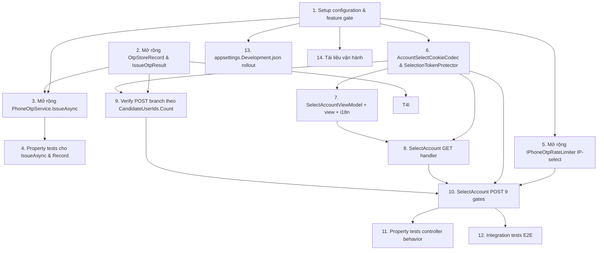

# Implementation Plan: Phone OTP Multi-Account Select

Tài liệu này chia thiết kế ở `design.md` thành các task code-only nhỏ, ordered đúng dependency, mỗi task tương ứng **1 PR có thể merge độc lập** (bao gồm cả test có liên quan trong cùng PR). Toàn bộ feature mở rộng spec gốc `phone-otp-login` mà KHÔNG đổi route hiện có, KHÔNG thêm cookie scheme mới, KHÔNG migration EF, KHÔNG thêm NuGet package (R17.6).

## Overview

- File mới đặt dưới namespace `Skoruba.Duende.IdentityServer.STS.Identity.PhoneOtp` (sub-namespace `.Configuration`, `.Models`, `.Services`, `.Storage`, `.Filters`) — giống convention của spec gốc.
- View đặt tại `Views/Account/LoginWithPhone/SelectAccount.cshtml`; resource files tại `Resources/Views/Account/LoginWithPhone/SelectAccount.{vi,en}.resx`.
- Feature flag `PhoneOtpLogin:MultiAccount:Enabled` default `false`. Khi off, mọi behaviour mới invisible (R14.4, R16.7).
- Mỗi top-level task = 1 PR; phần test cho task đó được gộp thành 1 bullet `Tests:` trong cùng task (code + test cùng merge).
- Ngôn ngữ implementation: C# (theo design.md đã chốt), Razor view, không pseudocode.

## Tasks

- [x] 1. Setup configuration & feature gate
  - Sửa `src/Skoruba.Duende.IdentityServer.STS.Identity/PhoneOtp/Configuration/PhoneOtpLoginConfiguration.cs`: thêm `public MultiAccountConfiguration MultiAccount { get; set; } = new();`. Bổ sung class mới `public sealed class MultiAccountConfiguration` cùng file (hoặc file riêng `MultiAccountConfiguration.cs` cùng folder) với 4 prop default verbatim Section 3.4 design: `Enabled=false`, `SelectTtlSeconds=60`, `IpSelectRateLimitWindowSeconds=600`, `IpSelectRateLimitMaxRequests=30`.
  - Sửa `src/Skoruba.Duende.IdentityServer.STS.Identity/PhoneOtp/PhoneOtpServiceCollectionExtensions.cs` `AddPhoneOtpLogin`: append validation block fail-fast đúng 5 rule Section 7.2 design (Enabled-without-parent, SelectTtlSeconds [30,180], IpSelectRateLimitWindowSeconds [60,3600], IpSelectRateLimitMaxRequests [5,200], DataProtector probe khi `Enabled && MultiAccount.Enabled`). Mỗi `InvalidOperationException` nêu đúng tên config key như Section 3.4.
  - Tạo file mới `src/Skoruba.Duende.IdentityServer.STS.Identity/PhoneOtp/Filters/PhoneOtpMultiAccountFeatureGateAttribute.cs`: là `Attribute, IAsyncActionFilter` (analogue của `PhoneOtpFeatureGateAttribute`). Đọc `IOptions<PhoneOtpLoginConfiguration>`; trả `NotFoundResult` khi `Enabled == false || MultiAccount.Enabled == false` (R1.2, R1.8, R14.4).
  - Sửa `src/Skoruba.Duende.IdentityServer.STS.Identity/appsettings.json`: thêm sub-section `"PhoneOtpLogin": { …, "MultiAccount": { "Enabled": false, "SelectTtlSeconds": 60, "IpSelectRateLimitWindowSeconds": 600, "IpSelectRateLimitMaxRequests": 30 } }` đúng layout Section 7.1 design. KHÔNG bật flag mặc định.
  - Tests: `tests/Skoruba.Duende.IdentityServer.STS.Identity.PhoneOtp.UnitTests/Configuration/MultiAccountConfigurationValidationTests.cs` cover 4 nhánh `SelectTtl_OutOfRange_Throws` (low+high), `IpSelectWindow_OutOfRange_Throws`, `IpSelectMax_OutOfRange_Throws`, `SubFlag_True_When_ParentFalse_Throws` (mỗi assertion check exception message chứa đúng key path); `tests/.../Filters/PhoneOtpMultiAccountFeatureGateAttributeTests.cs` cover parent off → 404, parent on + multi off → 404, both on → next() called.
  - _Requirements: 1.1, 1.2, 1.3, 1.4, 1.5, 1.6, 1.7, 1.8, 17.4, 18.2_

- [x] 2. Mở rộng `OtpStoreRecord` & `IssueOtpResult` với backward-compat deserialization
  - Sửa `src/Skoruba.Duende.IdentityServer.STS.Identity/PhoneOtp/Models/OtpStoreRecord.cs`: thêm field `public IReadOnlyList<string> CandidateUserIds { get; init; } = Array.Empty<string>();` (Section 3.1 design). Giữ nguyên field `UserId` (R2.4 — `UserId == CandidateUserIds[0]`). JSON serialization shape camelCase (System.Text.Json default).
  - Sửa `src/Skoruba.Duende.IdentityServer.STS.Identity/PhoneOtp/Storage/RedisPhoneOtpStore.cs` `GetAsync`: sau `JsonSerializer.Deserialize<OtpStoreRecord>(...)`, áp dụng fallback Section 3.1: `if (record.CandidateUserIds is null || record.CandidateUserIds.Count == 0) record = record with { CandidateUserIds = new[] { record.UserId } };` (R2.6, R14.4, R16.8).
  - Sửa `src/Skoruba.Duende.IdentityServer.STS.Identity/PhoneOtp/Models/IssueOtpResult.cs`: thêm prop optional `IReadOnlyList<string>? CandidateUserIds = null` (Section 3.2). Constructor backward-compat — call site không pass field này vẫn build OK.
  - Tests: `tests/Skoruba.Duende.IdentityServer.STS.Identity.PhoneOtp.UnitTests/Models/OtpStoreRecordSerializationTests.cs` cover `RoundTrip_NewShape` (record với `CandidateUserIds.Count >= 1` → Serialize → Deserialize → equal), `LegacyJson_FallsBackToSingleElementCandidateSet` (JSON literal thiếu field `candidateUserIds` → Deserialize via store path → fallback `[UserId]`), `Legacy_Single_PreservesUserId`.
  - _Requirements: 2.6, 14.4, 16.8_

- [x] 3. Mở rộng `PhoneOtpService.IssueAsync` để hỗ trợ `Candidate_Set`
  - Sửa `src/Skoruba.Duende.IdentityServer.STS.Identity/PhoneOtp/Services/PhoneOtpService.cs` `IssueAsync` theo Section 4.1 design — thêm branch sau lookup user: `users.Count == 0` → `Rejected` (giữ nguyên); `users.Count >= 1 && !MultiAccount.Enabled` (Count==1 tiếp tục, Count>1 → `Rejected` per R1.3, R2.2); `users.Count >= 1 && MultiAccount.Enabled` → sort deterministic theo `(LockoutEnabled ASC, LockoutEnd NULL FIRST then ASC, NormalizedUserName ASC)` (R2.3), `candidateIds = users.Select(u => u.Id).ToImmutableArray()`, `primaryUserId = candidateIds[0]`.
  - Persist `OtpStoreRecord` với `UserId = primaryUserId` AND `CandidateUserIds = candidateIds` (R2.4, R2.5).
  - Trả `IssueOtpResult(Issued, phoneHash, expiresAt, null, candidateIds)`.
  - Log entry `Event="PhoneOtpRequest"` thêm structured property `CandidateCount` (R2.8, R10.1). KHÔNG log individual user-id; KHÔNG leak `CandidateCount` qua HTTP response (R2.7, R3.x).
  - Tests: `tests/Skoruba.Duende.IdentityServer.STS.Identity.PhoneOtp.UnitTests/Services/PhoneOtpServiceIssueMultiAccountTests.cs` (extend hoặc new file) cover 5-case matrix theo bảng Property 3 design — `Count=0`, `Count=1 flag-off`, `Count=1 flag-on`, `Count>1 flag-off`, `Count>1 flag-on`. Assertion: outcome đúng, `record.UserId == record.CandidateUserIds[0]`, log entry chứa `CandidateCount`.
  - _Requirements: 1.3, 1.4, 2.1, 2.2, 2.3, 2.4, 2.5, 2.6, 2.7, 2.8, 9.1, 10.1, 14.4_

- [x] 4. Property-based tests cho IssueAsync và OtpStoreRecord
  - Tạo folder `tests/Skoruba.Duende.IdentityServer.STS.Identity.PhoneOtp.UnitTests/Properties/` (đã có từ spec gốc) — thêm 5 file mới. Mỗi file mở đầu comment header `// Feature: phone-otp-multi-account-select, Property N: <Title>`. Mỗi property = đúng 1 test, attribute `[Property(MaxTest = 100)]`. Generator FsCheck arbitraries.
  - Tests: `Property01_CandidateOrderDeterminism.cs` (Property 1: Candidate set ordering is deterministic and total — validates 2.3); `Property02_CandidateSetTenantScoping.cs` (Property 2: Candidate set is tenant-scoped — validates 9.1); `Property03_IssueExtendedSemantics.cs` (Property 3: Issue branches correctly across (Count, MultiAccount.Enabled) — validates 1.3, 1.4, 2.1, 2.2, 2.4); `Property04_RecordSerializationRoundTrip.cs` (Property 4: OtpStoreRecord serialization round-trip and backward compatibility — validates 2.6, 14.4); `Property15_LockoutCounterChain.cs` (Property 15: Lockout counter chains into Issue rejection — validates 11.2).
  - _Requirements: 2.3, 2.4, 2.6, 9.1, 11.2, 14.4_

- [x] 5. Mở rộng `IPhoneOtpRateLimiter` cho per-IP select counter
  - Sửa `src/Skoruba.Duende.IdentityServer.STS.Identity/PhoneOtp/Services/IPhoneOtpRateLimiter.cs`: thêm 2 method async `Task RegisterIpSelectAttemptAsync(string ipHash, CancellationToken ct)` và `Task<RateLimitDecision> CheckIpSelectAsync(string ipHash, CancellationToken ct)` (Section 4.2 design).
  - Sửa `src/Skoruba.Duende.IdentityServer.STS.Identity/PhoneOtp/Services/PhoneOtpRateLimiter.cs`: implement 2 method dùng key `{prefix}rl:ip-select:{ipHash}` TTL = `MultiAccount.IpSelectRateLimitWindowSeconds`. `CheckIpSelectAsync` reject khi counter `>= MultiAccount.IpSelectRateLimitMaxRequests`. Pattern read-modify-write giống `RegisterIpIssuanceAsync` đã có (chấp nhận ±1 race).
  - Tests: `tests/Skoruba.Duende.IdentityServer.STS.Identity.PhoneOtp.UnitTests/Services/PhoneOtpRateLimiterIpSelectTests.cs` cover `RegisterIpSelectAttempt_IncrementsCounter`, `CheckIpSelect_AllowedBelowThreshold`, `CheckIpSelect_RejectsAtThreshold`, `Counter_ExpiresAfterWindow` (dùng `FakeTimeProvider` + `MemoryDistributedCache`).
  - _Requirements: 18.1, 18.3, 18.5_

- [x] 6. Tạo `PhoneOtpAccountSelectCookieCodec` & `SelectionTokenProtector` + DI registration
  - Tạo file mới `src/Skoruba.Duende.IdentityServer.STS.Identity/PhoneOtp/Services/PhoneOtpAccountSelectCookieCodec.cs` theo Section 4.3 design: const `CookieName = "phone_otp_account_select"`, purpose `"PhoneOtp.AccountSelectCookie"`, method `Protect(AccountSelectContext)` và `bool TryUnprotect(string raw, out AccountSelectContext)`. Cùng file khai báo `public sealed record AccountSelectContext(...)` đúng 7 field Section 3.3.
  - Tạo file mới `src/Skoruba.Duende.IdentityServer.STS.Identity/PhoneOtp/Services/ISelectionTokenProtector.cs` (interface) + `SelectionTokenProtector.cs` (impl) theo Section 4.4 design: purpose `"PhoneOtp.AccountSelectToken"`, method `string Issue(string userId)` (base64url-encoded protected bytes), `bool TryResolve(string token, out string userId)`.
  - Sửa `PhoneOtpServiceCollectionExtensions.AddPhoneOtpLogin` (block thêm trong Task 1): conditional DI registration Section 7.3 design — chỉ register `PhoneOtpAccountSelectCookieCodec` (singleton) + `ISelectionTokenProtector → SelectionTokenProtector` (singleton) + `PhoneOtpMultiAccountFeatureGateAttribute` (singleton) khi `phoneOtpConfig.Enabled && multi.Enabled`.
  - Tests: `tests/.../Services/PhoneOtpAccountSelectCookieCodecTests.cs` cover `Protect_Unprotect_RoundTrip`, `Tampered_Returns_False` (mutate 1 byte), `WrongPurpose_Returns_False`, `Empty_String_Returns_False` (dùng `EphemeralDataProtectionProvider`); `tests/.../Services/SelectionTokenProtectorTests.cs` cover `Issue_DoesNotContain_UserId_AsPlaintextSubstring`, `TryResolve_Valid_RoundTrip`, `Issue_Twice_ProducesDistinctTokens`, `TryResolve_Tampered_ReturnsFalse`, `TryResolve_WrongPurpose_ReturnsFalse`; thêm 2 property-based tests trong `Properties/`: `Property07_AccountSelectCookieRoundTrip.cs` (validates 6.2, 6.3) và `Property08_SelectionTokenInvariants.cs` (validates 5.9, 6.8).
  - _Requirements: 5.9, 6.1, 6.2, 6.3, 6.4, 6.8, 6.12_

- [x] 7. Tạo `SelectAccountViewModel` + view `SelectAccount.cshtml` + i18n resources
  - Tạo file mới `src/Skoruba.Duende.IdentityServer.STS.Identity/ViewModels/Account/SelectAccountViewModel.cs` theo Section 3.5 design: `public sealed record CandidateOption(string SelectionToken, string UserName);` + `public sealed class SelectAccountViewModel { MaskedPhone, Candidates, ReturnUrl, Error }`.
  - Tạo file mới `src/Skoruba.Duende.IdentityServer.STS.Identity/Views/Account/LoginWithPhone/SelectAccount.cshtml` verbatim Section 5.1 design (Razor markup). DOM phải pass: single `<h1>` (R12.1), `<p>` subtitle, `<form method="post">` (R5.10), `<label for="account-select">` (R12.2), `<select id="account-select" name="SelectionToken" aria-required="true" autofocus required>` (R12.3, R12.4), `<button type="submit" aria-label="...">` (R12.5), back-link `<a href="/Account/Login?returnUrl=...">` (R5.13), error region `role="alert"` (R12.8), zero JS (R5.12), first option `selected` (R5.11), tất cả strings qua `IViewLocalizer` (R13.1, R13.5).
  - Tạo file mới `src/Skoruba.Duende.IdentityServer.STS.Identity/Resources/Views/Account/LoginWithPhone/SelectAccount.vi.resx` với 9 keys verbatim Section 5.2 design (vi default).
  - Tạo file mới `src/Skoruba.Duende.IdentityServer.STS.Identity/Resources/Views/Account/LoginWithPhone/SelectAccount.en.resx` với cùng 9 keys (en).
  - Tests: không có test layer riêng cho task này — DOM/accessibility được cover ở Task 12 integration (`MultiAccountAccessibilityTests`).
  - _Requirements: 5.1, 5.10, 5.11, 5.12, 5.13, 5.14, 12.1, 12.2, 12.3, 12.4, 12.5, 12.6, 12.7, 12.8, 13.1, 13.2, 13.3, 13.4, 13.5_

- [x] 8. Implement `PhoneLoginController.SelectAccount` GET handler
  - Sửa `src/Skoruba.Duende.IdentityServer.STS.Identity/Controllers/PhoneLoginController.cs`: thêm DI dependencies `PhoneOtpAccountSelectCookieCodec`, `ISelectionTokenProtector`, optional `IViewLocalizer<SelectAccountViewModel>` (hoặc `_localizer` đã có). Inject conditional — feature gate filter sẽ chặn nếu DI không register.
  - Thêm action `[HttpGet("SelectAccount")] [PhoneOtpMultiAccountFeatureGate] public async Task<IActionResult> SelectAccountGet([FromQuery] string? returnUrl, CancellationToken ct)` theo Section 4.5 design — gates theo thứ tự: cookie absent → 302 `/Account/Login` preserve `returnUrl` (R5.2); `TryUnprotect` fail → `ClearAccountSelectCookie()` + 302 `/Account/Login` (R6.6.a); tenant key empty hoặc mismatch → clear cookie + 302 (R5.3, R9.2); `now > ExpiresAtUtc` → clear cookie + log Warning `Event="PhoneOtpAccountSelectExpired"` + 302 (R5.4, R10.6); load candidate `UserIdentity` rows `Where(u => ctx.CandidateUserIds.Contains(u.Id) && u.TenantKey == tenantKey && u.PhoneNumberConfirmed)` silent omit deleted/disabled (R5.6); `users.Count == 0` sau filter → clear cookie + `TempData["PhoneOtpError"] = SelectAccount.GenericError` + 302 (R5.15); build `Candidates` qua `_tokenProtector.Issue(id)`, omit user có `UserName` rỗng (R12.9), preserve order theo `ctx.CandidateUserIds` (R5.5); render `SelectAccount.cshtml` với `MaskedPhone = (TempData["PhoneOtpMaskedPhone"] as string) ?? "••••"`.
  - Thêm helper private `RedirectToLoginPreservingReturnUrl(string?)` và `ClearAccountSelectCookie()` reusable cho POST handler.
  - Tests: `tests/.../Controllers/PhoneLoginControllerSelectAccountGetTests.cs` (unit) + `tests/.../IntegrationTests/MultiAccount/SelectAccountGetTests.cs` (integration). Cover 5 reject branches + 1 success render. Integration test parse HTML qua AngleSharp, assert đúng số `<option>` + first `selected` + `MaskedPhone` từ TempData.
  - _Requirements: 5.2, 5.3, 5.4, 5.5, 5.6, 5.7, 5.8, 5.9, 5.15, 9.2, 9.3, 12.9, 14.4_

- [x] 9. Sửa `PhoneLoginController.Verify` POST để branch theo `CandidateUserIds.Count`
  - Sửa `src/Skoruba.Duende.IdentityServer.STS.Identity/Controllers/PhoneLoginController.cs` POST `Verify` action — sau khi `VerifyAsync` trả `Succeeded` AND đã capture `record.CandidateUserIds` trước khi record bị delete (R4.1).
  - Nhánh `record.CandidateUserIds.Count == 1`: giữ nguyên flow hiện hữu (R4.2, R14.1, R14.3).
  - Nhánh `Count > 1 && MultiAccount.Enabled`: clear `phone_otp_session` cookie (R6.5); build `AccountSelectContext(TenantKey, PhoneE164Hash, CandidateUserIds, IssuedAtUtc=now, ExpiresAtUtc=now+SelectTtlSeconds, OtpRecordKey, Version=1)`; set cookie `phone_otp_account_select` qua `_selectCodec.Protect(ctx)` với CookieOptions `HttpOnly=true, Secure=true, SameSite=Lax, IsEssential=true, Expires=ctx.ExpiresAtUtc` (R6.1, R6.4); set TempData `PhoneOtpMaskedPhone` từ masked phone của verify pipeline (Section 4.5 handover); log Information `Event="PhoneOtpAccountSelectShown"` với `CandidateCount` (R4.5, R10.2); 302 `/Account/LoginWithPhone/SelectAccount?returnUrl=...` (R4.4).
  - Nhánh `Count > 1 && !MultiAccount.Enabled` (defensive — ngữ cảnh chỉ xảy ra nếu `IssueAsync` rò rỉ multi-record qua flag rotation race): re-render `Verify.cshtml` với `Generic_Verify_Error`, KHÔNG SignInAsync, KHÔNG raise `UserLoginSuccessEvent` (R4.3).
  - KHÔNG thêm cookie/header khác khi flag off (R3.3, R14.4).
  - Tests: `tests/.../IntegrationTests/MultiAccount/VerifyBranchTests.cs` cover `Count1_FlagOn_SignsInDirectly_NoSelectCookie`, `CountMany_FlagOn_RedirectsToSelectAccount_SetsCookie_ClearsSession`, `CountMany_FlagOff_DefensiveRejectsWithGenericError`. Assert log entry `PhoneOtpAccountSelectShown` chỉ xuất hiện ở branch 2.
  - _Requirements: 4.1, 4.2, 4.3, 4.4, 4.5, 4.6, 6.1, 6.4, 6.5, 10.2, 14.1, 14.3_

- [x] 10. Implement `PhoneLoginController.SelectAccount` POST với 9 gates
  - Sửa `src/Skoruba.Duende.IdentityServer.STS.Identity/Controllers/PhoneLoginController.cs`: thêm action `[HttpPost("SelectAccount")] [ValidateAntiForgeryToken] [PhoneOtpMultiAccountFeatureGate] public async Task<IActionResult> SelectAccountPost([FromForm] string SelectionToken, [FromForm] string? ReturnUrl, CancellationToken ct)` theo Section 4.6 + Section 2.2 design. Order các gate verbatim: Gate 1 (R18.6) hash IP qua SHA-256 (KHÔNG log raw IP, R10.5, R18.4), `RegisterIpSelectAttemptAsync` BEFORE cookie decrypt (R18.5), `CheckIpSelectAsync` exceeded → log Warning `Event="PhoneOtpAccountSelectIpRateLimited"` + DelayJitter + TempData generic error + 302 (R18.3, R18.4, R18.7); Gate 2 read cookie raw — absent → DelayJitter + 302 (no log, no phone counter); Gate 3 `_selectCodec.TryUnprotect` fail → clear cookie + DelayJitter + 302 (KHÔNG `RegisterVerifyFailureAsync` per R11.1); Gate 4 `now > ctx.ExpiresAtUtc` → clear cookie + log Warning `PhoneOtpAccountSelectExpired` + TempData expired error + DelayJitter + 302 (R5.4, R8.2); Gate 5 `tenantKey != ctx.TenantKey` → clear cookie + `RegisterVerifyFailureAsync(ctx.TenantKey, ctx.PhoneE164Hash)` + log Warning `Outcome="TenantMismatch"` + DelayJitter + 302 (R6.6.c, R9.2, R11.1); Gate 6 `_tokenProtector.TryResolve` fail → `RegisterVerifyFailureAsync` + log Warning `PhoneOtpAccountSelectTokenInvalid` + DelayJitter + 302 (R8.6); Gate 7 `userId ∉ ctx.CandidateUserIds` → `RegisterVerifyFailureAsync` + log Warning `PhoneOtpAccountSelectTokenInvalid Reason="userIdNotInSet"` + DelayJitter + 302 (R6.6.d, R8.6); Gate 8 reload `UserIdentity` qua `_userManager.Users.Where(u => u.Id == userId && u.TenantKey == tenantKey && u.PhoneNumberConfirmed).FirstOrDefaultAsync(ct)` — null → `RegisterVerifyFailureAsync` + log Warning `Outcome="UserNotFound"` + DelayJitter + re-render `SelectAccount` với surviving candidates + GIỮ cookie (R8.5); Gate 9 `user.LockoutEnabled && user.LockoutEnd > now` → `RegisterVerifyFailureAsync` + log Warning `Outcome="UserLockedOut"` + DelayJitter + 302 (R7.7, R6.6.e, R11.1).
  - Success branch: `ClearAccountSelectCookie()` BEFORE `SignInAsync` (R6.9); `await _signInManager.SignInAsync(user, isPersistent: false)` (R7.1); `await _events.RaiseAsync(new UserLoginSuccessEvent(user.UserName, user.Id, user.UserName, clientId: null))` với `LoginType="phone-otp-multi"` (R7.2); log Information `Event="PhoneOtpAccountSelected" Outcome="Succeeded"` + `User_Id_Hash` (8 hex SHA-256) (R7.5, R10.3); continuation cascade `(GetAuthorizationContextAsync, IsNativeClient, IsLocalUrl)` (R7.3, R7.4); KHÔNG DelayJitter (R11.5).
  - Helper `DelayJitterAsync(ct)`: `await Task.Delay(RandomNumberGenerator.GetInt32(100, 301), ct)` (R11.4, R18.7). Helper `Sha256Hex(string input, int? truncateChars = null)` cho IP hash + UserId hash. KHÔNG log raw IP, raw user-id, raw cookie value, raw SelectionToken, OTP plaintext (R10.5).
  - Tests: `tests/.../Controllers/PhoneLoginControllerSelectAccountPostTests.cs` (unit, mock dependencies bằng NSubstitute) cover từng gate fail có đúng counter side-effects (IP counter incremented always; phone counter NOT for Gate 2/3; phone counter incremented for Gate 5..9), success branch không call `RegisterVerifyFailureAsync`; `tests/.../IntegrationTests/MultiAccount/SelectAccountPostTests.cs` cover happy path 302 returnUrl + Identity cookie issued + select cookie deleted.
  - _Requirements: 6.6, 6.7, 6.8, 6.9, 6.10, 6.11, 7.1, 7.2, 7.3, 7.4, 7.5, 7.6, 7.7, 8.5, 8.6, 9.3, 10.3, 10.4, 10.5, 10.6, 11.1, 11.3, 11.4, 11.5, 18.3, 18.4, 18.5, 18.6, 18.7_

- [x] 11. Property-based tests cho controller behavior
  - Tạo các file mới trong `tests/Skoruba.Duende.IdentityServer.STS.Identity.PhoneOtp.UnitTests/Properties/`. Mỗi file mở đầu comment header `// Feature: phone-otp-multi-account-select, Property N: <Title>`. Mỗi property = đúng 1 test, attribute `[Property(MaxTest = 100)]`.
  - Tests: `Property05_AntiEnumerationVerifyResponse.cs` (Property 5: Verify-page response is independent of `Candidate_Set.Count` — validates 3.1, 3.2, 3.3, 3.5, 3.6, 3.7, 14.3); `Property06_VerifyBranchInvariants.cs` (Property 6: Post-verify branching invariants — validates 4.2, 4.4, 4.6, 6.5, 6.9, 6.10, 7.1, 8.1); `Property09_SelectAccountRenderInvariants.cs` (Property 9: SelectAccount render reflects surviving candidate set — validates 5.5, 5.6, 5.7, 5.8, 5.11, 12.9); `Property10_PostGateInvariants.cs` (Property 10: POST `/SelectAccount` gate invariants and per-phone failure counter — validates 6.6, 6.7, 7.3, 8.5, 8.6, 9.2, 9.3, 11.1); `Property11_ContinuationDispatch.cs` (Property 11: Continuation dispatch matches single-user verify — validates 7.3); `Property12_PerIpRateLimit.cs` (Property 12: Per-IP rate-limit on POST `/SelectAccount` — validates 18.1, 18.3, 18.5, 18.6); `Property13_RandomizedRejectionDelay.cs` (Property 13: Randomized rejection delay — validates 11.4, 11.5, 18.7); `Property14_LogRedaction.cs` (Property 14: Log entries do not contain forbidden plaintext — validates 10.5); `Property16_FlagOffInvariance.cs` (Property 16: Flag-off invariance — validates 14.4).
  - _Requirements: 3.1, 3.2, 3.3, 3.5, 3.6, 3.7, 4.2, 4.4, 4.6, 5.5, 5.6, 5.7, 5.8, 5.11, 6.5, 6.6, 6.7, 6.9, 6.10, 7.1, 7.3, 8.1, 8.5, 8.6, 9.2, 9.3, 10.5, 11.1, 11.4, 11.5, 12.9, 14.3, 14.4, 18.1, 18.3, 18.5, 18.6, 18.7_

- [x] 12. Integration tests E2E happy path & critical cases
  - Tạo các file mới trong `tests/Skoruba.Duende.IdentityServer.STS.Identity.PhoneOtp.IntegrationTests/MultiAccount/`. Tái sử dụng `PhoneOtpWebApplicationFactory` từ spec gốc (extend với config overlay `MultiAccount:Enabled=true|false` + thresholds qua `IConfiguration`); seed DB với 2 user trong tenant t1 share phone `+84334336232`, 1 user khác tenant cùng phone (kiểm tra cross-tenant), 1 user khác phone (kiểm tra single-user branch). Override `IPhoneOtpRateLimiter` thresholds (vd `IpSelectRateLimitMaxRequests=3`) để test rate-limit trong vài request. `FakeTimeProvider` để control TTL boundary. Serilog `InMemorySink` để capture log.
  - Tests: `MultiAccountFlowTests.Request_Verify_Select_HappyPath` (E2E full flow + cookie set/delete + Identity cookie issued); `MultiAccountFlowTests.AntiEnumeration_Verify_OneVsThreeUsers_ByteEqual` (validates 16.6, 3.1, 3.2); `MultiAccountFlowTests.SelectAccount_FlagOff_Returns404` (validates 16.7, 1.2, 1.8, 14.4); `MultiAccountFlowTests.OtpStoreRecord_Legacy_Deserializes_AndVerifies` (validates 16.8, 2.6); `MultiAccountFlowTests.IpRateLimit_Triggers_AfterThreshold` (validates 16.12, 18.3, 18.4, 18.5); `MultiAccountFlowTests.LockoutChain_3_TokenMutations_BlocksIssue` (validates 16.9, 11.2); `MultiAccountFlowTests.SelectAccount_DoubleSubmit_TabRace_RejectsSecond` (validates 8.1); `MultiAccountFlowTests.SelectAccount_TtlExpired_RedirectsLogin` (validates 5.4, 8.2); `MultiAccountFlowTests.SelectAccount_TenantMismatch_ClearsCookie` (validates 5.3, 9.2); `MultiAccountFlowTests.SelectAccount_CandidateDeleted_BetweenIssueAndSelect_ReRendersSurviving` (validates 8.5); `MultiAccountAccessibilityTests.DOM_HasH1_Label_Select_AriaRequired_Autofocus_SubmitAriaLabel` (parse HTML qua AngleSharp — validates 16.10, 12.1..12.5, 12.7, 12.8); `MultiAccountAccessibilityTests.EmptyUserName_Omitted` (validates 12.9); `MultiAccountFlowTests.NoOutboundCalls_VerifiedByFakeSmsSender` (validates 16.11); `MultiAccountFlowTests.Logs_Contain_Required_Events_RedactedFields` (Serilog `InMemorySink` — validates 10.1, 10.2, 10.3, 10.4, 10.5, 10.6).
  - _Requirements: 16.1, 16.2, 16.3, 16.4, 16.5, 16.6, 16.7, 16.8, 16.9, 16.10, 16.11, 16.12_

- [x] 13. Cập nhật `appsettings.Development.json` cho dev rollout
  - Sửa `src/Skoruba.Duende.IdentityServer.STS.Identity/appsettings.Development.json` (nếu tồn tại; nếu chưa có sub-section `PhoneOtpLogin`): bổ sung `"PhoneOtpLogin": { "MultiAccount": { "Enabled": true } }` để dev environment bật flag (giúp local debug). Production/staging giữ `Enabled=false` qua `appsettings.json` (Task 1) — operator phải tự bật qua user-secrets / env var khi rollout (R1.1).
  - Verify dòng `"PhoneOtpLogin": { "Enabled": true, … }` trong `appsettings.json` đã được set bởi spec gốc — nếu chưa, bổ sung. KHÔNG ghi đè giá trị Twilio credential placeholder.
  - Document chỉ append config — KHÔNG thêm code, KHÔNG thêm test.
  - Tests: không có (chỉ thay đổi config file).
  - _Requirements: 1.1, 1.5, 17.4_

- [x] 14. Tài liệu vận hành cho operator
  - Tạo file mới `docs/phone-otp-multi-account.md` (hoặc append section vào README hiện hữu của STS host). Nội dung tối thiểu: mô tả flag `PhoneOtpLogin:MultiAccount:Enabled` (default `false`); cách bật trong dev/staging/prod (env var `PhoneOtpLogin__MultiAccount__Enabled=true`, tham chiếu user-secrets cho local); 4 config key + range hợp lệ (`SelectTtlSeconds [30,180]`, `IpSelectRateLimitWindowSeconds [60,3600]`, `IpSelectRateLimitMaxRequests [5,200]`).
  - Risk note: khả năng false-positive lockout khi user multi-account fail nhiều lần (Section 12.6 design); mitigation = bump `PhoneVerifyLockoutMaxFailures` nếu cần. Risk note: IP rate-limit vô hiệu nếu reverse proxy không forward `X-Forwarded-For` đúng (Section 12.7); kiểm tra `ForwardedHeadersConfiguration`.
  - Telemetry / log events để monitor: `PhoneOtpAccountSelectShown` (Info), `PhoneOtpAccountSelected` (Info success / Warning reject), `PhoneOtpAccountSelectExpired`, `PhoneOtpAccountSelectTokenInvalid`, `PhoneOtpAccountSelectIpRateLimited` (Warning). Mỗi event ghi `TenantKey`, `Phone_Last4`, `Phone_Sha8`, optional `User_Id_Hash`, `Outcome`.
  - Rollout checklist (3 bước): bật flag dev → smoke flow request/verify/select → bật staging → bật prod sau 1 tuần observability.
  - Tests: không có (chỉ tài liệu).
  - _Requirements: 1.1, 11.2, 17.1, 17.2, 17.4_

## Notes

- Mỗi top-level task = 1 PR có thể merge độc lập, bao gồm cả test trong cùng PR (code + test cùng commit).
- Mỗi PR phải pass: `dotnet build` + `dotnet test tests/Skoruba.Duende.IdentityServer.STS.Identity.PhoneOtp.UnitTests/` + (nếu có integration test) `dotnet test tests/Skoruba.Duende.IdentityServer.STS.Identity.PhoneOtp.IntegrationTests/`.
- KHÔNG migration EF, KHÔNG thêm NuGet, KHÔNG đổi route cũ, KHÔNG đổi cookie scheme cũ (R17).
- Test fixtures kế thừa từ spec gốc (`PhoneOtpWebApplicationFactory`, `FakeSmsSender`, `MemoryDistributedCache`) — chỉ extend, không tạo mới.
- Property-based test files đặt trong `tests/Skoruba.Duende.IdentityServer.STS.Identity.PhoneOtp.UnitTests/Properties/` với header `// Feature: phone-otp-multi-account-select, Property N: <Title>` và `[Property(MaxTest = 100)]`.

## Task Dependency Graph

Sơ đồ phụ thuộc giữa các task — mũi tên `A --> B` nghĩa là B yêu cầu A hoàn tất trước. Các task cùng wave có thể chạy song song.



Wave breakdown:

- Wave 0 (foundation): Task 1, Task 2 — independent, có thể chạy song song.
- Wave 1 (domain extensions): Task 3 (cần T1+T2), Task 5 (cần T1) — song song.
- Wave 2 (services + property tests): Task 6 (cần T1), Task 4 (cần T3) — song song.
- Wave 3 (view layer): Task 7 (cần T6).
- Wave 4 (controller actions): Task 8 (cần T6+T7), Task 9 (cần T2+T6) — song song.
- Wave 5 (controller POST): Task 10 (cần T6+T8+T9+T5).
- Wave 6 (test waves): Task 11 + Task 12 — song song.
- Wave 7 (rollout artifacts): Task 13, Task 14 — không block code, song song.

```json
{
  "waves": [
    { "id": 0, "tasks": ["1", "2"] },
    { "id": 1, "tasks": ["3", "5"] },
    { "id": 2, "tasks": ["4", "6"] },
    { "id": 3, "tasks": ["7"] },
    { "id": 4, "tasks": ["8", "9"] },
    { "id": 5, "tasks": ["10"] },
    { "id": 6, "tasks": ["11", "12"] },
    { "id": 7, "tasks": ["13", "14"] }
  ]
}
```
