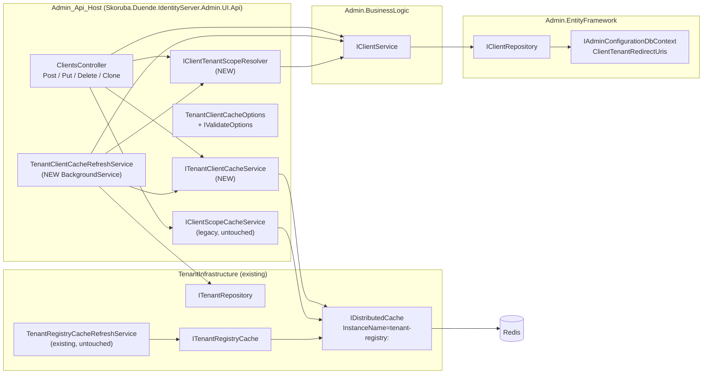
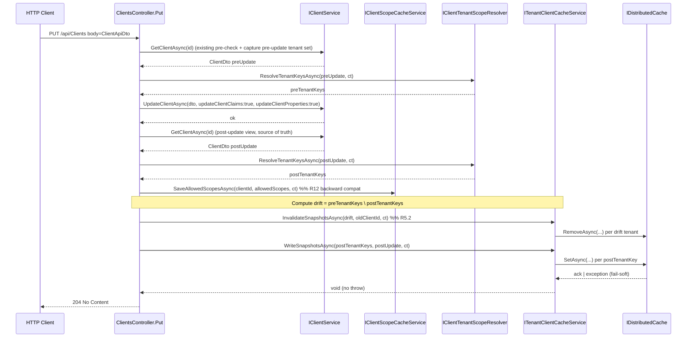
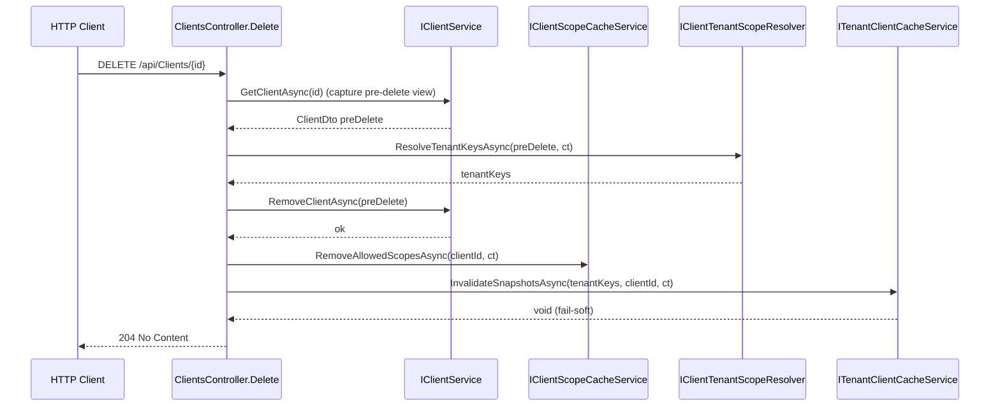
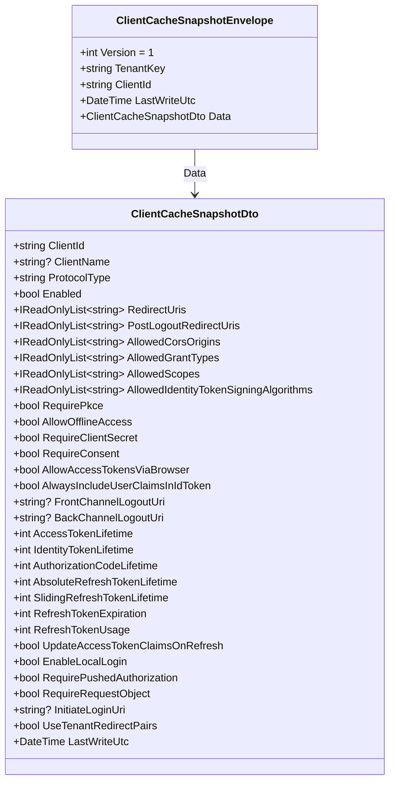

# Design Document

Tenant Client Cache Expansion

## Overview

Feature này mở rộng phạm vi cache phía Admin UI API từ chỗ chỉ lưu một field duy nhất (`AllowedScopes` trong `IClientScopeCacheService`) thành lưu một **public-safe snapshot** chứa toàn bộ Client config cần thiết cho mobile/SPA bootstrap, scope theo tenant. Phía consumer side (public read endpoint) là spec riêng và **out-of-scope** trong phase này. Phase này chỉ thiết lập write-side + invalidation + background refresh, hook vào `ClientsController.Post/Put/Delete/PostClientClone`.

Bối cảnh kiến trúc đã có sẵn:

- `Tenant_Infrastructure` (`src/Skoruba.Duende.IdentityServer.TenantInfrastructure`) đã wire `IDistributedCache` (Redis với `InstanceName = "tenant-registry:"`, fallback `MemoryDistributedCache` trong test) qua `ServiceCollectionExtensions.AddTenantInfrastructure`.
- `TenantRegistryCacheRefreshService` (BackgroundService) đã chạy sweep theo `TenantInfrastructureOptions.TenantCacheRefreshInterval` (default 1h) để refresh `tenant:{tenantKey}` + `tenant:public:names` snapshot.
- `IClientScopeCacheService` (Admin UI API) đã ghi key `clientId.Trim()` (bare key, không tenant scope) vào cùng `IDistributedCache` với value là space-separated `AllowedScopes`. Đã hook trong `ClientsController.Post/Put/Delete`.
- `IClientService` (BusinessLogic) là tier duy nhất chạm `IClientRepository` / `IAdminConfigurationDbContext.ClientTenantRedirectUris`. Controller KHÔNG được bypass tier này.
- `IAdminConfigurationDbContext.ClientTenantRedirectUris` là nguồn truth chính cho mapping `(tenantKey, clientId)`. `Client.Properties[skoruba_tenant_redirect_pairs]` là fallback legacy. `ClientTenantRedirectResolver` (STS) đã tham chiếu cùng cơ chế.

Feature này không đụng schema EF, không đụng Duende `IClientStore`, không thêm endpoint public, không thêm pub/sub, không thêm NuGet package mới. Toàn bộ implementation nằm trong:

- `src/Skoruba.Duende.IdentityServer.Admin.UI.Api/Services/TenantClientCache/*` (cache service mới + DTO + options + tenant scope resolver + background refresh).
- Một mở rộng nhỏ trên `IClientService` (BusinessLogic) hoặc bổ sung query method trên `IClientRepository` nếu Background_Refresh cần batch enumerate clients per tenant — quyết định cụ thể nằm ở phần Components.
- Hai chỗ thay đổi controller: `ClientsController.Post/Put/Delete/PostClientClone` ở `src/Skoruba.Duende.IdentityServer.Admin.UI.Api/Controllers/ClientsController.cs`.

### Goals

1. Lưu `Client_Cache_Snapshot` (public-safe whitelist) xuống Redis với key scope theo `(tenantKey, clientId)`.
2. Invalidate ngay lập tức trong cùng request CRUD, không đợi background refresh.
3. Self-heal drift bằng background sweep theo cấu hình `TenantClientCache:RefreshInterval`.
4. Fail-soft khi Redis down: log Warning + Audit_Event, KHÔNG fail HTTP request.
5. Đồng tồn (coexist) với `IClientScopeCacheService` legacy mà không thay đổi behaviour của nó.
6. Không tăng blast radius: tận dụng `IDistributedCache` + `IServiceScopeFactory` pattern đã có ở `TenantRegistryCacheRefreshService`.

### Non-goals (đã chốt ở requirements)

- KHÔNG public endpoint, KHÔNG pub/sub invalidation, KHÔNG decorate Duende `IClientStore`, KHÔNG migration EF, KHÔNG cache `ClientSecrets` / `Claims` / `Properties` / `IdentityProviderRestrictions`, KHÔNG mã hoá-at-rest tự cài.

## Architecture

### Component layout



Quan sát:

- `TenantClientCacheRefreshService` chạy **song song** với `TenantRegistryCacheRefreshService`, KHÔNG decorate / wrap / replace nó (R8.9). Hai service consume cùng `IDistributedCache` nhưng namespace key tách biệt (R3.8, xem mục Cache key).
- `IClientTenantScopeResolver` được resolve qua `IServiceScope` cả ở controller path lẫn background path để giữ scoped lifetime của `IClientService`/`DbContext` (R11.7, R11.8).
- Controller chỉ phụ thuộc `ITenantClientCacheService` và `IClientTenantScopeResolver` (cộng thêm `IClientScopeCacheService` legacy đã có); KHÔNG access `IDistributedCache` trực tiếp, KHÔNG access `DbContext`. Tuân thủ AGENTS.md hard rules.

### Layer responsibility

| Layer | Trách nhiệm | Files dự kiến |
|---|---|---|
| Controller (`Admin.UI.Api/Controllers`) | Gọi `IClientService` (write source-of-truth), sau đó gọi `IClientTenantScopeResolver` để lấy `tenantKeys`, rồi gọi `ITenantClientCacheService` cho mỗi `(tenantKey, clientId)`. KHÔNG bao giờ `await Redis` trực tiếp. KHÔNG bao giờ throw nếu cache fail. | `ClientsController.cs` |
| Cache service (`Admin.UI.Api/Services/TenantClientCache`) | Serialize whitelist → bytes; gọi `IDistributedCache.SetAsync/RemoveAsync` với `AbsoluteExpirationRelativeToNow`; emit Audit_Event + metrics; enforce 256 KiB size limit; enforce per-write timeout. | `TenantClientCacheService.cs`, `ITenantClientCacheService.cs`, `ClientCacheSnapshotDto.cs`, `ClientCacheSnapshotEnvelope.cs`, `ClientCacheSnapshotSerializer.cs` |
| Tenant scope resolver (`Admin.UI.Api/Services/TenantClientCache`) | Áp dụng priority chain: ClientTenantRedirectUris → Properties[skoruba_tenant_redirect_pairs] → empty. Trả `IReadOnlyCollection<string> tenantKeys` đã normalize + sorted. | `IClientTenantScopeResolver.cs`, `ClientTenantScopeResolver.cs` |
| Options + validation (`Admin.UI.Api/Configuration` hoặc `Services/TenantClientCache`) | Bind `TenantClientCache` section, fail-fast validate ranges, expose `IOptions<TenantClientCacheOptions>` + `IValidateOptions<TenantClientCacheOptions>`. | `TenantClientCacheOptions.cs`, `TenantClientCacheOptionsValidator.cs` |
| Background refresh (`Admin.UI.Api/Services/TenantClientCache`) | `BackgroundService` thực thi sweep periodically khi `Enabled=true`. Một sweep = enumerate active tenants → enumerate clients per tenant → gọi `ITenantClientCacheService.WriteSnapshotAsync` cho mỗi tuple. Fail-soft per tenant. | `TenantClientCacheRefreshService.cs` |
| BusinessLogic | Thêm 1 method consume read-only nếu cần (`IClientService.GetClientsByTenantAsync` hoặc reuse `GetClientsAsync` + filter). Quyết định cụ thể: xem section "Background_Refresh: tenant→clients enumeration". | `IClientService.cs`, `ClientService.cs` (chỉ sửa nếu cần) |
| Wiring | Đăng ký services + hosted service trong `StartupHelpers` (theo pattern `IClientScopeCacheService`). | `StartupHelpers.cs` (phương thức tiện ích mới) |

### Cross-cutting concerns

- **Cancellation**: tất cả async API của `ITenantClientCacheService` và `IClientTenantScopeResolver` nhận `CancellationToken`. Controller bind `HttpContext.RequestAborted`. Background service bind `IHostApplicationLifetime.ApplicationStopping` token (qua `ExecuteAsync` `stoppingToken`).
- **Logging**: dùng `Microsoft.Extensions.Logging.ILogger<TenantClientCacheService>` với structured fields (`EventType`, `TenantKey`, `ClientId`, `Outcome`, `DurationMs`, `SnapshotVersion`, `CorrelationId`). Không dùng raw Serilog API trực tiếp; Serilog đã wire ở host và sẽ enrich từ structured log calls.
- **Metrics**: `System.Diagnostics.Metrics.Meter` named `TenantClientCache` (instance singleton). Counters và histogram khai báo trong `TenantClientCacheMetrics.cs`.
- **Activity / CorrelationId**: lấy từ `Activity.Current?.TraceId.ToString()` tại thời điểm log emit. Không inject `IHttpContextAccessor` để giữ controller-agnostic.

## Components and Interfaces

### `TenantClientCacheOptions`

POCO bind từ section `TenantClientCache`. Đặt cùng folder với options khác trong `Admin.UI.Api/Configuration` để theo convention hiện tại.

```csharp
public sealed class TenantClientCacheOptions
{
    public const string SectionName = "TenantClientCache";

    public bool Enabled { get; set; } = true;
    public TimeSpan AbsoluteTtl { get; set; } = TimeSpan.FromHours(1);
    public TimeSpan? SlidingTtl { get; set; } = null;
    public TimeSpan RefreshInterval { get; set; } = TimeSpan.FromHours(1);
    public int WriteTimeoutMs { get; set; } = 2000;
    public int MaxClientsPerTenant { get; set; } = 5000;
}
```

Validation (R1.3 – R1.6) cài qua `IValidateOptions<TenantClientCacheOptions>` thay vì DataAnnotations để có thông điệp chứa observed value:

```csharp
internal sealed class TenantClientCacheOptionsValidator : IValidateOptions<TenantClientCacheOptions>
{
    public ValidateOptionsResult Validate(string? name, TenantClientCacheOptions o) { /* range checks */ }
}
```

Wire-up:

```csharp
services.AddOptions<TenantClientCacheOptions>()
    .Bind(configuration.GetSection(TenantClientCacheOptions.SectionName))
    .ValidateOnStart();
services.AddSingleton<IValidateOptions<TenantClientCacheOptions>, TenantClientCacheOptionsValidator>();
```

`ValidateOnStart()` đảm bảo fail-fast khi host bắt đầu (R1.3 – R1.6). `Information` log một lần trên startup chứa các giá trị bound (R1.10) — phát từ `IHostedService` lifecycle hook hoặc trong `TenantClientCacheRefreshService.StartAsync` (preferred để không thêm class mới).

### `IClientTenantScopeResolver`

```csharp
public interface IClientTenantScopeResolver
{
    Task<IReadOnlyList<string>> ResolveTenantKeysAsync(
        ClientDto client,
        CancellationToken cancellationToken);

    Task<IReadOnlyList<string>> ResolveTenantKeysAsync(
        int clientPrimaryKey,
        CancellationToken cancellationToken);
}
```

- Overload theo `ClientDto` dùng cho controller path (đã có `ClientDto` từ `IClientService.GetClientAsync`).
- Overload theo `int clientPrimaryKey` dùng cho background path (Background_Refresh duyệt clients per tenant).
- Lifetime: `Scoped` (R11.7).
- KHÔNG consume `IClientStore`. Dùng `IClientService.GetClientAsync(int)` + một query nhỏ trên `ClientTenantRedirectUris` qua `IClientRepository` (xem note ở Background_Refresh).

Algorithm (R11.2, mirror `ClientTenantRedirectResolver` của STS):

```mermaid
flowchart TD
    Start[Input: ClientDto] --> Q1{Có ClientTenantRedirectUris<br/>cho ClientId?}
    Q1 -- yes --> Norm1[DISTINCT TenantKey<br/>→ Trim().ToLowerInvariant()]
    Q1 -- no --> Q2{Properties chứa<br/>skoruba_tenant_redirect_pairs?}
    Q2 -- no --> Empty[Return empty list]
    Q2 -- yes --> Parse{JsonSerializer.Deserialize<br/>List&lt;Pair&gt; OK?}
    Parse -- no --> Empty
    Parse -- yes --> Norm2[DISTINCT pair.TenantKey<br/>→ Trim().ToLowerInvariant()]
    Norm1 --> Sort[OrderBy lexicographic ASC]
    Norm2 --> Sort
    Sort --> Result[IReadOnlyList&lt;string&gt;]
```

- Priority: DB rows trước, JSON property sau. Nếu DB có ≥ 1 row → bỏ qua JSON path (giống `ClientTenantRedirectResolver`).
- `Properties[skoruba_client_type]` (giá trị `Skoruba_*` cho client type) KHÔNG dùng để xác định tenant; nó chỉ ảnh hưởng đến việc một client có "global / shared" hay không (case priority 3 = empty, R11.2). Vì DB rows + JSON property là hai nguồn duy nhất sinh tenant set, nếu cả hai rỗng thì client là shared/global → return empty.
- Tái sử dụng `Skoruba.Duende.IdentityServer.Admin.BusinessLogic.Helpers.ClientTenantRedirectPairsHelper` (đã `internal static`) — cần đổi visibility hoặc expose method qua `InternalsVisibleTo` cho project Admin.UI.Api. Nếu không muốn đổi visibility, copy logic parse JSON ra resolver mới (thấp risk vì ClientTenantRedirectPairsHelper.PropertyKey là const). Quyết định cuối: **đổi `internal` thành `public`** chỉ cho `ClientTenantRedirectPairsHelper.PropertyKey` const + một method `TryParsePairs` — pattern này đã được dùng cho các helper khác trong BusinessLogic.

### `ITenantClientCacheService`

```csharp
public interface ITenantClientCacheService
{
    Task<ClientCacheSnapshotEnvelope?> ReadSnapshotAsync(
        string tenantKey,
        string clientId,
        CancellationToken cancellationToken);

    Task WriteSnapshotAsync(
        string tenantKey,
        ClientDto client,
        CancellationToken cancellationToken);

    Task WriteSnapshotsAsync(
        IReadOnlyCollection<string> tenantKeys,
        ClientDto client,
        CancellationToken cancellationToken);

    Task InvalidateSnapshotAsync(
        string tenantKey,
        string clientId,
        CancellationToken cancellationToken);

    Task InvalidateSnapshotsAsync(
        IReadOnlyCollection<string> tenantKeys,
        string clientId,
        CancellationToken cancellationToken);
}
```

- Lifetime: `Singleton`. Service không giữ tenant-scoped state; chỉ phụ thuộc `IDistributedCache` (singleton), `IOptionsMonitor<TenantClientCacheOptions>`, `ILogger<>`, `Meter`. Singleton phù hợp với `IDistributedCache` đã là singleton trong DI.
- `ReadSnapshotAsync` dùng cho Background_Refresh (skip-if-fresh logic optional, hiện không bắt buộc) và cho test seam. Phase này KHÔNG public read endpoint nên controller không gọi.
- `WriteSnapshotAsync` (single tenant) là primitive; `WriteSnapshotsAsync` (batch) là wrapper gọi `WriteSnapshotAsync` cho từng `tenantKey` tuần tự (foreach). Tuần tự được chấp nhận vì mỗi op bound bằng `WriteTimeoutMs`; số tenant per client thường ≤ 50.
- `InvalidateSnapshotsAsync` cũng tuần tự cho đơn giản; `IDistributedCache.RemoveAsync` không support batch.
- Mọi method:
  - Validate `tenantKey`, `clientId` (R3.3, R3.4) — throw `ArgumentException` cho null/empty/whitespace.
  - Bao quanh I/O bằng `try/catch (Exception)` để đảm bảo Fail_Soft (R10.1, R10.2). Không re-throw.
  - Áp dụng `WriteTimeoutMs` qua `CancellationTokenSource.CreateLinkedTokenSource(callerToken)` + `cts.CancelAfter(WriteTimeoutMs)` (R4.5, R5.4).
  - Emit Audit_Event (xem Logging section).
  - Khi `Options.Enabled == false`: skip I/O, emit Audit_Event với `Outcome=WriteSkippedDisabled` ở Debug (R1.7, R1.8).

### `ClientCacheSnapshotDto` + envelope

`ClientCacheSnapshotDto` là DTO nội tại của feature, KHÔNG public ra controller HTTP surface (out-of-scope public endpoint). Cấu trúc khớp 1-1 với `Public_Safe_Fields` whitelist từ Glossary R2.

```csharp
public sealed class ClientCacheSnapshotDto
{
    public string ClientId { get; init; } = "";
    public string? ClientName { get; init; }
    public string? ClientUri { get; init; }
    public string? LogoUri { get; init; }
    public string? Description { get; init; }
    public bool Enabled { get; init; }
    public string ProtocolType { get; init; } = "oidc";

    public IReadOnlyList<string> RedirectUris { get; init; } = Array.Empty<string>();
    public IReadOnlyList<string> PostLogoutRedirectUris { get; init; } = Array.Empty<string>();
    public IReadOnlyList<string> AllowedCorsOrigins { get; init; } = Array.Empty<string>();
    public IReadOnlyList<string> AllowedGrantTypes { get; init; } = Array.Empty<string>();
    public IReadOnlyList<string> AllowedScopes { get; init; } = Array.Empty<string>();
    public IReadOnlyList<string> AllowedIdentityTokenSigningAlgorithms { get; init; } = Array.Empty<string>();

    public bool RequirePkce { get; init; }
    public bool AllowPlainTextPkce { get; init; }
    public bool RequireClientSecret { get; init; }
    public bool RequireConsent { get; init; }
    public bool AllowOfflineAccess { get; init; }
    public bool AllowAccessTokensViaBrowser { get; init; }
    public bool AlwaysIncludeUserClaimsInIdToken { get; init; }

    public string? FrontChannelLogoutUri { get; init; }
    public bool FrontChannelLogoutSessionRequired { get; init; }
    public string? BackChannelLogoutUri { get; init; }
    public bool BackChannelLogoutSessionRequired { get; init; }

    public int AccessTokenLifetime { get; init; }
    public int IdentityTokenLifetime { get; init; }
    public int AuthorizationCodeLifetime { get; init; }
    public int AbsoluteRefreshTokenLifetime { get; init; }
    public int SlidingRefreshTokenLifetime { get; init; }
    public int RefreshTokenExpiration { get; init; }
    public int RefreshTokenUsage { get; init; }
    public bool UpdateAccessTokenClaimsOnRefresh { get; init; }

    public bool EnableLocalLogin { get; init; }
    public bool RequirePushedAuthorization { get; init; }
    public bool RequireRequestObject { get; init; }
    public string? InitiateLoginUri { get; init; }
    public bool UseTenantRedirectPairs { get; init; }

    public DateTime LastWriteUtc { get; init; }
}
```

Envelope (R2.3):

```csharp
public sealed class ClientCacheSnapshotEnvelope
{
    public int Version { get; init; }                // R2.3, hard-coded 1 in this feature
    public string TenantKey { get; init; } = "";
    public string ClientId { get; init; } = "";
    public DateTime LastWriteUtc { get; init; }
    public ClientCacheSnapshotDto Data { get; init; } = default!;
}
```

JSON serializer (R2.4, R2.7):

```csharp
internal static class ClientCacheSnapshotSerializer
{
    public static readonly JsonSerializerOptions Options = new()
    {
        PropertyNamingPolicy = JsonNamingPolicy.CamelCase,
        DefaultIgnoreCondition = JsonIgnoreCondition.Never,
        WriteIndented = false,
        Converters = { new JsonStringEnumConverter(JsonNamingPolicy.CamelCase) }
    };
}
```

- `WriteIndented = false` (R2.7).
- `DefaultIgnoreCondition = Never` để empty collection serialize thành `[]` thay vì bị omit (R2.4).
- Unknown property khi deserialize → ignore mặc định của `System.Text.Json` (R2.8).
- Version > 1 detection: thực hiện ở `ReadSnapshotAsync` sau khi deserialize envelope; nếu `envelope.Version > 1` → emit Audit_Event `Outcome=Stale`, return `null` (R2.8).

### Mapping `ClientDto` → `ClientCacheSnapshotDto`

Mapping đặt trong `ClientCacheSnapshotMapper` (static). Quan trọng:

- KHÔNG map `ClientSecrets`, `Claims`, `Properties`, `IdentityProviderRestrictions`, `Id`, `PairWiseSubjectSalt`, các view-helper field (`*Items`, `AccessTokenTypes`, `RefreshTokenExpirations`, `RefreshTokenUsages`, `ProtocolTypes`, `DPoPValidationModes`, `TenantRedirectPairs` raw). Đây là tuyệt đối (R2.2, R2.9, R15.1).
- `RefreshTokenExpiration` / `RefreshTokenUsage` / `AccessTokenType` / `DeviceFlowUserCodeType` / `ProtocolType` được cast về int (enum) hoặc string đơn giản — **giá trị**, không phải SelectList helper.
- `AllowedScopes`, `RedirectUris`, `PostLogoutRedirectUris`, `AllowedCorsOrigins`, `AllowedGrantTypes`, `AllowedIdentityTokenSigningAlgorithms`: nếu ClientDto có cả `*` và `*Items`, chỉ dùng list canonical (`AllowedScopes`, không phải `AllowedScopesItems`).
- Defensive whitelist check (R2.5): mapper sẽ kiểm tra `client.ClientSecrets`, `client.Claims`, `client.Properties`, `client.IdentityProviderRestrictions` — nếu một future refactor vô tình rename một secret-bearing field vào danh sách thì static mapper sẽ KHÔNG bao giờ truyền tới snapshot, vì mapper là explicit assignment. Để bảo vệ tốt hơn, viết một test (R17.6) ép `client.ClientSecrets = [{Value = "S3CR3T"}]` rồi assert serialized JSON KHÔNG chứa "S3CR3T".
- Size guard (R2.6, R14.5): sau khi serialize, `payload.Length > 256 * 1024` → reject write, emit `Outcome=WriteFailedTransient` subreason `Oversize` (R2.6).

### Cache key format (R3)

```
tenant-registry:{normalize(tenantKey)}:clients:{normalize(clientId)}      // per-client snapshot
tenant-registry:{normalize(tenantKey)}:clients:list                       // optional list key
```

- `IDistributedCache` thông qua `Microsoft.Extensions.Caching.StackExchangeRedis` đã prepend `InstanceName = "tenant-registry:"` cho mọi key (xem `TenantInfrastructureOptions.RedisInstanceName` + `DistributedTenantRegistryCache.GetTenantKey` chỉ trả `"tenant:..."`). Vì vậy **service layer** chỉ cần produce key dạng `{tenantKey}:clients:{clientId}` và `{tenantKey}:clients:list`; runtime Redis instance prefix `tenant-registry:` được append tự động.
- Tuy nhiên trong test với `MemoryDistributedCache`, không có instance prefix. Để kết quả test mirror production layout (và để `string.StartsWith` query trong test dễ assert), service layer sẽ **luôn produce full key** `tenant-registry:{tenantKey}:clients:{clientId}` và **disable instance prefix collision** — vì instance prefix chỉ append một lần, nếu service đã prefix sẵn `tenant-registry:` thì Redis key cuối cùng sẽ là `tenant-registry:tenant-registry:{tenantKey}:clients:{clientId}` (DOUBLE PREFIX BUG).
- **Decision**: service layer produce key dạng **`{tenantKey}:clients:{clientId}`** (không có `tenant-registry:` prefix). Runtime Redis sẽ tự append. Test với `MemoryDistributedCache` assert key dạng `{tenantKey}:clients:{clientId}` trực tiếp. Document rõ trong code comment + test fixture rằng "logical key" ≠ "physical Redis key" và giữ nhất quán với pattern hiện hữu của `DistributedTenantRegistryCache.GetTenantKey` (chỉ trả `"tenant:{tenantKey}"`, KHÔNG có `tenant-registry:`).

Collision proof (R3.8, R12.4):

| Existing key (logical, before InstanceName prefix) | New key (logical) | Collision? |
|---|---|---|
| `tenant:{tenantKey}` | `{tenantKey}:clients:{clientId}` | No (different first segment) |
| `tenant:{tenantKey}:service:{serviceName}:secret` | `{tenantKey}:clients:list` | No |
| `tenant:public:names` | `{tenantKey}:clients:*` | No (`public` would only collide if a tenantKey is literally `public`; mitigation: validate tenant keys don't equal reserved word `public`. **Decision**: rely on existing tenant-key validation in master DB; document risk.) |
| Bare `clientId.Trim()` (legacy `IClientScopeCacheService`) | `{tenantKey}:clients:{clientId}` | No, vì legacy key không chứa `:clients:` segment |

Một edge case duy nhất: nếu một tenant có `tenantKey == "public"`, thì `public:clients:list` không collide với `tenant:public:names`. OK. Và nếu một `clientId == "list"` thì `{tenantKey}:clients:list` collide với list key. **Mitigation**: list key được rename thành `__list__` hoặc `:list:index` — chọn `{tenantKey}:clients:__list__` để không collide với clientId hợp lệ (Duende clientId không cho phép `__` prefix theo convention nội bộ — hoặc đơn giản hơn, validate `clientId != "__list__"` ở `WriteSnapshotAsync`). Đưa quyết định này vào tasks.

Validation (R3.3, R3.4): null / empty / whitespace `tenantKey` hoặc `clientId` → `ArgumentException`. Service KHÔNG touch `IDistributedCache` cho call invalid.

### `TenantClientCacheRefreshService` (Background_Refresh)

```csharp
internal sealed class TenantClientCacheRefreshService : BackgroundService
{
    private readonly IServiceScopeFactory _scopeFactory;
    private readonly IOptionsMonitor<TenantClientCacheOptions> _options;
    private readonly ILogger<TenantClientCacheRefreshService> _logger;
    private readonly ITenantClientCacheService _cache; // singleton, reused across scopes
    private readonly TenantClientCacheMetrics _metrics;

    protected override async Task ExecuteAsync(CancellationToken stoppingToken)
    {
        if (!_options.CurrentValue.Enabled) return;          // R8.1
        await SweepAsync(stoppingToken);                      // R8.2: immediate sweep on startup
        while (!stoppingToken.IsCancellationRequested)
        {
            try { await Task.Delay(_options.CurrentValue.RefreshInterval, stoppingToken); }
            catch (OperationCanceledException) { break; }
            await SweepAsync(stoppingToken);
        }
    }

    private async Task SweepAsync(CancellationToken ct) { /* see below */ }
}
```

Sweep loop (R8.3 – R8.7):

```mermaid
sequenceDiagram
    participant Host as IHost
    participant BG as TenantClientCacheRefreshService
    participant Scope as IServiceScope
    participant TR as ITenantRepository
    participant CS as IClientService
    participant CTSR as IClientTenantScopeResolver
    participant TCC as ITenantClientCacheService
    participant Redis as IDistributedCache

    Host->>BG: ExecuteAsync(stoppingToken)
    BG->>BG: SweepAsync (immediate on startup)
    BG->>Scope: scopeFactory.CreateScope()
    Scope->>TR: GetTenantsAsync(null, ct)
    TR-->>Scope: IReadOnlyList<TenantInfo>
    loop per tenant (active)
        Scope->>CS: ListClientPrimaryKeysForTenantAsync(tenantKey, ct)
        CS-->>Scope: IReadOnlyList<int> ids (capped at MaxClientsPerTenant)
        loop per clientPrimaryKey
            Scope->>CS: GetClientAsync(id)
            CS-->>Scope: ClientDto
            Scope->>CTSR: ResolveTenantKeysAsync(client, ct)
            CTSR-->>Scope: tenantKeys
            alt tenantKey in tenantKeys
                Scope->>TCC: WriteSnapshotAsync(tenantKey, client, ct)
                TCC->>Redis: SetAsync(key, payload, options)
                Redis-->>TCC: ack | exception
                TCC-->>Scope: Outcome.WriteSucceeded | WriteFailedTransient
            else
                Scope->>Scope: skip (drift; client no longer scoped to tenant)
            end
        end
    end
    BG->>Scope: scope.Dispose()
    BG->>BG: Log Information sweep summary (R8.6)
    BG->>BG: await Task.Delay(RefreshInterval)
```

Quan trọng:

- Background service chỉ resolve `IServiceScopeFactory` ở constructor; per-sweep tạo scope mới (mirror `TenantRegistryCacheRefreshService`).
- `ListClientPrimaryKeysForTenantAsync(tenantKey, ct)` là method mới trên `IClientService` (BusinessLogic). Implementation query `IClientRepository`:
  ```csharp
  // ClientRepository
  public Task<List<int>> GetClientIdsByTenantAsync(string tenantKey, int max, CancellationToken ct)
  {
      var normalized = tenantKey.Trim();
      // priority 1: ClientTenantRedirectUris
      var fromMapping = await DbContext.ClientTenantRedirectUris
          .AsNoTracking()
          .Where(x => x.TenantKey == normalized)
          .Select(x => x.ClientId)
          .Distinct()
          .OrderBy(id => id)
          .Take(max + 1)            // +1 to detect overflow
          .ToListAsync(ct);
      // priority 2 (fallback): scan client.Properties[skoruba_tenant_redirect_pairs]
      // (only if priority 1 returned 0 — same chain as resolver, kept consistent)
      ...
  }
  ```
- `MaxClientsPerTenant` enforce ở repository (`Take(max + 1)`); nếu observed `count > max` → log Warning subreason `MaxClientsPerTenantExceeded` và service vẫn write `max` đầu (R8.4).
- Mỗi tenant sweep được wrap try/catch riêng. Redis exception ở một tenant không crash sweep cho tenant kế tiếp (R8.5, R10.6).
- Cancellation: `stoppingToken` truyền xuống mọi await; cancellation từ `IHostApplicationLifetime.ApplicationStopping` (R8.7).
- Sweep summary log (R8.6): `Information` event với `EventType="TenantClientCacheRefreshCompleted"`, `TenantsSwept`, `ClientsWritten`, `WriteFailures`, `DurationMs`.
- Metric `tenant_client_cache.refresh.last_completed_at` (gauge — sẽ implement bằng `ObservableGauge<long>` quan sát `DateTimeOffset.UtcNow.ToUnixTimeSeconds()` lần sweep cuối cùng — lưu trong field).

Lựa chọn: tạo class **mới** `TenantClientCacheRefreshService` (KHÔNG mở rộng `TenantRegistryCacheRefreshService`). Lý do:

- `TenantRegistryCacheRefreshService` ở trong project `TenantInfrastructure` (lower layer), nhưng feature mới cần consume `IClientService` (BusinessLogic / Admin.UI.Api). Mở rộng class cũ sẽ buộc TenantInfrastructure tham chiếu BusinessLogic → vi phạm hướng phụ thuộc.
- Hai BackgroundService chạy độc lập trên `RefreshInterval` riêng (`TenantInfrastructure:TenantCacheRefreshInterval` vs `TenantClientCache:RefreshInterval`), mỗi bên có thể fail-soft riêng.
- R8.9 yêu cầu KHÔNG đụng `TenantRegistryCacheRefreshService` semantics — class mới đảm bảo điều này một cách hard.

### `ClientsController` integration (R4 – R7, R12)

Strategy hook:

1. **Thứ tự operation**: `await IClientService.X(...)` → (nếu thành công) `await IClientScopeCacheService.Y(...)` (legacy, giữ nguyên thứ tự hiện hữu) → `await IClientTenantScopeResolver.ResolveTenantKeysAsync(...)` → `await ITenantClientCacheService.WriteSnapshotsAsync/InvalidateSnapshotsAsync(...)` → return HTTP response.
2. **Cancellation**: pass `HttpContext.RequestAborted` xuống mọi cache call (R4.9, R5.8, R6.6, R7.5).
3. **Fail-soft tại controller layer**: cache service đã catch internal, controller không cần thêm try/catch nữa. Tuy nhiên controller phải đảm bảo gọi cache **sau khi** đã gọi `_clientService` thành công, vì cache fail-soft không được rollback DB write (R4.4).

Sequence diagram cho Update path (R5):



Detail R5.7 (rename clientId): pre-update có thể có `clientId == "old"`, post-update có `clientId == "new"`. Controller phát hiện drift bằng `string.Equals(preUpdate.ClientId, postUpdate.ClientId, StringComparison.Ordinal)`; nếu khác → invalidate `(tenantKey, oldClientId)` cho mỗi `tenantKey ∈ preTenantKeys ∪ postTenantKeys` rồi write fresh snapshot ở `(tenantKey, newClientId)`.

Sequence cho Delete path (R6):



Detail Add path (R4): pre-existing `Post` đã call `_clientService.AddClientAsync(clientDto)` rồi `_clientScopeCacheService.SaveAllowedScopesAsync`. Sau bước đó:
- `clientDto.Id = id`; (Note: `AddClientAsync` set `clientDto.Id` server-side trước khi return, nhưng vì `ClientDto` mới được map từ ApiDto, nó có thể chưa có `TenantRedirectPairs` populated từ DB. Vì controller path chỉ vừa POST tạo client, `TenantRedirectPairs` đã được persist trong cùng `AddClientAsync`. Để đảm bảo state nhất quán, **gọi lại `_clientService.GetClientAsync(id)`** để lấy fresh ClientDto với `TenantRedirectPairs` từ DB.) Pattern này áp dụng đồng nhất ở Post / Put / Clone.
- `var freshClient = await _clientService.GetClientAsync(id);`
- `var tenantKeys = await _resolver.ResolveTenantKeysAsync(freshClient, ct);`
- `await _tenantClientCache.WriteSnapshotsAsync(tenantKeys, freshClient, ct);`

Detail Clone path (R7): `_clientService.CloneClientAsync(clientCloneDto)` đã preserve các flag `CloneClientRedirectUris` etc. Controller chỉ cần gọi `GetClientAsync(newId)` để lấy fresh state, rồi resolve tenants + write. Source client tuyệt đối KHÔNG được invalidate (R7.2).

### Backward compatibility với `IClientScopeCacheService` (R12)

| Aspect | Legacy `IClientScopeCacheService` | New `ITenantClientCacheService` |
|---|---|---|
| Cache key (logical) | `clientId.Trim()` | `{tenantKey}:clients:{clientId}` |
| Value | space-separated scopes | JSON envelope (`ClientCacheSnapshotEnvelope`) |
| Invocation site | Post / Put / Delete | Post / Put / Delete / Clone |
| Lifetime | Scoped | Singleton |
| Failure mode | swallow exception, log Warning | swallow exception, emit Audit_Event |
| TTL | none (persistent options, no `AbsoluteExpirationRelativeToNow`) | absolute (+ optional sliding) |
| Tenant scope | ❌ | ✅ |

Hai service **đồng tồn**. Controller gọi cả hai trong cùng request. Không service nào share state với service khác. Không có fallback giữa hai (R12.6).

Việc deprecate legacy service là một spec future, không thuộc phase này (R12.5).

### Logging + Audit_Event format (R13)

Mỗi cache op emit một structured log event và một metric increment.

```csharp
_logger.LogInformation(
    "{EventType} tenant={TenantKey} client={ClientId} outcome={Outcome} version={SnapshotVersion} durationMs={DurationMs} corr={CorrelationId}",
    "TenantClientCacheWrite", tenantKey, clientId, outcome, version, durationMs, correlationId);
```

| Outcome | Level | EventType |
|---|---|---|
| `WriteSucceeded` | Information | `TenantClientCacheWrite` |
| `WriteSkippedDisabled` | Debug | `TenantClientCacheWrite` |
| `WriteFailedTransient` (incl. `Oversize`, `RefreshSweepTooLong`, `MaxClientsPerTenantExceeded`) | Warning | `TenantClientCacheWrite` / `TenantClientCacheRefresh` |
| `InvalidateSucceeded` | Information | `TenantClientCacheInvalidate` |
| `InvalidateFailedTransient` | Warning | `TenantClientCacheInvalidate` |
| `Hit` | Debug | `TenantClientCacheRead` |
| `Miss` (incl. `CorruptPayload`, `Stale`) | Debug | `TenantClientCacheRead` |
| Refresh sweep summary | Information | `TenantClientCacheRefreshCompleted` |

Sanitize:

- Không log snapshot body (R13.3).
- Không log raw exception (`ToString()`); chỉ `ex.GetType().FullName` + `ex.Message[..min(256, length)]` (R13.4).
- Trước khi log `ex.Message`, regex replace các pattern `password=...` / `auth=...` thành `***` (R13.4). Implement bằng helper `RedactConnectionString` static.
- `CorrelationId = Activity.Current?.TraceId.ToString()` hoặc null (R13.2).

### Metrics (R16)

`TenantClientCacheMetrics.cs` (singleton) tạo `Meter("TenantClientCache", "1.0")`:

```csharp
_readHit            = meter.CreateCounter<long>("tenant_client_cache.read.hit");
_readMiss           = meter.CreateCounter<long>("tenant_client_cache.read.miss");
_writeSuccess       = meter.CreateCounter<long>("tenant_client_cache.write.success");
_writeFailure       = meter.CreateCounter<long>("tenant_client_cache.write.failure");
_invalidateSuccess  = meter.CreateCounter<long>("tenant_client_cache.invalidate.success");
_invalidateFailure  = meter.CreateCounter<long>("tenant_client_cache.invalidate.failure");
_refreshDuration    = meter.CreateHistogram<double>("tenant_client_cache.refresh.sweep.duration_ms");
_lastSweepCompletedAt = meter.CreateObservableGauge<long>("tenant_client_cache.refresh.last_completed_at",
    () => _lastSweepCompletedAtUnixSeconds);
```

Tags chỉ được phép: `tenantKey` (lowercased) và `outcome`. KHÔNG tag `clientId` (R16.3 — high cardinality).

## Data Models

### Persistence — không thay đổi schema (R12, out-of-scope EF migration)

Toàn bộ feature consume schema EF hiện hữu:

- `Client` (đã có `Id`, `ClientId`, `RedirectUris`, `PostLogoutRedirectUris`, `AllowedCorsOrigins`, `AllowedGrantTypes`, `AllowedScopes`, `Properties`, ...).
- `ClientTenantRedirectUri` (`TenantKey`, `ClientId`, `SignInCallbackUrl`, ...).
- `ClientProperty` (`Key`, `Value`).

Không tạo migration mới.

### Cache shape (envelope JSON)



Sample JSON (camelCase, no whitespace; line-broken here for readability only):

```json
{
  "version": 1,
  "tenantKey": "acme",
  "clientId": "acme-spa",
  "lastWriteUtc": "2026-04-01T12:34:56.789Z",
  "data": {
    "clientId": "acme-spa",
    "clientName": "Acme SPA",
    "clientUri": null,
    "logoUri": null,
    "description": null,
    "enabled": true,
    "protocolType": "oidc",
    "redirectUris": ["https://acme.example.com/callback"],
    "postLogoutRedirectUris": ["https://acme.example.com/"],
    "allowedCorsOrigins": ["https://acme.example.com"],
    "allowedGrantTypes": ["authorization_code"],
    "allowedScopes": ["openid","profile","acme.api"],
    "allowedIdentityTokenSigningAlgorithms": [],
    "requirePkce": true,
    "allowPlainTextPkce": false,
    "requireClientSecret": false,
    "requireConsent": false,
    "allowOfflineAccess": true,
    "allowAccessTokensViaBrowser": true,
    "alwaysIncludeUserClaimsInIdToken": false,
    "frontChannelLogoutUri": null,
    "frontChannelLogoutSessionRequired": true,
    "backChannelLogoutUri": null,
    "backChannelLogoutSessionRequired": true,
    "accessTokenLifetime": 3600,
    "identityTokenLifetime": 300,
    "authorizationCodeLifetime": 300,
    "absoluteRefreshTokenLifetime": 2592000,
    "slidingRefreshTokenLifetime": 1296000,
    "refreshTokenExpiration": 1,
    "refreshTokenUsage": 1,
    "updateAccessTokenClaimsOnRefresh": false,
    "enableLocalLogin": true,
    "requirePushedAuthorization": false,
    "requireRequestObject": false,
    "initiateLoginUri": null,
    "useTenantRedirectPairs": true,
    "lastWriteUtc": "2026-04-01T12:34:56.789Z"
  }
}
```

### Configuration shape (`appsettings.json`)

```json
{
  "TenantClientCache": {
    "Enabled": true,
    "AbsoluteTtl": "01:00:00",
    "SlidingTtl": null,
    "RefreshInterval": "01:00:00",
    "WriteTimeoutMs": 2000,
    "MaxClientsPerTenant": 5000
  }
}
```


## Correctness Properties

*A property is a characteristic or behavior that should hold true across all valid executions of a system — essentially, a formal statement about what the system should do. Properties serve as the bridge between human-readable specifications and machine-verifiable correctness guarantees.*

Phase này áp dụng PBT vì các invariant của cache (whitelist, key format, fail-soft, tenant scope resolution, idempotence, drift handling, sweep coverage) đều là pure-function logic / state-machine logic test-được trên `MemoryDistributedCache` + fake `IClientService` + fake `IClientTenantScopeResolver` (R17). Performance gates (R14) được kiểm bằng INTEGRATION test, không phải PBT.

Sau prework + reflection, danh sách property đã được hợp nhất từ 50+ EARS criterion xuống 16 property độc lập (xem prework analysis đã lưu).

### Property 1: Snapshot whitelist

*For any* `ClientDto` (kể cả khi populated với `ClientSecrets`, `Claims`, `Properties`, `IdentityProviderRestrictions`, `PairWiseSubjectSalt`, internal numeric `Id` non-default), the JSON payload produced by `ClientCacheSnapshotSerializer.Serialize(envelope)` SHALL contain top-level `data` object whose property name set is exactly `Public_Safe_Fields`, AND SHALL NOT contain any property whose name matches `*Secret*` (case-insensitive), `clientSecrets`, `claims`, `properties`, `identityProviderRestrictions`, `pairWiseSubjectSalt`, `id`, OR any view-helper field (`*Items`, `accessTokenTypes`, `refreshTokenExpirations`, `refreshTokenUsages`, `protocolTypes`, `dPoPValidationModes`), AND SHALL NOT contain any verbatim string value taken from non-whitelisted source fields.

**Validates: Requirements 2.1, 2.2, 2.9, 15.1, 15.4, 17.6**

### Property 2: Snapshot envelope shape + JSON formatting

*For any* valid `ClientCacheSnapshotEnvelope`, the serialized payload SHALL parse to a JSON object whose top-level keys are exactly `{version, tenantKey, clientId, lastWriteUtc, data}`, all property names SHALL be camelCase, all empty list-typed fields SHALL serialize to `[]` (not omitted), AND the payload SHALL NOT contain pretty-printed whitespace beyond what's inside string values.

**Validates: Requirements 2.3, 2.4, 2.7**

### Property 3: Snapshot round-trip

*For any* `ClientCacheSnapshotEnvelope` whose `Data.*` fields take values within their declared domains, `ClientCacheSnapshotSerializer.Deserialize(ClientCacheSnapshotSerializer.Serialize(envelope))` SHALL produce an envelope structurally equal to the original (same `Version`, same `TenantKey`, same `ClientId`, same `LastWriteUtc` to millisecond precision, same `Data` field-by-field including list ordering).

**Validates: Requirements 17.5**

### Property 4: Cache key format + namespace isolation

*For any* non-empty trimmed `tenantKey` and non-empty trimmed `clientId`, the logical key produced by the service layer SHALL equal `tenantKey.Trim().ToLowerInvariant() + ":clients:" + clientId.Trim()` for per-client snapshots and `tenantKey.Trim().ToLowerInvariant() + ":clients:__list__"` for the per-tenant list, AND this key SHALL NOT equal any logical key in the existing tenant-registry namespace (`tenant:{tenantKey}`, `tenant:{tenantKey}:service:{serviceName}:secret`, `tenant:public:names`) NOR equal the bare `clientId.Trim()` legacy key used by `IClientScopeCacheService`.

**Validates: Requirements 3.1, 3.2, 3.5, 3.8, 12.4**

### Property 5: Reject empty tenantKey or clientId

*For any* call to `ITenantClientCacheService.WriteSnapshotAsync / ReadSnapshotAsync / InvalidateSnapshotAsync` whose `tenantKey` is null/empty/whitespace OR whose `clientId` is null/empty/whitespace, the service SHALL throw `ArgumentException` AND SHALL NOT invoke any method on `IDistributedCache`.

**Validates: Requirements 3.3, 3.4**

### Property 6: Tenant_Scope_Resolution determinism

*For any* `ClientDto` with arbitrary combinations of `ClientTenantRedirectUris` rows (DB priority 1) and `Properties[skoruba_tenant_redirect_pairs]` JSON (priority 2), `IClientTenantScopeResolver.ResolveTenantKeysAsync(client, ct)` SHALL return a list whose elements are all lowercase, trimmed, case-insensitively distinct, lexicographically ascending, AND derived following the strict priority chain (priority 2 SHALL be ignored if priority 1 yields one or more rows).

**Validates: Requirements 11.2, 11.3, 11.4**

### Property 7: Multi-tenant batch write + drift handling

*For any* CRUD write operation `op ∈ {Add, Update, Clone}` on a client whose pre-state tenant set is `pre` (empty for Add/Clone) and whose post-state tenant set is `post` (resolved from the persisted client), the post-operation cache state SHALL satisfy:
- For each `t ∈ post`: key `t:clients:{postClientId}` is present with a fresh snapshot containing `postClientId` and the post-state public-safe fields.
- For each `t ∈ pre \ post`: key `t:clients:{preClientId}` is absent.
- For each `t ∈ pre ∩ post` AND when `preClientId == postClientId`: key `t:clients:{postClientId}` is present (overwritten with fresh snapshot).
- For each `t ∈ pre` AND when `preClientId != postClientId` (rename): key `t:clients:{preClientId}` is absent.
- The source client's keys (in Clone) SHALL remain unchanged before vs after.

**Validates: Requirements 3.6, 4.1, 5.1, 5.2, 5.7, 7.1, 7.2**

### Property 8: CRUD invalidate per tuple

*For any* `Delete` operation on a client whose pre-delete tenant set is `pre`, after the operation completes, for each `t ∈ pre` the key `t:clients:{clientId}` SHALL be absent from the cache, AND the per-tenant list key SHALL no longer contain `clientId`.

**Validates: Requirements 6.1, 6.2**

### Property 9: Idempotent write

*For any* `(tenantKey, clientDto)` pair, calling `WriteSnapshotAsync(tenantKey, clientDto, ct)` `n` times consecutively SHALL produce the same observable cache state as calling it once (same key, same payload bytes after the final call).

**Validates: Requirements 5.5**

### Property 10: Fail-soft umbrella

*For any* sequence of CRUD operations on `ClientsController` and *for any* sequence of background sweeps where the underlying `IDistributedCache.SetAsync / RemoveAsync / GetAsync` throws an arbitrary exception on an arbitrary subset of calls:
- No exception SHALL propagate out of `ClientsController.Post / Put / Delete / PostClientClone`.
- HTTP responses SHALL retain their success status (201 / 204 / 201 respectively).
- The Background_Refresh service SHALL continue executing subsequent tenants and subsequent sweeps after observing a Redis exception.
- For each failed cache call, exactly one Audit_Event with `Outcome ∈ {WriteFailedTransient, InvalidateFailedTransient}` SHALL be emitted, AND the underlying cache method SHALL have been invoked at most once per logical operation (no retry).

**Validates: Requirements 4.4, 5.3, 6.3, 7.4, 8.5, 10.1, 10.2, 10.3, 10.5, 10.6**

### Property 11: TTL options + read does not mutate TTL

*For any* `WriteSnapshotAsync` invocation:
- `IDistributedCache.SetAsync` SHALL be invoked with a `DistributedCacheEntryOptions` whose `AbsoluteExpirationRelativeToNow == TenantClientCacheOptions.AbsoluteTtl` AND whose `SlidingExpiration == TenantClientCacheOptions.SlidingTtl` when configured (or `null` otherwise), regardless of how many prior writes existed for the same key.

*For any* `ReadSnapshotAsync` invocation, `IDistributedCache.SetAsync` SHALL NOT be invoked.

**Validates: Requirements 5.4, 9.1, 9.2, 9.3, 9.4, 9.5, 9.7**

### Property 12: Enabled=false → no-op

*For any* CRUD or sweep operation while `TenantClientCacheOptions.Enabled == false`, the service SHALL NOT invoke any method on `IDistributedCache`, the Background_Refresh hosted service SHALL NOT be registered (or, if registered with Enabled changing at runtime, SHALL exit `ExecuteAsync` immediately), AND each invocation SHALL emit one Audit_Event with `Outcome=WriteSkippedDisabled` at level Debug.

**Validates: Requirements 1.7, 1.8**

### Property 13: Legacy coexistence

*For any* CRUD operation on `ClientsController.Post / Put / Delete`, the legacy `IClientScopeCacheService.SaveAllowedScopesAsync` (Add/Update) or `RemoveAllowedScopesAsync` (Delete) SHALL be invoked exactly once with the same `clientId` AND `allowedScopes` arguments as those passed today. Furthermore, no read in `ITenantClientCacheService` SHALL fall back to the legacy bare-clientId key when its own tenant-scoped key returns miss.

**Validates: Requirements 4.7, 5.6, 6.5, 12.2, 12.6**

### Property 14: Audit log fields + redaction + log levels

*For any* successful write/invalidate/read/refresh operation, exactly one Microsoft.Extensions.Logging event SHALL be emitted whose structured fields include `EventType`, `TenantKey`, `ClientId`, `Outcome`, `DurationMs`, `SnapshotVersion`, `CorrelationId` (or null), AND whose log level matches the (Outcome → Level) table (Debug for read-miss / WriteSkippedDisabled, Information for write/invalidate-succeed/refresh-summary, Warning for *FailedTransient).

For any operation whose underlying cache call throws with a message containing `password=...`, `,password=...`, OR `auth=...`, the emitted log message field SHALL replace those substrings with `***` AND truncate to the first 256 characters of `ex.Message`. The emitted event SHALL NOT contain the snapshot body, raw `ClientSecrets` value, raw `Properties` value, OR the verbatim cache key string.

**Validates: Requirements 13.1, 13.3, 13.4, 13.5, 13.6, 13.7, 16.1**

### Property 15: Metric counter + tag invariants

*For any* cache operation, the corresponding `System.Diagnostics.Metrics` counter SHALL be incremented exactly once with tag set `{tenantKey, outcome}` AND the tag set SHALL NOT include any tag whose key equals `clientId`.

**Validates: Requirements 16.2, 16.3**

### Property 16: Background sweep coverage

*For any* fake tenant directory `T` (returned by `ITenantRepository.GetTenantsAsync`) and *for any* fake client directory function `clientsByTenant: T → list<ClientDto>` whose per-tenant size is ≤ `MaxClientsPerTenant`, after one sweep of `TenantClientCacheRefreshService` completes, for every tenant `t ∈ T` and every client `c ∈ clientsByTenant(t)` resolving to a tenant set containing `t`, the key `t:clients:{c.ClientId}` SHALL be present with a fresh snapshot.

**Validates: Requirements 8.3**

## Error Handling

### Error categories

| Category | Source | Surface | Handling |
|---|---|---|---|
| Configuration error | `IValidateOptions<TenantClientCacheOptions>` | Host startup | Throw `OptionsValidationException` with field name + observed value → host fails fast (R1.3 – R1.6). |
| Argument error | Caller passing null/empty `tenantKey`/`clientId` | `ArgumentException` thrown synchronously | Service does not touch cache; fail-fast at API boundary (R3.3, R3.4). Controller never passes empty values because `ClientDto.ClientId` is validated upstream by Duende; defensive throw catches programmer error. |
| Whitelist defensive | Future refactor of `ClientDto` adding a secret-bearing field | `InvalidOperationException` thrown at write time naming offending field | Test-coverage in R17.6 ensures the message does not include the field's value (R2.5). Catches breaking changes early. |
| Oversize snapshot | Mapped DTO whose serialized bytes > 256 KiB | Audit_Event `Outcome=WriteFailedTransient` subreason `Oversize`, log Warning | Fail-soft: write rejected, no exception propagated. Source-of-truth in DB is unaffected. |
| Cache transient (Redis down, timeout, connection reset) | `IDistributedCache.*Async` throws | Audit_Event `Outcome=WriteFailedTransient | InvalidateFailedTransient`, log Warning, exception swallowed | Fail-soft umbrella. Controller still returns success HTTP code (R10.2). |
| Cache cancellation (request aborted, host stopping) | `OperationCanceledException` from linked CTS | NOT logged as failure (cancellation is expected); NOT counted as `WriteFailedTransient` | Differentiate by checking if caller's `CancellationToken.IsCancellationRequested` is true; if so, swallow silently (Debug log). |
| Corrupt cached payload (truncated bytes from Redis eviction race) | `JsonException` during deserialization | Audit_Event `Outcome=Miss` subreason `CorruptPayload`, log Debug, return null | Treated as cache miss; consumer (out-of-scope phase) falls back to source of truth (R10.4). |
| Stale version | Envelope `Version > 1` from a future writer | Audit_Event `Outcome=Stale` (subreason `FutureVersion`), log Debug, return null | Same as cache miss for read path. Phase này không có consumer nên scenario chỉ phát sinh trong test (R2.8). |
| Refresh sweep DB error (transient) | `IClientService.GetClientAsync` throws | Audit_Event `Outcome=WriteFailedTransient`, log Warning, KHÔNG write partial snapshot (R15.5) | Sweep continues to next client. |
| Sweep too long | Sweep wall-clock > `RefreshInterval / 2` | Log Warning subreason `RefreshSweepTooLong` (R14.4) | Sweep still completes; metric histogram captures duration. |
| MaxClientsPerTenant exceeded | Tenant has > limit clients | Log Warning subreason `MaxClientsPerTenantExceeded` (R8.4); write first `MaxClientsPerTenant` snapshots in deterministic order | Sweep continues. |

### Exception swallowing boundaries

Mỗi method public của `ITenantClientCacheService` cài một `try/catch (Exception ex) when (ex is not OperationCanceledException || !cancellationToken.IsCancellationRequested)`. Exception duy nhất được phép re-throw là `ArgumentException` (input validation, programmer error) và `InvalidOperationException` (whitelist defense — but only at write-side mapping, before any I/O).

Background_Refresh `SweepAsync` cài cùng pattern + một outer try/catch ở `ExecuteAsync` để đảm bảo BackgroundService KHÔNG bao giờ propagate exception out (which would bring down the host's `IHostedService` runner).

### Retry policy

KHÔNG có retry trong phase này (R10.3). Mỗi logical operation chỉ một SetAsync/RemoveAsync/GetAsync call (bound bằng `WriteTimeoutMs`). Lý do:

- Background_Refresh tự nó là retry khi sweep tiếp theo chạy.
- Synchronous retry trong CRUD path sẽ block HTTP response, vi phạm SLA.
- Polly hoặc retry policy là spec future nếu cần.

## Testing Strategy

### Test pyramid

| Layer | Test type | Project | Notes |
|---|---|---|---|
| Unit | Property-based (FsCheck / Hedgehog / handwritten generators) — pick existing toolchain in repo, KHÔNG add NuGet | `tests/Skoruba.Duende.IdentityServer.Admin.UnitTests` (hoặc tạo `tests/Skoruba.Duende.IdentityServer.Admin.UI.Api.UnitTests` nếu chưa có) | Properties P1 – P15 chạy với `MemoryDistributedCache` + fake `IClientService` + fake `IClientTenantScopeResolver` + spy `IDistributedCache`. ≥ 100 iterations per property. |
| Unit | Example-based xUnit tests | Cùng project | Wire-up examples (R1.1, R1.2, R1.8, R1.10, R8.1, R8.2, R8.6, R12.1, R12.3, R17.4 scenarios). |
| Integration | xUnit + WebApplicationFactory + Testcontainers Redis (nếu có sẵn) HOẶC `MemoryDistributedCache` | `tests/Skoruba.Duende.IdentityServer.Admin.IntegrationTests` | Performance gates R14, end-to-end CRUD + sweep + Redis-down. |
| Smoke | Script trong CI | `tools/` | Verify Redis ACL + TLS không bị regression (out-of-scope deep coverage). |

### Test seam wiring

```csharp
public sealed class TenantClientCacheTestFixture : IDisposable
{
    public IDistributedCache Cache { get; }   // MemoryDistributedCache
    public ITenantClientCacheService Service { get; }
    public IClientTenantScopeResolver Resolver { get; } // fake
    public IClientService ClientService { get; }       // fake or in-memory
    public ITenantRepository TenantRepository { get; } // fake
    public TenantClientCacheOptions Options { get; }
    public CapturingLogger<TenantClientCacheService> Log { get; }
    public RecordingMeterListener Metrics { get; }
}
```

- Fake `IClientTenantScopeResolver` cho phép unit test controller logic không phụ thuộc DbContext (R17.2).
- Fake `IClientService` cho phép unit test sweep logic + scope resolver mà không spin up `AdminConfigurationDbContext` (R17.3).
- Spy `IDistributedCache` (decorator quanh `MemoryDistributedCache`) cho phép:
  - Counting calls (P10, P11).
  - Injecting failures (`throw new RedisConnectionException(...)`) cho fail-soft tests.
  - Capturing `DistributedCacheEntryOptions` để assert TTL (P11).
- `RecordingMeterListener` dùng `MeterListener` của .NET 8+ để capture counter increments + tags (P15).
- `CapturingLogger` dùng `ITestOutputHelper` + custom `ILoggerProvider` để capture structured log entries (P14).

### Property test configuration

- Mỗi property test annotate bằng comment XML:
  ```csharp
  // Feature: tenant-client-cache-expansion, Property 7: Multi-tenant batch + drift handling
  ```
- Minimum 100 iterations / test (configurable via `[FsCheck.Property(MaxTest = 100)]` hoặc tương đương).
- Generators tái sử dụng cho `ClientDto`, `ClientTenantRedirectPairDto`, `ClientCacheSnapshotDto` đặt trong file `Generators.cs` chung của test project.
- Generator cho `ClientDto` MUST randomly populate `ClientSecrets`, `Claims`, `Properties` non-empty để bảo đảm Property 1 thực sự kiểm tra leak path.

### Property-based testing library choice

Để tuân AGENTS.md "không thêm NuGet package mới", cần xác minh existing test projects có sẵn FsCheck / Hedgehog. Plan: kiểm tra `*.UnitTests.csproj` dependencies trong tasks phase. Nếu KHÔNG có:
- Fallback: viết deterministic table-driven tests + `xUnit Theory` với manually crafted input matrices cho mỗi property. Mỗi matrix ≥ 50 distinct samples để approximate property test coverage.
- Đây là quyết định mở; tasks phase sẽ confirm.

### Test coverage table (summary)

| Property | Test class (proposed) | Iterations |
|---|---|---|
| P1 Whitelist | `ClientCacheSnapshotWhitelistProperties` | 100+ |
| P2 Envelope shape | `ClientCacheSnapshotEnvelopeProperties` | 100+ |
| P3 Round-trip | `ClientCacheSnapshotRoundTripProperties` | 200 |
| P4 Cache key format | `TenantClientCacheKeyProperties` | 100+ |
| P5 Empty input reject | `TenantClientCacheArgumentValidationTests` | example + ≥ 20 sample whitespace strings |
| P6 Resolver determinism | `ClientTenantScopeResolverProperties` | 100+ |
| P7 Multi-tenant + drift | `ClientsControllerCacheIntegrationProperties` | 100+ |
| P8 CRUD invalidate | `ClientsControllerCacheIntegrationProperties` | 100+ |
| P9 Idempotent write | `TenantClientCacheServiceIdempotenceProperties` | 100+ |
| P10 Fail-soft | `TenantClientCacheFailSoftProperties` | 100+ |
| P11 TTL options | `TenantClientCacheTtlProperties` | 100+ |
| P12 Enabled=false | `TenantClientCacheDisabledTests` | example + property over op-set |
| P13 Legacy coexistence | `LegacyClientScopeCacheCoexistenceProperties` | 100+ |
| P14 Audit log redaction | `TenantClientCacheLoggingProperties` | 100+ |
| P15 Metric tags | `TenantClientCacheMetricsProperties` | 100+ |
| P16 Sweep coverage | `TenantClientCacheRefreshServiceProperties` | 100+ |
| R14 Performance | `TenantClientCachePerformanceTests` (INTEGRATION) | benchmark loop, p99 assertion |

### Mandatory R17.4 scenarios (non-property unit tests)

(a) Add → snapshot present, (b) Update → snapshot replaced, (c) Delete → snapshot removed, (d) Clone → new snapshot + source intact, (e) Redis down → CRUD succeeds + WriteFailedTransient, (f) snapshot oversize → reject + audit, (g) Enabled=false → no-op.

## Backward Compatibility

### Coexistence với `IClientScopeCacheService`

Phase này CHỌN strategy (a) từ requirements: giữ `IClientScopeCacheService` nguyên trạng, đẩy `ITenantClientCacheService` mới song song. Lý do:

- KHÔNG đổi key namespace của legacy → giảm risk regression cho consumer hiện tại (nếu có) đang đọc key `clientId.Trim()` trực tiếp.
- Hai service có lifetime khác nhau (Scoped vs Singleton) — wrap legacy bằng new sẽ phức tạp hoá DI.
- Migration plan tương lai (deprecate legacy) là spec riêng (R12.5).

`ClientsController` constructor inject **cả ba**: `IClientService`, `IClientScopeCacheService` (legacy), `ITenantClientCacheService` (new). Order of operations trong mỗi action method:

```
1. await _clientService.<Mutation>Async(...);
2. await _clientScopeCacheService.<Save|Remove>AllowedScopesAsync(clientId, scopes, ct);    // legacy, unchanged
3. var fresh = await _clientService.GetClientAsync(id);                                     // re-read for tenant pairs
4. var tenantKeys = await _resolver.ResolveTenantKeysAsync(fresh, ct);
5. await _tenantClientCache.<Write|Invalidate>SnapshotsAsync(tenantKeys, fresh|clientId, ct);
6. return <HTTP success>;
```

Bước (2) vẫn là legacy call **trước** new-cache call. Lý do: nếu legacy fail (đã catch internally), behaviour của consumer hiện tại không thay đổi. Nếu new-cache fail, neither legacy nor new throws — fail-soft là contract.

### `IClientService` extension

Một method mới (consume bởi Background_Refresh):

```csharp
public interface IClientService
{
    // existing methods unchanged
    Task<IReadOnlyList<int>> ListClientPrimaryKeysForTenantAsync(string tenantKey, int max, CancellationToken ct);
}
```

Implementation gọi `IClientRepository.GetClientIdsByTenantAsync(tenantKey, max, ct)`. Method mới KHÔNG đụng method cũ, KHÔNG đổi signature của `GetClientAsync` / `GetClientsAsync` / `AddClientAsync` / `UpdateClientAsync` / `RemoveClientAsync` / `CloneClientAsync`. Public surface chỉ thêm.

`IClientRepository` thêm 1 method mới tương ứng. Implementation query `IAdminConfigurationDbContext.ClientTenantRedirectUris` (đã có sẵn). KHÔNG migration EF.

### Existing endpoints / DTO contracts

KHÔNG thay đổi:
- `ClientApiDto`, `ClientCloneApiDto`, `ClientDto`, `ClientPropertyDto`, `ClientSecretDto`.
- HTTP response shapes của `ClientsController.Get / GetById / GetSecrets / GetClaims / GetProperties`.
- Status codes 201 / 204 / 400 / 404.

NSwag spec / generated UI client KHÔNG cần regenerate vì surface API không đổi.

## Security Review Checkpoint

Trước khi PR merge, bắt buộc đi qua checklist sau (mirror R15 + AGENTS.md "When changing IdentityServer config or auth flow, review security implications explicitly."):

| # | Check | How to verify |
|---|---|---|
| 1 | `ClientCacheSnapshotMapper` KHÔNG copy `ClientSecrets`, `Claims`, `Properties`, `IdentityProviderRestrictions`, `PairWiseSubjectSalt`, `Id`. | Code review explicit assignment list; Property 1 test (R17.6). |
| 2 | Serialized JSON KHÔNG chứa property name `*Secret*` (case-insensitive) cho mọi input. | Property 1 + ad-hoc grep on test output. |
| 3 | Logging KHÔNG chứa snapshot body, raw exception, secret-pattern. | Property 14 + manual review of `LogFormatter` helper. |
| 4 | KHÔNG public HTTP endpoint trả snapshot. | `dotnet run` + `curl /api/...` smoke test; no new route registered. |
| 5 | KHÔNG decorate Duende `IClientStore`. | `dotnet build` + `grep "IClientStore"` in feature diff. |
| 6 | Cache key namespace cô lập. | Property 4 + manual key-set diff. |
| 7 | TLS-in-transit + Redis ACL inherited from Tenant_Infrastructure (không tự cài encryption). | Read `ServiceCollectionExtensions.cs` of TenantInfrastructure; confirm no override. |
| 8 | Background sweep KHÔNG ghi partial / null snapshot khi DB error. | R15.5 unit test. |
| 9 | Whitelist guard reject (R2.5) phát hiện future ClientDto refactor leaking secret-bearing field. | Defensive test that adds a non-whitelisted source-side field and asserts mapper either ignores it or throws (KHÔNG copy). |
| 10 | KHÔNG migration EF. | `dotnet ef migrations list` before/after; no new entries. |

## Risks and Mitigations

| Risk | Likelihood | Impact | Mitigation |
|---|---|---|---|
| Redis down at request time → Admin CRUD slowed by `WriteTimeoutMs` per write | Medium | Low (write timeout = 2s default; total per-request added latency bounded by `2s × |tenantKeys|`) | Cap `MaxClientsPerTenant` so resolver returns ≤ N tenant keys per client; add Background_Refresh to self-heal; document SLO impact. Phase 2 candidate: parallel `WriteSnapshotsAsync` with `Task.WhenAll`. |
| Snapshot drift (Redis write succeeded but DB rollback later via tx — N/A here because cache write is post-DB-commit) | Low | Medium | Cache write happens AFTER `IClientService.UpdateClientAsync` returns successfully (DB commit done). Background_Refresh self-heals at next sweep. |
| Snapshot drift (Redis write failed, DB committed) | High during Redis outage | Medium | Audit_Event WriteFailedTransient logs the drift. Background_Refresh self-heals at next sweep (max stale window = `RefreshInterval`). |
| Schema evolution at version 2 | Low (this phase) | Medium | Envelope `Version` field reserved; reader-side Version > known → treat as Stale (R2.8). Future writer bumps version + producers add backward-compatible fields only. |
| Multi-instance race (two Admin_Api_Host instances writing same key concurrently) | Medium (HA deployment) | Low | `IDistributedCache.SetAsync` is last-writer-wins; both writes contain the same source-of-truth post-commit data, so race is benign. Cache key includes `LastWriteUtc` so consumers can detect skew. Phase 2 candidate: pub/sub broadcast (out-of-scope per requirements). |
| Tenant key `public` collision với existing `tenant:public:names` | Low (operational policy excludes reserved word) | Low | Document reserved tenant keys in Tenant_Infrastructure README; consider adding validation in tenant creation flow (not in this spec). |
| Client ID `__list__` collision với per-tenant list key | Very low (Duende clientId convention) | Low | Validate `clientId != "__list__"` in `WriteSnapshotAsync` (throw `ArgumentException`). Also validate at `IClientService.AddClientAsync` time as defense-in-depth (out-of-scope this spec; tracked as follow-up). |
| `Properties[skoruba_tenant_redirect_pairs]` JSON malformed | Medium (legacy data) | Low | Resolver catches `JsonException` and treats as priority 3 (empty); same behaviour as STS `ClientTenantRedirectResolver` to preserve consistency. |
| Background sweep slows host startup (immediate sweep on R8.2) | Low (sweep is async; host start does not await sweep completion) | Low | Sweep runs in `ExecuteAsync` which is fire-and-forget by `IHostedService` contract; host startup is NOT blocked. Only first-write latency for new caches is ≤ initial sweep. |
| Test framework lacks property-based testing library | Medium | Low | Inspect `*.UnitTests.csproj` for FsCheck/Hedgehog; if absent, fall back to deterministic table-driven Theory tests with ≥ 50 samples per property. Decision happens in tasks phase. |
| `ClientTenantRedirectPairsHelper.PropertyKey` constant visibility (`internal`) | Low | Low | Either flip to `public const` (small surface) or duplicate the constant string in resolver (string `"skoruba_tenant_redirect_pairs"`). Decision in tasks phase. |
| Singleton `ITenantClientCacheService` capturing scoped `ILogger` ok? | N/A | N/A | `ILogger<T>` is registered as singleton-friendly by default; safe. |
| `ITenantRepository.GetTenantsAsync(null, ct)` returning all tenants causes N+1 Client query | Medium | Medium | Sweep is bounded by `MaxClientsPerTenant`; total queries = `|tenants| × (1 list + N detail)`. Acceptable for default 5000-cap. Performance test R14.4 enforces budget; tune `RefreshInterval` if breached. |

## Configuration sample (appsettings)

```json
{
  "TenantInfrastructure": {
    "MasterDbProvider": "MySql",
    "TenantCacheRefreshInterval": "01:00:00",
    "RedisConnectionString": "redis:6379,ssl=true",
    "RedisInstanceName": "tenant-registry:"
  },
  "TenantClientCache": {
    "Enabled": true,
    "AbsoluteTtl": "01:00:00",
    "SlidingTtl": null,
    "RefreshInterval": "01:00:00",
    "WriteTimeoutMs": 2000,
    "MaxClientsPerTenant": 5000
  }
}
```

## Open questions (decided in tasks phase)

1. Property-based testing library: existing FsCheck/Hedgehog reference vs deterministic table fallback?
2. `ClientTenantRedirectPairsHelper.PropertyKey` visibility flip vs duplicate constant?
3. List key suffix: `:list` vs `:__list__` (collision-safe choice)?
4. Whether to expose a public `IClientService.ListClientPrimaryKeysForTenantAsync` or keep it internal to a new `IClientCacheTenantQueryService` that wraps `IClientRepository`?

## File-level change summary (forward reference for tasks phase)

| File | Change | Layer |
|---|---|---|
| `src/Skoruba.Duende.IdentityServer.Admin.UI.Api/Configuration/TenantClientCacheOptions.cs` | NEW | Configuration |
| `src/Skoruba.Duende.IdentityServer.Admin.UI.Api/Configuration/TenantClientCacheOptionsValidator.cs` | NEW | Configuration |
| `src/Skoruba.Duende.IdentityServer.Admin.UI.Api/Services/TenantClientCache/ITenantClientCacheService.cs` | NEW | Service abstraction |
| `src/Skoruba.Duende.IdentityServer.Admin.UI.Api/Services/TenantClientCache/TenantClientCacheService.cs` | NEW | Service impl |
| `src/Skoruba.Duende.IdentityServer.Admin.UI.Api/Services/TenantClientCache/IClientTenantScopeResolver.cs` | NEW | Service abstraction |
| `src/Skoruba.Duende.IdentityServer.Admin.UI.Api/Services/TenantClientCache/ClientTenantScopeResolver.cs` | NEW | Service impl |
| `src/Skoruba.Duende.IdentityServer.Admin.UI.Api/Services/TenantClientCache/ClientCacheSnapshotDto.cs` | NEW | DTO |
| `src/Skoruba.Duende.IdentityServer.Admin.UI.Api/Services/TenantClientCache/ClientCacheSnapshotEnvelope.cs` | NEW | DTO |
| `src/Skoruba.Duende.IdentityServer.Admin.UI.Api/Services/TenantClientCache/ClientCacheSnapshotMapper.cs` | NEW | Mapping |
| `src/Skoruba.Duende.IdentityServer.Admin.UI.Api/Services/TenantClientCache/ClientCacheSnapshotSerializer.cs` | NEW | Serializer |
| `src/Skoruba.Duende.IdentityServer.Admin.UI.Api/Services/TenantClientCache/TenantClientCacheRefreshService.cs` | NEW | BackgroundService |
| `src/Skoruba.Duende.IdentityServer.Admin.UI.Api/Services/TenantClientCache/TenantClientCacheMetrics.cs` | NEW | Metrics |
| `src/Skoruba.Duende.IdentityServer.Admin.UI.Api/Services/TenantClientCache/Cache_Outcome.cs` | NEW | Enum |
| `src/Skoruba.Duende.IdentityServer.Admin.UI.Api/Services/TenantClientCache/LogRedaction.cs` | NEW | Helper |
| `src/Skoruba.Duende.IdentityServer.Admin.UI.Api/Helpers/StartupHelpers.cs` | EDIT (add `RegisterTenantClientCache(this IServiceCollection)`) | Wiring |
| `src/Skoruba.Duende.IdentityServer.Admin.UI.Api/Controllers/ClientsController.cs` | EDIT (Post / Put / Delete / PostClientClone) | Controller |
| `src/Skoruba.Duende.IdentityServer.Admin.BusinessLogic/Services/Interfaces/IClientService.cs` | EDIT (add `ListClientPrimaryKeysForTenantAsync`) | BusinessLogic |
| `src/Skoruba.Duende.IdentityServer.Admin.BusinessLogic/Services/ClientService.cs` | EDIT (impl new method) | BusinessLogic |
| `src/Skoruba.Duende.IdentityServer.Admin.EntityFramework/Repositories/ClientRepository.cs` | EDIT (add tenant-scoped query) | Data access |
| `src/Skoruba.Duende.IdentityServer.Admin.EntityFramework/Repositories/Interfaces/IClientRepository.cs` | EDIT | Data access |
| `tests/.../UnitTests/TenantClientCache/*` | NEW (multiple) | Tests |
| Configuration `appsettings.json` (Admin.UI hosts) | EDIT (add `TenantClientCache` section with defaults) | Wiring |

---

[Generate Task List](kiro-spec://create?featureName=tenant-client-cache-expansion&documentType=tasks)
