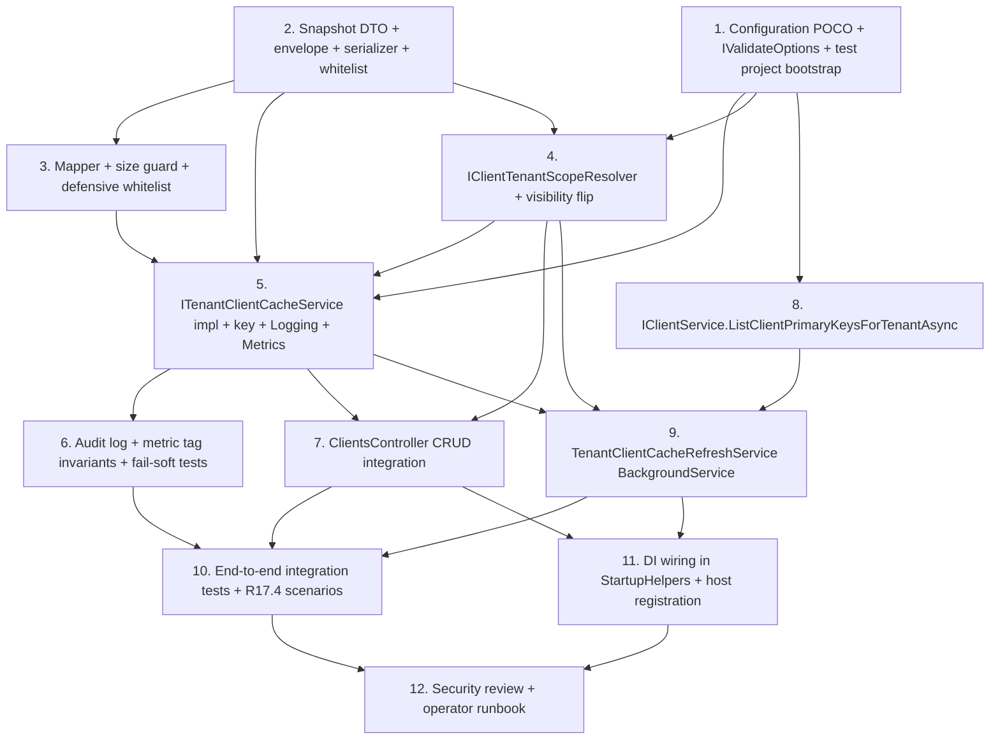

# Implementation Plan: Tenant Client Cache Expansion

Tài liệu này chia thiết kế ở `design.md` thành các task code-only nhỏ, ordered theo risk-based dependency (foundation pure → core service → controller integration → background refresh → e2e tests → wiring/security). Mỗi top-level task tương ứng **1 PR có thể merge độc lập** (code + test cùng PR). Toàn bộ feature giữ guarantee: KHÔNG thêm NuGet package mới, KHÔNG migration EF, KHÔNG thay đổi public HTTP endpoint surface, KHÔNG decorate Duende `IClientStore`, KHÔNG cache `ClientSecrets` / `Claims` / `Properties` / `IdentityProviderRestrictions`, KHÔNG đổi behaviour của legacy `IClientScopeCacheService`.

## Overview

- **Layer boundary** (theo AGENTS.md): UI → Controller → BusinessLogic → EF. Cache service mới đặt trong project `Admin.UI.Api`; mọi truy cập `ClientTenantRedirectUris` đi qua `IClientService` → `IClientRepository`. Controller KHÔNG bypass tier nào.
- **File mới** đặt dưới namespace `Skoruba.Duende.IdentityServer.Admin.UI.Api.Services.TenantClientCache` + `Skoruba.Duende.IdentityServer.Admin.UI.Api.Configuration` (verbatim per file-level change summary cuối design.md).
- **Test project** mới `tests/Skoruba.Duende.IdentityServer.Admin.UI.Api.UnitTests` (chưa tồn tại — sẽ tạo ở Task 1) cho unit + property tests. Integration test mở rộng `tests/Skoruba.Duende.IdentityServer.Admin.UI.Api.IntegrationTests/Tests/TenantClientCache/`.
- **PBT library**: `FsCheck.Xunit 3.0.0` đã có sẵn ở 2 PhoneOtp test projects → sẽ thêm cùng package reference vào project test mới (KHÔNG phải NuGet mới — đã trong solution lockfile). Nếu lock file không cho phép, fallback sang xUnit `[Theory]` với matrix tối thiểu 50 sample/property (xem note Task 11).
- **Cache key contract** (đã chốt ở design.md "Cache key format" section): logical key = `{tenantKey.Trim().ToLowerInvariant()}:clients:{clientId.Trim()}` cho per-client, `{tenantKey}:clients:__list__` cho list (NOT `:list`, để tránh collision với `clientId == "list"`). Runtime Redis prefix `tenant-registry:` được `IDistributedCache` instance prefix tự append; service layer KHÔNG tự prefix.
- **Snapshot envelope** version = `1` (hard-coded phase này; `Version > 1` → `Stale` outcome ở read path).
- **TTL contract**: `AbsoluteExpirationRelativeToNow = AbsoluteTtl` mỗi write; `SlidingExpiration = SlidingTtl` chỉ khi config non-null. Read path KHÔNG mutate TTL.
- **Fail-soft contract**: mọi exception từ `IDistributedCache` được catch trong service layer; controller không try/catch thêm. Một logical operation = một call (no retry, bound bằng `WriteTimeoutMs`).
- **Backward compat**: Controller gọi `IClientScopeCacheService` (legacy) **trước** rồi `ITenantClientCacheService` (new) trong cùng request — order verbatim ở design.md "Coexistence" section. Legacy service untouched.
- **Reference convention**: cấu trúc + metadata footer `_Requirements:` / `_Properties:` mirror `.kiro/specs/phone-otp-multi-account-select/tasks.md`.


## Tasks

- [x] 1. Configuration POCO + IValidateOptions + appsettings sample + test project bootstrap
  - Tạo file mới `src/Skoruba.Duende.IdentityServer.Admin.UI.Api/Configuration/TenantClientCacheOptions.cs` đúng shape Section "TenantClientCacheOptions" design: `public sealed class TenantClientCacheOptions { public const string SectionName = "TenantClientCache"; public bool Enabled = true; public TimeSpan AbsoluteTtl = TimeSpan.FromHours(1); public TimeSpan? SlidingTtl = null; public TimeSpan RefreshInterval = TimeSpan.FromHours(1); public int WriteTimeoutMs = 2000; public int MaxClientsPerTenant = 5000; }`. Default values verbatim Glossary `Tenant_Client_Cache_Options` (R1.2).
  - Tạo file mới `src/Skoruba.Duende.IdentityServer.Admin.UI.Api/Configuration/TenantClientCacheOptionsValidator.cs`: `internal sealed class TenantClientCacheOptionsValidator : IValidateOptions<TenantClientCacheOptions>` implement đủ 4 range guard + 1 cross-field guard (R1.3 `AbsoluteTtl ∈ [00:05:00, 24:00:00]`, R1.4 `SlidingTtl ∈ [00:01:00, AbsoluteTtl]` khi non-null, R1.5 `RefreshInterval ∈ [00:05:00, 24:00:00]`, R1.6 `WriteTimeoutMs ∈ [100, 10000]` AND `MaxClientsPerTenant ∈ [1, 50000]`). Mỗi `ValidateOptionsResult.Fail(...)` MUST nêu đúng config key path AND observed value (R1.3..R1.6). Trả `Success` khi `Enabled == false` (no range check khi disabled).
  - Sửa `src/Skoruba.Duende.IdentityServer.Admin.UI.Api/Helpers/StartupHelpers.cs`: thêm extension method mới `public static IServiceCollection RegisterTenantClientCache(this IServiceCollection services, IConfiguration configuration)` body theo pattern `services.AddOptions<TenantClientCacheOptions>().Bind(configuration.GetSection(TenantClientCacheOptions.SectionName)).ValidateOnStart(); services.AddSingleton<IValidateOptions<TenantClientCacheOptions>, TenantClientCacheOptionsValidator>();`. Phase này mới dừng ở binding + validator; service registration sẽ thêm ở Task 11. Caller (host `Startup.cs` của `Skoruba.Duende.IdentityServer.Admin.UI`) sẽ được wire ở Task 11 — Task 1 KHÔNG sửa host startup.
  - Sửa `src/Skoruba.Duende.IdentityServer.Admin.UI.Api/appsettings.json` (HOẶC appsettings của Admin host gốc nếu file chính nằm ở `src/Skoruba.Duende.IdentityServer.Admin/appsettings.json` — verify trước khi edit): thêm sub-section `"TenantClientCache": { "Enabled": true, "AbsoluteTtl": "01:00:00", "SlidingTtl": null, "RefreshInterval": "01:00:00", "WriteTimeoutMs": 2000, "MaxClientsPerTenant": 5000 }` đúng shape "Configuration sample" design. Defaults match POCO; KHÔNG thay đổi section `TenantInfrastructure` đã có.
  - Tạo project mới `tests/Skoruba.Duende.IdentityServer.Admin.UI.Api.UnitTests/Skoruba.Duende.IdentityServer.Admin.UI.Api.UnitTests.csproj` mirror package set của `Skoruba.Duende.IdentityServer.Admin.UnitTests.csproj` (xunit 2.9.3 + xunit.runner.visualstudio 3.1.5 + Microsoft.NET.Test.Sdk 18.0.1 + FluentAssertions 6.12.1 + Moq 4.20.72 + Microsoft.Extensions.Caching.Memory 10.0.2) AND thêm `<PackageReference Include="FsCheck.Xunit" Version="3.0.0" />` (đã có version đó trong solution lockfile từ PhoneOtp test projects — KHÔNG NuGet mới). ProjectReference: `Skoruba.Duende.IdentityServer.Admin.UI.Api.csproj` + `Skoruba.Duende.IdentityServer.Admin.BusinessLogic.csproj`. Thêm dòng project mới vào `Skoruba.Duende.IdentityServerAdmin.sln`.
  - Tests: `tests/Skoruba.Duende.IdentityServer.Admin.UI.Api.UnitTests/Configuration/TenantClientCacheOptionsValidatorTests.cs` cover `Defaults_AreValid`, `AbsoluteTtl_Below_5min_Fails_NamesKeyAndValue`, `AbsoluteTtl_Above_24h_Fails_NamesKeyAndValue`, `SlidingTtl_Null_Allowed`, `SlidingTtl_Below_1min_Fails`, `SlidingTtl_Greater_Than_AbsoluteTtl_Fails`, `RefreshInterval_OutOfRange_Fails`, `WriteTimeoutMs_OutOfRange_Fails_LowAndHigh`, `MaxClientsPerTenant_OutOfRange_Fails_LowAndHigh`, `Disabled_SkipsRangeChecks_Succeeds`. Mỗi assertion check exception message contain key name (`TenantClientCache:AbsoluteTtl`, etc.) and observed value.
  - _Requirements: 1.1, 1.2, 1.3, 1.4, 1.5, 1.6, 1.7, 1.8, 1.9, 1.10, 17.1_
  - _Properties: P12 (foundation only)_

- [x] 2. Snapshot DTO + envelope + serializer + Public_Safe_Fields whitelist
  - Tạo file mới `src/Skoruba.Duende.IdentityServer.Admin.UI.Api/Services/TenantClientCache/ClientCacheSnapshotDto.cs` chứa `public sealed class ClientCacheSnapshotDto` đúng tập 39 prop verbatim Glossary `Public_Safe_Fields` (R2.1) với `init` setters. KHÔNG thêm field nào ngoài whitelist; KHÔNG có `ClientSecrets`, `Claims`, `Properties`, `IdentityProviderRestrictions`, `Id`, `PairWiseSubjectSalt`, `*Items` view-helper, `AccessTokenTypes`, `RefreshTokenExpirations`, `RefreshTokenUsages`, `ProtocolTypes`, `DPoPValidationModes` (R2.2, R2.9, R15.1, R15.4).
  - Tạo file mới `src/Skoruba.Duende.IdentityServer.Admin.UI.Api/Services/TenantClientCache/ClientCacheSnapshotEnvelope.cs` chứa `public sealed class ClientCacheSnapshotEnvelope { int Version; string TenantKey; string ClientId; DateTime LastWriteUtc; ClientCacheSnapshotDto Data; }` đúng shape Section "Cache shape" design (R2.3).
  - Tạo file mới `src/Skoruba.Duende.IdentityServer.Admin.UI.Api/Services/TenantClientCache/ClientCacheSnapshotSerializer.cs`: `internal static class` exposing `JsonSerializerOptions Options` (camelCase, `WriteIndented = false`, `DefaultIgnoreCondition = Never`, `Converters = { new JsonStringEnumConverter(JsonNamingPolicy.CamelCase) }`) (R2.4, R2.7) AND `static byte[] Serialize(ClientCacheSnapshotEnvelope env)` returning UTF-8 bytes AND `static ClientCacheSnapshotEnvelope? TryDeserialize(byte[] payload, out string? failureReason)` returning null + failureReason ∈ `{"corrupt", null}` khi `JsonException` (R10.4).
  - Tạo file mới `src/Skoruba.Duende.IdentityServer.Admin.UI.Api/Services/TenantClientCache/Cache_Outcome.cs`: `public enum Cache_Outcome { Hit, Miss, Stale, WriteSucceeded, WriteSkippedDisabled, WriteFailedTransient, InvalidateSucceeded, InvalidateFailedTransient }` đúng Glossary.
  - Tests: `tests/Skoruba.Duende.IdentityServer.Admin.UI.Api.UnitTests/TenantClientCache/ClientCacheSnapshotSerializerTests.cs` cover example-based assertions: `Envelope_TopLevel_Keys_Are_Exactly_VersionTenantKeyClientIdLastWriteUtcData`, `EmptyList_Serializes_AsEmptyArray_NotOmitted`, `Payload_Has_No_Whitespace`, `Camel_Case_Property_Names`, `Deserialize_Unknown_Property_Ignored`, `Deserialize_Truncated_Bytes_Returns_Null_With_Corrupt_Reason`, `Version_Greater_Than_1_Deserializes_But_Marked_Stale_By_Caller`. Plus property tests trong same file (`[FsCheck.Xunit.Property(MaxTest = 100)]`):
    - `Property01_WhitelistFields` (P1) — generator sinh `ClientCacheSnapshotDto` arbitrary; assert serialized JSON `data` object có **exact** key set = Public_Safe_Fields camelCase, AND `JsonNode.Parse(payload)["data"]` KHÔNG chứa key match regex `(?i).*secret.*` / `clientSecrets` / `claims` / `properties` / `identityProviderRestrictions` / `pairWiseSubjectSalt` / `id` / `*Items` / `accessTokenTypes` / `refreshTokenExpirations` / `refreshTokenUsages` / `protocolTypes` / `dPoPValidationModes`. (Validates R2.1, R2.2, R2.9, R15.1, R15.4, R17.6.)
    - `Property02_EnvelopeShape` (P2) — assert top-level keys == `{version, tenantKey, clientId, lastWriteUtc, data}`, all camelCase, no whitespace outside string values. (Validates R2.3, R2.4, R2.7.)
    - `Property03_RoundTrip` (P3) — generator sinh full envelope; `TryDeserialize(Serialize(env))` structural equal (Version, TenantKey, ClientId, LastWriteUtc to ms, Data field-by-field including list ordering). MaxTest = 200. (Validates R17.5.)
  - _Requirements: 2.1, 2.2, 2.3, 2.4, 2.7, 2.8, 2.9, 10.4, 15.1, 15.4, 17.5, 17.6_
  - _Properties: P1, P2, P3_

- [x] 3. ClientCacheSnapshotMapper (ClientDto → ClientCacheSnapshotDto) + size guard + defensive whitelist
  - Tạo file mới `src/Skoruba.Duende.IdentityServer.Admin.UI.Api/Services/TenantClientCache/ClientCacheSnapshotMapper.cs`: `internal static class` exposing `static ClientCacheSnapshotDto Map(ClientDto source, DateTime lastWriteUtc)`. Mapping verbatim Section "Mapping ClientDto → ClientCacheSnapshotDto" design — explicit assignment cho từng Public_Safe_Fields entry. KHÔNG đọc `ClientSecrets`, `Claims`, `Properties`, `IdentityProviderRestrictions`, `Id`, `PairWiseSubjectSalt`, view-helper `*Items`, `AccessTokenTypes`, `RefreshTokenExpirations`, `RefreshTokenUsages`, `ProtocolTypes`, `DPoPValidationModes`, `TenantRedirectPairs` raw (R2.2, R15.1).
  - List fields (`RedirectUris`, `PostLogoutRedirectUris`, `AllowedCorsOrigins`, `AllowedGrantTypes`, `AllowedScopes`, `AllowedIdentityTokenSigningAlgorithms`): map từ canonical `IList<string>` của `ClientDto` (KHÔNG từ `*Items`); `null` source → `Array.Empty<string>()`. Boolean / int fields map 1-1; `RefreshTokenExpiration` / `RefreshTokenUsage` cast từ enum sang int (giữ value, KHÔNG dùng SelectList).
  - Defensive whitelist guard (R2.5): expose `static void EnsureNoLeakedSecretField(ClientDto source)` throw `InvalidOperationException` nếu reflection phát hiện thêm property mới trên `ClientDto` whose name matches regex `(?i).*secret.*` AND value non-null AND non-default — message nêu tên field NHƯNG KHÔNG nêu value. Method gọi từ `ClientCacheSnapshotMapper.Map` trước khi construct DTO.
  - Tạo file mới `src/Skoruba.Duende.IdentityServer.Admin.UI.Api/Services/TenantClientCache/ClientCacheSnapshotSizeGuard.cs`: `internal static class` exposing `const int MaxBytes = 256 * 1024;` AND `static bool IsWithinLimit(byte[] payload) => payload.Length <= MaxBytes;` (R2.6, R14.5).
  - Tests (extend `tests/.../UnitTests/TenantClientCache/`): `ClientCacheSnapshotMapperTests.cs` cover `Maps_Public_Safe_Fields_Verbatim` (example-based), `Empty_Source_Lists_Become_Empty_Arrays_Not_Null`, `EnsureNoLeakedSecretField_Throws_When_Reflection_Sees_Future_SecretBearing_Property` (use `DynamicMethod` hoặc subclass test helper để giả lập future refactor), `EnsureNoLeakedSecretField_Throws_Message_Names_Field_Not_Value`. PLUS `ClientCacheSnapshotNoLeakProperties.cs` — generator sinh `ClientDto` với `ClientSecrets = [{Value = "S3CR3T"}]`, `Claims = [...]`, `Properties = [...]`, `IdentityProviderRestrictions = [...]` populated; `Map(...)` then `Serialize(envelope)` then assert UTF-8 string `payload` KHÔNG chứa substring `"S3CR3T"`, KHÔNG chứa key `clientSecrets`, `claims`, `properties`, `identityProviderRestrictions`. `[Property(MaxTest = 100)]`. (Reinforces P1, validates R17.6 negative case.)
  - PLUS size-guard example tests: `SizeGuard_Under_Limit_Allowed`, `SizeGuard_Exact_Limit_Allowed`, `SizeGuard_Over_Limit_Rejected`. Property `[Property(MaxTest = 50)]` `Property_Snapshot_Within_Default_Domains_Stays_Below_256KiB` — generator sinh DTO với realistic value domain (lists ≤ 50 items, strings ≤ 512 chars) → assert `Serialize(env).Length <= 256 * 1024`. (Validates R2.6, R14.5.)
  - _Requirements: 2.2, 2.5, 2.6, 14.5, 15.1, 17.6_
  - _Properties: P1 (negative leak), partial P2/P3_

- [x] 4. IClientTenantScopeResolver + ClientTenantRedirectPairsHelper visibility flip
  - Tạo file mới `src/Skoruba.Duende.IdentityServer.Admin.UI.Api/Services/TenantClientCache/IClientTenantScopeResolver.cs` với 2 overload đúng Section "IClientTenantScopeResolver" design: `Task<IReadOnlyList<string>> ResolveTenantKeysAsync(ClientDto client, CancellationToken ct)` AND `Task<IReadOnlyList<string>> ResolveTenantKeysAsync(int clientPrimaryKey, CancellationToken ct)`. Lifetime `Scoped` (R11.7).
  - Tạo file mới `src/Skoruba.Duende.IdentityServer.Admin.UI.Api/Services/TenantClientCache/ClientTenantScopeResolver.cs`: implement priority chain (Section "Algorithm" Mermaid + R11.2). Priority 1: query `IClientService` cho `ClientTenantRedirectUris` rows liên quan `ClientId` → DISTINCT `TenantKey` → `Trim().ToLowerInvariant()`. Priority 2 (chỉ khi priority 1 zero): parse `client.Properties[skoruba_tenant_redirect_pairs]` JSON qua `ClientTenantRedirectPairsHelper.TryParsePairs(...)` → DISTINCT `TenantKey` → normalize. Priority 3: empty list. Output: distinct case-insensitive, lexicographic ascending, immutable (`IReadOnlyList<string>`) (R11.3, R11.4). KHÔNG throw on empty (R11.5). KHÔNG consume Duende `IClientStore` (R11.6).
  - Sửa `src/Skoruba.Duende.IdentityServer.Admin.BusinessLogic/Helpers/ClientTenantRedirectPairsHelper.cs` (file đã có): flip visibility của `const string PropertyKey = "skoruba_tenant_redirect_pairs"` từ `internal` thành `public`, AND expose method `public static bool TryParsePairs(string? json, out IReadOnlyList<ClientTenantRedirectPair> pairs)` (rename / refactor existing parse logic — giữ nguyên signature internal nếu cần backward, NHƯNG thêm public façade). Quyết định "Open question 2" của design: chọn flip visibility (small surface, tránh duplicate const). Nếu BusinessLogic exposes pair shape qua DTO chứ không phải entity, dùng DTO; nếu `ClientTenantRedirectPair` chỉ entity, expose `public sealed record ClientTenantRedirectPairView(string TenantKey, string SignInRedirectUri, string SignOutRedirectUri)` thay vì leak entity.
  - For Priority 1 query: Background_Refresh sẽ cần batch enumerate. Phase này resolver chỉ truy cập per-client view. Tận dụng `IClientService.GetClientAsync` → `ClientDto.TenantRedirectPairs` đã được populate (verify `ClientService` mapping). Nếu `ClientDto.TenantRedirectPairs` chưa expose từ `IClientService`, mở rộng `ClientDto`/`ClientApiDto` hoặc resolver gọi thêm `IClientService.GetClientTenantRedirectPairsAsync(int id, CancellationToken ct)` mới (small additive surface, KHÔNG đổi existing method signature). Quyết định trong PR review — task bullet này yêu cầu "use whichever surface BusinessLogic already exposes; if absent, add additive method consuming `IClientRepository.ClientTenantRedirectUris.AsNoTracking().Where(x => x.Client.ClientId == clientId).ToListAsync()`".
  - Tests: `tests/.../UnitTests/TenantClientCache/ClientTenantScopeResolverTests.cs` example-based: `Priority1_DbRows_TakesPriority_Over_PropertyJson`, `Priority2_PropertyJson_UsedWhen_DbRows_Empty`, `Priority3_BothEmpty_Returns_Empty`, `Returns_Lowercased_Trimmed_Distinct_LexAsc`, `Malformed_Property_Json_Falls_To_Empty_Not_Throws` (mirror `ClientTenantRedirectResolver` STS behaviour). PLUS `ClientTenantScopeResolverProperties.cs`:
    - `Property06_ResolverDeterminism` (P6) — generator sinh `ClientDto` với combinations of DB rows + property JSON; assert output is normalized lowercase, trimmed, case-insensitively distinct, lexicographic ascending, AND priority chain strict (priority 2 ignored if priority 1 has ≥ 1 row). `[Property(MaxTest = 100)]`. (Validates R11.2, R11.3, R11.4.)
  - PLUS argument validation tests: `Empty_ClientId_Returns_Empty_Not_Throws` (R11.5).
  - _Requirements: 11.1, 11.2, 11.3, 11.4, 11.5, 11.6, 11.7_
  - _Properties: P6_

- [x] 5. ITenantClientCacheService + TenantClientCacheService impl + cache key + LogRedaction + Metrics
  - Tạo file mới `src/Skoruba.Duende.IdentityServer.Admin.UI.Api/Services/TenantClientCache/ITenantClientCacheService.cs` đúng 5 method Section "ITenantClientCacheService" design: `ReadSnapshotAsync`, `WriteSnapshotAsync` (single), `WriteSnapshotsAsync` (batch by tenant set), `InvalidateSnapshotAsync`, `InvalidateSnapshotsAsync`. CancellationToken trên mọi method.
  - Tạo file mới `src/Skoruba.Duende.IdentityServer.Admin.UI.Api/Services/TenantClientCache/TenantClientCacheService.cs`. Lifetime `Singleton`. Dependencies: `IDistributedCache`, `IOptionsMonitor<TenantClientCacheOptions>`, `ILogger<TenantClientCacheService>`, `TenantClientCacheMetrics`, `TimeProvider` (DI default `TimeProvider.System`). Implementation contract:
    - **Cache key**: helper `static string PerClientKey(string tenantKey, string clientId) => $"{tenantKey.Trim().ToLowerInvariant()}:clients:{clientId.Trim()}";` AND `static string PerTenantListKey(string tenantKey) => $"{tenantKey.Trim().ToLowerInvariant()}:clients:__list__";` (Section "Cache key format" design — list suffix `__list__` to avoid `clientId == "list"` collision).
    - **Validation**: input `tenantKey` / `clientId` null/empty/whitespace → throw `ArgumentException` BEFORE touching `IDistributedCache` (R3.3, R3.4). Defensive: `clientId == "__list__"` → `ArgumentException` (per Risks table mitigation).
    - **Write path**: nếu `Options.Enabled == false` → emit Audit_Event `Outcome=WriteSkippedDisabled` Debug, return (R1.7, P12). Else: build `ClientCacheSnapshotEnvelope { Version = 1, TenantKey, ClientId, LastWriteUtc = TimeProvider.GetUtcNow().UtcDateTime, Data = ClientCacheSnapshotMapper.Map(client, lastWriteUtc) }`. Serialize. Size guard: nếu `> 256 KiB` → emit Audit_Event `WriteFailedTransient` subreason `Oversize` Warning, return (no throw, R2.6). Build `DistributedCacheEntryOptions { AbsoluteExpirationRelativeToNow = Options.AbsoluteTtl, SlidingExpiration = Options.SlidingTtl }` (set sliding only when non-null, R9.1..R9.3). Linked CTS với `cts.CancelAfter(WriteTimeoutMs)` (R4.5, R5.4). Call `_cache.SetAsync(PerClientKey(...), payload, options, linkedToken)`. Catch any exception → log Warning `EventType="TenantClientCacheWrite" Outcome=WriteFailedTransient`, increment metric `tenant_client_cache.write.failure`, NO rethrow (R10.1, R10.2). Success → log Information `Outcome=WriteSucceeded`, increment `tenant_client_cache.write.success`. Differentiate `OperationCanceledException when callerToken.IsCancellationRequested` → Debug log, NO failure metric (Section "Cache cancellation" Error Handling).
    - **WriteSnapshotsAsync(batch)**: foreach tenantKey trong batch, call `WriteSnapshotAsync` tuần tự (acceptable per design "≤ 50 tenants per client"); each call self-contained.
    - **Invalidate path**: same shape as Write but call `RemoveAsync` AND remove `clientId` entry from `PerTenantListKey` if list-tracking implemented. Outcome `InvalidateSucceeded` / `InvalidateFailedTransient`. Idempotent (R6.7).
    - **Read path**: deserialize via `ClientCacheSnapshotSerializer.TryDeserialize`; null bytes → `Outcome=Miss`, log Debug; corrupt → `Outcome=Miss` subreason `CorruptPayload`, Debug (R10.4); `envelope.Version > 1` → `Outcome=Stale` subreason `FutureVersion`, Debug, return null (R2.8). Hit → metric `tenant_client_cache.read.hit`, Debug log, return envelope.
  - Tạo file mới `src/Skoruba.Duende.IdentityServer.Admin.UI.Api/Services/TenantClientCache/TenantClientCacheMetrics.cs`: singleton, exposes `Meter("TenantClientCache", "1.0")` + 6 counters (`tenant_client_cache.read.hit`, `read.miss`, `write.success`, `write.failure`, `invalidate.success`, `invalidate.failure`) + 1 histogram (`refresh.sweep.duration_ms`) + 1 observable gauge (`refresh.last_completed_at`, populated bởi BackgroundService Task 8). Tag set hard-coded `{tenantKey, outcome}` only — KHÔNG tag `clientId` (R16.3). Public `Record*` helper methods enforce tag whitelist tại runtime (Throw in DEBUG nếu caller pass extra tag).
  - Tạo file mới `src/Skoruba.Duende.IdentityServer.Admin.UI.Api/Services/TenantClientCache/LogRedaction.cs`: `internal static class` exposing `static string SanitizeExceptionMessage(Exception ex)` truncating `ex.Message` to 256 chars + regex replace `password=...`, `,password=...`, `auth=...` (case-insensitive) → `***` (R13.4). AND `static string? CurrentCorrelationId() => Activity.Current?.TraceId.ToString();` (R13.2).
  - Tests: `tests/.../UnitTests/TenantClientCache/TenantClientCacheServiceTests.cs` (example-based core scenarios from R17.4 sub-list): `Add_Snapshot_Present`, `Update_Snapshot_Replaced`, `Delete_Snapshot_Removed`, `Enabled_False_NoOp_Skips_IDistributedCache_Calls` (verify via `Mock<IDistributedCache>` Verify Times.Never), `Redis_Down_Throws_Service_Swallows_Returns`, `Oversize_Snapshot_Rejected_Audit_Emitted`. PLUS argument validation: `Empty_TenantKey_Throws_ArgumentException_Without_Touching_Cache`, `Empty_ClientId_Throws_ArgumentException_Without_Touching_Cache`, `ClientId_Equals_ListSuffix_Throws_ArgumentException`. PLUS property tests `TenantClientCacheKeyProperties.cs`:
    - `Property04_KeyFormat` (P4) — generator sinh non-empty trimmed `tenantKey` + `clientId`; assert `PerClientKey(tk, cid) == tk.Trim().ToLowerInvariant() + ":clients:" + cid.Trim()` AND key ≠ `tenant:{tk}` AND `tenant:public:names` AND `cid.Trim()` (legacy bare key); `PerTenantListKey(tk) == tk.Trim().ToLowerInvariant() + ":clients:__list__"`. (Validates R3.1, R3.2, R3.5, R3.8, R12.4.) `[Property(MaxTest = 100)]`.
    - `Property05_RejectEmpty` (P5) — generator sinh whitespace strings (`""`, `" "`, `"\t"`, `"\n"`, null) for tenantKey OR clientId; assert `WriteSnapshotAsync` / `ReadSnapshotAsync` / `InvalidateSnapshotAsync` throw `ArgumentException` AND `Mock<IDistributedCache>.Verify(c => c.*Async(...), Times.Never)`. (Validates R3.3, R3.4.)
    - `Property09_IdempotentWrite` (P9) — generator sinh (tenantKey, ClientDto) pair; gọi `WriteSnapshotAsync` n times (n ∈ [1,5]); `IDistributedCache` final `GetAsync` returns bytes byte-equal với `Serialize(env)` của lần cuối (account for `LastWriteUtc` differ — fixate via `FakeTimeProvider`). (Validates R5.5.)
    - `Property11_TtlOptions` (P11) — capture `DistributedCacheEntryOptions` arg via `Mock<IDistributedCache>.Setup(...).Callback`. Assert mỗi write `AbsoluteExpirationRelativeToNow == Options.AbsoluteTtl`. Khi `Options.SlidingTtl != null`, `SlidingExpiration == Options.SlidingTtl`; khi null → `SlidingExpiration == null`. Read path → `_cache.SetAsync` Verify Never. (Validates R5.4, R9.1..R9.5, R9.7.)
    - `Property12_DisabledNoOp` (P12) — flip `Options.Enabled = false`; foreach op (Write, Read, Invalidate, Batch) assert `IDistributedCache` zero invocations AND each emit one log entry `Outcome=WriteSkippedDisabled` at Debug. (Validates R1.7, R1.8.)
  - _Requirements: 1.7, 1.8, 2.6, 3.1, 3.2, 3.3, 3.4, 3.5, 3.7, 3.8, 5.4, 5.5, 6.7, 9.1, 9.2, 9.3, 9.4, 9.5, 9.6, 9.7, 10.1, 10.2, 10.3, 10.4, 12.4_
  - _Properties: P4, P5, P9, P11, P12_

- [x] 6. Audit logging + metric tag invariants + fail-soft boundaries (cross-cutting tests)
  - **No production-code change** in this task — `TenantClientCacheService` đã wire log + metric ở Task 5. Task này thêm property + cross-cutting tests bảo vệ hành vi observability + fail-soft umbrella, AND hardening tweaks nếu test phát hiện gap.
  - Tạo file mới `tests/.../UnitTests/TenantClientCache/Helpers/CapturingLogger.cs` (test infra): `ILoggerProvider` + `ILogger<T>` lưu structured log entries (FormattedLogValues key/value list, log level, exception). Reusable across property tests.
  - Tạo file mới `tests/.../UnitTests/TenantClientCache/Helpers/RecordingMeterListener.cs`: wrap `System.Diagnostics.Metrics.MeterListener` để capture counter increments + histogram measurements + tag set per measurement.
  - Tạo file mới `tests/.../UnitTests/TenantClientCache/Helpers/ThrowingDistributedCache.cs`: wrap `MemoryDistributedCache` để inject exception (ex: `new InvalidOperationException("password=secret123")`) on demand cho fail-soft test (R10).
  - Tests:
    - `TenantClientCacheLoggingProperties.cs` (P14) — generator sinh (op, outcome) tuple; assert exactly 1 log entry / op; structured fields = `{EventType, TenantKey, ClientId, Outcome, DurationMs, SnapshotVersion, CorrelationId}` (CorrelationId nullable); log level matches table (Debug for `Hit`/`Miss`/`WriteSkippedDisabled`, Information for `WriteSucceeded`/`InvalidateSucceeded`/`TenantClientCacheRefreshCompleted`, Warning for `*FailedTransient`); message field KHÔNG chứa snapshot body, `clientSecrets`, raw exception, raw cache key. Assert sanitization: inject `ThrowingDistributedCache.ThrowOnNext(new Exception("connstr=server,password=topsecret,auth=AAA"))` → log message contain `***` thay vì `topsecret`/`AAA`, AND truncated to 256 chars. (Validates R13.1, R13.3, R13.4, R13.5, R13.6, R13.7, R16.1.)
    - `TenantClientCacheMetricsProperties.cs` (P15) — RecordingMeterListener; foreach op trong { Write success, Write failure, Invalidate success, Invalidate failure, Read hit, Read miss }, assert counter increment exactly once với tag set `{tenantKey, outcome}` AND tag dict KHÔNG chứa key `clientId`. (Validates R16.2, R16.3.)
    - `TenantClientCacheFailSoftProperties.cs` (P10) — generator sinh sequence of ops mixed với `ThrowingDistributedCache.NextNCallsThrow(k)`; assert: NO exception propagates from `ITenantClientCacheService.*Async`; for each failed op exactly 1 Audit_Event `Outcome ∈ {WriteFailedTransient, InvalidateFailedTransient}` emitted; underlying `IDistributedCache.*Async` invoked at most once per logical op (no retry). MaxTest = 100. (Validates R10.1, R10.2, R10.3, R10.5.)
  - Nếu test phát hiện gap (vd log message chưa redact, log level sai, metric tag dư), sửa `TenantClientCacheService.cs` / `LogRedaction.cs` / `TenantClientCacheMetrics.cs` trong cùng PR để pass.
  - _Requirements: 10.1, 10.2, 10.3, 10.5, 13.1, 13.2, 13.3, 13.4, 13.5, 13.6, 13.7, 16.1, 16.2, 16.3_
  - _Properties: P10, P14, P15_

- [x] 7. ClientsController integration (Post / Put / Delete / PostClientClone) — write/invalidate per tenant, fail-soft, drift handling
  - Sửa `src/Skoruba.Duende.IdentityServer.Admin.UI.Api/Controllers/ClientsController.cs`. Inject thêm 2 DI dependencies: `ITenantClientCacheService _tenantClientCache`, `IClientTenantScopeResolver _scopeResolver`. Giữ nguyên DI hiện hữu (`IClientService`, `IClientScopeCacheService` legacy, etc.). Order operation trong mỗi action method **verbatim** Section "Backward Compatibility — Coexistence" design:
    1. `await _clientService.<Add|Update|Remove|Clone>ClientAsync(...)` (existing call, source of truth).
    2. `await _clientScopeCacheService.<Save|Remove>AllowedScopesAsync(...)` (legacy, untouched, R12.2).
    3. `var fresh = await _clientService.GetClientAsync(id);` re-read cho fresh `TenantRedirectPairs` (Section "Detail Add path" design).
    4. `var tenantKeys = await _scopeResolver.ResolveTenantKeysAsync(fresh, HttpContext.RequestAborted);`
    5. `await _tenantClientCache.<Write|Invalidate>SnapshotsAsync(tenantKeys, fresh|clientId, HttpContext.RequestAborted);`
    6. `return <HTTP status>;`
  - **Post (R4)**: sau `AddClientAsync` thành công AND `id != 0`, follow steps 2..5; nếu `tenantKeys` empty → skip cache write nhưng vẫn return 201 (R4.2, R3.7). Audit event `WriteSkippedDisabled` subreason `NoTenantScope` đã emit từ `WriteSnapshotsAsync` khi list empty.
  - **Put (R5)**: BEFORE step 1, capture `var preUpdate = await _clientService.GetClientAsync(id); var preTenantKeys = await _scopeResolver.ResolveTenantKeysAsync(preUpdate, ct); var preClientId = preUpdate.ClientId;`. AFTER step 1 + step 3, compute drift:
    - `var rename = !string.Equals(preClientId, fresh.ClientId, StringComparison.Ordinal);` (R5.7)
    - `var drift = preTenantKeys.Except(tenantKeys, StringComparer.OrdinalIgnoreCase).ToList();` (R5.2)
    - Khi `rename`: `var invalidateClientId = preClientId; var invalidateTenantKeys = preTenantKeys.Union(tenantKeys, StringComparer.OrdinalIgnoreCase);` invalidate `(invalidateTenantKeys × invalidateClientId)` THEN write `(tenantKeys × fresh.ClientId)`.
    - Else: invalidate `drift × preClientId`, then write `tenantKeys × fresh.ClientId`. Return 204.
  - **Delete (R6)**: BEFORE step 1, capture `var preDelete = await _clientService.GetClientAsync(id); var tenantKeys = await _scopeResolver.ResolveTenantKeysAsync(preDelete, ct); var clientId = preDelete.ClientId;`. AFTER step 1 + step 2 (legacy `RemoveAllowedScopesAsync`), call `_tenantClientCache.InvalidateSnapshotsAsync(tenantKeys, clientId, ct)`. Return 204.
  - **PostClientClone (R7)**: AFTER `CloneClientAsync` thành công AND `cloneId != 0`, steps 3..5 against the cloned client view. KHÔNG invalidate source client snapshots (R7.2). Return 201.
  - Cancellation: tất cả cache call pass `HttpContext.RequestAborted` (R4.9, R5.8, R6.6, R7.5).
  - Fail-soft tại controller: KHÔNG `try/catch` quanh cache call (service đã catch internal); nếu có any unexpected exception escape (programmer error), Generic ASP.NET handler returns 500 — accept this (cache service contract bảo đảm KHÔNG escape exception).
  - Logging: KHÔNG log snapshot body trong controller (R4.8). Cache service đã emit Audit_Event.
  - Tests: `tests/.../UnitTests/TenantClientCache/ClientsControllerCacheIntegrationTests.cs` example-based:
    - `Post_NewClient_TenantScoped_WritesSnapshotPerTenant_Returns201` (verify `Mock<ITenantClientCacheService>.Verify(s => s.WriteSnapshotsAsync(expectedKeys, ...), Times.Once)`).
    - `Post_NewClient_NoTenantScope_SkipsCacheWrite_StillReturns201` (R4.2).
    - `Put_TenantSetUnchanged_WritesPerTenantOnly_NoInvalidate` (R5.1).
    - `Put_TenantAdded_WritesNewTenant_NoInvalidate`.
    - `Put_TenantRemoved_InvalidatesDriftTenant_WritesRemainingTenants` (R5.2).
    - `Put_RenameClientId_InvalidatesAllOldTenantKeys_WritesNewTenantKeys` (R5.7).
    - `Delete_InvalidatesAllPreDeleteTenants_Returns204` (R6.1, R6.2).
    - `Clone_WritesNewClientSnapshots_DoesNotInvalidateSource_Returns201` (R7.1, R7.2).
    - `Clone_ZeroTenantClone_SkipsWrite_StillReturns201` (R7.3).
    - `RedisDown_AllCrudReturnSuccessHttp_LogsWriteFailedTransient` (use `ThrowingDistributedCache`; assert HTTP 201/204 still).
    - `LegacyClientScopeCacheService_StillCalled_BeforeNewCacheService` (R12.2; `Mock` verify call sequence).
    - `RequestAborted_PassedAsCancellationToken_To_CacheService` (R4.9, R5.8, R6.6, R7.5).
  - PLUS property test `tests/.../UnitTests/TenantClientCache/ClientsControllerCacheIntegrationProperties.cs`:
    - `Property07_MultiTenantBatchAndDrift` (P7) — generator sinh op ∈ {Add, Update, Clone}, pre-state tenant set `pre`, post-state tenant set `post`, optional rename. Drive controller (with mocked `IClientService` returning canned `ClientDto` per call) → assert post-cache-state per spec (R3.6, R4.1, R5.1, R5.2, R5.7, R7.1, R7.2). MaxTest = 100.
    - `Property08_CrudInvalidatePerTuple` (P8) — generator sinh Delete op against pre-set `pre`; assert all `(t, clientId)` keys absent post-op AND list key removed entry. (Validates R6.1, R6.2.)
    - `Property13_LegacyCoexistence` (P13) — generator sinh CRUD op; assert `IClientScopeCacheService.<Save|Remove>AllowedScopesAsync` invoked exactly once với same `(clientId, allowedScopes)` args; assert `ITenantClientCacheService.ReadSnapshotAsync` KHÔNG fall back to legacy bare-clientId key on miss. (Validates R4.7, R5.6, R6.5, R12.2, R12.6.)
  - _Requirements: 3.6, 3.7, 4.1, 4.2, 4.3, 4.4, 4.5, 4.6, 4.7, 4.8, 4.9, 5.1, 5.2, 5.3, 5.4, 5.5, 5.6, 5.7, 5.8, 6.1, 6.2, 6.3, 6.4, 6.5, 6.6, 6.7, 7.1, 7.2, 7.3, 7.4, 7.5, 12.1, 12.2, 12.3, 12.5, 12.6_
  - _Properties: P7, P8, P13_

- [x] 8. IClientService.ListClientPrimaryKeysForTenantAsync + IClientRepository batch query (BusinessLogic + EF tier)
  - Sửa `src/Skoruba.Duende.IdentityServer.Admin.EntityFramework/Repositories/Interfaces/IClientRepository.cs` (project Admin.EntityFramework Identity / Configuration — verify đúng project chứa interface trước edit): thêm method mới `Task<IReadOnlyList<int>> GetClientIdsByTenantAsync(string tenantKey, int max, CancellationToken cancellationToken);` (additive, KHÔNG đổi method cũ).
  - Sửa `src/Skoruba.Duende.IdentityServer.Admin.EntityFramework/Repositories/ClientRepository.cs`: implement method mới đúng pattern Section "Background_Refresh: tenant→clients enumeration" design:
    1. `var normalized = tenantKey.Trim();` (giữ original case cho DB compare; column `TenantKey` đã được normalize ở insert path).
    2. Priority 1: `var fromMapping = await DbContext.ClientTenantRedirectUris.AsNoTracking().Where(x => x.TenantKey == normalized).Select(x => x.Client.Id).Distinct().OrderBy(id => id).Take(max + 1).ToListAsync(cancellationToken);`
    3. Nếu `fromMapping.Count > 0` → return as `IReadOnlyList<int>` (capped at `max`; if `> max`, caller logs `MaxClientsPerTenantExceeded` per R8.4).
    4. Priority 2 (fallback, only when priority 1 empty): query `DbContext.Clients.AsNoTracking().Where(c => c.Properties.Any(p => p.Key == ClientTenantRedirectPairsHelper.PropertyKey)).Select(c => new { c.Id, Pairs = c.Properties.First(p => p.Key == ClientTenantRedirectPairsHelper.PropertyKey).Value }).ToListAsync(...)` → in-memory parse JSON via `ClientTenantRedirectPairsHelper.TryParsePairs` → filter pair.TenantKey matching normalized → distinct ids → cap at `max + 1`. Acceptable since legacy fallback path expected rare.
  - Sửa `src/Skoruba.Duende.IdentityServer.Admin.BusinessLogic/Services/Interfaces/IClientService.cs`: thêm method `Task<IReadOnlyList<int>> ListClientPrimaryKeysForTenantAsync(string tenantKey, int max, CancellationToken cancellationToken);`. Verify thêm member ở interface gốc (nếu interface là `IClientService` chung của Admin.BusinessLogic — file đã exist).
  - Sửa `src/Skoruba.Duende.IdentityServer.Admin.BusinessLogic/Services/ClientService.cs`: implement passthrough `=> _clientRepository.GetClientIdsByTenantAsync(tenantKey, max, ct);`. KHÔNG đổi method cũ (R12 hard rule).
  - Argument validation: `tenantKey` null/empty/whitespace → `ArgumentException`; `max <= 0` → `ArgumentOutOfRangeException`. Pass these guards through both tiers.
  - Tests: `tests/Skoruba.Duende.IdentityServer.Admin.UnitTests/Services/ClientServiceListClientPrimaryKeysForTenantTests.cs` (project đã có sẵn, không phải project mới):
    - `EmptyTenantKey_Throws_ArgumentException`.
    - `MaxLessOrEqualZero_Throws_ArgumentOutOfRangeException`.
    - `Priority1_Mapping_Returns_DistinctIds_OrderedAsc_CappedAtMax` (in-memory `DbContext` seed via `Microsoft.EntityFrameworkCore.InMemory`, đã có ref).
    - `Priority2_Property_Fallback_Used_When_Mapping_Empty`.
    - `Both_Empty_Returns_EmptyList`.
    - `Mapping_Has_Plus_One_Element_Caller_Detects_Overflow` (verify return list size `max + 1` so caller can detect).
  - _Requirements: 8.3, 8.4, 11.6_
  - _Properties: P16 (foundation only)_

- [x] 9. TenantClientCacheRefreshService (BackgroundService) + sweep + last_completed_at gauge
  - Tạo file mới `src/Skoruba.Duende.IdentityServer.Admin.UI.Api/Services/TenantClientCache/TenantClientCacheRefreshService.cs`. `internal sealed class TenantClientCacheRefreshService : BackgroundService`. Constructor injects `IServiceScopeFactory _scopeFactory`, `IOptionsMonitor<TenantClientCacheOptions> _options`, `ILogger<TenantClientCacheRefreshService> _logger`, `ITenantClientCacheService _cache` (singleton, captured), `TenantClientCacheMetrics _metrics`, `TimeProvider _time`. Mirror lifecycle pattern của `TenantInfrastructure.TenantRegistryCacheRefreshService` (KHÔNG kế thừa nó — class mới đứng độc lập, R8.8, R8.9).
  - `ExecuteAsync(stoppingToken)` body verbatim Section "TenantClientCacheRefreshService" design:
    1. If `_options.CurrentValue.Enabled == false` → return immediately (R1.8, R8.1).
    2. Log Information once: `EventType="TenantClientCacheRefreshServiceStarted"` + bound options values + resolved `IDistributedCache` impl type (R1.10).
    3. `await SweepAsync(stoppingToken);` (immediate startup sweep, R8.2).
    4. Loop: `await Task.Delay(_options.CurrentValue.RefreshInterval, stoppingToken)` (catch `OperationCanceledException` to break); then `await SweepAsync(stoppingToken);`.
  - `SweepAsync(CancellationToken ct)` body:
    1. `var sw = Stopwatch.StartNew();`
    2. `using var scope = _scopeFactory.CreateScope();`
    3. `var tenantRepo = scope.ServiceProvider.GetRequiredService<ITenantRepository>();`
    4. `var clientService = scope.ServiceProvider.GetRequiredService<IClientService>();`
    5. `var resolver = scope.ServiceProvider.GetRequiredService<IClientTenantScopeResolver>();`
    6. `var tenants = await tenantRepo.GetTenantsAsync(filter: null, ct);`
    7. Foreach tenant (only `IsActive`): try-catch wrap (Redis/DB exception swallow per tenant, R8.5, R10.6).
        - `var ids = await clientService.ListClientPrimaryKeysForTenantAsync(tenant.TenantKey, _options.CurrentValue.MaxClientsPerTenant, ct);`
        - Nếu `ids.Count > _options.CurrentValue.MaxClientsPerTenant` → log Warning `EventType="TenantClientCacheRefresh" Outcome=WriteSkippedDisabled` subreason `MaxClientsPerTenantExceeded` + observed count + cap; truncate to `Take(MaxClientsPerTenant)` (R8.4).
        - Foreach `id`: `var client = await clientService.GetClientAsync(id);` (try-catch DB error → log Warning `Outcome=WriteFailedTransient`, KHÔNG ghi partial / null snapshot, continue next, R15.5); `var tenantKeys = await resolver.ResolveTenantKeysAsync(client, ct);`; chỉ write nếu `tenant.TenantKey ∈ tenantKeys` (skip drift); `await _cache.WriteSnapshotAsync(tenant.TenantKey, client, ct);` (cache service tự catch failure).
    8. Log Information sweep summary `EventType="TenantClientCacheRefreshCompleted" TenantsSwept=<n> ClientsWritten=<m> WriteFailures=<k> DurationMs=<sw.ElapsedMilliseconds>` (R8.6, R13.7).
    9. Update `_metrics.LastSweepCompletedAtUnixSeconds = _time.GetUtcNow().ToUnixTimeSeconds();` (R16.4).
    10. Performance budget check: nếu `sw.Elapsed > _options.CurrentValue.RefreshInterval / 2` → log Warning subreason `RefreshSweepTooLong` (R14.4).
    11. Outer try/catch in `ExecuteAsync` ensures BackgroundService never propagates exception out (host stability).
  - Tests: `tests/.../UnitTests/TenantClientCache/TenantClientCacheRefreshServiceTests.cs` example-based:
    - `Disabled_Service_ReturnsImmediately_NoSweep`.
    - `Enabled_True_RegisteredAndImmediateSweepRuns_BeforeFirstDelay` (use `FakeTimeProvider`).
    - `RefreshInterval_DrivesPeriodicSweep`.
    - `RedisException_PerTenant_Logged_DoesNotCrashSweep_NextTenantStillProcessed` (R8.5).
    - `MaxClientsPerTenant_Exceeded_LogsWarning_TruncatesToCap` (R8.4).
    - `Cancellation_StoppingToken_ExitsSweepCleanly_WithinWriteTimeoutMs` (R8.7).
    - `DbError_LoadingClient_DoesNotWrite_PartialSnapshot` (R15.5).
    - `Sweep_LastCompletedAt_Gauge_Updated` (R16.4).
    - `Sweep_TooLong_Logs_RefreshSweepTooLong_Warning` (R14.4).
  - PLUS property test `tests/.../UnitTests/TenantClientCache/TenantClientCacheRefreshServiceProperties.cs`:
    - `Property16_SweepCoverage` (P16) — generator sinh fake tenant directory + per-tenant client list (size ≤ `MaxClientsPerTenant`); after one sweep, foreach `(t, c)` resolving to set containing `t`, key `t:clients:{c.ClientId}` present with fresh snapshot. Use `MemoryDistributedCache` + fake `ITenantRepository` + fake `IClientService`. `[Property(MaxTest = 100)]`. (Validates R8.3.)
  - _Requirements: 1.10, 8.1, 8.2, 8.3, 8.4, 8.5, 8.6, 8.7, 8.8, 8.9, 14.4, 15.5, 16.4_
  - _Properties: P16_

- [x] 10. End-to-end integration tests + R17.4 mandatory scenarios
  - Tạo folder mới `tests/Skoruba.Duende.IdentityServer.Admin.UI.Api.IntegrationTests/Tests/TenantClientCache/`. Reuse existing `WebApplicationFactory` setup (under `Tests/Base/`); extend với config overlay `TenantClientCache: { ... }` + override `IDistributedCache` registration to `MemoryDistributedCache` (no live Redis required).
  - Tests:
    - `TenantClientCacheCrudIntegrationTests.AddClient_PersistsSnapshotPerTenant` — POST `/api/Clients` → assert Redis (memory) chứa entry `{tenantKey}:clients:{clientId}` cho mỗi tenant resolved; envelope deserialize equal expected fields. (R17.4 case (a).)
    - `UpdateClient_ReplacesSnapshot_FreshLastWriteUtc` — PUT → snapshot replaced; `LastWriteUtc > previous.LastWriteUtc`. (R17.4 case (b).)
    - `DeleteClient_RemovesSnapshot_PerTenant` — DELETE → `IDistributedCache.GetAsync` returns null. (R17.4 case (c).)
    - `CloneClient_NewSnapshot_SourceIntact` — POST `/api/Clients/Clone` → assert clone snapshot present; source snapshot unchanged byte-for-byte. (R17.4 case (d).)
    - `RedisDown_Crud_ReturnsSuccessHttp_AuditEventEmitted` — register `ThrowingDistributedCache` (always-throw); POST/PUT/DELETE return 201/204; capturing logger contains 1 `WriteFailedTransient` per op. (R17.4 case (e).)
    - `OversizeSnapshot_Rejected_AuditEmitted_HttpStillSuccess` — seed `ClientDto` with massive `RedirectUris` list (10 000 entries) → POST returns 201; audit `WriteFailedTransient` subreason `Oversize`. (R17.4 case (f).)
    - `Enabled_False_AllOps_NoOp` — config overlay `TenantClientCache:Enabled=false` → POST/PUT/DELETE return success; `MemoryDistributedCache` empty; logger contains `WriteSkippedDisabled` per op. (R17.4 case (g).)
    - `LegacyClientScopeCacheService_StillWorks_Independently` — bare `clientId.Trim()` key still set/removed by legacy service; new tenant-scoped key independent. (R12.1, R12.2, R12.3.)
    - `BackgroundRefresh_E2E_FreshSnapshotsAfterStartup` — start host with seeded tenant + clients in DB; await first sweep; assert all `(tenant, client)` snapshots present. (R8.2, R8.3.)
    - `BackgroundRefresh_RedisDown_DoesNotCrashHost` — overlay throwing cache; sweep still emits Warning + completes; host remains responsive. (R10.6.)
    - `Performance_Read_P99_Under_5ms_InMemoryCache` — benchmark loop 1000 iterations against `MemoryDistributedCache`; assert p99 read ≤ 5 ms. (R14.1.)
    - `Performance_Write_P99_Under_25ms_InMemoryCache` — same shape; p99 write ≤ 25 ms. (R14.2.)
    - `Performance_BackgroundSweep_1000Tenants_50Clients_Under_HalfRefreshInterval` — synthetic `ITenantRepository` returning 1 000 tenants × 50 clients; assert sweep wall-clock < `RefreshInterval / 2`. (R14.4.)
  - KHÔNG live Redis; tests dùng `MemoryDistributedCache` (R17.1) + `ThrowingDistributedCache` decorator (Task 6 helper, copy-reference into integration test project nếu cần — ưu tiên move helper to shared `tests/Common/` rồi reference từ cả unit + integration project).
  - _Requirements: 8.2, 8.3, 10.6, 12.1, 12.2, 12.3, 14.1, 14.2, 14.4, 17.1, 17.2, 17.3, 17.4_
  - _Properties: P7, P8, P10, P12, P13, P16 (E2E coverage)_

- [x] 11. DI wiring in StartupHelpers + host registration + appsettings.Development.json
  - Sửa `src/Skoruba.Duende.IdentityServer.Admin.UI.Api/Helpers/StartupHelpers.cs` `RegisterTenantClientCache` extension (đã add Task 1 với options binding only): mở rộng để register full service set:
    1. `services.AddSingleton<TenantClientCacheMetrics>();`
    2. `services.AddSingleton<ITenantClientCacheService, TenantClientCacheService>();`
    3. `services.AddScoped<IClientTenantScopeResolver, ClientTenantScopeResolver>();`
    4. Conditional hosted service: read bound options (via `services.BuildServiceProvider()` chỉ một lần ở method này — tránh anti-pattern bằng cách dùng `Configuration.GetSection(SectionName).Get<TenantClientCacheOptions>()` trực tiếp trong extension method, KHÔNG build provider). If `Enabled == true` → `services.AddHostedService<TenantClientCacheRefreshService>();` (R1.8, R8.1).
  - Sửa host startup nơi `RegisterTenantClientCache` cần được gọi: file `src/Skoruba.Duende.IdentityServer.Admin.UI.Api/Helpers/StartupHelpers.cs` (đã edit) + caller site. Verify caller — likely `src/Skoruba.Duende.IdentityServer.Admin.UI/Helpers/StartupHelpers.cs` `AddAdminUIApiAndDependencies` extension, OR `src/Skoruba.Duende.IdentityServer.Admin/Startup.cs`. Insert call `services.RegisterTenantClientCache(Configuration);` sau dòng `services.AddTenantInfrastructure(Configuration)` để guarantee `IDistributedCache` đã wire. KHÔNG đụng các registration khác (legacy `IClientScopeCacheService` etc.).
  - Sửa `src/Skoruba.Duende.IdentityServer.Admin/appsettings.Development.json` (nếu file tồn tại): đảm bảo có `"TenantClientCache": { "Enabled": true, "AbsoluteTtl": "01:00:00", "RefreshInterval": "01:00:00", "WriteTimeoutMs": 2000, "MaxClientsPerTenant": 5000 }` cho dev environment. Production overrides via env var `TenantClientCache__Enabled=true|false` per operator policy. KHÔNG đổi `TenantInfrastructure` section đã có.
  - Sửa `src/Skoruba.Duende.IdentityServer.Admin.UI.Api/appsettings.json` (đã add ở Task 1): xác nhận `Enabled = true` default — operator có thể off qua env var `TenantClientCache__Enabled=false`.
  - Tests: `tests/.../UnitTests/TenantClientCache/StartupHelpersRegisterTenantClientCacheTests.cs` — build a `ServiceCollection`, call `RegisterTenantClientCache(configuration)`, assert:
    - `IServiceProvider.GetRequiredService<IOptions<TenantClientCacheOptions>>()` returns bound options.
    - `IServiceProvider.GetRequiredService<ITenantClientCacheService>()` non-null.
    - `IServiceProvider.GetRequiredService<IClientTenantScopeResolver>()` non-null (scoped resolution).
    - `IServiceProvider.GetServices<IHostedService>().OfType<TenantClientCacheRefreshService>()` count = 1 when `Enabled=true`, count = 0 when `Enabled=false`.
    - `ValidateOnStart` triggers fail-fast khi config invalid (range overflow scenarios).
  - PLUS integration test `tests/.../IntegrationTests/Tests/TenantClientCache/HostStartupSmokeTests.cs`: `Host_Starts_Successfully_With_TenantClientCache_Enabled_True_Default_Config` (R1.10 single Information log entry on startup containing bound options + resolved cache impl type — assert capturing logger contains expected event).
  - _Requirements: 1.1, 1.7, 1.8, 1.10, 8.1, 17.1_
  - _Properties: (wiring only — tied behaviors covered by P10–P16 in Tasks 5–10)_

- [x] 12. Security review checkpoint + operator runbook
  - Tạo file mới `docs/tenant-client-cache.md` (hoặc append section vào README hiện hữu của Admin host nếu repo convention dùng Wiki/README). Nội dung tối thiểu:
    - **Overview**: What `TenantClientCache` is (public-safe per-tenant snapshot of Duende Client config in Redis), what is NOT cached (`ClientSecrets`, `Claims`, `Properties`, `IdentityProviderRestrictions`, `Id`, `PairWiseSubjectSalt`).
    - **Configuration**: 6 keys (`Enabled`, `AbsoluteTtl`, `SlidingTtl`, `RefreshInterval`, `WriteTimeoutMs`, `MaxClientsPerTenant`) + valid ranges + defaults verbatim từ `TenantClientCacheOptions`.
    - **Rollout checklist**: (1) merge với `Enabled=false` default in production appsettings; (2) enable via env var `TenantClientCache__Enabled=true` in dev; (3) smoke test `POST /api/Clients` then `GET` Redis key `tenant-registry:{tenantKey}:clients:{clientId}` → expect envelope JSON; (4) enable in staging, observe 1 sweep cycle; (5) enable in prod after 1 week observability.
    - **Telemetry**: structured Serilog events (`TenantClientCacheRead`, `TenantClientCacheWrite`, `TenantClientCacheInvalidate`, `TenantClientCacheRefresh`, `TenantClientCacheRefreshCompleted`) — fields: `TenantKey`, `ClientId`, `Outcome`, `DurationMs`, `SnapshotVersion`, `CorrelationId`. Log levels (Information for success, Warning for `*FailedTransient`, Debug for `WriteSkippedDisabled` / `Hit` / `Miss`).
    - **Metrics**: 6 counters + 1 histogram + 1 gauge với tag set `{tenantKey, outcome}` only.
    - **Risk notes** (verbatim Section "Risks and Mitigations" design): Redis down adds `WriteTimeoutMs × |tenantKeys|` per request (≤ 2 s × 50 = 100 s worst case — mitigated by `MaxClientsPerTenant` cap and Background_Refresh self-heal). Snapshot drift window ≤ `RefreshInterval`. Reserved tenant key `public` collision risk (operational policy excludes). `clientId == "__list__"` defensive validation in service layer.
    - **Failure modes**: Redis outage = fail-soft (no HTTP failure); JSON parse error = `Outcome=Miss subreason=CorruptPayload`; `Version > 1` = `Stale` (forward compat).
  - Security review checklist verification — append to runbook a checkbox list mirror Section "Security Review Checkpoint" design (10 items). Each item points to test that proves it (P1, P14, etc.). Reviewer signs after `dotnet test` passes for all 11 prior tasks.
  - Verify NO live Redis credential, secret, or JWT in any test fixture / appsettings file. Run `git diff main..HEAD -- '*.json' '*.cs' '*.md' | grep -iE 'password|secret|connectionstring|api[_-]?key'` to spot accidentally committed credentials. KHÔNG log secret in tests (use placeholder "REDACTED").
  - Verify NO new NuGet package: `git diff main..HEAD -- '**/*.csproj' | grep '<PackageReference Include='` shows only `FsCheck.Xunit` 3.0.0 (already in solution lockfile from PhoneOtp test projects, NOT new) AND existing standard test packages (xunit, FluentAssertions, Moq, etc.). If git diff shows any other PackageReference addition, refactor to remove.
  - Verify NO EF migration: `git diff main..HEAD -- '**/Migrations/**' '**/*.Designer.cs' '**/*ModelSnapshot.cs'` returns empty.
  - Verify NO Duende `IClientStore` decoration: `git grep -nE 'IClientStore|FindClientByIdAsync' src/` shows ZERO new references in feature diff.
  - Tests: KHÔNG test mới (chỉ documentation + grep-based spot checks executed in PR review). However include 1 new test `tests/.../UnitTests/TenantClientCache/SecurityRegressionTests.cs` cover negative assertions:
    - `Mapper_Reflection_Surface_Excludes_All_Forbidden_Field_Names` — reflect on `ClientCacheSnapshotDto` properties; assert NO property name matches forbidden regex set.
    - `No_Public_Endpoint_Exposes_Snapshot` — scan `ClientsController` reflection; assert no action method returns `ClientCacheSnapshotDto` / `ClientCacheSnapshotEnvelope` (R15.3).
  - _Requirements: 1.1, 12.1, 12.5, 13.1, 13.7, 15.1, 15.2, 15.3, 15.4, 15.5, 17.4_
  - _Properties: (audit / security gates only — covered by P1, P14 in Tasks 2–6)_

## Notes

- Mỗi top-level task = 1 PR có thể merge độc lập, code + test trong cùng PR (single commit chain).
- Mỗi PR phải pass: `dotnet build` (toàn solution) + `dotnet test tests/Skoruba.Duende.IdentityServer.Admin.UI.Api.UnitTests/` + (Task 10 trở đi) `dotnet test tests/Skoruba.Duende.IdentityServer.Admin.UI.Api.IntegrationTests/`. Task 8 cũng chạm `Skoruba.Duende.IdentityServer.Admin.UnitTests` (tier BusinessLogic + EF) → chạy thêm `dotnet test tests/Skoruba.Duende.IdentityServer.Admin.UnitTests/`.
- AGENTS.md hard rules: KHÔNG bypass layer (Controller → BusinessLogic → EF; cache service inject `IClientService` ở Background_Refresh, KHÔNG inject `DbContext`); Controller chỉ inject `IClientService` + `IClientScopeCacheService` + `ITenantClientCacheService` + `IClientTenantScopeResolver`, KHÔNG `IDistributedCache` trực tiếp.
- PBT library: `FsCheck.Xunit 3.0.0` (đã có trong solution lockfile từ PhoneOtp test projects — KHÔNG NuGet mới). Mỗi property test annotate `// Feature: tenant-client-cache-expansion, Property N: <Title>` + `[FsCheck.Xunit.Property(MaxTest = 100)]` (200 cho P3 round-trip).
- Test fixtures (`MemoryDistributedCache` + `ThrowingDistributedCache` + `CapturingLogger` + `RecordingMeterListener`) đặt trong `tests/Skoruba.Duende.IdentityServer.Admin.UI.Api.UnitTests/TenantClientCache/Helpers/`. Integration test reference cùng helpers (cân nhắc move to `tests/Common/` shared project nếu cần).
- 16 properties (P1..P16) phân bổ:
  - Task 2: P1, P2, P3 (envelope + serializer + whitelist)
  - Task 3: P1 negative (mapper leak guard)
  - Task 4: P6 (resolver determinism)
  - Task 5: P4, P5, P9, P11, P12 (key format, empty input, idempotent, TTL, disabled)
  - Task 6: P10, P14, P15 (fail-soft, log redaction, metric tags)
  - Task 7: P7, P8, P13 (multi-tenant batch + drift, CRUD invalidate, legacy coexistence)
  - Task 9: P16 (background sweep coverage)
  - Task 10: E2E coverage of all properties (integration plane)
- Test-related sub-tasks KHÔNG được mark optional với "*" — feature có high security stakes (cache không leak secret); test-coverage là bắt buộc per PR (R17 mandatory).

## Task Dependency Graph

Sơ đồ phụ thuộc — `A --> B` nghĩa là B yêu cầu A merge trước. Cùng wave có thể thực hiện song song.



Wave breakdown (risk-based ordering):

- **Wave 0 (foundation pure, no I/O)**: Task 1 (config) + Task 2 (DTO + serializer) — independent; both must merge before downstream.
- **Wave 1 (foundation + resolver)**: Task 3 (mapper + size guard, depends on T2) + Task 4 (resolver, depends on T1+T2) + Task 8 (BusinessLogic + EF tier query, depends on T1) — three independent sub-trees executed in parallel.
- **Wave 2 (core service)**: Task 5 (cache service + key + logging + metrics, depends on T1+T2+T3+T4).
- **Wave 3 (cross-cutting hardening)**: Task 6 (audit + metric + fail-soft cross-cutting tests, depends on T5).
- **Wave 4 (integration + background)**: Task 7 (controller CRUD, depends on T4+T5) + Task 9 (BackgroundService, depends on T4+T5+T8) — parallelizable.
- **Wave 5 (E2E coverage)**: Task 10 (depends on T6+T7+T9).
- **Wave 6 (wiring)**: Task 11 (depends on T7+T9).
- **Wave 7 (review + runbook)**: Task 12 (depends on T10+T11).

```json
{
  "waves": [
    { "id": 0, "tasks": ["1", "2"] },
    { "id": 1, "tasks": ["3", "4", "8"] },
    { "id": 2, "tasks": ["5"] },
    { "id": 3, "tasks": ["6"] },
    { "id": 4, "tasks": ["7", "9"] },
    { "id": 5, "tasks": ["10"] },
    { "id": 6, "tasks": ["11"] },
    { "id": 7, "tasks": ["12"] }
  ]
}
```

