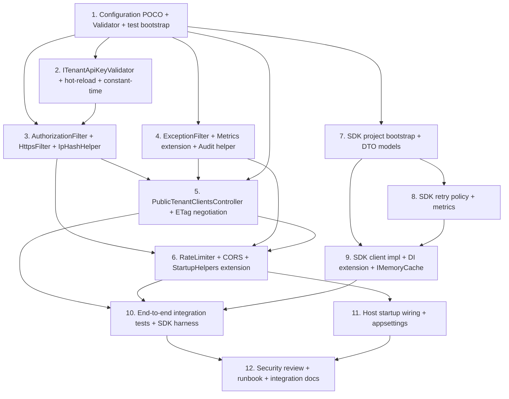

# Implementation Plan: Tenant Client Cache Public Read

Tài liệu này chia thiết kế ở `design.md` thành các task code-only ordered theo risk-based dependency (foundation pure → validator/filter → controller integration → SDK → wiring + E2E → security/runbook). Mỗi top-level task tương ứng **1 PR có thể merge độc lập** (code + test cùng PR). Feature kế thừa toàn bộ constraint từ parent spec `tenant-client-cache-expansion`: KHÔNG thêm NuGet package mới (mọi `PackageReference` phải đã có trong `Directory.Packages.props` hoặc transitive set), KHÔNG migration EF, KHÔNG đổi public HTTP endpoint surface hiện hữu, KHÔNG decorate Duende `IClientStore`, KHÔNG cache `ClientSecrets` / `Claims` / `Properties` / `IdentityProviderRestrictions`, KHÔNG đổi behaviour của legacy `IClientScopeCacheService`, KHÔNG đổi snapshot envelope shape, KHÔNG mở rộng `Public_Safe_Fields` (38 field cố định).

Constraints riêng feature: (1) controller public-read CHỈ phụ thuộc `ITenantClientCacheService.ReadSnapshotAsync`; KHÔNG inject `IClientService`, `IClientRepository`, `DbContext`, hoặc bất cứ service tier nào có thể chạm secret-bearing fields (R2.7, R12.10); (2) API key validation SHA-256 hex constant-time, hot-reload qua `IOptionsMonitor`, KHÔNG plaintext server-side (R3.2, R3.5); (3) per-tenant token bucket rate limit chạy SAU API key (R3.8, R4.7); (4) CORS allowlist mặc định rỗng, không AllowCredentials (R5.3, R5.4); (5) ETag SHA-256 weak, `If-None-Match` 304 negotiation (R6); (6) NEW SDK NuGet project `Skoruba.Duende.IdentityServer.TenantClientCache.Client` net8.0, `IsPackable=true`, dùng `IHttpClientFactory` + native retry loop + `IMemoryCache`, KHÔNG global static (R10.11), KHÔNG NuGet third-party mới (R10.1).

File conventions: server-side mới đặt dưới `src/Skoruba.Duende.IdentityServer.Admin.UI.Api/Configuration/`, `src/Skoruba.Duende.IdentityServer.Admin.UI.Api/Services/PublicTenantClients/`, `src/Skoruba.Duende.IdentityServer.Admin.UI.Api/Controllers/`. SDK đặt trong project mới `src/Skoruba.Duende.IdentityServer.TenantClientCache.Client/`. Tests mở rộng `tests/Skoruba.Duende.IdentityServer.Admin.UI.Api.UnitTests/` + `tests/Skoruba.Duende.IdentityServer.Admin.UI.Api.IntegrationTests/`, AND project test mới `tests/Skoruba.Duende.IdentityServer.TenantClientCache.Client.UnitTests/`. Reference convention: footer `_Requirements: X.Y, X.Z` + `_Properties: P1, P2` mirror parent spec. PBT library: `FsCheck.Xunit 3.0.0` (đã có trong solution lockfile từ parent spec — verify trong Task 1; nếu chưa pull transitive, add `PackageReference` cho project test mới với cùng version, KHÔNG NuGet mới). Task numbering: 12 top-level task ordered foundation → validator → filter → controller → wiring → SDK → E2E → review.

## Overview

- **Layer boundary** (theo AGENTS.md): UI → Controller → BusinessLogic → cache service. Public-read controller goes ONLY through `ITenantClientCacheService.ReadSnapshotAsync`. KHÔNG bypass tier; KHÔNG inject `DbContext`, `IClientService`, `IClientRepository` từ controller. Layer guard enforced bằng reflection test ở Task 12 (P18 + security regression).
- **File locations**:
  - Server-side: `src/Skoruba.Duende.IdentityServer.Admin.UI.Api/`
    - `Configuration/TenantClientCachePublicReadOptions.cs` (NEW)
    - `Configuration/TenantClientCachePublicReadOptionsValidator.cs` (NEW)
    - `Services/PublicTenantClients/*.cs` (NEW folder, 7 file: validator, filters, IpHashHelper)
    - `Services/TenantClientCache/TenantClientCacheMetrics.cs` (EDIT — append 7 counter + 1 histogram + helpers; file đã exist từ parent spec)
    - `Controllers/PublicTenantClientsController.cs` (NEW)
    - `Helpers/StartupHelpers.cs` (EDIT — append `AddTenantClientCachePublicRead` extension; existing methods untouched)
    - `appsettings.json` (EDIT — append empty section template)
  - SDK: NEW project `src/Skoruba.Duende.IdentityServer.TenantClientCache.Client/`
    - csproj net8.0, `<IsPackable>true</IsPackable>`, package metadata
    - Top-level: `ITenantClientCacheClient.cs`, `TenantClientCacheClient.cs`, `TenantClientCacheClientOptions.cs`, `TenantClientCacheClientServiceCollectionExtensions.cs`
    - `Models/`: `PublicClientSnapshot.cs`, `TenantClientSnapshotResult.cs`, `SdkCacheOutcome.cs`
    - `Internal/`: `TenantClientCacheClientMetrics.cs`, `TenantClientCacheClientRetryPolicy.cs`, `TenantClientCacheClientCacheEntry.cs`
  - Tests:
    - Extend existing `tests/Skoruba.Duende.IdentityServer.Admin.UI.Api.UnitTests/PublicTenantClients/` (NEW folder)
    - Extend existing `tests/Skoruba.Duende.IdentityServer.Admin.UI.Api.IntegrationTests/Tests/PublicTenantClients/` (NEW folder)
    - NEW project `tests/Skoruba.Duende.IdentityServer.TenantClientCache.Client.UnitTests/`
- **Snapshot data flow**: Public_Safe_Fields snapshot envelope đã được parent spec build. Public-read controller chỉ deserialize `envelope.Data` (38 field) → response body. Envelope `version`, `tenantKey`, `clientId`, `lastWriteUtc` được surface qua header (`X-Snapshot-Version`, `X-Snapshot-Last-Write-Utc`), KHÔNG trong body root (R2.5).
- **Pipeline ordering**: HTTPS filter → CORS middleware → API key authorization filter → Rate limiter → Controller (path validation → snapshot read → ETag negotiation → headers) → Exception filter (catch-all). 401 KHÔNG tốn rate limit token (R3.8). Malformed path tokenized via route regex constraint (`{tenantKey:regex(^[a-z0-9_-]+$)}`) tốn 1 token; tradeoff documented Task 6.
- **Reference convention**: footer `_Requirements: X.Y, X.Z` + `_Properties: P1, P2`. Mỗi property test annotate `// Feature: tenant-client-cache-public-read, Property N: <Title>` + `[FsCheck.Xunit.Property(MaxTest = 100)]` (200 cho P19/P20 retry/cache lifecycle).

## Tasks

- [x] 1. Configuration POCO + IValidateOptions + appsettings sample + test project bootstrap
  - Tạo file mới `src/Skoruba.Duende.IdentityServer.Admin.UI.Api/Configuration/TenantClientCachePublicReadOptions.cs` đúng shape Section "TenantClientCachePublicReadOptions" design: `public sealed class TenantClientCachePublicReadOptions { public const string SectionName = "TenantClientCachePublicRead"; public IDictionary<string, string> ApiKeys { get; set; } = new Dictionary<string, string>(StringComparer.Ordinal); public RateLimitOptions RateLimit { get; set; } = new(); public CorsOptions Cors { get; set; } = new(); public ResponseCacheOptions ResponseCache { get; set; } = new(); public AuditOptions Audit { get; set; } = new(); }` + 4 nested classes: `RateLimitOptions { TokenLimit=30, TokensPerPeriod=30, ReplenishmentPeriod=TimeSpan.FromMinutes(1), QueueLimit=0, AutoReplenishment=true }`, `CorsOptions { AllowedOrigins=new List<string>(), PreflightMaxAgeSeconds=600 }`, `ResponseCacheOptions { MaxAgeSeconds=60 }`, `AuditOptions { LogIpHash=true, RemoteIpSalt=string.Empty }`. Defaults verbatim Glossary `TenantClientCachePublicReadOptions` (R1.2, R1.3, R4.2, R5.7, R6.2).
  - Tạo file mới `src/Skoruba.Duende.IdentityServer.Admin.UI.Api/Configuration/TenantClientCachePublicReadOptionsValidator.cs`: `internal sealed class TenantClientCachePublicReadOptionsValidator : IValidateOptions<TenantClientCachePublicReadOptions>` constructor injects `IHostEnvironment env`. Implement đủ guard verbatim Section "TenantClientCachePublicReadOptionsValidator" design:
    - R1.4: foreach `(key, value)` trong `ApiKeys`, `value` MUST match regex `^[0-9a-f]{64}$`; error message NÊU offending tenant key NHƯNG KHÔNG bao giờ chèn `value` (lỗi message format: `"ApiKeys[{key}] is not a 64-char lowercased hex SHA-256 digest."`).
    - R1.5: `key` MUST equal `key.Trim()` AND không chứa uppercase character; error message nêu offending key.
    - R4.3: `RateLimit.TokenLimit ∈ [1, 10000]`; lỗi nêu observed value.
    - R4.4: `RateLimit.ReplenishmentPeriod ∈ [00:00:01, 01:00:00]`.
    - R5.6: foreach `origin` trong `Cors.AllowedOrigins`, MUST `Uri.TryCreate(origin, UriKind.Absolute, out u)` AND `u.Scheme == "https"` (or `http` chỉ khi `u.Host == "localhost"`); error message nêu offending entry.
    - R5.7: `Cors.PreflightMaxAgeSeconds ∈ [0, 86400]`.
    - R6.2: `ResponseCache.MaxAgeSeconds ∈ [0, 3600]`.
    - R9.6: nếu `env.IsProduction()` AND `string.IsNullOrWhiteSpace(Audit.RemoteIpSalt)` → fail.
    - Return `ValidateOptionsResult.Fail(errors)` khi `errors.Count > 0`, else `Success`.
  - Sửa `src/Skoruba.Duende.IdentityServer.Admin.UI.Api/Helpers/StartupHelpers.cs`: thêm extension method MỚI `public static IServiceCollection AddTenantClientCachePublicRead(this IServiceCollection services, IConfiguration configuration)` với body bind options + register validator: `services.AddOptions<TenantClientCachePublicReadOptions>().Bind(configuration.GetSection(TenantClientCachePublicReadOptions.SectionName)).ValidateOnStart(); services.AddSingleton<IValidateOptions<TenantClientCachePublicReadOptions>, TenantClientCachePublicReadOptionsValidator>();`. Phase này dừng ở binding + validator only; service registration sẽ thêm ở Task 6 + Task 11. Caller (host `Startup.cs` của `Skoruba.Duende.IdentityServer.Admin`) sẽ wire ở Task 11 — Task 1 KHÔNG sửa host startup.
  - Sửa `src/Skoruba.Duende.IdentityServer.Admin.UI.Api/appsettings.json` (HOẶC appsettings của Admin host gốc nếu file chính nằm ở `src/Skoruba.Duende.IdentityServer.Admin/appsettings.json` — verify trước khi edit theo cách parent spec đã làm): thêm sub-section `"TenantClientCachePublicRead": { "ApiKeys": {}, "RateLimit": { "TokenLimit": 30, "TokensPerPeriod": 30, "ReplenishmentPeriod": "00:01:00", "QueueLimit": 0, "AutoReplenishment": true }, "Cors": { "AllowedOrigins": [], "PreflightMaxAgeSeconds": 600 }, "ResponseCache": { "MaxAgeSeconds": 60 }, "Audit": { "LogIpHash": true, "RemoteIpSalt": "" } }` đúng shape "appsettings.json sample" design. Defaults match POCO; KHÔNG thay đổi section `TenantInfrastructure` / `TenantClientCache` đã có.
  - Tạo project mới `tests/Skoruba.Duende.IdentityServer.TenantClientCache.Client.UnitTests/Skoruba.Duende.IdentityServer.TenantClientCache.Client.UnitTests.csproj` mirror package set của `Skoruba.Duende.IdentityServer.Admin.UI.Api.UnitTests.csproj` (xunit 2.9.3 + xunit.runner.visualstudio 3.1.5 + Microsoft.NET.Test.Sdk 18.0.1 + FluentAssertions 6.12.1 + Moq 4.20.72 + Microsoft.Extensions.Caching.Memory 10.0.2 + `<PackageReference Include="FsCheck.Xunit" Version="3.0.0" />`). PBT library decision: `FsCheck.Xunit 3.0.0` đã có trong solution lockfile (parent spec `tenant-client-cache-expansion` đã pull); `PackageReference` thêm vào project test mới chỉ pin version đã có, KHÔNG NuGet third-party mới. Verify bằng `dotnet list package --include-transitive` của một project test khác đã reference `FsCheck.Xunit`. ProjectReference: KHÔNG add yet (SDK project chưa exist — sẽ add ở Task 7). Thêm dòng project mới vào `Skoruba.Duende.IdentityServerAdmin.sln`.
  - Tests: `tests/Skoruba.Duende.IdentityServer.Admin.UI.Api.UnitTests/PublicTenantClients/Configuration/TenantClientCachePublicReadOptionsValidatorTests.cs` cover example + property assertions (P1):
    - `Defaults_Are_Valid_When_ApiKeys_Empty_And_NotProduction` (R1.7).
    - `ApiKey_Hash_Not_64_Hex_Lowercase_Fails_NamesKeyButNotValue` (R1.4) — assert exception message contain offending tenant key, KHÔNG chứa hash value.
    - `ApiKey_TenantKey_Uppercase_Or_Whitespace_Fails` (R1.5).
    - `RateLimit_TokenLimit_Out_Of_Range_Fails_NamesKeyAndValue` (R4.3) — boundaries 0, 10001.
    - `RateLimit_ReplenishmentPeriod_Out_Of_Range_Fails` (R4.4).
    - `Cors_AllowedOrigins_NonHttps_NonLocalhost_Fails_NamesEntry` (R5.6).
    - `Cors_AllowedOrigins_Http_Localhost_Allowed`.
    - `Cors_PreflightMaxAge_Out_Of_Range_Fails` (R5.7).
    - `ResponseCache_MaxAge_Out_Of_Range_Fails` (R6.2).
    - `Audit_RemoteIpSalt_Empty_In_Production_Fails` (R9.6) — `Mock<IHostEnvironment>` returning `EnvironmentName="Production"`.
    - `Audit_RemoteIpSalt_Empty_In_Development_Allowed` (R9.6 dev relaxation).
    - `Property01_ValidatorRejects_Without_Leaking_Values` (P1) — `[FsCheck.Xunit.Property(MaxTest = 100)]` generator sinh malformed `TenantClientCachePublicReadOptions` (random uppercase tenantKey, random non-hex hash, out-of-range numeric, non-https origin, prod env empty salt); assert `Validate(...)` returns `Fail` AND foreach error message in result, message KHÔNG chứa hash value substring (`hashValue.Length >= 16` MUST NOT appear in message). Annotate `// Feature: tenant-client-cache-public-read, Property 1: Options validator rejects malformed entries without leaking values`.
  - _Requirements: 1.1, 1.2, 1.3, 1.4, 1.5, 1.6, 1.7, 1.8, 1.9, 4.3, 4.4, 5.6, 5.7, 6.2, 9.6, 17.1_
  - _Properties: P1_


- [x] 2. ITenantApiKeyValidator + TenantApiKeyValidator + hot-reload + constant-time tests
  - Tạo file mới `src/Skoruba.Duende.IdentityServer.Admin.UI.Api/Services/PublicTenantClients/ITenantApiKeyValidator.cs`: `public interface ITenantApiKeyValidator { bool TryValidate(string normalizedTenantKey, ReadOnlySpan<char> apiKeyPlaintext); }`. Doc-comment yêu cầu caller pre-normalize tenantKey via `Trim().ToLowerInvariant()` (R2.3).
  - Tạo file mới `src/Skoruba.Duende.IdentityServer.Admin.UI.Api/Services/PublicTenantClients/TenantApiKeyValidator.cs`: `internal sealed class TenantApiKeyValidator : ITenantApiKeyValidator`. Lifetime `Singleton`. Constructor inject `IOptionsMonitor<TenantClientCachePublicReadOptions>`. Implementation verbatim Section "TenantApiKeyValidator" design:
    1. Re-read `_options.CurrentValue.ApiKeys` mỗi call (R3.5 + hot-reload R1.6).
    2. `if (!snapshot.TryGetValue(normalizedTenantKey, out var expectedHexLower)) return false;` — KHÔNG short-circuit return; vẫn compute hash để giảm timing différence với valid path (best-effort timing parity, document tradeoff).
    3. UTF-8 encode `apiKeyPlaintext` (no BOM); `SHA256.HashData(...)` → `Span<byte> computed = stackalloc byte[32];`.
    4. Parse `expectedHexLower` (64 char hex) → `Span<byte> expected = stackalloc byte[32]` qua helper `TryParseHexLower(string, Span<byte>) : bool`. Nếu parse fail → return false.
    5. Return `CryptographicOperations.FixedTimeEquals(computed, expected)` (R3.2 constant-time).
  - Validator KHÔNG cache derived bytes per request (R3.5); KHÔNG persist plaintext (R1.4 conceptual).
  - Tests: `tests/.../UnitTests/PublicTenantClients/TenantApiKeyValidatorTests.cs` example-based:
    - `MatchingHash_Returns_True`.
    - `MismatchedHash_Returns_False`.
    - `UnregisteredTenant_Returns_False`.
    - `EmptyStore_Returns_False` (R1.7 boundary).
    - `Whitespace_ApiKey_Computes_DifferentHash_DoesNotCrash`.
    - `TryParseHexLower_Rejects_Mixed_Case` (defensive).
  - PLUS property tests `tests/.../UnitTests/PublicTenantClients/TenantApiKeyValidatorProperties.cs`:
    - `Property02_HotReload` (P2) — generator sinh sequence `(tenant, oldHash, newHash, plaintextOld, plaintextNew)`. Wire `IOptionsMonitor` test stub support `OnChange` notification; first call `TryValidate(tenant, plaintextOld) == true`. Update options snapshot to `newHash`. Trigger `IOptionsMonitor.OnChange`. Second call `TryValidate(tenant, plaintextNew) == true` AND `TryValidate(tenant, plaintextOld) == false`. KHÔNG process restart. `[Property(MaxTest = 100)]`. (Validates R1.6, R3.5.)
    - `Property03_ConstantTime` (P3) — generator sinh matched + mismatched `(tenantKey, plaintext)` pair; assert `TryValidate` output correctness (matched → true; mismatched → false; unregistered → false). Approximate timing assertion: foreach pair, run `TryValidate` 10000 iterations, capture wall-clock; assert mean delta giữa matched/mismatched < 50% relative spread (loose bound; primary assertion = output correctness). Annotate `// Approximate timing assertion; FixedTimeEquals output equality is the primary correctness guarantee.` (Validates R3.1, R3.2.)
  - _Requirements: 1.6, 3.1, 3.2, 3.5_
  - _Properties: P2, P3_

- [x] 3. TenantApiKeyAuthorizationFilter + HttpsRequiredFilter + IpHashHelper + log redaction
  - Tạo file mới `src/Skoruba.Duende.IdentityServer.Admin.UI.Api/Services/PublicTenantClients/HttpsRequiredFilter.cs`: `internal sealed class HttpsRequiredFilter : IAsyncAuthorizationFilter`. Lifetime `Singleton` (no scoped state). Body verbatim Section "HttpsRequiredFilter" design:
    1. `if (req.IsHttps) return Task.CompletedTask;`
    2. `var host = req.Host.Host; if (string.Equals(host, "localhost", StringComparison.OrdinalIgnoreCase) || IPAddress.IsLoopback(...)) return Task.CompletedTask;`
    3. Else: `ctx.Result = new ObjectResult(new { error = "https_required" }) { StatusCode = 400, ContentTypes = { "application/json; charset=utf-8" } };`
  - Tạo file mới `src/Skoruba.Duende.IdentityServer.Admin.UI.Api/Services/PublicTenantClients/IpHashHelper.cs`: `public sealed class IpHashHelper`. Constructor inject `IOptionsMonitor<TenantClientCachePublicReadOptions>`. Method `string? Hash(IPAddress? remoteIp)`:
    1. `var audit = _options.CurrentValue.Audit; if (!audit.LogIpHash || remoteIp is null) return null;` (R3.6).
    2. `var salt = audit.RemoteIpSalt ?? string.Empty;` (R9.6).
    3. UTF-8 encode `remoteIp.ToString() + ":" + salt`; SHA-256 → hex lowercase (R9.6 format). Lifetime `Singleton`.
  - Tạo file mới `src/Skoruba.Duende.IdentityServer.Admin.UI.Api/Services/PublicTenantClients/TenantApiKeyAuthorizationFilter.cs`: `internal sealed class TenantApiKeyAuthorizationFilter : IAsyncAuthorizationFilter`. Constructor inject `ITenantApiKeyValidator`, `ILogger<TenantApiKeyAuthorizationFilter>`, `IOptionsMonitor<TenantClientCachePublicReadOptions>`, `TenantClientCacheMetrics`, `IpHashHelper`. Const `HeaderName = "X-Tenant-Api-Key"`. Body verbatim Section "TenantApiKeyAuthorizationFilter" design:
    1. R3.7: chỉ đọc header `X-Tenant-Api-Key`; KHÔNG đọc query / cookie / body.
    2. Header missing OR `string.IsNullOrWhiteSpace(raw)` → ShortCircuit 401 `{"error":"missing_api_key"}` (R3.1).
    3. `var tenantKey = ((string?)ctx.RouteData.Values["tenantKey"] ?? string.Empty).Trim().ToLowerInvariant();`
    4. `var ok = _validator.TryValidate(tenantKey, raw.ToString().AsSpan());` (R3.2).
    5. Nếu `!ok` → ShortCircuit 401 `{"error":"invalid_api_key"}` (R3.2, R3.3).
    6. ShortCircuit helper:
       - Emit `_metrics.PublicReadUnauthorized()` (NO `tenantKey` tag, R8.4).
       - Log Warning với structured fields `{EventType="TenantClientCachePublicRead.Unauthorized", Outcome="Unauthorized", CorrelationId=Activity.Current?.TraceId, RemoteIpHash=_ipHash.Hash(...)}` — KHÔNG log raw header, hash, raw tenantKey (R3.4, R8.7).
       - `ctx.Result = new ObjectResult(new { error }) { StatusCode = 401, ContentTypes = { "application/json; charset=utf-8" } };`
  - Đăng ký Singleton (filter + IpHashHelper + validator); attribute `[ServiceFilter(typeof(...))]` áp dụng action-level ở Task 5, KHÔNG global registration. Registration code thêm vào `AddTenantClientCachePublicRead` extension method ở Task 6 (foundation-only ở Task 1).
  - Tests: `tests/.../UnitTests/PublicTenantClients/TenantApiKeyAuthorizationFilterTests.cs` example-based:
    - `MissingHeader_Returns_401_MissingApiKey_NotInvokesService` (R3.1) — `Mock<ITenantClientCacheService>.Verify(s => s.ReadSnapshotAsync, Times.Never)`.
    - `WhitespaceHeader_Returns_401_MissingApiKey` (R3.1).
    - `InvalidKey_Returns_401_InvalidApiKey` (R3.2).
    - `UnregisteredTenant_Returns_401_InvalidApiKey_SameAs_WrongKey` (R3.3).
    - `Audit_Log_Does_Not_Contain_Raw_Header_Or_Hash` (R3.4) — capture `CapturingLogger`; assert no log entry contains substring matching key plaintext, hash hex, or raw tenantKey.
    - `Reads_Only_Header_Not_Query_Or_Body` (R3.7) — request with key in `?apiKey=...` → 401.
  - PLUS property tests `tests/.../UnitTests/PublicTenantClients/TenantApiKeyAuthorizationFilterProperties.cs`:
    - `Property04_EnumerationResistance` (P4) — generator sinh pair `(unregistered_tenant, registered_tenant_with_wrong_key)`; drive request through filter; assert HTTP status, response body, Retry-After header (absent), AND audit log entry shape are byte-equal between two cases. Audit entry MUST omit `TenantKey` field for both. `[Property(MaxTest = 100)]`. (Validates R3.3, R9.1.)
    - `Property06_WhitespaceHeader` (P6) — generator sinh whitespace-only header values `("", " ", "\t", "\n", "  \t  ")`; assert 401 `missing_api_key` AND `ITenantClientCacheService.ReadSnapshotAsync` invoked Times.Never. `[Property(MaxTest = 100)]`. (Validates R3.1, R3.7.)
    - `Property14_AuditLogRedaction` (P14) — generator sinh request with random `apiKey` plaintext, random `tenantKey`; trigger 401; capture all log entries from filter; assert no log entry's structured field value contains: raw header, SHA-256 hash, raw `tenantKey` (for Unauthorized outcome). For success path (delegated to controller integration test in Task 5), property continues with: snapshot envelope, response body bytes, raw IP. Plus reflection-based field-name match against `(?i).*secret.*` regex. `[Property(MaxTest = 200)]`. (Validates R3.4, R8.7, R8.8, R9.3, R9.5, R10.10.)
    - `Property17_HttpsGate_And_RemoteIpHash` (P17) — generator sinh `(scheme, host, remoteIp)` tuple. Assert: scheme=`http` AND host≠localhost AND remoteIp not loopback → 400 `https_required` BEFORE API key validation. Assert: `IpHashHelper.Hash(ip)` returns deterministic `sha256-hex(ip + ":" + salt)`; same `(ip, salt)` → same hash; no audit field contains raw `ip.ToString()` substring. `[Property(MaxTest = 100)]`. (Validates R9.6, R9.7.)
  - _Requirements: 3.1, 3.2, 3.3, 3.4, 3.6, 3.7, 9.1, 9.3, 9.6, 9.7_
  - _Properties: P4, P6, P14, P17_

- [x] 4. PublicReadExceptionFilter + TenantClientCacheMetrics extension + audit event shape
  - Tạo file mới `src/Skoruba.Duende.IdentityServer.Admin.UI.Api/Services/PublicTenantClients/PublicReadExceptionFilter.cs`: `internal sealed class PublicReadExceptionFilter : IAsyncExceptionFilter`. Constructor inject `ILogger<PublicReadExceptionFilter>`, `TenantClientCacheMetrics`. Body verbatim Section "PublicReadExceptionFilter" design:
    1. `if (ctx.Exception is OperationCanceledException && ctx.HttpContext.RequestAborted.IsCancellationRequested) { ctx.ExceptionHandled = true; return Task.CompletedTask; }` — caller disconnect, propagate silently per parent spec cancellation contract.
    2. Extract `tenantKey = ((string?)ctx.RouteData.Values["tenantKey"] ?? string.Empty).Trim().ToLowerInvariant();`
    3. `_metrics.PublicReadServiceUnavailable(tenantKey);` (tagged tenantKey per R8.4).
    4. `_logger.LogError(ctx.Exception, "{EventType} tenant={TenantKey} outcome={Outcome} corr={CorrelationId}", "TenantClientCachePublicRead.ServiceUnavailable", tenantKey, "ServiceUnavailable", Activity.Current?.TraceId.ToString());` — KHÔNG include exception message/type trong response (R7.5); structured logger MAY include exception details.
    5. `ctx.HttpContext.Response.Headers.RetryAfter = "5";` (R7.5).
    6. `ctx.Result = new ObjectResult(new { error = "snapshot_unavailable" }) { StatusCode = 503, ContentTypes = { "application/json; charset=utf-8" } };`
    7. `ctx.ExceptionHandled = true;` (R7.8 — never let 500 escape).
  - Lifetime `Singleton`.
  - Sửa file `src/Skoruba.Duende.IdentityServer.Admin.UI.Api/Services/TenantClientCache/TenantClientCacheMetrics.cs` (file đã exist từ parent spec): append fields + ctor block + helper methods verbatim Section "TenantClientCacheMetrics extension" design:
    - 7 counters: `_publicReadHit`, `_publicReadNotModified`, `_publicReadMiss`, `_publicReadUnauthorized`, `_publicReadRateLimited`, `_publicReadBadRequest`, `_publicReadServiceUnavailable` (tên metric: `tenant_client_cache.public_read.{hit, not_modified, miss, unauthorized, rate_limited, bad_request, service_unavailable}`).
    - 1 histogram: `_publicReadDuration` (`tenant_client_cache.public_read.duration_ms`).
    - Helper methods enforce tag policy (R8.4):
      - `PublicReadHit(string tenantKey, double ms)` → counter + histogram tag `tenantKey` + `outcome="Hit"`.
      - `PublicReadNotModified(string tenantKey, double ms)` → tag tenantKey.
      - `PublicReadMiss(string tenantKey, double ms)` → tag tenantKey.
      - `PublicReadRateLimited(string tenantKey, double ms)` → tag tenantKey.
      - `PublicReadServiceUnavailable(string tenantKey)` → tag tenantKey (histogram MAY tag; design Section R8.5 cho phép).
      - `PublicReadUnauthorized()` → NO tag (R8.4 anti-enumeration).
      - `PublicReadBadRequest()` → NO tag.
    - KHÔNG tạo Meter mới (R8.3 — reuse Meter `"TenantClientCache"`).
  - Tạo helper static class `Audit_Event_Public_Read` ở `src/Skoruba.Duende.IdentityServer.Admin.UI.Api/Services/PublicTenantClients/AuditEventPublicRead.cs`: static methods `Emit{Hit, NotModified, Miss, Unauthorized, RateLimited, BadRequest, ServiceUnavailable}(ILogger logger, AuditFields fields)` áp dụng schema R8 + redaction R8.7. `AuditFields` sealed record với 9 field theo design "Audit_Event_Public_Read schema" table: `EventType, TenantKey?, ClientId?, Outcome, DurationMs, CorrelationId?, RemoteIpHash?, HttpStatus, ETagSent?, RetryAfterSeconds?`. Helper enforce: `TenantKey` + `ClientId` OMITTED khi `Outcome ∈ {Unauthorized, BadRequest}` (R8.4 anti-enumeration).
  - Tests: `tests/.../UnitTests/PublicTenantClients/PublicReadExceptionFilterTests.cs` example-based:
    - `Throws_ResolvedTo_503_With_RetryAfter_5` (R7.5).
    - `Exception_Message_Not_Leaked_In_Response_Body` (R7.5) — body strictly `{"error":"snapshot_unavailable"}`.
    - `OperationCanceledException_From_RequestAborted_PropagatesSilent` — `ExceptionHandled=true` AND no body written.
    - `OperationCanceledException_NotFromAbort_TreatedAsTransient` (defensive).
    - `Filter_Sets_ExceptionHandled_True_NeverLet_500_Escape` (R7.8).
  - PLUS metric + audit property tests `tests/.../UnitTests/PublicTenantClients/PublicReadObservabilityProperties.cs`:
    - `Property15_AuditEventShape` (P15) — generator sinh `(outcome, tenantKey, clientId, durationMs)` tuples; for each terminal outcome, emit audit via `Audit_Event_Public_Read.Emit*`; assert: exactly 1 log entry per outcome; structured fields = expected schema; log level matches table (Information for Hit/NotModified, Debug for Miss, Warning for Unauthorized/RateLimited/BadRequest, Error for ServiceUnavailable); `CorrelationId` matches `Activity.Current?.TraceId.ToString()` (or null); `DurationMs >= 0`. `[Property(MaxTest = 100)]`. (Validates R8.1, R8.2, R8.6.)
    - `Property16_MetricTagPolicy` (P16) — `RecordingMeterListener` capture all counter increments. Foreach outcome trong 7-set, drive metric via helper; assert tag dict cho `Hit/NotModified/Miss/RateLimited/ServiceUnavailable` chứa key `tenantKey` lowercase; tag dict cho `Unauthorized/BadRequest` KHÔNG chứa key `tenantKey`. Foreach measurement, tag dict KHÔNG chứa key `clientId`. Histogram `tenant_client_cache.public_read.duration_ms` tag chứa `outcome`. `[Property(MaxTest = 100)]`. (Validates R8.4, R8.5.)
  - _Requirements: 7.5, 7.8, 8.1, 8.2, 8.3, 8.4, 8.5, 8.6, 8.7_
  - _Properties: P15, P16_

- [x] 5. PublicTenantClientsController — single action GET/HEAD, path validation, ReadSnapshotAsync, ETag negotiation, response headers
  - Tạo file mới `src/Skoruba.Duende.IdentityServer.Admin.UI.Api/Controllers/PublicTenantClientsController.cs` đúng shape Section "PublicTenantClientsController" design:
    - Attributes: `[ApiController] [AllowAnonymous] [Route("api/public/tenants")] [EnableCors("TenantClientCachePublicRead")] [EnableRateLimiting("TenantClientCachePublicRead")] [ServiceFilter(typeof(HttpsRequiredFilter))] [ServiceFilter(typeof(TenantApiKeyAuthorizationFilter))] [ServiceFilter(typeof(PublicReadExceptionFilter))] [Tags("PublicTenantClients")]` (R12.9, R12.10).
    - Constructor inject `ITenantClientCacheService _snapshots`, `IOptionsMonitor<TenantClientCachePublicReadOptions> _options`, `TenantClientCacheMetrics _metrics`, `ILogger<PublicTenantClientsController> _logger`, `IpHashHelper _ipHash`. **KHÔNG** inject `IClientService`, `IClientRepository`, `IAdminConfigurationDbContext`, hoặc bất kỳ service nào có thể chạm secret-bearing fields (R2.7, R12.10) — reflection guard ở Task 12.
    - Const: `TenantKeyMaxLength = 128`, `ClientIdMaxLength = 200`, `TenantKeyShape = new Regex("^[a-z0-9_-]+$", Compiled | CultureInvariant)`, `JsonSerializerOptions Json = new(JsonSerializerDefaults.Web) { WriteIndented = false }`.
    - Action: `[HttpGet("{tenantKey}/clients/{clientId}")] [HttpHead("{tenantKey}/clients/{clientId}")] [Produces("application/json")] public async Task<IActionResult> GetAsync(string tenantKey, string clientId, CancellationToken cancellationToken)`. Body steps:
      1. `var sw = ValueStopwatch.StartNew();`
      2. R7.1: `var nt = (tenantKey ?? "").Trim().ToLowerInvariant(); if (string.IsNullOrEmpty(nt) || nt.Length > 128 || !TenantKeyShape.IsMatch(nt)) return Bad("invalid_tenant_key", nt);`
      3. R7.2: `var nc = (clientId ?? "").Trim(); if (string.IsNullOrEmpty(nc) || nc.Length > 200) return Bad("invalid_client_id", nt);`
      4. R2.1, R2.8: `var envelope = await _snapshots.ReadSnapshotAsync(nt, nc, HttpContext.RequestAborted);`
      5. R7.3: `if (envelope is null) return NotFound(nt, sw.Elapsed);` — emit Miss audit + `_metrics.PublicReadMiss(nt, sw.Elapsed.TotalMilliseconds)`; return 404 body `{"error":"snapshot_not_found"}`.
      6. R7.4: pipeline-disabled signal handling. Decision: parent spec convention chọn 1 trong 2 — (a) sentinel envelope `Version <= 0`, hoặc (b) custom exception `SnapshotPipelineDisabledException` bubbling lên `PublicReadExceptionFilter`. Implement BOTH paths defensively: `if (envelope.Version <= 0) return PipelineDisabled(nt, sw.Elapsed);`. Exception filter KHÔNG handle disabled-state; route nó trở thành 503 với error `snapshot_unavailable` thay vì `snapshot_pipeline_disabled` — accept this fallback (operator runbook documents exact path).
      7. R6.1, R6.8: `var bodyBytes = JsonSerializer.SerializeToUtf8Bytes(envelope.Data, Json);` Span<byte> hash = stackalloc byte[32]; SHA256.HashData(bodyBytes, hash); var etag = $"W/\"{Convert.ToHexString(hash).ToLowerInvariant()}\"";`
      8. R6.4, R6.5: `var requestEtag = Request.Headers.IfNoneMatch.ToString(); if (Matches(requestEtag, etag)) { WriteCommonHeaders(etag, envelope); EmitNotModified(nt, sw.Elapsed); return StatusCode(304); }` — `Matches` helper handles RFC 7232: trim whitespace, with/without `W/` prefix, case-sensitive on hex per RFC, AND `If-None-Match: *` wildcard (R6.5).
      9. R2.6, R2.4: `WriteCommonHeaders(etag, envelope); Response.ContentType = "application/json; charset=utf-8";`
      10. R2.9 HEAD: `if (HttpMethods.IsHead(Request.Method)) { Response.ContentLength = bodyBytes.Length; EmitHit(nt, sw.Elapsed); return new EmptyResult(); }`
      11. `await Response.Body.WriteAsync(bodyBytes, HttpContext.RequestAborted); EmitHit(nt, sw.Elapsed); return new EmptyResult();`
    - `WriteCommonHeaders(string etag, ClientCacheSnapshotEnvelope env)` set: `ETag` (R6.1), `Cache-Control: public, max-age=N, no-transform` (R6.2 + R9.8), `Vary: X-Tenant-Api-Key` (R6.3), `X-Snapshot-Last-Write-Utc: env.LastWriteUtc.ToString("o", InvariantCulture)` (R6.6), `X-Snapshot-Version: env.Version.ToString(InvariantCulture)` (R6.7), `X-Content-Type-Options: nosniff` (R9.8).
    - `Bad(string error, string nt)` → 400 `{"error": error}` + emit BadRequest audit + `_metrics.PublicReadBadRequest()` (NO tenantKey tag, R8.4).
    - `NotFound(string nt, TimeSpan e)` → 404 `{"error":"snapshot_not_found"}` + emit Miss audit + `_metrics.PublicReadMiss(nt, e.TotalMilliseconds)`.
    - `PipelineDisabled(string nt, TimeSpan e)` → 503 `{"error":"snapshot_pipeline_disabled"}` + `Response.Headers.RetryAfter = "60"` + emit ServiceUnavailable audit + `_metrics.PublicReadServiceUnavailable(nt)`.
    - `EmitHit / EmitNotModified` → emit Information audit + counter + histogram via `TenantClientCacheMetrics` helpers.
  - Tests: `tests/.../UnitTests/PublicTenantClients/PublicTenantClientsControllerTests.cs` example-based:
    - `Get_HappyPath_Returns_200_With_Headers_And_Body` (R2.4, R6.1, R6.2, R6.3, R6.6, R6.7, R9.8).
    - `Head_Same_Headers_Empty_Body_ContentLength_Set` (R2.9).
    - `IfNoneMatch_Matching_Returns_304_Same_Headers_Empty_Body` (R6.4).
    - `IfNoneMatch_Wildcard_Returns_304` (R6.5).
    - `IfNoneMatch_With_W_Prefix_Or_Whitespace_Matches` (R6.4 RFC 7232).
    - `Snapshot_Null_Returns_404_SnapshotNotFound` (R7.3).
    - `Envelope_Version_LE_Zero_Returns_503_PipelineDisabled` (R7.4).
    - `InvalidTenantKey_Path_Returns_400_NotInvokesService` (R7.1) — verify `Mock<ITenantClientCacheService>.Verify(..., Times.Never)`.
    - `InvalidClientId_Path_Returns_400_NotInvokesService` (R7.2).
    - `RequestAborted_Propagates_To_ReadSnapshotAsync` (R2.8) — capture CT arg via Moq Callback.
    - `Foreign_TenantKey_In_Query_Or_Body_Ignored_PathOnly_Used` (R2.2, R3.7).
    - `Method_POST_Returns_405` (R2.9 — framework default; integration test in Task 10).
  - PLUS property tests `tests/.../UnitTests/PublicTenantClients/PublicTenantClientsControllerProperties.cs`:
    - `Property05_PathInputsOnly` (P5) — generator sinh `(pathTenant, pathClient, foreignTenant, foreignClient)` tuple; foreign values planted in query string + body + header (other than `X-Tenant-Api-Key`); assert `ITenantClientCacheService.ReadSnapshotAsync` invoked with args `(pathTenant.Trim().ToLowerInvariant(), pathClient.Trim(), CT)`. `[Property(MaxTest = 100)]`. (Validates R2.2, R2.3, R3.7.)
    - `Property09_PathValidation` (P9) — generator sinh malformed `tenantKey` (null, empty, whitespace, length > 128, contains `{ A, ., /, %, " }`); separate generator for `clientId` (null, empty, whitespace, length > 200); assert HTTP 400 + correct error string + `ReadSnapshotAsync` Times.Never. `[Property(MaxTest = 100)]`. (Validates R7.1, R7.2.)
    - `Property10_SerializationAndEtagDeterminism` (P10) — generator sinh `ClientCacheSnapshotEnvelope` with valid `Data`; serialize twice; assert `bytes1.SequenceEqual(bytes2)`. Compute SHA-256 hex; assert response ETag header equals `W/"<hex>"` lowercase. Parse JSON of `bytes1`; assert top-level keys = camelCase 38 Public_Safe_Fields (no `version, tenantKey, clientId, lastWriteUtc` at root). `[Property(MaxTest = 200)]`. (Validates R2.4, R2.5, R6.1, R6.8.)
    - `Property11_IfNoneMatchNegotiation` (P11) — generator sinh `ifNoneMatch` value variants: exact match, with/without `W/` prefix, with/without surrounding whitespace, mixed case hex (per RFC 7232 § 2.3.2 the entity-tag's quoted-string is case-sensitive but `W/` prefix matching tested), wildcard `*`, multiple values comma-separated. Assert: matching → 304 with identical headers; non-matching → 200 with body. `[Property(MaxTest = 100)]`. (Validates R6.4, R6.5.)
    - `Property12_ResponseHeaderCompleteness` (P12) — generator sinh successful 200/304 outcome via fake snapshot; assert response headers include: `ETag`, `Cache-Control: public, max-age=<configured>, no-transform`, `Vary: X-Tenant-Api-Key`, `X-Snapshot-Last-Write-Utc: <iso8601>`, `X-Snapshot-Version: <int>`, `X-Content-Type-Options: nosniff`. For 200, `Content-Type == "application/json; charset=utf-8"`. `[Property(MaxTest = 100)]`. (Validates R2.6, R6.2, R6.3, R6.6, R6.7, R9.8.)
    - `Property13_FailureBodySchemaClosed` (P13) — generator sinh terminal failure outcome `{Unauthorized, BadRequest, NotFound, RateLimited, ServiceUnavailable, PipelineDisabled}`; parse response body as JSON; assert exactly one property `error` of type string; assert status code ∈ `{400, 401, 404, 405, 429, 503}`; assert `status ∉ {3xx}` AND `status ∉ {5xx \ {503}}`. PLUS: throw arbitrary `Exception` from fake `ITenantClientCacheService` → response = 503 `{"error":"snapshot_unavailable"}` (R7.8 — never 500). `[Property(MaxTest = 100)]`. (Validates R7.5, R7.6, R7.7, R7.8.)
  - _Requirements: 2.1, 2.2, 2.3, 2.4, 2.5, 2.6, 2.7, 2.8, 2.9, 6.1, 6.2, 6.3, 6.4, 6.5, 6.6, 6.7, 6.8, 6.9, 7.1, 7.2, 7.3, 7.4, 7.5, 7.6, 7.7, 7.8, 9.8, 12.7_
  - _Properties: P5, P9, P10, P11, P12, P13_


- [x] 6. Rate limiter wiring + CORS policy + StartupHelpers extension
  - Mở rộng `src/Skoruba.Duende.IdentityServer.Admin.UI.Api/Helpers/StartupHelpers.cs` extension method `AddTenantClientCachePublicRead` (đã add Task 1 với options binding only): thêm full registration:
    1. `services.AddSingleton<ITenantApiKeyValidator, TenantApiKeyValidator>();`
    2. `services.AddSingleton<TenantApiKeyAuthorizationFilter>();` (filter inject scoped logger qua `ILogger<>` resolved from singleton — verify ASP.NET Core convention; nếu fail → mark `AddScoped`).
    3. `services.AddSingleton<HttpsRequiredFilter>();`
    4. `services.AddSingleton<PublicReadExceptionFilter>();`
    5. `services.AddSingleton<IpHashHelper>();`
    6. `services.AddRateLimiter(options => { options.AddPolicy("TenantClientCachePublicRead", httpContext => { ... }); options.OnRejected = static async (ctx, ct) => { ... }; });` body verbatim Section "Rate limiter wiring" design:
       - Partition key = `httpContext.Request.RouteValues["tenantKey"].Trim().ToLowerInvariant()` (R4.6); empty → `RateLimitPartition.GetNoLimiter("__noop__")`.
       - `RateLimitPartition.GetTokenBucketLimiter(tenantKey, _ => new TokenBucketRateLimiterOptions { TokenLimit, TokensPerPeriod, ReplenishmentPeriod, QueueLimit, AutoReplenishment })` đọc từ `IOptionsMonitor.CurrentValue.RateLimit`.
       - `OnRejected`: extract `MetadataName.RetryAfter`; fallback `Retry-After: 1` (R4.5); response 429 `{"error":"rate_limit_exceeded"}` body; emit `_metrics.PublicReadRateLimited(tenantKey)` + Audit Warning `Outcome=RateLimited` (R4.8).
    7. `services.AddCors(o => { o.AddPolicy("TenantClientCachePublicRead", policy => { ... }); });` body verbatim Section "CORS policy" design:
       - `policy.WithOrigins(cfg.AllowedOrigins.ToArray())` (or `WithOrigins()` zero origins khi empty, R5.4).
       - `.WithMethods("GET", "HEAD", "OPTIONS")` (R5.2).
       - `.WithHeaders("X-Tenant-Api-Key", "If-None-Match", "Accept")` (R5.2 — KHÔNG include `Cookie`, `Authorization`).
       - `.WithExposedHeaders("ETag", "Cache-Control")` (R5.8).
       - `.DisallowCredentials()` (R5.3).
       - `.SetPreflightMaxAge(TimeSpan.FromSeconds(cfg.PreflightMaxAgeSeconds))` (R5.7).
    8. Comment-marker: `// Service registration for ITenantClientCacheService is OWNED by tenant-client-cache-expansion spec (Task 11 in that spec). This extension assumes it is already registered before AddTenantClientCachePublicRead is called.`
  - Tradeoff documentation (xem Section "Pipeline ordering" design): action-level `[EnableRateLimiting]` runs after `IAsyncAuthorizationFilter` (R3.8 + R4.7 enforced); however, malformed path validation (R7.1, R7.2) inside controller action consumes 1 token (R4.9 partial gap). Mitigation: route constraint `{tenantKey:regex(^[a-z0-9_-]+$)}` blocks malformed `tenantKey` ngay route layer (framework returns 404 trước rate limiter — accept trade-off; alternative resource filter complicate đáng kể). Document trong runbook Task 12.
  - Tests: `tests/.../UnitTests/PublicTenantClients/StartupHelpersAddTenantClientCachePublicReadTests.cs`:
    - `Build_ServiceCollection_All_Services_Resolve` — assert `IServiceProvider.GetRequiredService<ITenantApiKeyValidator>()`, `IpHashHelper`, `TenantApiKeyAuthorizationFilter`, `HttpsRequiredFilter`, `PublicReadExceptionFilter` non-null.
    - `Idempotent_Registration_TryAdd_Pattern` — call extension twice → no DI duplication (use `TryAddSingleton` internally if needed).
    - `RateLimiter_Policy_Registered_With_Name`.
    - `Cors_Policy_Registered_With_Name`.
    - `ValidateOnStart_Triggers_FailFast_When_Config_Invalid` — overlay `RateLimit:TokenLimit = 0` → host fails to start.
  - PLUS property + integration tests `tests/.../UnitTests/PublicTenantClients/RateLimitProperties.cs`:
    - `Property07_AuthBeforeRateLimit` (P7) — generator sinh sequence of `n` unauthenticated requests targeting same `tenantKey`; assert: token bucket retains `TokenLimit` tokens after sequence (no consumption for 401-bound). Implement via `WebApplicationFactory` test host driving requests with missing/invalid `X-Tenant-Api-Key`. `[Property(MaxTest = 50)]`. (Validates R3.8, R4.7.)
    - `Property08_RateLimitContract` (P8) — generator sinh `n > TokenLimit` authenticated requests targeting same `tenantKey` from random IPs/keys; assert: exactly `TokenLimit` non-429 responses; remaining `n - TokenLimit` → 429 + body `{"error":"rate_limit_exceeded"}` + header `Retry-After: <ceil(seconds)>`. Foreach 429, `ITenantClientCacheService.ReadSnapshotAsync` Times.Never. Use `FakeTimeProvider` + `RateLimiterOptions` overlay với `TokenLimit=5` để test fast. `[Property(MaxTest = 50)]`. (Validates R4.5, R4.6, R4.8.)
  - PLUS CORS smoke test (example): `Cors_Empty_Allowlist_Default_NoAllowOriginEchoed` — preflight request with `Origin: https://attacker.example` against empty allowlist → response NO `Access-Control-Allow-Origin` header (R5.4).
  - _Requirements: 1.7, 3.8, 4.1, 4.2, 4.5, 4.6, 4.7, 4.8, 4.9, 5.1, 5.2, 5.3, 5.4, 5.5, 5.7, 5.8, 12.10_
  - _Properties: P7, P8_

- [x] 7. SDK project bootstrap — csproj, models (PublicClientSnapshot, TenantClientSnapshotResult, SdkCacheOutcome), JSON serializer config
  - Tạo project mới `src/Skoruba.Duende.IdentityServer.TenantClientCache.Client/Skoruba.Duende.IdentityServer.TenantClientCache.Client.csproj` đúng shape Section "csproj" design:
    - `<TargetFramework>net8.0</TargetFramework>`, `<Nullable>enable</Nullable>`, `<ImplicitUsings>enable</ImplicitUsings>`, `<LangVersion>latest</LangVersion>`.
    - Package metadata: `<IsPackable>true</IsPackable>`, `<PackageId>Skoruba.Duende.IdentityServer.TenantClientCache.Client</PackageId>`, `<Description>SDK for the public-read endpoint of the tenant client cache.</Description>`, `<Authors>Skoruba</Authors>`, `<RepositoryUrl>https://github.com/skoruba/Duende.IdentityServer.Admin</RepositoryUrl>`, `<PackageLicenseExpression>MIT</PackageLicenseExpression>`, `<PackageTags>identityserver;duende;tenant;cache;sdk</PackageTags>`.
    - PackageReference (R10.1, R12.6 — chỉ packages đã có trong solution's transitive set): `Microsoft.Extensions.Http`, `Microsoft.Extensions.Caching.Memory`, `Microsoft.Extensions.Options`, `Microsoft.Extensions.Logging.Abstractions`, `Microsoft.Extensions.DependencyInjection.Abstractions`. KHÔNG version cứng — thừa hưởng từ `Directory.Packages.props` (Central Package Management). `System.Text.Json` đến qua framework reference net8.0.
    - Thêm dòng project mới vào `Skoruba.Duende.IdentityServerAdmin.sln` solution file.
  - Tạo file `src/Skoruba.Duende.IdentityServer.TenantClientCache.Client/Models/PublicClientSnapshot.cs`: `public sealed record PublicClientSnapshot` với 38 property + 1 `lastWriteUtc` field verbatim Section "Models/PublicClientSnapshot.cs" design (xem design.md để có full list 39 trường với `[JsonPropertyName]` camelCase). Property names: `ClientId, ClientName, ClientUri, LogoUri, Description, Enabled, ProtocolType, RedirectUris, PostLogoutRedirectUris, AllowedCorsOrigins, AllowedGrantTypes, AllowedScopes, AllowedIdentityTokenSigningAlgorithms, RequirePkce, AllowPlainTextPkce, RequireClientSecret, RequireConsent, AllowOfflineAccess, AllowAccessTokensViaBrowser, AlwaysIncludeUserClaimsInIdToken, FrontChannelLogoutUri, FrontChannelLogoutSessionRequired, BackChannelLogoutUri, BackChannelLogoutSessionRequired, AccessTokenLifetime, IdentityTokenLifetime, AuthorizationCodeLifetime, AbsoluteRefreshTokenLifetime, SlidingRefreshTokenLifetime, RefreshTokenExpiration, RefreshTokenUsage, UpdateAccessTokenClaimsOnRefresh, EnableLocalLogin, RequirePushedAuthorization, RequireRequestObject, InitiateLoginUri, UseTenantRedirectPairs, LastWriteUtc`. Mỗi property `[JsonPropertyName("camelCase")]`, init setter, default `string.Empty` / `Array.Empty<string>()` / sentinel int 0. KHÔNG thêm field ngoài whitelist (R12.7) — defensive guard ở Task 12.
  - Tạo file `src/Skoruba.Duende.IdentityServer.TenantClientCache.Client/Models/TenantClientSnapshotResult.cs`: `public sealed record TenantClientSnapshotResult(PublicClientSnapshot? Snapshot, string? Etag, DateTimeOffset? LastWriteUtc, int? Version, SdkCacheOutcome Outcome, TimeSpan? RetryAfter);` (R10.4).
  - Tạo file `src/Skoruba.Duende.IdentityServer.TenantClientCache.Client/Models/SdkCacheOutcome.cs`: `public enum SdkCacheOutcome { Hit, Miss, NotModified, NotFound, Unauthorized, RateLimited, ServiceUnavailable, TransientFailure }` đúng Glossary `Sdk_Cache_Outcome` (R10.4).
  - Tạo file `src/Skoruba.Duende.IdentityServer.TenantClientCache.Client/Internal/TenantClientCacheClientCacheEntry.cs`: `internal sealed record TenantClientCacheClientCacheEntry(PublicClientSnapshot Snapshot, string? Etag, DateTimeOffset? LastWriteUtc, int? Version);` (cache holder cho SDK in-memory revalidation).
  - Tests: thêm ProjectReference từ `tests/Skoruba.Duende.IdentityServer.TenantClientCache.Client.UnitTests/...csproj` (đã bootstrap ở Task 1) → `src/Skoruba.Duende.IdentityServer.TenantClientCache.Client.csproj`. Add tests `tests/Skoruba.Duende.IdentityServer.TenantClientCache.Client.UnitTests/Models/PublicClientSnapshotTests.cs`:
    - `Defaults_Construct_NoNullRef`.
    - `Serialize_To_Json_Uses_CamelCase_Keys`.
    - `RoundTrip_System_Text_Json_Preserves_All_Fields` — serialize PublicClientSnapshot via System.Text.Json; deserialize back; assert structural equality.
    - `Property_Set_Includes_All_38_Public_Safe_Fields_Plus_LastWriteUtc` — reflection-based count check.
  - PLUS property test `tests/Skoruba.Duende.IdentityServer.TenantClientCache.Client.UnitTests/Models/PublicClientSnapshotProperties.cs`:
    - `Property18_FieldSet_And_CamelCase` (P18) — reflect on `PublicClientSnapshot` properties; assert: every property carries `[JsonPropertyName]` attribute; attribute value is camelCase form of C# property name (e.g. `ClientId` → `clientId`); property name set ⊆ Public_Safe_Fields whitelist (38 trường) ∪ `{LastWriteUtc}`. Foreach property name, assert NO match to forbidden regex set: `clientSecrets`, `claims`, `properties`, `identityProviderRestrictions`, `pairWiseSubjectSalt`, `id`, `(?i).*secret.*`. Use generator-free `[Fact]` with FsCheck `Prop.ForAll` over reflection result. Annotate `// Feature: tenant-client-cache-public-read, Property 18: PublicClientSnapshot field set + camelCase`. (Validates R10.5, R12.7.)
  - _Requirements: 10.1, 10.5, 12.6, 12.7_
  - _Properties: P18_

- [x] 8. SDK retry policy + metrics
  - Tạo file `src/Skoruba.Duende.IdentityServer.TenantClientCache.Client/Internal/TenantClientCacheClientRetryPolicy.cs`: `internal sealed class TenantClientCacheClientRetryPolicy` body verbatim Section "Internal/TenantClientCacheClientRetryPolicy.cs" design:
    - `bool ShouldRetry(HttpStatusCode status, int attempt, int maxAttempts)`: attempt >= maxAttempts → false; status ∈ {500, 502, 503, 504} → true; else false (R11.1, R11.2: KHÔNG retry trên 4xx).
    - `TimeSpan NextDelay(int attempt, TimeSpan baseDelay)`: `baseDelay.Ticks * (1L << attempt)` capped at `TimeSpan.FromMinutes(1).Ticks` (R11.3 — formula `RetryBaseDelay * 2^attempt` với 60s cap; KHÔNG jitter để deterministic test).
    - `static bool IsTransientNetworkException(Exception ex)`: `HttpRequestException` → true; `TaskCanceledException tce && tce.InnerException is TimeoutException` → true (NOT caller-token cancellation, R11.5 boundary); `SocketException` → true; else false (R11.1).
  - Tạo file `src/Skoruba.Duende.IdentityServer.TenantClientCache.Client/Internal/TenantClientCacheClientMetrics.cs`: `internal sealed class TenantClientCacheClientMetrics` body verbatim Section "Internal/TenantClientCacheClientMetrics.cs" design:
    - `public const string MeterName = "Skoruba.Duende.IdentityServer.TenantClientCache.Client";` (NEW Meter, khác với server `"TenantClientCache"` — R11.11).
    - 9 counter: `client.read.hit_local`, `hit_remote`, `not_modified`, `miss`, `unauthorized`, `rate_limited`, `service_unavailable`, `transient_failure`, `retry_attempted`.
    - 1 histogram: `client.read.duration_ms` tag `outcome`.
    - Helper methods: `HitLocal(), HitRemote(), NotModified(), Miss(), Unauthorized(), RateLimited(), ServiceUnavailable(), TransientFailure(), RetryAttempted(), RecordDuration(double ms, SdkCacheOutcome outcome)`. Tag policy: ONLY `outcome`, NEVER `tenantKey` (R11.11 anti-cardinality). Lifetime `Singleton`.
  - Tests: `tests/Skoruba.Duende.IdentityServer.TenantClientCache.Client.UnitTests/Internal/TenantClientCacheClientRetryPolicyTests.cs` example-based:
    - `ShouldRetry_500_502_503_504_Returns_True_When_Attempts_Remain`.
    - `ShouldRetry_400_401_403_404_405_429_Returns_False_Always` (R11.2).
    - `ShouldRetry_Returns_False_When_Attempt_Equals_MaxAttempts`.
    - `NextDelay_Formula_BaseDelay_Times_2Pow_Attempt_Capped_60s` — table-driven: `(baseDelay=200ms, attempt=0) → 200ms`, `(attempt=1) → 400ms`, `(attempt=10, baseDelay=200ms) → 60s` (cap).
    - `IsTransientNetworkException_HttpRequestException_True`.
    - `IsTransientNetworkException_TaskCanceledException_With_TimeoutInner_True`.
    - `IsTransientNetworkException_TaskCanceledException_Without_Inner_False` (caller cancellation).
    - `IsTransientNetworkException_SocketException_True`.
  - PLUS metrics test: `TenantClientCacheClientMetricsTests.cs`:
    - `RecordDuration_Adds_Outcome_Tag_Only` — `MeterListener` capture; assert tag dict = `{outcome=...}` only.
    - `Counters_NoTenantKey_Tag_Ever` (R11.11) — foreach helper invocation, capture tag dict; assert no key `tenantKey`.
  - PLUS property test `tests/Skoruba.Duende.IdentityServer.TenantClientCache.Client.UnitTests/Internal/TenantClientCacheClientRetryPolicyProperties.cs`:
    - `Property19_RetryDecisionAndBackoff` (P19) — generator sinh sequence of `m` HTTP status codes where last status `s_final` arbitrary, earlier statuses ∈ `{500, 502, 503, 504}` OR throw `HttpRequestException`/`SocketException`/`TaskCanceledException(InnerException = TimeoutException)`. Drive retry loop (test harness — wraps `RetryPolicy.ShouldRetry` + `NextDelay` calls); assert: at most `min(m, MaxRetryAttempts + 1)` HTTP calls; return after first non-retriable status; delay between attempts equals `baseDelay * 2^(attempt - 1)` capped at `min(60s, baseDelay * 2^MaxRetryAttempts)`. Foreach status ∈ {400, 401, 403, 404, 405, 429}: exactly 1 HTTP call. `[Property(MaxTest = 200)]`. Annotate `// Feature: tenant-client-cache-public-read, Property 19: SDK retry decision + backoff formula`. (Validates R11.1, R11.2, R11.3.)
  - _Requirements: 11.1, 11.2, 11.3, 11.5, 11.11, 11.12_
  - _Properties: P19_

- [x] 9. SDK TenantClientCacheClient impl + ServiceCollectionExtensions + IMemoryCache + revalidation
  - Tạo file `src/Skoruba.Duende.IdentityServer.TenantClientCache.Client/TenantClientCacheClientOptions.cs` đúng shape Section "TenantClientCacheClientOptions" design: `public sealed class TenantClientCacheClientOptions { public Uri? BaseAddress; public string ApiKey = ""; public TimeSpan HttpTimeout = TimeSpan.FromSeconds(5); public int MaxRetryAttempts = 2; public TimeSpan RetryBaseDelay = TimeSpan.FromMilliseconds(200); public TimeSpan MaxClientCacheTtl = TimeSpan.FromMinutes(5); public bool EnableInMemoryCaching = true; }` (R10.7, R11.1, R11.3, R11.6).
  - Tạo file `src/Skoruba.Duende.IdentityServer.TenantClientCache.Client/ITenantClientCacheClient.cs`: 2 method overload đúng R10.3 + R11.8: `GetClientAsync(string tenantKey, string clientId, CancellationToken ct = default)` + `GetClientAsync(string tenantKey, string clientId, string? ifNoneMatch, CancellationToken ct = default)`.
  - Tạo file `src/Skoruba.Duende.IdentityServer.TenantClientCache.Client/TenantClientCacheClient.cs`: `internal sealed class TenantClientCacheClient : ITenantClientCacheClient` body verbatim Section "TenantClientCacheClient implementation skeleton" design:
    - Const `ApiKeyHeader = "X-Tenant-Api-Key"`.
    - Constructor inject `IHttpClientFactory`, `IMemoryCache`, `IOptionsMonitor<TenantClientCacheClientOptions>`, `ILogger<TenantClientCacheClient>`, `TenantClientCacheClientMetrics`, `TenantClientCacheClientRetryPolicy`.
    - `GetClientAsync` body:
      1. `ArgumentNullException.ThrowIfNull` cho tenantKey/clientId; normalize `nt = tenantKey.Trim().ToLowerInvariant(); nc = clientId.Trim();`
      2. Local cache lookup khi `EnableInMemoryCaching && ifNoneMatch is null && _memoryCache.TryGetValue(...)` → return `Outcome=Hit Source=local` (R11.7) + emit `_metrics.HitLocal()` + log Information.
      3. `IHttpClientFactory.CreateClient("TenantClientCachePublicRead")` (R10.6 — KHÔNG instantiate `HttpClient` direct).
      4. Revalidation ETag = `ifNoneMatch ?? cachedEtag` (R11.9 — auto-revalidate khi cache expired but entry still around).
      5. Retry loop: `while (attempt <= MaxRetryAttempts)`:
         - Build `HttpRequestMessage` GET `api/public/tenants/{Uri.EscapeDataString(nt)}/clients/{Uri.EscapeDataString(nc)}` + header `X-Tenant-Api-Key` + optional `If-None-Match`.
         - `await http.SendAsync(req, HttpCompletionOption.ResponseHeadersRead, ct);`
         - `if (_retry.ShouldRetry(response.StatusCode, attempt, MaxRetryAttempts))` → `_metrics.RetryAttempted()` + dispose response + `await Task.Delay(_retry.NextDelay(attempt, baseDelay), ct);` + attempt++ + continue.
         - Else break.
         - Catch `OperationCanceledException when ct.IsCancellationRequested` → throw (R11.5 — caller cancellation).
         - Catch `Exception ex when IsTransientNetworkException(ex)` → log + `_metrics.RetryAttempted()` + `Task.Delay(...)` + attempt++.
      6. `TranslateAsync(response, lastException, nt, nc, key, opts, sw.Elapsed, ct)`:
         - 200: deserialize body `PublicClientSnapshot`; extract `Etag, X-Snapshot-Last-Write-Utc, X-Snapshot-Version, Cache-Control max-age`; TTL = `min(maxAge, MaxClientCacheTtl)`; `_memoryCache.Set(key, entry, ttl)` (R11.6 — TTL=0 → no-cache); `_metrics.HitRemote()`; return `Outcome=Miss` (server fresh).
         - 304: lookup prior cache entry; refresh TTL nếu có; `_metrics.NotModified()`; return `Outcome=NotModified` với `Snapshot=cached.Snapshot` (R11.9). Khi NO prior cache → `Snapshot=null`, `Outcome=NotModified`.
         - 401: `_metrics.Unauthorized()` → `Outcome=Unauthorized`.
         - 404: `_metrics.Miss()` → `Outcome=NotFound` (R7.3).
         - 429: `_metrics.RateLimited()` → `Outcome=RateLimited`, set `RetryAfter` từ header Delta hoặc Date (R11.4 — surface, không auto-wait).
         - 503: `_metrics.ServiceUnavailable()` → `Outcome=ServiceUnavailable`, set `RetryAfter`.
         - Other 4xx (e.g. 400 invalid_tenant_key/invalid_client_id): `_metrics.TransientFailure()` → `Outcome=TransientFailure` (single bucket cho fail-soft).
         - Response is null (retries exhausted với network exception): `_metrics.TransientFailure()` → `Outcome=TransientFailure`.
    - Logging structured: `tenantKey, clientId, Outcome, DurationMs, HttpStatus, RetryAttempt` only — KHÔNG log `ApiKey`, response body, hash (R10.10).
  - Tạo file `src/Skoruba.Duende.IdentityServer.TenantClientCache.Client/TenantClientCacheClientServiceCollectionExtensions.cs` body verbatim Section "TenantClientCacheClientServiceCollectionExtensions" design:
    - `public const string HttpClientName = "TenantClientCachePublicRead";` (R10.6).
    - `AddTenantClientCacheClient(IServiceCollection, Action<TenantClientCacheClientOptions>)` body:
      1. `services.AddOptions<TenantClientCacheClientOptions>().Configure(configure).Validate(o => { ... }, "TenantClientCacheClientOptions failed validation").ValidateOnStart();` — validation rule per R10.7, R10.8: `BaseAddress != null && IsAbsoluteUri && (Scheme==https || Host==localhost) && !IsNullOrWhiteSpace(ApiKey) && HttpTimeout ∈ [1s, 60s] && MaxRetryAttempts ∈ [0, 5] && RetryBaseDelay ∈ [10ms, 5s] && MaxClientCacheTtl ∈ [0s, 1h]`.
      2. `services.AddHttpClient(HttpClientName, (sp, http) => { http.BaseAddress = opts.BaseAddress; http.Timeout = opts.HttpTimeout; http.DefaultRequestHeaders.UserAgent.ParseAdd(BuildUserAgent()); });` (R10.9 — User-Agent populated; R11.12 — HttpTimeout via `HttpClient.Timeout`).
      3. `services.AddSingleton<TenantClientCacheClientMetrics>();` (R11.11).
      4. `services.AddSingleton<TenantClientCacheClientRetryPolicy>();`
      5. `services.AddMemoryCache();` (R10.7).
      6. `services.AddSingleton<ITenantClientCacheClient, TenantClientCacheClient>();` (R10.2).
    - `private static string BuildUserAgent()` đúng format `"Skoruba.Duende.IdentityServer.TenantClientCache.Client/{assemblyVersion}"` (R10.9).
  - Tests: `tests/Skoruba.Duende.IdentityServer.TenantClientCache.Client.UnitTests/TenantClientCacheClientTests.cs` example-based với `HttpMessageHandler` test double (custom `DelegatingHandler` capturing requests + injecting fake responses):
    - `Get_HappyPath_200_Caches_Locally_Returns_Miss` (R10.4 outcome `Miss`).
    - `Get_AfterCacheTtl_Issues_IfNoneMatch_304_Extends_Ttl_Returns_NotModified` (R11.9).
    - `Get_NotFound_404_Returns_NotFound` (R7.3).
    - `Get_Unauthorized_401_Returns_Unauthorized` (R3.1, R3.2).
    - `Get_RateLimited_429_Returns_RateLimited_With_RetryAfter` (R11.4).
    - `Get_ServiceUnavailable_503_Returns_ServiceUnavailable_With_RetryAfter` (R11.4).
    - `Get_BadRequest_400_Returns_TransientFailure` — fold "other 4xx" into single bucket.
    - `Get_500_Retries_2_Times_Then_Returns_TransientFailure` (R11.1, R11.3).
    - `Get_HttpRequestException_Retries_2_Times_Then_Returns_TransientFailure` (R11.1).
    - `Get_429_Returns_Immediately_NoRetry` (R11.2).
    - `Get_CallerCancellationToken_Cancelled_Throws_OperationCanceledException` (R11.5).
    - `Get_RetryAfter_From_Date_Header_ConvertedToTimeSpan` (R11.4).
    - `Get_UserAgent_Header_Populated_With_AssemblyVersion` (R10.9).
    - `HttpClient_Timeout_Equals_Options_HttpTimeout` (R11.12).
    - `Get_304_Without_Prior_Cache_Returns_NotModified_With_Null_Snapshot` (R11.9 boundary).
    - `Get_Explicit_IfNoneMatch_BypassesLocalCache_AlwaysIssuesHttp` (R11.8).
    - `AddTenantClientCacheClient_Validates_BaseAddress_Required_Absolute_Https` (R10.7, R10.8) — overlay null/relative/`http://example.com` BaseAddress → host fails to start.
    - `AddTenantClientCacheClient_Validates_HttpTimeout_Range` (R10.7).
    - `Get_NoGlobalStaticState_TwoInstances_DifferentBaseAddress` (R10.11) — register 2 client instances in 2 keyed DI scopes; assert not interfering.
  - PLUS property test `tests/Skoruba.Duende.IdentityServer.TenantClientCache.Client.UnitTests/TenantClientCacheClientCacheProperties.cs`:
    - `Property20_InMemoryCacheAndRevalidation` (P20) — generator sinh sequence of operations on same `(tenantKey, clientId)` key:
      - 200 response with `Cache-Control: max-age=N` → cache populated với TTL = `min(N, MaxClientCacheTtl)`; TTL=0 → no-cache.
      - Subsequent call within TTL → `Outcome=Hit` no HTTP call.
      - Subsequent call after TTL → HTTP call with `If-None-Match: <cached-etag>`; on 304 → `Outcome=NotModified`, `Snapshot=cached`, TTL extended; on 200 → cache replaced.
      - Call passing explicit non-null `ifNoneMatch` → bypass local cache lookup, issue HTTP with that header.
      - Two distinct `(tenantKey, clientId)` keys → snapshots isolated.
    - Implement với `FakeTimeProvider` for deterministic TTL expiry. `[Property(MaxTest = 200)]`. Annotate `// Feature: tenant-client-cache-public-read, Property 20: SDK in-memory cache + revalidation`. (Validates R11.6, R11.7, R11.8, R11.9, R11.10.)
  - _Requirements: 10.2, 10.3, 10.4, 10.6, 10.7, 10.8, 10.9, 10.10, 10.11, 11.4, 11.5, 11.6, 11.7, 11.8, 11.9, 11.10, 11.12_
  - _Properties: P20_


- [x] 10. End-to-end integration tests (server pipeline + SDK consumer harness)
  - Tạo folder mới `tests/Skoruba.Duende.IdentityServer.Admin.UI.Api.IntegrationTests/Tests/PublicTenantClients/`. Reuse existing `WebApplicationFactory` setup (under `Tests/Base/` from parent spec); extend với config overlay `TenantClientCachePublicRead: { ... }` + override `ITenantClientCacheService` registration to a `FakeTenantClientCacheService` test double cho phép inject canned `ClientCacheSnapshotEnvelope` per `(tenantKey, clientId)` key (capture call counts; throw on demand cho 503 path; return null cho 404 path; return sentinel `Version <= 0` cho pipeline-disabled path).
  - Tạo `Helpers/FakeTenantClientCacheService.cs` (move shared from parent spec via `tests/Common/` nếu khả thi; else copy lighter version cho integration project). Helper exposes: `WhenAnyKey_Returns(envelope)`, `WhenAnyKey_Throws(exception)`, `WhenAnyKey_PipelineDisabled()`, `Verify_Calls(...)`.
  - Reuse `CapturingLogger`, `RecordingMeterListener`, `TestApiKeys` từ parent spec helper folder.
  - Tests:
    - `PublicReadEndpoint_HappyPath_Returns_200_With_Headers_And_Body` — assert all headers per P12; body deserialize sang `PublicClientSnapshot` structural match.
    - `PublicReadEndpoint_IfNoneMatch_Matches_Returns_304_Same_Headers` (R6.4).
    - `PublicReadEndpoint_IfNoneMatch_Wildcard_Returns_304` (R6.5).
    - `PublicReadEndpoint_MissingApiKey_Returns_401_MissingApiKey_BodyEqual` (R3.1).
    - `PublicReadEndpoint_InvalidApiKey_Returns_401_InvalidApiKey_BodyEqual` (R3.2).
    - `PublicReadEndpoint_Unregistered_VS_WrongKey_ResponsesIdentical` (P4 / R3.3, R9.1).
    - `PublicReadEndpoint_InvalidTenantKey_Path_Returns_400_InvalidTenantKey_NotInvokesService` (R7.1).
    - `PublicReadEndpoint_InvalidClientId_Path_Returns_400_InvalidClientId_NotInvokesService` (R7.2).
    - `PublicReadEndpoint_RateLimitExceeded_Returns_429_With_RetryAfter` (R4.5) — burst 31 requests trong 1 phút against `TokenLimit=30`; use `FakeTimeProvider` để control replenishment.
    - `PublicReadEndpoint_RateLimit_DoesNotConsume_Token_For_401` (P7 / R3.8, R4.7) — drive 60 missing-API-key requests; assert 31st valid request still gets 200.
    - `PublicReadEndpoint_NotFound_Returns_404_SnapshotNotFound` (R7.3).
    - `PublicReadEndpoint_PipelineDisabled_Returns_503_RetryAfter_60` (R7.4).
    - `PublicReadEndpoint_TransientThrow_Returns_503_RetryAfter_5_NeverLeaks_Exception_Body` (R7.5, R7.8).
    - `PublicReadEndpoint_PostPutDelete_Return_405` (R2.9).
    - `PublicReadEndpoint_PlainHttp_NonLocalhost_Returns_400_HttpsRequired_Before_ApiKeyValidation` (R9.7) — drive request via `WebHostBuilder` configured with `ListenLocalhost(http)` test only (loopback bypassed); use IP impersonation or `Forwarded` header to make IP non-loopback.
    - `PublicReadEndpoint_HEAD_SameHeaders_EmptyBody_ContentLengthSet` (R2.9).
    - `PublicReadEndpoint_HotReload_RemovingTenantKey_NextRequest_Returns_401` (R1.6, R3.5) — overlay `IConfiguration` reload, drive `IOptionsMonitor.OnChange`, assert next request 401.
    - `PublicReadEndpoint_Cors_Preflight_EmptyAllowlist_NoAccessControlAllowOriginEcho` (R5.4) — `OPTIONS` request with `Origin: https://attacker.example` → response NO `Access-Control-Allow-Origin`.
    - `PublicReadEndpoint_Cors_Preflight_ConfiguredAllowlist_EchoesAllowedOrigin` (R5.1, R5.2).
    - `OpenApi_Document_Has_Tag_PublicTenantClients_Separate_From_Clients` (R12.9) — fetch `/swagger/v1/swagger.json`, parse, assert tag set contains `"PublicTenantClients"` and the new endpoint listed under it.
  - SDK end-to-end harness: same integration project hoặc shared (decision deferred — prefer same project to avoid extra csproj). `Tests/PublicTenantClients/Sdk/SdkEndToEndTests.cs`:
    - `Sdk_GetClientAsync_Against_InProcessHost_Returns_Miss_Then_Hit_FromLocalCache` — register `AddTenantClientCacheClient(o => { o.BaseAddress = factory.Server.BaseAddress; o.ApiKey = ...; })` against `WebApplicationFactory` HttpClient handler; first call → `Outcome=Miss` + body present; second call → `Outcome=Hit` + no HTTP traffic.
    - `Sdk_GetClientAsync_AfterTtl_Revalidates_Returns_NotModified` — wait/advance time; second call sends `If-None-Match`; server returns 304; SDK returns `NotModified` với cached `Snapshot`.
    - `Sdk_GetClientAsync_404_Returns_NotFound`.
    - `Sdk_GetClientAsync_401_Returns_Unauthorized`.
    - `Sdk_GetClientAsync_429_Returns_RateLimited_With_RetryAfter`.
    - `Sdk_GetClientAsync_503_Returns_ServiceUnavailable_With_RetryAfter`.
    - `Sdk_GetClientAsync_5xx_Retries_2_Times_Then_TransientFailure`.
  - Performance smoke: `Performance_PublicRead_P99_Under_25ms_With_MemoryDistributedCache` — 1000 iteration loop với `MemoryDistributedCache` upstream + `FakeTenantClientCacheService` returning canned envelope; assert p99 wall-clock ≤ 25 ms (NFR Performance section design).
  - KHÔNG live Redis; tests dùng `MemoryDistributedCache` + `FakeTenantClientCacheService` decorator. SDK harness chạy in-process via `WebApplicationFactory<TestStartup>`.
  - _Requirements: 1.6, 2.9, 3.1, 3.2, 3.3, 3.5, 3.8, 4.5, 4.7, 5.1, 5.2, 5.4, 6.1, 6.2, 6.3, 6.4, 6.5, 6.6, 6.7, 7.1, 7.2, 7.3, 7.4, 7.5, 7.8, 9.1, 9.7, 10.4, 11.4, 11.5, 11.6, 11.7, 11.8, 11.9, 12.9, 12.10_
  - _Properties: P4, P5, P7, P8, P9, P10, P11, P12, P13, P17, P20 (E2E coverage)_

- [x] 11. DI wiring + appsettings + host startup
  - Sửa caller site cho `AddTenantClientCachePublicRead`: file `src/Skoruba.Duende.IdentityServer.Admin/Startup.cs` (HOẶC `src/Skoruba.Duende.IdentityServer.Admin.UI/Helpers/StartupHelpers.cs` `AddAdminUIApiAndDependencies` — verify exact caller theo pattern parent spec đã làm). Insert call `services.AddTenantClientCachePublicRead(Configuration);` SAU dòng `services.RegisterTenantClientCache(Configuration)` (parent spec extension) để guarantee `ITenantClientCacheService` đã wire trước khi public-read controller resolve nó. KHÔNG đụng các registration khác.
  - Sửa `Configure(app)` block trong same Startup.cs:
    - Thêm `app.UseCors();` (nếu chưa có) BEFORE routing — ASP.NET Core 8 ordering convention.
    - Thêm `app.UseRateLimiter();` AFTER `app.UseAuthorization()` (R3.8 ordering — auth first). Verify policy `"TenantClientCachePublicRead"` đã được registered ở `AddRateLimiter` from `AddTenantClientCachePublicRead` extension (Task 6).
    - Verify `app.UseHttpsRedirection()` đã có (defense-in-depth với `HttpsRequiredFilter`).
  - Sửa `src/Skoruba.Duende.IdentityServer.Admin/appsettings.Development.json` (nếu file tồn tại): thêm dev section với placeholder values:
    ```json
    "TenantClientCachePublicRead": {
      "ApiKeys": {},
      "RateLimit": { "TokenLimit": 30, "TokensPerPeriod": 30, "ReplenishmentPeriod": "00:01:00", "QueueLimit": 0, "AutoReplenishment": true },
      "Cors": { "AllowedOrigins": ["https://localhost:44303"], "PreflightMaxAgeSeconds": 600 },
      "ResponseCache": { "MaxAgeSeconds": 60 },
      "Audit": { "LogIpHash": true, "RemoteIpSalt": "" }
    }
    ```
    Production overrides via env var `TenantClientCachePublicRead__ApiKeys__<tenantKey>=<sha256-hex>` + `TenantClientCachePublicRead__Audit__RemoteIpSalt=<random>` per operator policy.
  - Sửa `src/Skoruba.Duende.IdentityServer.Admin.UI.Api/appsettings.json` (đã add ở Task 1): xác nhận `ApiKeys` empty default — operator MUST populate via env var hoặc deployment overlay.
  - OpenAPI verification: ensure `services.AddSwaggerGen` (or NSwag) nhận controller mới qua `[Tags("PublicTenantClients")]` (R12.9). KHÔNG cần code change vì attribute đã handle; smoke test `OpenApi_Document_Has_Tag_PublicTenantClients` đã có ở Task 10.
  - Tests: `tests/.../UnitTests/PublicTenantClients/HostCompositionRootTests.cs`:
    - `Host_Resolves_All_Public_Read_Services` — build `WebApplicationFactory`, assert `IServiceProvider.GetRequiredService` cho `ITenantApiKeyValidator`, `IpHashHelper`, `TenantApiKeyAuthorizationFilter`, `HttpsRequiredFilter`, `PublicReadExceptionFilter` non-null.
    - `Host_Idempotent_Registration_TryAdd` — call extension twice → service collection size unchanged after second call (use `TryAddSingleton`).
    - `Host_Resolves_RateLimiter_Policy_TenantClientCachePublicRead`.
    - `Host_Resolves_Cors_Policy_TenantClientCachePublicRead`.
    - `OpenApi_Document_Includes_PublicTenantClients_Tag` (R12.9).
  - PLUS startup smoke `tests/.../IntegrationTests/Tests/PublicTenantClients/HostStartupSmokeTests.cs`:
    - `Host_Starts_Successfully_With_Empty_ApiKeys_Default_Config` (R1.7).
    - `Host_Fails_Fast_When_ApiKey_Hash_Malformed` (R1.4).
    - `Host_Fails_Fast_When_RateLimit_TokenLimit_OutOfRange` (R4.3).
    - `Host_Fails_Fast_When_Cors_Origin_NonHttps_NonLocalhost` (R5.6).
    - `Host_Logs_Single_Information_Entry_With_Bound_Options_On_Startup` (R1.8) — capturing logger; assert event log entry containing tenant count, RateLimit/Cors/ResponseCache values; assert KHÔNG log API key hash hoặc plaintext.
  - _Requirements: 1.1, 1.7, 1.8, 1.10, 12.1, 12.9, 12.10, 17.1_

- [x] 12. Security review checkpoint + operator runbook + integration docs
  - Tạo file mới `docs/tenant-client-cache-public-read.md` mirror parent runbook `docs/tenant-client-cache.md` structure. Nội dung tối thiểu:
    - **Overview**: What `Public_Read_Endpoint` is (anonymous-from-Duende GET endpoint surfacing Public_Safe_Fields snapshot per tenant), what is NOT exposed (`ClientSecrets`, `Claims`, `Properties`, `IdentityProviderRestrictions`, `PairWiseSubjectSalt`, `Id`).
    - **Configuration matrix**: 5 keys (`ApiKeys`, `RateLimit`, `Cors`, `ResponseCache`, `Audit`) + sub-keys + valid ranges + defaults verbatim từ `TenantClientCachePublicReadOptions`.
    - **Rollout checklist**: (1) merge với `ApiKeys: {}` empty → endpoint trả 401 toàn bộ (R1.7 fail-closed); (2) populate single tenant via env var trong staging; (3) smoke test `GET /api/public/tenants/{t}/clients/{c}` với valid key → 200 + headers; (4) deploy production với `RemoteIpSalt` non-empty random (R9.6); (5) onboard further tenants by appending env vars.
    - **Telemetry**: structured Serilog events (`TenantClientCachePublicRead.{Hit, NotModified, Miss, Unauthorized, RateLimited, BadRequest, ServiceUnavailable}`) — fields `TenantKey?, ClientId?, Outcome, DurationMs, CorrelationId, RemoteIpHash?, HttpStatus, ETagSent?, RetryAfterSeconds?`. Log levels (Information for Hit/NotModified, Debug for Miss, Warning for Unauthorized/RateLimited/BadRequest, Error for ServiceUnavailable).
    - **Metrics**: 7 counters + 1 histogram extending Meter `"TenantClientCache"` (R8.3); tag policy table per outcome. SDK side: 9 counters + 1 histogram on Meter `"Skoruba.Duende.IdentityServer.TenantClientCache.Client"` (R11.11), tag `outcome` only.
    - **Security review checklist** (10 items mirror Section "Security Model" design table + verification test name):
      1. Tenant enumeration resistance → P4 test.
      2. Constant-time hash compare → P3 test.
      3. Hot-reload revocation → P2 test.
      4. Log poisoning prevention → P14 test.
      5. API key plaintext never persisted server-side → reflection test on `TenantClientCachePublicReadOptions`.
      6. HTTPS required (non-localhost) → P17 test + integration `Plain_HTTP_Returns_400`.
      7. RemoteIpHash, never raw IP → P17 test.
      8. CORS empty allowlist → integration `Cors_Default_Empty_NoAllowOriginEchoed`.
      9. Cardinality-safe metrics (`Unauthorized` / `BadRequest` no `tenantKey` tag) → P16 test.
      10. Controller no `DbContext` / `IClientService` injection → reflection test.
    - **Failure modes table**: 11 row mirror "Error Handling" design table — fault, HTTP status, response body, log level, metric counter.
    - **Risk notes**: tradeoff documented Task 6 (R4.9 partial — malformed path tokenized via route constraint, length-based 400 consumes 1 token; mitigated by 30 req/min default).
    - **Integration guide section** (consumer-facing):
      - csproj reference `<PackageReference Include="Skoruba.Duende.IdentityServer.TenantClientCache.Client" Version="..." />`.
      - DI registration sample:
        ```csharp
        services.AddTenantClientCacheClient(o =>
        {
            o.BaseAddress = new Uri("https://identity.example.com");
            o.ApiKey = configuration["TenantClientCacheClient:ApiKey"];
            o.HttpTimeout = TimeSpan.FromSeconds(5);
            o.MaxRetryAttempts = 2;
            o.MaxClientCacheTtl = TimeSpan.FromMinutes(5);
        });
        ```
      - Sample call:
        ```csharp
        var result = await client.GetClientAsync("acme", "acme-spa", ct);
        switch (result.Outcome)
        {
            case SdkCacheOutcome.Hit:
            case SdkCacheOutcome.Miss:
            case SdkCacheOutcome.NotModified:
                Use(result.Snapshot);
                break;
            case SdkCacheOutcome.NotFound: Handle404(); break;
            case SdkCacheOutcome.Unauthorized: HandleAuth(); break;
            case SdkCacheOutcome.RateLimited:
            case SdkCacheOutcome.ServiceUnavailable:
                ScheduleRetry(result.RetryAfter); break;
            case SdkCacheOutcome.TransientFailure: Backoff(); break;
        }
        ```
      - Retry/cache behavior: `EnableInMemoryCaching=true` (default) → Local cache TTL = `min(server max-age, MaxClientCacheTtl)`. `MaxRetryAttempts=2` retries on 5xx + transient network exception. KHÔNG retry on 4xx.
      - Error handling flowchart (Mermaid) showing decision tree from `GetClientAsync` → `Outcome` → caller action.
  - PR review verification grep checks (executed manually, KHÔNG part of automated test suite):
    - `git diff main..HEAD -- '**/*.json' '**/*.cs' '**/*.md' | grep -iE 'X-Tenant-Api-Key:.*[A-Za-z0-9]{16,}'` — phải KHÔNG có plaintext key value trong test fixtures (use placeholder `"REDACTED"` or `"test-key-deadbeef"` chỉ dùng trong test).
    - `git diff main..HEAD -- '**/*.csproj' | grep '<PackageReference Include='` — chỉ chấp nhận `FsCheck.Xunit` 3.0.0 (đã có trong solution lockfile parent spec) + standard test packages (xunit, FluentAssertions, Moq) đã có. Bất cứ NuGet third-party mới nào (Polly, Refit, AutoMapper, etc.) → REJECT (R10.1, R12.6).
    - `git diff main..HEAD -- '**/Migrations/**' '**/*.Designer.cs' '**/*ModelSnapshot.cs'` — phải EMPTY (R12.5 — no EF migration).
    - `git grep -nE 'IClientStore|FindClientByIdAsync' src/Skoruba.Duende.IdentityServer.Admin.UI.Api/` — must NOT contain new references (R2.7).
    - `git grep -nE 'IClientService|IClientRepository|DbContext' src/Skoruba.Duende.IdentityServer.Admin.UI.Api/Controllers/PublicTenantClientsController.cs` — must EMPTY (R2.7, R12.10).
  - Tests: `tests/.../UnitTests/PublicTenantClients/SecurityRegressionTests.cs`:
    - `Controller_Has_No_DbContext_Or_IClientService_Or_IClientRepository_In_Constructor` — reflection on `PublicTenantClientsController` ctor parameter types; assert NO type implementing/derived from `DbContext`, NO type matching `IClientService` / `IClientRepository` / `IAdminConfigurationDbContext` interfaces. (Validates R2.7, R12.10.)
    - `PublicClientSnapshot_Has_No_Forbidden_Field_Names` — reflection on `Skoruba.Duende.IdentityServer.TenantClientCache.Client.Models.PublicClientSnapshot` properties; assert NO property name matches forbidden regex set: `clientSecrets`, `claims`, `properties`, `identityProviderRestrictions`, `pairWiseSubjectSalt`, `id`, `(?i).*secret.*`. (Validates R12.7, P18 reinforcement.)
    - `Controller_DoesNotExposeEnvelope_Type_In_Response_Schema` — reflection scan controller action method return type (`IActionResult`) doesn't expose `ClientCacheSnapshotEnvelope` (parent type) directly via OpenAPI shape; assert response body schema = `PublicClientSnapshot` shape.
    - `Cors_Default_Allowlist_Empty_Implies_No_AllowOrigin_Echoed` — integration smoke (cross-reference Task 10 test) but assert ALSO that `ICorsPolicyProvider` returns policy with zero origins when section absent.
    - `RateLimiter_Counter_Tag_Policy_Excludes_TenantKey_For_Unauthorized_BadRequest` — invoke metric helper directly, capture `MeterListener` measurement; assert tag set per R8.4. (Reinforces P16.)
  - _Requirements: 1.1, 1.10, 9.1, 9.2, 9.3, 9.4, 9.5, 9.6, 9.7, 9.8, 12.1, 12.5, 12.6, 12.7, 12.10_

## Notes

- Mỗi top-level task = 1 PR có thể merge độc lập, code + test trong cùng PR (single commit chain).
- Mỗi PR phải pass: `dotnet build` (toàn solution) + `dotnet test tests/Skoruba.Duende.IdentityServer.Admin.UI.Api.UnitTests/` + (Task 7+ trở đi) `dotnet test tests/Skoruba.Duende.IdentityServer.TenantClientCache.Client.UnitTests/` + (Task 10 trở đi) `dotnet test tests/Skoruba.Duende.IdentityServer.Admin.UI.Api.IntegrationTests/`.
- AGENTS.md hard rules:
  - **Layer boundary**: Controller → BusinessLogic → cache service. `PublicTenantClientsController` MUST NOT inject `DbContext`, `IClientService`, `IClientRepository`, hay bất kỳ service nào có thể truy cập secret-bearing fields. Reflection test ở Task 12 enforces.
  - **Pre-task verification** (manual): kiểm tra parent spec `tenant-client-cache-expansion` đã merge — `Skoruba.Duende.IdentityServer.Admin.UI.Api/Services/TenantClientCache/ITenantClientCacheService.cs` exists; `TenantClientCacheMetrics` constructor + Meter `"TenantClientCache"` exists.
- PBT library: tái sử dụng **FsCheck.Xunit 3.0.0** (đã có trong solution lockfile từ parent spec — KHÔNG NuGet mới). Mỗi property test annotate bằng `// Feature: tenant-client-cache-public-read, Property N: <Title>` + `[FsCheck.Xunit.Property(MaxTest = 100)]` (200 cho P19/P20 retry/cache lifecycle, P14 audit redaction).
- Test fixtures (reuse from parent spec where possible; copy nếu helper folder không reachable across project boundary):
  - `MemoryDistributedCache` — built-in `Microsoft.Extensions.Caching.Memory`.
  - `FakeTenantClientCacheService` — NEW (Task 10), capture call args, inject canned envelope/exception/null.
  - `CapturingLogger` — reuse parent spec.
  - `RecordingMeterListener` — reuse parent spec.
  - `ThrowingDistributedCache` — reuse parent spec (used by SDK 5xx tests).
  - `TestApiKeys` — NEW helper (Task 5/6), generate deterministic `(plaintext, sha256-hex)` pair cho `IOptionsMonitor` test snapshot.
- 20 properties (P1..P20) phân bổ:
  - Task 1: P1 (validator rejects malformed without leaking values)
  - Task 2: P2, P3 (validator hot-reload + constant-time)
  - Task 3: P4, P6, P14, P17 (filters + audit redaction + HTTPS gate + RemoteIpHash)
  - Task 4: P15, P16 (audit shape + metric tags)
  - Task 5: P5, P9, P10, P11, P12, P13 (controller path inputs + path validation + ETag determinism + If-None-Match negotiation + header completeness + failure schema closed)
  - Task 6: P7, P8 (rate limit auth-before, contract)
  - Task 7: P18 (DTO whitelist + camelCase)
  - Task 8: P19 (SDK retry decision + backoff)
  - Task 9: P20 (SDK in-memory cache + revalidation)
  - Task 10: E2E coverage of all properties (integration plane)
  - Task 11: composition root smoke
  - Task 12: security regression (reflection-based reinforcement of P16, P18)
- Test-related sub-tasks KHÔNG được mark optional với "*" — feature có high security stakes (cache không leak secret; tenant enumeration resistance); test-coverage là bắt buộc per PR.
- Tradeoff documentation:
  - R4.9 partial gap: malformed `tenantKey` length > 128 (sau khi route regex `{tenantKey:regex(^[a-z0-9_-]+$)}` đã chặn shape) consumes 1 token. Mitigation: `TokenLimit=30` default + reverse proxy upstream IP rate limit (R9.2 operator responsibility).
  - Pipeline-disabled signal: parent spec convention sử dụng sentinel envelope `Version <= 0` (đã chốt ở Task 5 implementation note); nếu parent spec đổi sang exception path, exception filter sẽ map nó thành `snapshot_unavailable` thay vì `snapshot_pipeline_disabled`. Operator runbook documents exact path.

## Task Dependency Graph

Sơ đồ phụ thuộc — `A --> B` nghĩa là B yêu cầu A merge trước. Cùng wave có thể thực hiện song song.



Wave breakdown (risk-based ordering):

- **Wave 0 (foundation)**: Task 1 (configuration POCO + validator + test project bootstrap) — single atomic PR, blocks everyone.
- **Wave 1 (validator + SDK bootstrap)**: Task 2 (depends on T1) + Task 7 (SDK csproj + models, depends on T1) — independent sub-trees executed in parallel.
- **Wave 2 (filter + exception + metrics + SDK retry)**: Task 3 (depends on T1+T2) + Task 4 (depends on T1) + Task 8 (SDK retry + metrics, depends on T7) — three independent sub-trees.
- **Wave 3 (controller + SDK client)**: Task 5 (controller, depends on T3+T4) + Task 9 (SDK client impl, depends on T7+T8) — parallelizable.
- **Wave 4 (wiring)**: Task 6 (rate limiter + CORS + startup extension, depends on T3+T4+T5).
- **Wave 5 (E2E)**: Task 10 (integration tests + SDK harness, depends on T5+T6+T9).
- **Wave 6 (host startup)**: Task 11 (depends on T6 — extension method must be complete before caller wires it; T10 not strictly required but practical to land after E2E green).
- **Wave 7 (review + docs)**: Task 12 (depends on T10+T11).

```json
{
  "waves": [
    { "id": 0, "tasks": ["1"] },
    { "id": 1, "tasks": ["2", "7"] },
    { "id": 2, "tasks": ["3", "4", "8"] },
    { "id": 3, "tasks": ["5", "9"] },
    { "id": 4, "tasks": ["6"] },
    { "id": 5, "tasks": ["10"] },
    { "id": 6, "tasks": ["11"] },
    { "id": 7, "tasks": ["12"] }
  ]
}
```
