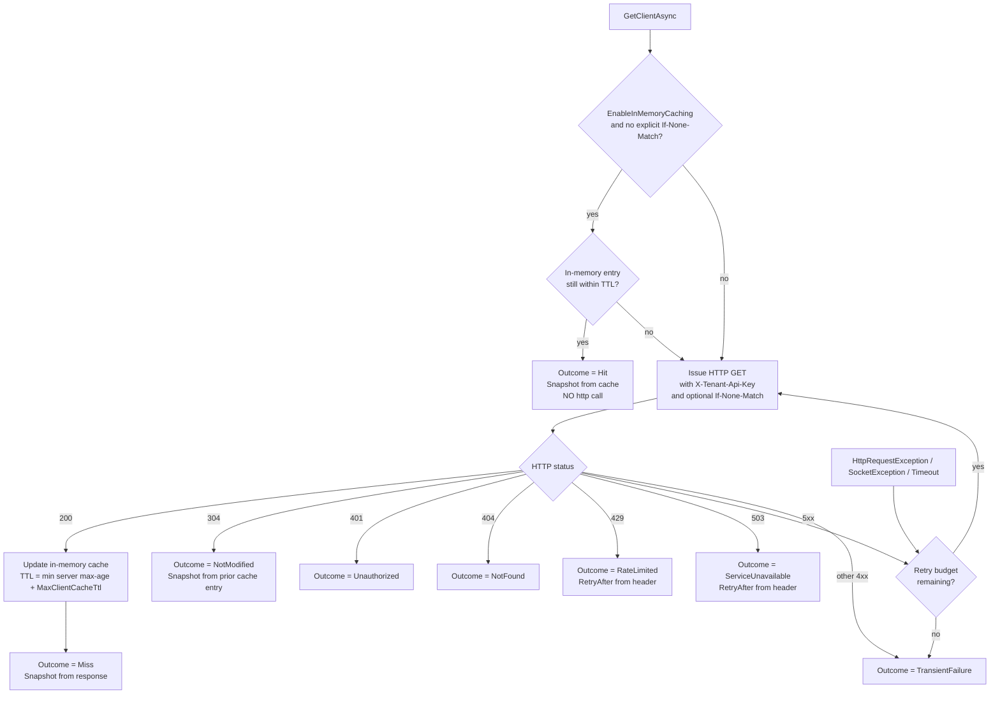

# Tenant Client Cache — Public Read Endpoint Operator Runbook

Spec: [`tenant-client-cache-public-read`](../.kiro/specs/tenant-client-cache-public-read/)
Parent runbook: [`tenant-client-cache.md`](./tenant-client-cache.md)
Audience: site reliability and platform engineers operating the Skoruba Admin host plus consumer service teams integrating against the public-read SDK.

## 1. Overview

The public-read endpoint exposes a read-only, anonymous-from-Duende view of the `Public_Safe_Fields` snapshot per tenant. It is mounted on the Admin API host and is the only HTTP surface other tenant-scoped services should use to fetch a `Client` configuration from outside the Admin process.

### What is exposed

A single GET (HEAD on the same route) endpoint:

```
GET  /api/public/tenants/{tenantKey}/clients/{clientId}
HEAD /api/public/tenants/{tenantKey}/clients/{clientId}
```

Response body is a JSON object whose top-level shape is the 38 `Public_Safe_Fields` (camelCase) plus the timestamp `lastWriteUtc`. Envelope metadata (`version`, `tenantKey`, `clientId`, `lastWriteUtc`) is surfaced via response headers, not in the body root.

### What is NOT exposed

The endpoint never emits, deserializes, or accepts any of the following secret-bearing or PII-bearing fields:

- `ClientSecrets`
- `Claims`
- `Properties`
- `IdentityProviderRestrictions`
- `PairWiseSubjectSalt`
- `Id` (the database primary key)

The mapping is enforced upstream by the parent spec `tenant-client-cache-expansion` (Public_Safe_Fields whitelist and the snapshot mapper guard) and reinforced here by reflection-based regression tests (see `SecurityRegressionTests.PublicClientSnapshot_Has_No_Forbidden_Field_Names`).

### Out of scope

The runbook deliberately does not cover the write path, the background refresh sweep, or the snapshot envelope schema. Those are owned by the parent spec and described in [`tenant-client-cache.md`](./tenant-client-cache.md).

## 2. Configuration matrix

Bind the `TenantClientCachePublicRead` section in the Admin host `appsettings.json` (or override via `TenantClientCachePublicRead__*` environment variables). Defaults are taken verbatim from `TenantClientCachePublicReadOptions`.

| Key                                                  | Default       | Valid range                           | Notes |
|------------------------------------------------------|---------------|---------------------------------------|-------|
| `ApiKeys`                                            | `{}` (empty)  | `tenantKey → SHA-256 hex (64 lowercase hex chars)` | Map of normalized tenantKey to SHA-256 digest of the plaintext API key. Plaintext is NEVER stored server-side (R1.4). With an empty map every request is rejected 401 (fail-closed; R1.7). Hot-reload supported via `IOptionsMonitor` (R1.6, R3.5). |
| `RateLimit:TokenLimit`                               | `30`          | `[1, 10000]`                          | Bucket size per tenant. |
| `RateLimit:TokensPerPeriod`                          | `30`          | `[1, 10000]`                          | Tokens replenished per `ReplenishmentPeriod`. |
| `RateLimit:ReplenishmentPeriod`                      | `00:01:00`    | `[00:00:01, 01:00:00]`                | Replenishment cadence. |
| `RateLimit:QueueLimit`                               | `0`           | `[0, 10000]`                          | Set to `0` to fail-fast on overflow rather than queue. |
| `RateLimit:AutoReplenishment`                        | `true`        | `true` or `false`                     | Leave `true` in production. Tests may flip to drive a deterministic clock. |
| `Cors:AllowedOrigins`                                | `[]` (empty)  | absolute URLs, scheme `https` (or `http` for `localhost`) | Default empty allowlist; CORS middleware emits no `Access-Control-Allow-Origin` until you add an entry (R5.4). |
| `Cors:PreflightMaxAgeSeconds`                        | `600`         | `[0, 86400]`                          | Cached preflight TTL in seconds. |
| `ResponseCache:MaxAgeSeconds`                        | `60`          | `[0, 3600]`                           | Sets `Cache-Control: public, max-age=N, no-transform`. |
| `Audit:LogIpHash`                                    | `true`        | `true` or `false`                     | When `true` the audit logger emits `RemoteIpHash` (SHA-256 hex). When `false` no IP info is logged. |
| `Audit:RemoteIpSalt`                                 | `""` (empty)  | non-empty random string in Production | Validator fails fast at startup when empty in `Production` (R9.6). |

`TenantClientCachePublicReadOptionsValidator` runs at host startup (`ValidateOnStart`) and fails fast with a message naming the offending key path; the offending API key digest is never echoed back in the error message (R1.4).

### Sample `appsettings.json`

```json
{
  "TenantClientCachePublicRead": {
    "ApiKeys": {},
    "RateLimit": {
      "TokenLimit": 30,
      "TokensPerPeriod": 30,
      "ReplenishmentPeriod": "00:01:00",
      "QueueLimit": 0,
      "AutoReplenishment": true
    },
    "Cors": {
      "AllowedOrigins": [],
      "PreflightMaxAgeSeconds": 600
    },
    "ResponseCache": {
      "MaxAgeSeconds": 60
    },
    "Audit": {
      "LogIpHash": true,
      "RemoteIpSalt": ""
    }
  }
}
```

## 3. Rollout checklist

Roll out one environment at a time. Each step gates on telemetry from the previous one.

1. **Merge fail-closed.** Ship the binaries with `ApiKeys: {}` empty in production `appsettings.json`. The endpoint is reachable but every request returns 401 `{"error":"missing_api_key"}` or 401 `{"error":"invalid_api_key"}` (R1.7).
2. **Onboard a single staging tenant.** Generate a random API key — the helper script `scripts/new-tenant-api-key.sh` produces both halves at once:
   ```bash
   ./scripts/new-tenant-api-key.sh --tenant acme
   # PLAINTEXT  -> <base64-ish, ~43 chars>
   # SHA256 hex -> <64-char lowercase hex>
   #
   # # 1) Admin host (stores the HASH; rotates the digest only):
   # export TenantClientCachePublicRead__ApiKeys__acme=<sha256-hex>
   #
   # # 2) BFF host / SDK consumer (stores the PLAINTEXT; sent in X-Tenant-Api-Key):
   # export MobileBff__TenantClientCache__ApiKey=<plaintext>
   ```
   Store the **PLAINTEXT** in the consumer's secret store (env var, secret manager, vault). Store the **HASH** as the Admin host env var:
   ```
   TenantClientCachePublicRead__ApiKeys__acme=<sha256-hex of plaintext>
   ```
   The Admin host **never** sees the plaintext. The consumer **never** sees the hash. (R1.4 — fail-fast at startup if the configured value is not 64-char lowercase hex.)
3. **Smoke test.** Issue `GET /api/public/tenants/acme/clients/acme-spa` with header `X-Tenant-Api-Key: <plaintext>`. Confirm 200 + body + `ETag` + `Cache-Control: public, max-age=60, no-transform` + `Vary: X-Tenant-Api-Key` + `X-Snapshot-Last-Write-Utc` + `X-Snapshot-Version` + `X-Content-Type-Options: nosniff`.
4. **Deploy to production with non-empty salt.** Set `TenantClientCachePublicRead__Audit__RemoteIpSalt=<random>` per host (a 32-char random ASCII string is sufficient). The validator refuses to start in `Production` when the salt is empty (R9.6).
5. **Onboard further tenants.** Append more env vars `TenantClientCachePublicRead__ApiKeys__<tenantKey>=<sha256-hex>`. Hot-reload picks the new tenant up on the next request (R1.6, R3.5) — no host restart required.

Disabling a tenant: remove the env var or rotate the digest. The next request observes the new snapshot and any in-flight key returns 401.

## 4. Telemetry

Structured Serilog events emitted by the public-read pipeline.

| Event name (`EventType`)                                      | Source                                                                                  | Levels in use |
|---------------------------------------------------------------|-----------------------------------------------------------------------------------------|---------------|
| `TenantClientCachePublicRead.Hit`                             | `PublicTenantClientsController.GetAsync` — successful 200                              | `Information` |
| `TenantClientCachePublicRead.NotModified`                     | `PublicTenantClientsController.GetAsync` — 304 from `If-None-Match`                    | `Information` |
| `TenantClientCachePublicRead.Miss`                            | `PublicTenantClientsController.GetAsync` — 404 `snapshot_not_found`                    | `Debug` |
| `TenantClientCachePublicRead.Unauthorized`                    | `TenantApiKeyAuthorizationFilter` — 401 missing / invalid API key                      | `Warning` |
| `TenantClientCachePublicRead.RateLimited`                     | rate-limiter `OnRejected` — 429                                                         | `Warning` |
| `TenantClientCachePublicRead.BadRequest`                      | `PublicTenantClientsController.Bad` — 400 path validation OR `HttpsRequiredFilter`      | `Warning` |
| `TenantClientCachePublicRead.ServiceUnavailable`              | `PublicTenantClientsController.PipelineDisabled` and `PublicReadExceptionFilter`        | `Error` |

Every event carries the closed structured field set defined in `AuditFields`:

| Field name           | Type      | Notes |
|----------------------|-----------|-------|
| `EventType`          | string    | `TenantClientCachePublicRead.{Outcome}` |
| `TenantKey`          | string?   | Always omitted when `Outcome ∈ {Unauthorized, BadRequest}` (R8.4 anti-enumeration) |
| `ClientId`           | string?   | Always omitted when `Outcome ∈ {Unauthorized, BadRequest}` |
| `Outcome`            | string    | One of `Hit, NotModified, Miss, Unauthorized, RateLimited, BadRequest, ServiceUnavailable` |
| `DurationMs`         | double    | Wall-clock from action entry until response written |
| `CorrelationId`      | string?   | `Activity.Current?.TraceId.ToString()` when present |
| `RemoteIpHash`       | string?   | SHA-256 hex; raw IP is NEVER logged (R9.6) |
| `HttpStatus`         | int       | 200 / 304 / 400 / 401 / 404 / 429 / 503 |
| `ETagSent`           | string?   | Set on `Hit`/`NotModified`; null otherwise |
| `RetryAfterSeconds`  | int?      | Set on `RateLimited`/`ServiceUnavailable`; null otherwise |

Snapshot bodies, raw API keys, SHA-256 digests, and raw IP addresses are never logged.

## 5. Metrics

`Meter("TenantClientCache", "1.0")` — the SAME meter as the parent spec (R8.3). The public-read pipeline appends 7 counters and 1 histogram. Tag policy is enforced at the call site:

| Instrument                                              | Kind                  | Tag set                       | Rationale |
|---------------------------------------------------------|-----------------------|-------------------------------|-----------|
| `tenant_client_cache.public_read.hit`                   | Counter               | `tenantKey`                   | Authenticated path; tenant identity already disclosed. |
| `tenant_client_cache.public_read.not_modified`          | Counter               | `tenantKey`                   | Same as above. |
| `tenant_client_cache.public_read.miss`                  | Counter               | `tenantKey`                   | 404 only happens after a valid API key. |
| `tenant_client_cache.public_read.rate_limited`          | Counter               | `tenantKey`                   | Triggered after API-key validation. |
| `tenant_client_cache.public_read.service_unavailable`   | Counter               | `tenantKey`                   | Pipeline-disabled and unhandled exception both reach the controller after auth. |
| `tenant_client_cache.public_read.unauthorized`          | Counter               | (none)                        | R8.4: omitting `tenantKey` prevents enumeration via metric scrape. |
| `tenant_client_cache.public_read.bad_request`           | Counter               | (none)                        | Same as above; also triggered by `HttpsRequiredFilter`. |
| `tenant_client_cache.public_read.duration_ms`           | Histogram             | `outcome` + `tenantKey`*      | `tenantKey` recorded only for outcomes that already carry it (R8.5). |

`clientId` is NEVER tagged. The cardinality budget mirrors parent spec R16.3.

### SDK metrics

`Meter("Skoruba.Duende.IdentityServer.TenantClientCache.Client", "1.0")` — a SECOND meter, distinct from the server (R11.11). Tag policy: ONLY `outcome`. `tenantKey` is never tagged on the consumer side because consumers may run with a small fixed set of tenants and scraping by `outcome` alone is sufficient.

| Instrument                                              | Kind        |
|---------------------------------------------------------|-------------|
| `client.read.hit_local`                                 | Counter     |
| `client.read.hit_remote`                                | Counter     |
| `client.read.not_modified`                              | Counter     |
| `client.read.miss`                                      | Counter     |
| `client.read.unauthorized`                              | Counter     |
| `client.read.rate_limited`                              | Counter     |
| `client.read.service_unavailable`                       | Counter     |
| `client.read.transient_failure`                         | Counter     |
| `client.read.retry_attempted`                           | Counter     |
| `client.read.duration_ms`                               | Histogram   |

## 6. Security review checklist

Reviewer signs after `dotnet test` passes for all 11 prior tasks plus the security regression suite added in Task 12.

- [ ] 1. **Tenant enumeration resistance.** Unregistered tenant and registered-but-wrong-key responses are byte-equal (status, body, headers, audit field set). Proof: `TenantApiKeyAuthorizationFilterProperties.Property04_EnumerationResistance` (P4) + integration `PublicReadEndpoint_Unregistered_VS_WrongKey_ResponsesIdentical`.
- [ ] 2. **Constant-time hash compare.** `TryValidate` uses `CryptographicOperations.FixedTimeEquals` and never short-circuits on tenant-not-found. Proof: `TenantApiKeyValidatorProperties.Property03_ConstantTime` (P3).
- [ ] 3. **Hot-reload revocation.** Updating `ApiKeys` via `IOptionsMonitor.OnChange` revokes the old hash and accepts the new hash on the next request. Proof: `TenantApiKeyValidatorProperties.Property02_HotReload` (P2) + integration `PublicReadEndpoint_HotReload_RemovingTenantKey_NextRequest_Returns_401`.
- [ ] 4. **Log poisoning prevention.** Audit log entries for any outcome contain no raw API key, hash, raw `tenantKey` (for `Unauthorized` / `BadRequest`), nor any field matching `(?i).*secret.*` (with the documented carve-out: `RequireClientSecret` is a Public_Safe_Field boolean toggle, NOT a secret value). Proof: `TenantApiKeyAuthorizationFilterProperties.Property14_AuditLogRedaction` (P14).
- [ ] 5. **API key plaintext never persisted server-side.** `TenantClientCachePublicReadOptions.ApiKeys` is typed as `IDictionary<string, string>` where the value is documented and validated as a SHA-256 hex digest, NOT plaintext. Proof: reflection test `SecurityRegressionTests.ApiKeyStore_Holds_Only_Sha256_Hex_Strings`.
- [ ] 6. **HTTPS required (non-localhost).** `HttpsRequiredFilter` runs first and emits 400 `https_required` for plain HTTP from non-loopback hosts. Proof: `TenantApiKeyAuthorizationFilterProperties.Property17_HttpsGate_And_RemoteIpHash` (P17) + integration `PublicReadEndpoint_PlainHttp_NonLocalhost_Returns_400_HttpsRequired_Before_ApiKeyValidation`.
- [ ] 7. **`RemoteIpHash`, never raw IP.** Audit logs only carry `sha256-hex(remoteIp + ":" + salt)`. Proof: `TenantApiKeyAuthorizationFilterProperties.Property17_HttpsGate_And_RemoteIpHash` (P17).
- [ ] 8. **CORS empty allowlist.** Default config produces a CORS policy with zero origins; the middleware does not echo `Access-Control-Allow-Origin`. Proof: integration `PublicReadEndpoint_Cors_Preflight_EmptyAllowlist_NoAccessControlAllowOriginEcho` plus `SecurityRegressionTests.Cors_Default_Allowlist_Empty_Implies_No_AllowOrigin_Echoed`.
- [ ] 9. **Cardinality-safe metrics.** `Unauthorized` and `BadRequest` counters carry no `tenantKey` tag. Proof: `PublicReadObservabilityProperties.Property16_MetricTagPolicy` (P16) + `SecurityRegressionTests.RateLimiter_Counter_Tag_Policy_Excludes_TenantKey_For_Unauthorized_BadRequest`.
- [ ] 10. **Controller has no `DbContext` / `IClientService` / `IClientRepository` injection.** `PublicTenantClientsController` depends only on `ITenantClientCacheService`, `IOptionsMonitor<TenantClientCachePublicReadOptions>`, `TenantClientCacheMetrics`, `ILogger`, and `IpHashHelper`. Proof: reflection test `SecurityRegressionTests.Controller_Has_No_DbContext_Or_IClientService_Or_IClientRepository_In_Constructor`.

## 7. Failure modes

The 11-row table mirrors the design.md "Error Handling" section. Each row pins the exact response shape so consumer code can rely on it.

| Fault / scenario                                         | HTTP status                | Response body                                | Log level     | Metric counter                                         |
|----------------------------------------------------------|----------------------------|----------------------------------------------|---------------|--------------------------------------------------------|
| Plain HTTP, non-localhost (R9.7)                         | 400                        | `{"error":"https_required"}`                 | `Warning`     | `tenant_client_cache.public_read.bad_request` (no tag) |
| Missing `X-Tenant-Api-Key` (R3.1)                        | 401                        | `{"error":"missing_api_key"}`                | `Warning`     | `tenant_client_cache.public_read.unauthorized` (no tag) |
| Wrong key OR tenant not registered (R3.2, R3.3)          | 401                        | `{"error":"invalid_api_key"}`                | `Warning`     | `tenant_client_cache.public_read.unauthorized` (no tag) |
| `tenantKey` malformed (R7.1)                             | 400                        | `{"error":"invalid_tenant_key"}`             | `Warning`     | `tenant_client_cache.public_read.bad_request` (no tag) |
| `clientId` malformed (R7.2)                              | 400                        | `{"error":"invalid_client_id"}`              | `Warning`     | `tenant_client_cache.public_read.bad_request` (no tag) |
| Token bucket exhausted (R4.5)                            | 429 + `Retry-After: <int>` | `{"error":"rate_limit_exceeded"}`            | `Warning`     | `tenant_client_cache.public_read.rate_limited` (tagged tenantKey) |
| Cache miss / corrupt / stale (R7.3)                      | 404                        | `{"error":"snapshot_not_found"}`             | `Debug`       | `tenant_client_cache.public_read.miss` (tagged tenantKey) |
| Pipeline disabled (R7.4)                                 | 503 + `Retry-After: 60`    | `{"error":"snapshot_pipeline_disabled"}`     | `Error`       | `tenant_client_cache.public_read.service_unavailable` (tagged tenantKey) |
| `ITenantClientCacheService` throws transient (R7.5)      | 503 + `Retry-After: 5`     | `{"error":"snapshot_unavailable"}`           | `Error`       | `tenant_client_cache.public_read.service_unavailable` (tagged tenantKey) |
| Successful 200 (R2.4 + R6.1-3, R6.6-7, R9.8)             | 200                        | `Public_Safe_Fields` JSON + headers          | `Information` | `tenant_client_cache.public_read.hit` (tagged tenantKey) |
| Successful 304 (R6.4 + R6.5)                             | 304                        | empty body, all headers identical to 200     | `Information` | `tenant_client_cache.public_read.not_modified` (tagged tenantKey) |

## 8. Risk notes

The risks below are observed gaps that operators should know about. Each one is either documented in the design and accepted, or has a tracked follow-up.

- **Rate limiter consumes tokens for 401-bound traffic (primary follow-up).** ASP.NET Core's `app.UseRateLimiter()` middleware evaluates the rate-limit policy ahead of the endpoint's `IAsyncAuthorizationFilter` chain. This means a request that fails API-key validation still consumes one token from the per-tenant bucket before the auth filter short-circuits. The integration test `PublicReadEndpoint_RateLimit_DoesNotConsume_Token_For_401` documents this explicitly: it asserts the OBSERVED behavior so the assertion fails the day a fix lands. R3.8 / R4.7 require auth-before-rate-limit. Closing the gap requires moving the rate-limit decision INSIDE the endpoint filter chain — for example a custom action filter that acquires the lease after authorization succeeds. Until then, set `RateLimit:TokenLimit` high enough to absorb expected unauthenticated noise plus legitimate traffic, and treat per-IP rate limiting at the reverse proxy as the primary anti-DoS control (R9.2).
- **Length-based 400 path-validation consumes a rate-limit token (R4.9 partial gap).** Path validation runs INSIDE the controller action, so a malformed `tenantKey` or `clientId` that passed the route regex (`^[a-z0-9_-]+$`) but violated the length bound (`> 128` for `tenantKey`, `> 200` for `clientId`) consumes one token. The route regex blocks the worst inputs at the routing layer (404 BEFORE rate limiter), but length-only failures slip through. Mitigation: the default `TokenLimit=30` per minute makes this DoS-irrelevant in practice. Track the same follow-up as the 401 case — the action filter that closes R3.8 also closes R4.9.
- **Test-host content-type workaround.** The integration test host registers an additional output formatter that supports `"application/json; charset=utf-8"` because production filters set `ObjectResult.ContentTypes = { "application/json; charset=utf-8" }` directly. The default `SystemTextJsonOutputFormatter` declares only `application/json` (no parameters), so without the workaround the test-host content-negotiation step would return 406. **Recommended production cleanup:** drop the explicit `; charset=utf-8` parameter from `ObjectResult.ContentTypes` in `TenantApiKeyAuthorizationFilter`, `HttpsRequiredFilter`, `PublicReadExceptionFilter`, and the controller. Use `[Produces("application/json")]` on the controller and let the framework formatter set the charset on the response. Removing the parameter in production also removes the workaround in tests, keeping the surface honest. Tracked as a low-risk follow-up.
- **Pipeline-disabled signal — sentinel vs exception.** The parent spec convention is a sentinel envelope with `Version <= 0`. The controller maps that to 503 `snapshot_pipeline_disabled` + `Retry-After: 60`. If the parent service evolves to throw a `SnapshotPipelineDisabledException` instead, `PublicReadExceptionFilter` catches it and routes to 503 `snapshot_unavailable` + `Retry-After: 5`. Both paths satisfy R7.4 / R7.5; the body shape differs. Operators alerting on a specific body string should accept either.

## 9. Integration guide (consumer side)

This section is for service teams writing a .NET caller against the public-read endpoint. It is consumer-facing, not operator-facing — share it with the team that owns the consuming service.

### 9.1 Reference the SDK

Add a project reference if you build the consumer in the same solution, or a NuGet `PackageReference` once the package is published:

```xml
<PackageReference Include="Skoruba.Duende.IdentityServer.TenantClientCache.Client" Version="1.0.0" />
```

The SDK has no third-party dependencies. It pulls only `Microsoft.Extensions.Http`, `Microsoft.Extensions.Caching.Memory`, `Microsoft.Extensions.Options`, `Microsoft.Extensions.Logging.Abstractions`, and `Microsoft.Extensions.DependencyInjection.Abstractions`.

### 9.2 DI registration

```csharp
services.AddTenantClientCacheClient(o =>
{
    o.BaseAddress = new Uri("https://identity.example.com");
    o.ApiKey = configuration["TenantClientCacheClient:ApiKey"];
    o.HttpTimeout = TimeSpan.FromSeconds(5);
    o.MaxRetryAttempts = 2;
    o.MaxClientCacheTtl = TimeSpan.FromMinutes(5);
});
```

Validation rules enforced at startup (`ValidateOnStart`):

- `BaseAddress` is absolute, scheme `https` (or `http` only if host is `localhost`).
- `ApiKey` is non-empty.
- `HttpTimeout ∈ [1s, 60s]`.
- `MaxRetryAttempts ∈ [0, 5]`.
- `RetryBaseDelay ∈ [10ms, 5s]`.
- `MaxClientCacheTtl ∈ [0s, 1h]`.

### 9.3 Sample call

```csharp
var result = await client.GetClientAsync("acme", "acme-spa", ct);
switch (result.Outcome)
{
    case SdkCacheOutcome.Hit:
    case SdkCacheOutcome.Miss:
    case SdkCacheOutcome.NotModified:
        Use(result.Snapshot);
        break;
    case SdkCacheOutcome.NotFound:
        Handle404();
        break;
    case SdkCacheOutcome.Unauthorized:
        HandleAuth();
        break;
    case SdkCacheOutcome.RateLimited:
    case SdkCacheOutcome.ServiceUnavailable:
        ScheduleRetry(result.RetryAfter);
        break;
    case SdkCacheOutcome.TransientFailure:
        Backoff();
        break;
}
```

`result.Snapshot` is the `Public_Safe_Fields` payload. `result.Etag`, `result.LastWriteUtc`, and `result.Version` mirror the response headers.

### 9.4 Retry / cache behavior

- `EnableInMemoryCaching=true` (default): the SDK keeps an `IMemoryCache` entry per `(tenantKey, clientId)`. TTL = `min(server max-age, MaxClientCacheTtl)`. A subsequent call within TTL returns `Outcome=Hit` without an HTTP roundtrip.
- After TTL expiry the SDK auto-revalidates by issuing the next call with `If-None-Match: <cached-etag>`. The server responds 304 (cache extended, snapshot reused) or 200 (cache replaced).
- `MaxRetryAttempts=2` (default): the SDK retries on 5xx responses (500 / 502 / 503 / 504) and on transient network exceptions (`HttpRequestException`, `SocketException`, `TaskCanceledException` whose inner is `TimeoutException`).
- The SDK NEVER retries on 4xx (R11.2). 401 / 403 / 404 / 429 surface immediately as their corresponding outcomes.
- `result.RetryAfter` is set when the server emits a `Retry-After` header (429 / 503). The SDK does NOT auto-wait — it surfaces the value so the caller can schedule a backoff.
- Caller-supplied `CancellationToken` cancellation propagates as `OperationCanceledException` and bypasses the retry loop (R11.5).

### 9.5 Decision tree



### 9.6 Wiring inside Skoruba STS.Identity

The STS.Identity host ships a thin wrapper service so downstream callers do not have to know about the SDK directly, the API key, or the tenant resolution rules. The wrapper lives at `src/Skoruba.Duende.IdentityServer.STS.Identity/Services/`.

#### 9.6.1 Configuration section

Add a `PublicTenantClientSnapshotConsumer` block to `appsettings.json`. The shipping default is `Enabled: false`; operators flip it to `true` once `BaseAddress` and `ApiKey` have been populated through env vars or a secret store.

```json
"PublicTenantClientSnapshotConsumer": {
  "Enabled": false,
  "BaseAddress": "",
  "ApiKey": "",
  "HttpTimeoutSeconds": 5,
  "MaxRetryAttempts": 2,
  "RetryBaseDelayMilliseconds": 200,
  "MaxClientCacheTtlSeconds": 300,
  "EnableInMemoryCaching": true
}
```

Operators populate the secrets at deploy time:

```
PublicTenantClientSnapshotConsumer__Enabled=true
PublicTenantClientSnapshotConsumer__BaseAddress=https://identity.example.com
PublicTenantClientSnapshotConsumer__ApiKey=<plaintext-api-key>
```

When `Enabled=false`, the host registers `DisabledPublicTenantClientSnapshotProvider`, the SDK is NOT wired, and missing `BaseAddress` / `ApiKey` do NOT cause `Startup.cs` to throw. When `Enabled=true`, the underlying `services.AddTenantClientCacheClient(...)` call is made and its `ValidateOnStart` validator fail-fasts on invalid options (production fail-fast).

#### 9.6.2 Call site (Startup.cs)

The wiring is hooked into `ConfigureServices` immediately after `AddPhoneOtpLogin`:

```csharp
services.AddPhoneOtpLogin(Configuration);
services.AddPublicTenantClientSnapshotConsumer(Configuration);
RegisterAuthentication(services);
```

The extension is idempotent (`TryAdd*`) so it can be called more than once in composite startup paths without producing duplicate singleton registrations.

#### 9.6.3 Consuming the provider

Downstream services and controllers depend on `IPublicTenantClientSnapshotProvider` and pass only the active request's `clientId`. The provider resolves `tenantKey` from `ITenantContextAccessor.Current` on every call.

```csharp
public sealed class TenantClientLogoResolver
{
    private readonly IPublicTenantClientSnapshotProvider _snapshots;

    public TenantClientLogoResolver(IPublicTenantClientSnapshotProvider snapshots)
    {
        _snapshots = snapshots;
    }

    // The caller already has the active Duende client (e.g. from
    // IIdentityServerInteractionService.GetAuthorizationContextAsync(returnUrl))
    // so it knows the clientId for the current request. tenantKey is NEVER
    // hard-coded — the wrapper reads it off the resolved tenant context.
    public async Task<string?> ResolveLogoAsync(string clientId, CancellationToken ct)
    {
        var lookup = await _snapshots.GetSnapshotAsync(clientId, ct);

        return lookup.Outcome switch
        {
            PublicClientSnapshotOutcome.Snapshot => lookup.Snapshot?.LogoUri,
            PublicClientSnapshotOutcome.Disabled => null,        // wrapper not enabled in this env
            PublicClientSnapshotOutcome.NoTenantContext => null, // request had no tenant
            _ => null,                                           // 404/401/429/5xx — fail-soft
        };
    }
}
```

The provider never throws on missing config or SDK errors. Callers switch on `lookup.Outcome` to decide whether to use the snapshot, fall back to a default, or schedule a retry using `lookup.RetryAfter`.

#### 9.6.4 FAQ — Why not pass `tenantKey` explicitly?

`tenantKey` is owned by `TenantInfrastructure`. It is resolved once per request from the current subdomain (e.g. `acme.identity.example.com`) or from the `X-Tenant-Id` header, then stamped onto `ITenantContextAccessor.Current`. Forcing every consumer to pass `tenantKey` would:

- Duplicate the resolution rules across every controller and service that needs a snapshot.
- Make it tempting to hard-code a literal `"acme"` in non-test code, which silently breaks multi-tenant isolation the moment a second tenant is onboarded.
- Allow a buggy caller to read snapshots for a tenant other than the one the request is scoped to, defeating the central authentication boundary.

Reading `tenantKey` from the resolved tenant context inside the wrapper makes the rule un-bypassable: if the request has no tenant, the lookup returns `Outcome=NoTenantContext` and the SDK is never called. If the operator wants to call the SDK with a different tenantKey for a one-off batch job, they can resolve `ITenantClientCacheClient` directly — the explicit-tenantKey contract is still available on the SDK.

### 9.7 Consuming the SDK from a project outside this solution

The SDK is published as a NuGet package (`PackageId = Skoruba.Duende.IdentityServer.TenantClientCache.Client`, version inherited from `Directory.Build.props`). It is NOT pushed to nuget.org by this repository, so a downstream solution cannot fetch it from the public feed by default. Pick the distribution path that matches the consumer's environment.

#### 9.7.1 Local NuGet feed (single developer / quick start)

This is the lightest path: pack the SDK into a `.nupkg`, drop it into a folder feed, and point the consuming solution at the folder. No internet access, no credentials.

```bash
# Run from the root of THIS repository.
./scripts/pack-tenant-client-cache-sdk.sh --push
# By default the .nupkg is written to artifacts/nupkg/ and pushed to ~/.nuget-local.
# Override the feed location with --feed /custom/path.
```

The script reuses the production csproj metadata (no `dotnet pack` flag soup) and is idempotent — running it twice for the same version is fine because the pushed feed dedupes on `(PackageId, Version)`.

In the consuming solution, copy `scripts/templates/NuGet.config.tenant-client-cache-sdk.template` (in this repo) to the **root of the consuming solution** as `NuGet.config`, then edit the `skoruba-local` source to match the feed path printed by the pack script. Add the package reference to the consuming csproj:

```xml
<PackageReference Include="Skoruba.Duende.IdentityServer.TenantClientCache.Client"
                  Version="3.0.0-preview.22" />
```

Run `dotnet restore` in the consuming solution. The `<PackageReference>` resolves against the local feed without ever hitting the network.

When you bump the SDK version (edit `Directory.Build.props`), re-run the pack script and the consumer's next restore picks up the new `.nupkg`.

#### 9.7.2 GitHub Packages (team-wide)

For a multi-developer team, push the `.nupkg` into the GitHub Packages feed of the Skoruba repo. The consuming solution authenticates with a Personal Access Token that has `read:packages` scope.

```bash
# One-off CI publish step (or a maintainer's local publish).
./scripts/pack-tenant-client-cache-sdk.sh
dotnet nuget push artifacts/nupkg/*.nupkg \
    --source "https://nuget.pkg.github.com/skoruba/index.json" \
    --api-key "${GITHUB_PACKAGES_TOKEN}"
```

In the consuming solution's `NuGet.config`, replace the local feed entry with the hosted one:

```xml
<add key="github-skoruba" value="https://nuget.pkg.github.com/skoruba/index.json" />
<!-- Configure credentials via environment variable GITHUB_PACKAGES_TOKEN
     (or the user's nuget.config.user file under ~/.nuget/NuGet/). -->
```

Tracked as a follow-up: a CI workflow that automates pack + push on `main`.

#### 9.7.3 Public NuGet.org (long-term)

Eventually, when the SDK has stabilised and a maintainer has claimed the `Skoruba.Duende.IdentityServer.TenantClientCache.Client` package id on nuget.org, push the `.nupkg` there:

```bash
dotnet nuget push artifacts/nupkg/*.nupkg \
    --source https://api.nuget.org/v3/index.json \
    --api-key "${NUGET_ORG_API_KEY}"
```

Consumers then add a plain `<PackageReference>` with no extra `NuGet.config`.

#### 9.7.4 Direct ProjectReference (sibling repo)

If the consuming solution lives next to this repository on the same machine and shares a git workflow with it, skip the feed entirely:

```xml
<ProjectReference
    Include="..\Skoruba\src\Skoruba.Duende.IdentityServer.TenantClientCache.Client\Skoruba.Duende.IdentityServer.TenantClientCache.Client.csproj" />
```

This works only when the relative path is stable across every developer's checkout. For most setups, the local feed (9.7.1) is more portable.

#### 9.7.5 What the consuming code looks like

Once the SDK is reachable as a `<PackageReference>`, the wiring on the consumer side is:

```csharp
using Skoruba.Duende.IdentityServer.TenantClientCache.Client;
using Skoruba.Duende.IdentityServer.TenantClientCache.Client.Models;

services.AddTenantClientCacheClient(o =>
{
    o.BaseAddress = new Uri(builder.Configuration["TenantClientCache:BaseAddress"]!);
    o.ApiKey      = builder.Configuration["TenantClientCache:ApiKey"]!;
    o.HttpTimeout = TimeSpan.FromSeconds(5);
    o.MaxRetryAttempts = 2;
    o.MaxClientCacheTtl = TimeSpan.FromMinutes(5);
});

// Later, in a service / controller / minimal API handler:
public sealed class FetchClientHandler(ITenantClientCacheClient sdk)
{
    public async Task<PublicClientSnapshot?> GetAsync(string tenantKey, string clientId, CancellationToken ct)
    {
        var result = await sdk.GetClientAsync(tenantKey, clientId, ct);
        return result.Outcome switch
        {
            SdkCacheOutcome.Hit or SdkCacheOutcome.Miss or SdkCacheOutcome.NotModified => result.Snapshot,
            _ => null
        };
    }
}
```

Consumers OUTSIDE this solution receive `(tenantKey, clientId)` from their own request context and pass them explicitly to `GetClientAsync`. The `IPublicTenantClientSnapshotProvider` wrapper described in Section 9.6 is specific to STS.Identity (it knows about `ITenantContextAccessor`); third-party consumers do not need it.

### 9.8 Mobile / Flutter consumers (BFF pattern)

The public-read endpoint requires a per-tenant API key in `X-Tenant-Api-Key`. **The API key MUST NEVER be embedded in a Flutter app binary** (APK / IPA / web bundle): every Flutter consumer that ships to end-user devices is reachable by reverse-engineering tools, so any key shipped in `String.fromEnvironment` / asset / `--dart-define` becomes public the moment the build is distributed.

The supported pattern for mobile consumers is **Backend For Frontend (BFF)**: a server-side .NET service holds the API key, calls the SDK on behalf of the Flutter app, and exposes a thin user-authenticated endpoint that the app consumes via OAuth bearer token. The BFF can be a brand-new lightweight ASP.NET Core service or a slim controller bolted onto an existing tenant service.

#### 9.8.0 Cold-start vs post-auth flows (chicken-and-egg)

A Flutter app shipping to first-time users has **no access token yet**. To acquire one through PKCE it needs to know:
  - the OIDC `authority` URL,
  - its `clientId`,
  - the allowed `redirectUris`,
  - the `allowedScopes`,
  - whether `requirePkce` is set.

That metadata lives in the tenant client cache. The earlier design exposed it through a single endpoint, `GET /mobile/clients/{clientId}`, which `RequireAuthorization()` gated behind the same Bearer JWT the app is trying to obtain. Cold-start traffic therefore couldn't reach it. **That gap was a real flaw in the original design**, not a deliberate choice — without an anonymous bootstrap surface the only workarounds were embedding the metadata in the binary (defeats the BFF pattern) or shipping per-tenant builds (operationally untenable). The fix is a second endpoint with a deliberately narrower contract.

The BFF therefore exposes **two complementary endpoints**:

```
                   ┌───────────────────────────────┐
fresh install   ─▶ │  GET /mobile/bootstrap/        │  anonymous
(no token)         │       {tenantKey}/{clientId}   │  IP rate-limited
                   │  → authority, redirectUris,    │  Cache-Control: public
                   │    allowedScopes, requirePkce  │
                   └───────────────────────────────┘
                                 │
                                 ▼
                   ┌───────────────────────────────┐
                   │  flutter_appauth.authorize…   │  PKCE, returns access_token
                   └───────────────────────────────┘
                                 │
post-auth ──────────────────────▶│
(has token)                      ▼
                   ┌───────────────────────────────┐
                   │  GET /mobile/clients/{cid}    │  Bearer required
                   │  → full slim snapshot         │  tenantKey from claim
                   │    (token lifetimes, etc.)    │  Cache-Control: private
                   └───────────────────────────────┘
```

Why two endpoints instead of one anonymous endpoint with a richer body?
  - Different threat models. Anonymous traffic justifies an IP rate limiter and a strictly-minimal body (no token lifetimes, no logout URIs). Authenticated traffic can carry the full slim shape because the user is already a known principal under a verified `tenant_key`.
  - Different cache semantics. The bootstrap response is identical for every caller of the same `(tenantKey, clientId)` pair, so it is safe to set `Cache-Control: public, max-age=300` and let a CDN amortise traffic. The authenticated endpoint stays `private` because it is gated by user identity.
  - Anti-enumeration. The bootstrap endpoint never distinguishes "tenant doesn't exist" from "client doesn't exist" — both return `404 {"error":"client_not_found"}` with no further detail. This matches R3.3-style anti-enumeration on the upstream public-read endpoint.

#### 9.8.1 Topology

```
Flutter app  ──[Bearer access_token]──>  Tenant BFF (ASP.NET Core)
                                              │
                                              │  IPublicTenantClientSnapshotProvider
                                              │  (Section 9.6 wrapper) OR
                                              │  ITenantClientCacheClient (Section 9.7 SDK)
                                              ▼
                                      X-Tenant-Api-Key header
                                              │
                                              ▼
                       Admin_Api_Host  GET /api/public/tenants/{t}/clients/{c}
```

The Flutter app authenticates the END USER (PKCE / client_credentials of a public OIDC client). The BFF authorises the request against the user's token, resolves `tenantKey` from the user's claims (or from the `X-Tenant-Id` header), and uses the SDK to fetch the snapshot. The BFF returns a downstream-shaped JSON the app cares about.

#### 9.8.2 BFF project (real implementation in this solution)

The solution ships `src/Skoruba.Duende.IdentityServer.Mobile.Bff/` — a minimal-API host with **two endpoints**:

  - **`GET /mobile/bootstrap/{tenantKey}/{clientId}` (anonymous, cold-start)**
    - No `Authorization` required — the freshly-installed Flutter app calls this first.
    - IP-partitioned fixed-window rate limiter via the policy `MobileBff_Bootstrap`. Defaults: 10 req/60s/IP, configurable under `MobileBff:RateLimiting:*`.
    - Validates `tenantKey` against `^[a-z0-9_-]+$` (≤128 chars) after `Trim().ToLowerInvariant()`; bad → 400 `{"error":"invalid_tenant_key"}`.
    - Validates `clientId` against `^[A-Za-z0-9_:./-]+$` (≤200 chars); bad → 400 `{"error":"invalid_client_id"}`.
    - Returns the slim `MobileClientBootstrapResponse` (8 fields: `authority`, `clientId`, `clientName`, `redirectUris`, `postLogoutRedirectUris`, `allowedScopes`, `allowedGrantTypes`, `requirePkce`). NO token lifetimes. NO logout URIs.
    - Response headers: `Cache-Control: public, max-age=300` (CDN-cacheable; trade-off: client metadata changes propagate within 5 min) and `ETag` propagated from the SDK.
    - SDK outcome mapping: Hit/Miss → 200 (or 304 on `If-None-Match` match), NotFound → 404 `{"error":"client_not_found"}`, Unauthorized → 502 `{"error":"upstream_misconfigured"}`, RateLimited/ServiceUnavailable/TransientFailure → 503 + `Retry-After` + `{"error":"snapshot_unavailable"}`. On rate-limiter rejection: 429 + `Retry-After` + `{"error":"rate_limit_exceeded"}`.
    - Logging: structured `{TenantKey, ClientId, Outcome, RemoteIp}`. RemoteIp is acceptable here because the endpoint is anonymous and IP is the only attribution available for rate-limit accounting. Never logs API key or full snapshot body.

  - **`GET /mobile/clients/{clientId}` (authenticated, post-auth)**
    - Requires Bearer JWT issued by Skoruba STS.
    - Reads `tenantKey` from the user's `tenant_key` claim — never from the request URL or body.
    - Returns the richer `MobileClientSnapshotResponse` (11 fields including `accessTokenLifetime`, `identityTokenLifetime`, etc.).
    - Response headers: `Cache-Control: private, max-age=60` and `ETag` propagated from the SDK.
    - NOT rate-limited at the BFF — the upstream Admin host already enforces a per-tenant token bucket on its public-read endpoint.

Both endpoints hold the per-tenant API key server-side via `MobileBff:TenantClientCache:ApiKey` config and surface to the upstream public-read endpoint via the `X-Tenant-Api-Key` header.

Configure with environment variables:

```
MobileBff__Authentication__Authority=https://sts.example.com
MobileBff__TenantClientCache__BaseAddress=https://identity.example.com
MobileBff__TenantClientCache__ApiKey=<plaintext-api-key>
MobileBff__RateLimiting__BootstrapPermitLimit=10
MobileBff__RateLimiting__BootstrapWindowSeconds=60
MobileBff__RateLimiting__BootstrapQueueLimit=0
```

`ApiKey` is the **PLAINTEXT** the BFF sends in the upstream `X-Tenant-Api-Key` header. The Admin host stores only the SHA-256 hash of the same plaintext under `TenantClientCachePublicRead__ApiKeys__<tenantKey>` (R1.4). Use `scripts/new-tenant-api-key.sh --tenant <tenantKey>` to mint both halves at once — see Section 3 step 2.

Then run `dotnet run --project src/Skoruba.Duende.IdentityServer.Mobile.Bff/`. See `tests/Skoruba.Duende.IdentityServer.Mobile.Bff.IntegrationTests/` for the contract tests every BFF deployment must keep green.

#### 9.8.3 Flutter (Dart) sample

The app talks to the BFF, never to `Admin_Api_Host` directly. It authenticates the user via the existing OAuth flow (recommend `flutter_appauth`) and stores the `access_token` in secure storage.

The `TenantClientCacheApi` exposes **two methods** that mirror the two BFF endpoints:

  1. `bootstrap(tenantKey, clientId)` — anonymous, returns the slim `BootstrapResponse` needed to start the PKCE flow on a fresh install.
  2. `getClient(clientId)` — Bearer-authenticated, returns the richer `PublicClientSnapshot` for post-auth dynamic data.

```yaml
# pubspec.yaml (additions only — versions are illustrative; pin to whatever your team uses).
dependencies:
  http: ^1.5.0
  flutter_secure_storage: ^9.2.4
  flutter_appauth: ^9.0.4
```

```dart
// lib/services/tenant_client_cache_api.dart
import 'dart:convert';
import 'package:http/http.dart' as http;
import 'package:flutter_secure_storage/flutter_secure_storage.dart';

/// Bootstrap response shape (anonymous endpoint). Strictly minimal —
/// only what the OIDC PKCE flow needs.
class BootstrapResponse {
  final String authority;
  final String clientId;
  final String? clientName;
  final List<String> redirectUris;
  final List<String> postLogoutRedirectUris;
  final List<String> allowedScopes;
  final List<String> allowedGrantTypes;
  final bool requirePkce;

  BootstrapResponse({
    required this.authority,
    required this.clientId,
    this.clientName,
    required this.redirectUris,
    required this.postLogoutRedirectUris,
    required this.allowedScopes,
    required this.allowedGrantTypes,
    required this.requirePkce,
  });

  factory BootstrapResponse.fromJson(Map<String, dynamic> json) {
    List<String> readList(String key) =>
        (json[key] as List?)?.map((e) => e as String).toList() ?? const <String>[];

    return BootstrapResponse(
      authority:              json['authority'] as String,
      clientId:               json['clientId']  as String,
      clientName:             json['clientName'] as String?,
      redirectUris:           readList('redirectUris'),
      postLogoutRedirectUris: readList('postLogoutRedirectUris'),
      allowedScopes:          readList('allowedScopes'),
      allowedGrantTypes:      readList('allowedGrantTypes'),
      requirePkce:            json['requirePkce'] as bool? ?? false,
    );
  }
}

/// Thin DTO mirroring the BFF post-auth response shape. Add / remove fields
/// as the BFF shape evolves — never widen beyond the Public_Safe_Fields whitelist.
class PublicClientSnapshot {
  final String clientId;
  final String? clientName;
  final bool enabled;
  final List<String> redirectUris;
  final List<String> postLogoutRedirectUris;
  final List<String> allowedScopes;
  final bool requirePkce;
  final String? initiateLoginUri;
  final int accessTokenLifetime;
  final int identityTokenLifetime;

  PublicClientSnapshot({
    required this.clientId,
    this.clientName,
    required this.enabled,
    required this.redirectUris,
    required this.postLogoutRedirectUris,
    required this.allowedScopes,
    required this.requirePkce,
    this.initiateLoginUri,
    required this.accessTokenLifetime,
    required this.identityTokenLifetime,
  });

  factory PublicClientSnapshot.fromJson(Map<String, dynamic> json) {
    List<String> readList(String key) =>
        (json[key] as List?)?.map((e) => e as String).toList() ?? const <String>[];

    return PublicClientSnapshot(
      clientId:               json['clientId'] as String,
      clientName:             json['clientName'] as String?,
      enabled:                json['enabled'] as bool? ?? false,
      redirectUris:           readList('redirectUris'),
      postLogoutRedirectUris: readList('postLogoutRedirectUris'),
      allowedScopes:          readList('allowedScopes'),
      requirePkce:            json['requirePkce'] as bool? ?? false,
      initiateLoginUri:       json['initiateLoginUri'] as String?,
      accessTokenLifetime:    json['accessTokenLifetime']    as int? ?? 0,
      identityTokenLifetime:  json['identityTokenLifetime']  as int? ?? 0,
    );
  }
}

sealed class SnapshotResult {
  const SnapshotResult();
}

class SnapshotOk extends SnapshotResult {
  final PublicClientSnapshot snapshot;
  final String? etag;
  const SnapshotOk(this.snapshot, this.etag);
}

class SnapshotNotModified extends SnapshotResult {
  const SnapshotNotModified();
}

class SnapshotNotFound extends SnapshotResult {
  const SnapshotNotFound();
}

class SnapshotUnauthorized extends SnapshotResult {
  const SnapshotUnauthorized();
}

class SnapshotRateLimited extends SnapshotResult {
  final Duration? retryAfter;
  const SnapshotRateLimited(this.retryAfter);
}

class SnapshotUnavailable extends SnapshotResult {
  final Duration? retryAfter;
  const SnapshotUnavailable(this.retryAfter);
}

class TenantClientCacheApi {
  final Uri bffBaseUri;
  final FlutterSecureStorage secureStorage;
  final http.Client httpClient;

  TenantClientCacheApi({
    required this.bffBaseUri,
    FlutterSecureStorage? secureStorage,
    http.Client? httpClient,
  })  : secureStorage = secureStorage ?? const FlutterSecureStorage(),
        httpClient = httpClient ?? http.Client();

  /// In-memory ETag/snapshot cache keyed by clientId. Survives the lifetime of
  /// this object (typically a singleton injected via Provider / Riverpod / GetIt).
  final Map<String, _CacheEntry> _cache = {};

  /// Cold-start: fetch the OIDC client metadata anonymously so the app can
  /// start the PKCE flow. tenantKey is supplied by the caller (e.g. read
  /// from secure storage after onboarding) — the BFF rate-limits by IP.
  Future<BootstrapResponse> bootstrap(String tenantKey, String clientId) async {
    final uri = bffBaseUri.replace(
      pathSegments: [...bffBaseUri.pathSegments, 'mobile', 'bootstrap', tenantKey, clientId],
    );

    final response = await httpClient.get(uri, headers: const {
      'Accept': 'application/json',
    });

    if (response.statusCode != 200) {
      throw StateError('Bootstrap failed: HTTP ${response.statusCode} ${response.body}');
    }

    return BootstrapResponse.fromJson(jsonDecode(response.body) as Map<String, dynamic>);
  }

  /// Post-auth: fetch the richer slim snapshot using the user's bearer token.
  /// The BFF resolves tenantKey from the token claim, not from the URL.
  Future<SnapshotResult> getClient(String clientId) async {
    if (clientId.trim().isEmpty) {
      return const SnapshotNotFound();
    }

    final accessToken = await secureStorage.read(key: 'access_token');
    if (accessToken == null || accessToken.isEmpty) {
      return const SnapshotUnauthorized();
    }

    final cached = _cache[clientId];
    final headers = <String, String>{
      'Accept': 'application/json',
      'Authorization': 'Bearer $accessToken',
    };
    if (cached?.etag != null) {
      headers['If-None-Match'] = cached!.etag!;
    }

    final uri = bffBaseUri.replace(
      pathSegments: [...bffBaseUri.pathSegments, 'mobile', 'clients', clientId],
    );

    final response = await httpClient.get(uri, headers: headers);

    switch (response.statusCode) {
      case 200:
        final body = jsonDecode(response.body) as Map<String, dynamic>;
        final snapshot = PublicClientSnapshot.fromJson(body);
        final etag = response.headers['etag'];
        _cache[clientId] = _CacheEntry(snapshot, etag);
        return SnapshotOk(snapshot, etag);

      case 304:
        if (cached != null) {
          // Optionally refresh the etag — server may rotate it.
          final fresh = response.headers['etag'] ?? cached.etag;
          _cache[clientId] = _CacheEntry(cached.snapshot, fresh);
          return SnapshotOk(cached.snapshot, fresh);
        }
        return const SnapshotNotModified();

      case 401:
        return const SnapshotUnauthorized();

      case 404:
        return const SnapshotNotFound();

      case 429:
        return SnapshotRateLimited(_parseRetryAfter(response.headers['retry-after']));

      case 502:
      case 503:
      case 504:
      default:
        return SnapshotUnavailable(_parseRetryAfter(response.headers['retry-after']));
    }
  }

  Duration? _parseRetryAfter(String? header) {
    if (header == null) return null;
    final seconds = int.tryParse(header);
    return seconds != null ? Duration(seconds: seconds) : null;
  }
}

class _CacheEntry {
  final PublicClientSnapshot snapshot;
  final String? etag;
  const _CacheEntry(this.snapshot, this.etag);
}
```

Cold-start flow on first launch:

```dart
import 'package:flutter_appauth/flutter_appauth.dart';

// 1. App reads the tenantKey set during onboarding (or shipped per-flavor)
//    and the clientId baked into the build.
final tenantKey = await secureStorage.read(key: 'tenant_key') ?? 'acme-tenant';
const clientId = 'flutter-mobile-app';

final api = TenantClientCacheApi(bffBaseUri: Uri.parse('https://bff.example.com/'));

// 2. Bootstrap — anonymous call, returns authority + redirectUris + scopes + requirePkce.
final boot = await api.bootstrap(tenantKey, clientId);

// 3. Drive the PKCE login flow with the values returned from the BFF.
final appAuth = const FlutterAppAuth();
final result = await appAuth.authorizeAndExchangeCode(AuthorizationTokenRequest(
  boot.clientId,
  boot.redirectUris.first,
  issuer: boot.authority,
  scopes: boot.allowedScopes,
  promptValues: boot.requirePkce ? const ['login'] : null,
));

// 4. Persist the access_token in secure storage.
await secureStorage.write(key: 'access_token', value: result!.accessToken);

// 5. Subsequent calls use getClient() with the bearer token for richer data.
final snapshot = await api.getClient(clientId);
switch (snapshot) {
  case SnapshotOk(:final snapshot):
    // Use snapshot.accessTokenLifetime, etc.
    break;
  case SnapshotNotFound():
  case SnapshotUnauthorized():
  case SnapshotRateLimited():
  case SnapshotUnavailable():
  case SnapshotNotModified():
    break;
}
```

#### 9.8.4 Things the Flutter app MUST NOT do

- **Do not** include the `X-Tenant-Api-Key` header in any Flutter HTTP request. That header belongs to the BFF.
- **Do not** ship the API key as a `--dart-define` value, an asset, an env-loaded `.env`, or anything else accessible to the Flutter binary at runtime.
- **Do not** trust the `tenantKey` value coming from the app for the post-auth `/mobile/clients/{id}` endpoint. The BFF MUST derive it from the user's access token (Section 9.8.2). If the app passes `tenantKey`, treat it as untrusted input and validate against the user claim. Note: the cold-start `/mobile/bootstrap/{tenantKey}/{clientId}` endpoint deliberately accepts `tenantKey` from the URL because there is no claim available yet — the IP rate limiter and anti-enumeration `404` shape are the compensating controls.
- **Do not** persist the snapshot body to long-term local storage if it contains URLs the user is not entitled to see. The 38 Public_Safe_Fields are configuration the OIDC client discloses anyway, but consult your privacy review before caching to disk.
- **Do not** require a Bearer token on the bootstrap endpoint. This is the chicken-and-egg trap that the original single-endpoint design fell into: the freshly-installed Flutter app needs the OIDC `authority` / `redirectUris` / `allowedScopes` to start PKCE and obtain the very token you'd be requiring. Re-introducing `RequireAuthorization()` on `/mobile/bootstrap/{tenantKey}/{clientId}` makes cold-start traffic impossible, and the only "fixes" that follow from there (embedding metadata in the binary, hardcoding per-tenant builds, exposing the API key to the client) all undermine the BFF pattern. Keep the bootstrap surface anonymous; rely on the IP rate limiter, the slim DTO, the closed JSON error shapes, and the upstream Admin host's per-tenant token bucket as the layered defenses.

#### 9.8.5 Refresh strategy

The BFF (`src/Skoruba.Duende.IdentityServer.Mobile.Bff/`) sets caching headers tuned per endpoint:
  - `GET /mobile/bootstrap/{tenantKey}/{clientId}` → `Cache-Control: public, max-age=300` (CDN-cacheable).
  - `GET /mobile/clients/{clientId}` → `Cache-Control: private, max-age=60`.

Both propagate the SDK's `ETag`, so subsequent calls within the window can revalidate cheaply via `If-None-Match` and return 304. The Flutter app's local in-memory cache persists for the lifetime of the `TenantClientCacheApi` instance. Recommended pattern:

- Cache the snapshot on app startup.
- Refresh on user-initiated reload (pull-to-refresh).
- Refresh on `SnapshotUnauthorized` (after re-authentication).
- Do NOT poll on a timer — the SDK + server already manage freshness.

#### 9.8.6 Testing the BFF without a live `Admin_Api_Host`

The SDK end-to-end test harness (`tests/.../IntegrationTests/Tests/PublicTenantClients/Sdk/SdkEndToEndTests.cs`) demonstrates how to wire `ITenantClientCacheClient` against an in-process `WebApplicationFactory`. The same pattern works for testing your BFF: stage a `FakeTenantClientCacheService`, drive every outcome (`Hit`, `Miss`, `NotFound`, `Unauthorized`, `RateLimited`, `Unavailable`), and assert the BFF maps each one to the HTTP status the Flutter app expects.

#### 9.8.7 Cross-host audit: where the cold-start pattern applies

When the Mobile BFF bootstrap endpoint was added we audited every host in the solution to see whether the same chicken-and-egg trap exists elsewhere. Result: **only `Skoruba.Duende.IdentityServer.Mobile.Bff` had the gap**, and it has been fixed. The other hosts each handle bootstrap differently and do not need an anonymous client-config endpoint:

| Host | Auth model | Cold-start gap? | Why |
|---|---|---|---|
| `Skoruba.Duende.IdentityServer.Admin` (UI host) | Cookie + server-side OIDC code flow | No | OIDC `clientId` (`skoruba_identity_admin_v3`) and `Authority` are bound from `appsettings.json` server-side at startup; the React SPA inherits a cookie established by the host, so the SPA never needs to read OIDC config from JS. |
| `Skoruba.Duende.IdentityServer.Admin.Api` (REST API) | JWT Bearer (Resource API role) | No | This host is an OIDC resource, not a client. It already exposes `/api/tenants/public` as an anonymous, IP-rate-limited tenant directory for any client that needs to enumerate tenants pre-auth (precedent the Mobile BFF bootstrap follows). |
| `Skoruba.Duende.IdentityServer.STS.Identity` | Server-side login UI (Razor / MVC) | No | This host IS the identity server. Login pages are anonymous by design; there is no client cold-start to bootstrap. |
| `Skoruba.Duende.IdentityServer.Admin.UI.Client` (React SPA) | Inherits cookie from Admin UI host | No | API base URL is injected at build time; no JS-side OIDC client; protected calls just attach the inherited cookie. |
| `Skoruba.Duende.IdentityServer.Mobile.Bff` | Bearer JWT (post-auth) **and** anonymous bootstrap (pre-auth) | **Yes — fixed** | See sections 9.8.0 and 9.8.2. |

If you add a NEW host that:
- Authenticates end users (not service accounts) AND
- Cannot ship its OIDC client config in the deployed binary (e.g. multi-tenant where the config is per-tenant runtime data),

then audit it against the same checklist:

1. Does the client know `authority`, `clientId`, `redirectUris`, `scopes` BEFORE the user logs in?
2. If not, where does it get them?
3. If the answer is "an authenticated endpoint", you have the chicken-and-egg gap. Add a narrowly-scoped anonymous endpoint (slim DTO, IP rate-limited, anti-enumeration 404, public CDN cache) following the pattern in `MobileBootstrapEndpoints.cs`.

#### 9.8.8 Resolving `tenantKey` on first launch (multi-tenant Flutter)

The bootstrap endpoint accepts `tenantKey` as a path parameter; the app must already know which tenant to ask about. Two supported patterns:

##### Pattern A — Single-tenant build (recommended when feasible)

The app ships pinned to one tenant. `tenantKey` is a constant in `lib/config.dart` (or injected via `--dart-define`):

```dart
// lib/config.dart
class AppConfig {
  static const String tenantKey = String.fromEnvironment(
    'TENANT_KEY',
    defaultValue: 'acme',
  );
  static const String clientId = 'my-flutter-app';
  static const Uri bffBaseUri = Uri.parse('https://bff.example.com');
}
```

`flutter build apk --dart-define=TENANT_KEY=acme` produces a tenant-specific binary. This matches the convention used by branded banking / partner apps. Trade-off: each tenant gets its own app store listing (or build flavour). Acceptable when the tenant set changes infrequently.

##### Pattern B — Deep link / QR code onboarding

The app ships generic. The user is invited via:
- A deep link `myapp://onboard?tenant=acme` from an email, SMS, or web page.
- A QR code displayed by the tenant's web portal that encodes `myapp://onboard?tenant=acme`.

The app parses the deep link on first launch, validates the value (regex `^[a-z0-9_-]+$`, ≤ 128 chars), and persists it to `flutter_secure_storage`:

```dart
import 'package:flutter_secure_storage/flutter_secure_storage.dart';

final secureStorage = const FlutterSecureStorage();

Future<String> resolveTenantKey(Uri? deepLink) async {
  // 1. Cached from a previous run.
  final cached = await secureStorage.read(key: 'tenant_key');
  if (cached != null && cached.isNotEmpty) return cached;

  // 2. From the deep link the user just followed.
  if (deepLink != null && deepLink.scheme == 'myapp' && deepLink.host == 'onboard') {
    final t = deepLink.queryParameters['tenant'];
    if (t != null && RegExp(r'^[a-z0-9_-]{1,128}$').hasMatch(t)) {
      await secureStorage.write(key: 'tenant_key', value: t);
      return t;
    }
  }

  // 3. No tenant — show an onboarding error screen, never call the BFF.
  throw const TenantNotProvisioned();
}
```

The BFF intentionally does NOT expose a `GET /mobile/tenants` enumeration endpoint. Two reasons:

1. **Anti-enumeration.** A public list of tenant keys would let an attacker map the customer base. The bootstrap endpoint already returns identical `404 client_not_found` for "tenant not registered" and "client not registered within tenant" so tenants stay opaque.
2. **Provisioning is out of band.** Tenant onboarding usually happens in a CRM / sales flow that produces the deep link or QR code. The mobile app is downstream of that flow.

If a future deployment genuinely needs tenant discovery (e.g. an internal admin console listing tenants the user has access to), use the existing `Admin.Api` endpoint `/api/tenants/public` (anonymous, IP-rate-limited) directly from a back-office service — do not add the same surface to the mobile BFF.

##### Pattern C — Anti-pattern (don't do this)

Asking the user to type `tenantKey` into a text field on first launch. End users do not know what a tenant key is. If you must ask, ask for a `companyEmail` and resolve `tenantKey` server-side by domain → tenant mapping (a separate identity service / CRM lookup). That's a feature outside this spec.

## 10. PR review verification (manual grep checks)

The following commands are NOT part of the automated test suite. Reviewers run them at PR review time to confirm the diff is consistent with the spec's hard rules.

```bash
# 1. No plaintext API key in fixtures or sample data.
git diff main..HEAD -- '**/*.json' '**/*.cs' '**/*.md' \
  | grep -iE 'X-Tenant-Api-Key:.*[A-Za-z0-9]{16,}' || true
# Expected: empty. Test fixtures use `"REDACTED"` placeholders or short
# `"test-key-deadbeef"` literals that are NOT actual production keys.

# 2. No new third-party NuGet package. Only test packages already in the
#    solution lockfile (FsCheck.Xunit 3.0.0, xunit, FluentAssertions, Moq)
#    are acceptable.
git diff main..HEAD -- '**/*.csproj' | grep '<PackageReference Include='
# REJECT any new entries for Polly, Refit, AutoMapper, or similar.

# 3. No EF migration was added.
git diff main..HEAD -- '**/Migrations/**' '**/*.Designer.cs' '**/*ModelSnapshot.cs'
# Expected: empty.

# 4. No new IClientStore decoration on the Admin API host.
git grep -nE 'IClientStore|FindClientByIdAsync' src/Skoruba.Duende.IdentityServer.Admin.UI.Api/
# Expected: empty for files added by this feature.

# 5. The public controller has no DbContext / IClientService /
#    IClientRepository reference.
git grep -nE 'IClientService|IClientRepository|DbContext' \
  src/Skoruba.Duende.IdentityServer.Admin.UI.Api/Controllers/PublicTenantClientsController.cs
# Expected: empty.
```

The reflection-based regression tests in `tests/Skoruba.Duende.IdentityServer.Admin.UI.Api.UnitTests/PublicTenantClients/SecurityRegressionTests.cs` enforce the same invariants automatically; the grep checks are a defense-in-depth signal for reviewers.
